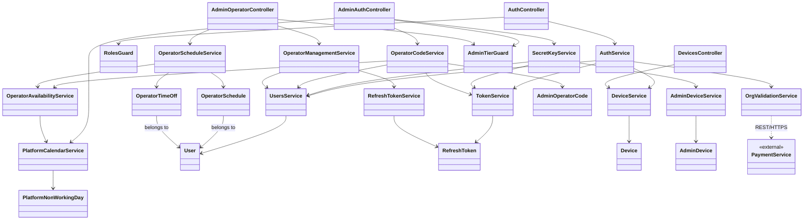

# auth-service

- **Status:** Reviewed <!-- Draft | Reviewed | Implemented -->
- **Owners:** Anwar (project owner)
- **Related ADRs:** [0001](../adr/0001-generic-organization-id-scoping-claim.md) (generic `organizationId` scoping claim), [0002](../adr/0002-jwt-access-token-with-rotating-refresh-token.md) (JWT access token + DB-backed rotating refresh token), [0003](../adr/0003-postgresql-typeorm-persistence.md) (PostgreSQL + TypeORM persistence), [0004](../adr/0004-synchronous-fail-closed-license-validation.md) (synchronous, fail-closed license validation against payment-service), [0005](../adr/0005-bounded-time-license-subscription-revalidation.md) (bounded-time license/subscription re-validation on login and refresh), [0006](../adr/0006-per-user-subscription-reservation-on-license-lapse.md) (per-user subscription reservation on organization license lapse — `payment-service`'s decision, referenced here for the login/refresh contract it implies), [0009](../adr/0009-platform-scoped-admin-accounts.md) (platform-scoped Admin accounts — `platformId`, `adminTier` owner/operator tiers), [0010](../adr/0010-owner-secret-key-login-with-device-alerting.md) (owner permanent secret-key login with new-device alerting), [0011](../adr/0011-operator-time-boxed-login-code.md) (time-boxed operator login code with business-day gating), [0012](../adr/0012-owner-managed-operator-schedule-and-blocking.md) (owner-managed operator profile, schedule, and block/unblock), [0013](../adr/0013-operator-session-ceiling.md) (hard 8-hour session ceiling for operator refresh-token rotation), [0014](../adr/0014-schedule-anchored-operator-duration.md) (schedule-anchored operator login-code and session duration), [0015](../adr/0015-two-phase-operator-contact-confirmation.md) (two-phase operator contact confirmation before first login), [0016](../adr/0016-first-owner-bootstrap-command.md) (one-time bootstrap command for a platform's first owner account, and the accompanying null-`organizationId` login/refresh short-circuit), [0017](../adr/0017-owner-recovery-and-second-owner.md) (owner recovery via multi-owner support and CLI force-reset)
- **Related ADDs/SDDs:** See `docs/sdd/auth-service.md` for `auth-service`'s internal module/class design, data model, and API contract in detail.

## Scope

This document covers `auth-service`'s v1 architecture as a boundary within `nawara-core`:
how it verifies credentials, issues/rotates/revokes tokens, exposes the generic `role` and
`organizationId` claims other services and consuming apps rely on (per ADR-0001), and how it
gates registration on an organization's license validity via a synchronous call to
`payment-service` (per ADR-0004), including stamping the v1 trial period on first-time
registrants for a given organization. It also covers re-validating that same license (and,
when one exists, the requesting user's own individual subscription) on every login and token
refresh, so that a user stays logged out — within one access-token lifetime — once their
organization's license lapses (per ADR-0005), and how `auth-service` distinguishes the two
different `403` reasons a login/refresh can fail for. Per ADR-0001, `organizationId` is
required input on
every self-service `POST /auth/register` call — there is no org-less self-registration mode;
the only null-`organizationId` accounts are the platform's own `Admin` accounts, which are
provisioned out-of-band and never created through this public endpoint (see Context).

This document also covers capturing a best-effort device/network fingerprint at first app
launch, with a registration-time fallback if the first-launch call doesn't succeed (see
"Design rationale: device/network fingerprinting" below) — intended to give future
abuse-prevention/rate-limiting work an early signal to build on. Acting on that signal
(actual blocking, rate-limiting, or abuse scoring) is explicitly out of scope here; this
document covers capture only.

This document also now covers platform-scoped Admin accounts (per ADR-0009): the
`platformId`/`adminTier` claims that distinguish a platform's top-level owner from a
delegated operator, and the two new, owner/operator-specific ways an Admin can log in
without a standing password — an owner's permanent secret key with new-device alerting
(per ADR-0010), and an operator's time-boxed login code gated to the platform's configured
working days (per ADR-0011). It also covers the minimal per-platform working-day calendar
(`PlatformNonWorkingDay`) management endpoints those login flows depend on.

This document now also covers the owner's "manage agent" surface for operators it created
(per ADR-0012): viewing/listing operators, updating an operator's contact info, configuring a
per-operator schedule and individual time-off distinct from the platform-wide calendar, and
blocking/unblocking an operator's access (activating the previously-dormant `User.isActive`
field). It also covers the hard session ceiling placed on an operator's session once granted,
independent of ADR-0011's login-code redemption window (per ADR-0013).

This document now also covers making both of those windows track the operator's own
schedule rather than a flat duration — an operator's login-code redemption window and the
resulting session ceiling are both now anchored to their scheduled shift end for the day,
falling back to a flat 8 hours only for an operator with no configured `OperatorSchedule`
(per ADR-0014) — and a two-phase contact-confirmation step an operator must complete before
their first ordinary login code is ever sent, proving they actually own the email/phone an
owner registered them with (per ADR-0015).

Explicitly out of scope:

- Any app-specific authorization semantics — what a given `role` (e.g. `Admin`,
  `SchoolAdmin`) is actually allowed to do inside a consuming app is that app's concern, not
  `auth-service`'s. `auth-service` only issues and verifies the claim; it never interprets it.
- The five features already deferred past v1: password reset, email verification, MFA,
  social login, and multi-session/device management. None of these are designed here.
- Any API-gateway design. No gateway exists in this repo today, and this document does not
  assume one will.
- The license/organization data model itself, and the individual-subscription
  freeze/resume ("reservation") mechanics from ADR-0006. Per `CLAUDE.md`, licenses and
  subscriptions are `payment-service` `Product`/`Charge` concepts; that model belongs in
  `payment-service`'s own ADD/SDD, not here. This document only covers the shape of
  `auth-service`'s (currently assumed, per ADR-0004/ADR-0005) calls out to it, and how a
  `403` from either check is surfaced to the client.
- Which roles or users ever get an individual subscription in the first place. That's a
  consuming-app decision (e.g. `nawara-drive` choosing which of its own roles must pay
  individually) — `auth-service` only ever observes whether `payment-service` reports a
  subscription for a given user, never why one does or doesn't exist (per ADR-0006).
- Any actual rate-limiting, blocking, or abuse-scoring logic built on top of captured
  `Device` records. As covered below, this document designs only how a device gets
  identified and recorded, not what happens once a pattern of abuse is detected.
- A real audit-log/"follow operator actions" capability (per ADR-0012). The `ownerId` already
  carried on `admin.operator_blocked`/`admin.operator_unblocked` is an incidental, minimal
  "who did it" record, not a designed audit trail — a real audit log is deferred, undesigned
  future work.

## Context

`auth-service` is currently a bare, unmodified Nest CLI scaffold
(`apps/auth-service/src/app.controller.ts`, `app.service.ts`, `app.module.ts`, `main.ts` —
none of it touched yet). This ADD exists to give the first real implementation of that
scaffold a settled shape before code is written, expanding on the four ADRs above, which
resolved token strategy, persistence, the multi-tenancy claim, and the new cross-service
dependency, but did not describe how the resulting pieces fit together as a whole.

Today's and near-term callers of `auth-service`:

- **`nawara-drive`'s backend, desktop (Tauri), and mobile (Expo/React Native) apps** — the
  first real consumer, calling `auth-service` directly over REST/HTTPS. There is no API
  gateway in front of it today, so these clients hit `auth-service` the same way any external
  client would, consistent with this repo's "API is the only contract" principle.
- **Other `nawara-core` services**, potentially, if they need to validate an access token or
  look up minimal user data (e.g. `notification-service` resolving a `userId` to a delivery
  channel). Per ADR-0002, access-token verification is designed to happen without calling
  back into `auth-service` at all — any such service would hold the verification key locally
  — but a service might still need `auth-service`'s API for anything beyond bare
  verification (e.g. confirming a user still exists).
- **`daycare`**, named in this repo's own `CLAUDE.md` as a future migration target. It
  currently runs its own local, domain-agnostic auth/notification/license services and is not
  a current dependency of `auth-service` — it's noted here only because `auth-service`'s
  design should stay generic enough that `daycare` could plausibly adopt it later, per the
  "would an unrelated future app find this useful as-is?" test in `CLAUDE.md`.
- **A possible future API gateway.** No gateway design exists in this repo, and none should
  be assumed by anything in this document — `auth-service` must work correctly as a
  directly-called service.

New in this design, and worth calling out explicitly: `auth-service` now also depends on
**`payment-service`**, called synchronously to validate an organization's license status
during registration (ADR-0004). This is the first synchronous, service-to-service call of
any kind in `nawara-core` — until now, every service in this repo has been an independent,
directly-called leaf with no outbound dependency on another service in the repo.

Also new in this design: that same `payment-service` dependency is no longer limited to
registration. `POST /auth/login` and `POST /auth/refresh` now make the same kind of call, to
re-check that the requesting user's organization still holds a valid license — and, when one
exists, that the user's own individual subscription is still valid — before issuing or
rotating tokens (ADR-0005). This exists because access tokens, once issued, are verified
locally with no call back to `auth-service` or `payment-service` (per ADR-0002); without a
check at login/refresh time, a user whose organization's license lapses after they logged in
would simply keep working until they happened to log out on their own.

Per ADR-0001, `organizationId` is required input on every self-service registration — there
is no supported flow for an end user to register without one. The only accounts with a null
`organizationId` are the platform's own `Admin` accounts, and those are provisioned
out-of-band (seeded directly into the database, or via a separate internal/operator-only
mechanism — see Open questions), never through the public `POST /auth/register` endpoint
this document designs.

Also new in this design: `auth-service` now captures a device/network fingerprint as early
as first app launch — before a user has entered anything, including an organization id —
via a dedicated `POST /auth/devices/register` endpoint, with a fallback onto
`POST /auth/register` itself if that earlier call didn't succeed (see "Design rationale:
device/network fingerprinting" below). This is captured purely as a future
abuse-prevention signal; nothing in this design acts on it yet.

## Component overview

At the architecture level, `auth-service` is composed of eight logical components:

- **`AuthModule`** — the `AuthController` and `AuthService` handling registration, login,
  refresh, and logout. This is the module clients actually talk to.
- **`UsersModule`** — owns `User` persistence (credentials, `role`, `organizationId` per
  ADR-0001, trial-period metadata for B2B accounts). `AuthModule` depends on it; it has no
  outward-facing controller of its own in v1.
- **Token handling** — JWT signing/verification for access tokens, and DB-backed refresh
  token issuance/rotation/reuse-detection per ADR-0002. Access-token verification is a pure,
  local, stateless operation (no DB call); refresh-token rotation reads and writes the
  `RefreshToken` table.
- **`OrganizationsModule`** (organization-validation service) — implements
  `POST /auth/organizations/validate` and the server-side re-check inside registration,
  calling out to `payment-service` per ADR-0004. Per ADR-0005, `AuthService` now also calls
  into this component from `login` and `refresh`, to re-check the requesting user's
  organization's license (and, when one exists, their individual subscription) before
  issuing or rotating tokens. This is the only component in `auth-service` with an outbound
  network dependency on another service.
- **RBAC guards (`RolesGuard`)** — a generic Nest guard reading the `role` claim off the
  verified access token to gate `auth-service`'s own endpoints where needed (e.g. anything
  restricted to the platform's own `Admin` role, such as license generation triggers that
  live in `payment-service` but might need an `Admin`-authenticated call path). `RolesGuard`
  only understands the generic `role: string` — it has no built-in notion of what any
  particular role means.
- **`DevicesModule`** (`DevicesController`, `DeviceService`) — implements
  `POST /auth/devices/register`, the unauthenticated first-launch endpoint (see "Design
  rationale: device/network fingerprinting" below). Reads IP address and User-Agent
  directly off the incoming request (never trusting a client-supplied value for either),
  accepts the client's `installId` and optional device
  metadata, and idempotently upserts a `Device` record keyed by `installId`. Also owns the
  server-side handling of the `deviceFingerprint` fallback field on `POST /auth/register`
  when the dedicated call didn't succeed earlier. `DevicesModule` is independent of
  `AuthModule`'s login/refresh/logout flows — it is called before a user exists, and later
  linked to a `User` once one is created via registration.
- **`AdminModule`** (`AdminAuthController`, `SecretKeyService`, `OperatorCodeService`,
  `AdminDeviceService`, `PlatformCalendarService`, `AdminTierGuard`) — new, per ADR-0009/
  ADR-0010/ADR-0011. Handles everything specific to platform-scoped Admin accounts that
  doesn't fit the generic email+password flow `AuthModule` already owns: `SecretKeyService`
  issues/rotates/verifies an owner's permanent secret key and owns the `AdminDevice`
  new-device-alerting check (ADR-0010); `OperatorCodeService` issues/verifies an operator's
  time-boxed login code (ADR-0011) and, per ADR-0015, now also issues and verifies a
  separate, purpose-scoped confirmation code an operator must redeem before their first
  ordinary login code is ever sent — both the login code's redemption window and its
  resulting session ceiling are computed via the new
  `OperatorAvailabilityService.getShiftEndOrFallback` (per ADR-0014), while the confirmation
  code keeps a flat 8h duration unconditionally, since it's issued at registration time,
  outside the `isOperatorAvailable` gate a shift end could be anchored to;
  `PlatformCalendarService` owns the
  `PlatformNonWorkingDay` rows and the `isWorkingDay` check `OperatorCodeService` depends on;
  `AdminTierGuard` is a new, generic Nest guard reading the `adminTier` claim off the
  verified access token (no DB round-trip), analogous to `RolesGuard` but for the
  owner/operator distinction. `AdminAuthController` exposes all of this module's endpoints
  (secret-key login/rotation, operator registration, operator login, calendar management).
  `AdminModule` depends on `UsersModule` (it creates and reads `User` rows, per ADR-0009)
  and on token handling (it issues the same access/refresh token pairs `AuthModule` does),
  but is otherwise independent of `AuthModule` itself — an Admin never goes through
  `POST /auth/login`'s email+password path for the new owner/operator flows (an owner still
  can, via the existing endpoint, as the secret-key recovery path per ADR-0010).
- **`AdminOperatorController`, `OperatorManagementService`, `OperatorScheduleService`,
  `OperatorAvailabilityService`** (owner-managed operator administration, new per ADR-0012) —
  a new controller, sibling to `AdminAuthController` inside `AdminModule`, exposing the
  owner's "manage agent" surface: listing/viewing operators, updating contact info,
  block/unblock, and per-operator schedule/time-off management. `OperatorManagementService`
  owns operator profile reads/updates and the block/unblock actions (including activating the
  previously-dormant `User.isActive` field and revoking that operator's refresh tokens on
  block). `OperatorScheduleService` owns `OperatorSchedule`/`OperatorTimeOff` persistence.
  `OperatorAvailabilityService` composes `PlatformCalendarService.isWorkingDay` with the new
  per-operator schedule/time-off data to answer "can this operator log in right now?" — it is
  a new, distinct component from `PlatformCalendarService` (which stays platform-scoped only),
  and it's what `OperatorCodeService`'s `request-code` flow now calls instead of calling
  `PlatformCalendarService` directly. As of ADR-0014, `OperatorAvailabilityService` also
  exposes `getShiftEndOrFallback(operatorUserId, now)`, deriving a concrete shift-end
  timestamp (or a `+8h` fallback for an unscheduled operator) from the same
  `OperatorSchedule` data `isOperatorAvailable` already reads — `OperatorCodeService` calls
  it independently at both `requestCode()` (for the login code's `expiresAt`) and
  `verifyCode()` (for the session's `sessionExpiresAt`), never reusing one call's result for
  the other. All of `AdminOperatorController`'s endpoints are gated
  by the same `AdminTierGuard` `AdminAuthController` already uses — no new authorization
  mechanism.
- **Token handling** also now enforces a hard session ceiling for operator-issued tokens (new
  per ADR-0013): `RefreshTokenService.rotate()` gains a ceiling check (run before its existing
  reuse-detection check) against a new `RefreshToken.sessionExpiresAt` column, and
  `TokenService.signAccessToken()` gains an optional explicit-expiry parameter so an
  operator's final token before the ceiling has its own `exp` claim clamped to that ceiling.
  Both changes are inert (`null`/omitted-parameter default) for every non-operator caller.

```mermaid
graph LR
  subgraph Consumers
    NDBackend[nawara-drive backend]
    NDDesktop[nawara-drive desktop]
    NDMobile[nawara-drive mobile]
    Owner[Platform owner]
    Operator[Platform operator]
  end

  NDBackend -- REST/HTTPS --> AuthController
  NDDesktop -- REST/HTTPS --> AuthController
  NDMobile -- REST/HTTPS --> AuthController

  NDBackend -- "REST/HTTPS (first launch)" --> DevicesController
  NDDesktop -- "REST/HTTPS (first launch)" --> DevicesController
  NDMobile -- "REST/HTTPS (first launch)" --> DevicesController

  Owner -- "REST/HTTPS (secret-key login, rotation)" --> AdminAuthController
  Operator -- "REST/HTTPS (confirm, request-code, verify-code)" --> AdminAuthController
  Owner -- "REST/HTTPS (manage operators)" --> AdminOperatorController

  subgraph auth-service
    AuthController --> AuthService
    AuthService --> UsersService
    AuthService --> TokenService
    AuthService --> OrgValidationService
    AuthController --> RolesGuard
    AuthService --> DeviceService
    DevicesController --> DeviceService
    AdminAuthController --> SecretKeyService
    AdminAuthController --> OperatorCodeService
    AdminAuthController --> PlatformCalendarService
    AdminAuthController --> AdminTierGuard
    SecretKeyService --> AdminDeviceService
    SecretKeyService --> UsersService
    OperatorCodeService --> UsersService
    OperatorCodeService --> OperatorAvailabilityService
    AdminOperatorController --> OperatorManagementService
    AdminOperatorController --> OperatorScheduleService
    AdminOperatorController --> AdminTierGuard
    OperatorManagementService --> UsersService
    OperatorManagementService --> RefreshTokenService
    OperatorScheduleService --> OperatorAvailabilityService
    OperatorAvailabilityService --> PlatformCalendarService
  end

  UsersService --> AuthDB[(auth-service Postgres DB)]
  TokenService --> AuthDB
  RefreshTokenService --> AuthDB
  DeviceService --> AuthDB
  SecretKeyService --> AuthDB
  AdminDeviceService --> AuthDB
  OperatorCodeService --> AuthDB
  PlatformCalendarService --> AuthDB
  OperatorManagementService --> AuthDB
  OperatorScheduleService --> AuthDB
  OperatorAvailabilityService --> AuthDB
  OrgValidationService -- REST/HTTPS --> PaymentService[payment-service]

  AuthService -. user.registered event .-> Broker[[RabbitMQ]]
  SecretKeyService -. "admin.secret_key_login_from_new_device / admin.secret_key_rotated" .-> Broker
  OperatorCodeService -. "admin.operator_registered / admin.operator_code_issued /<br/>admin.operator_confirmation_code_issued / admin.operator_contact_confirmed" .-> Broker
  OperatorManagementService -. "admin.operator_blocked / admin.operator_unblocked" .-> Broker
```

`AuthController` is the only entry point clients call for credential-based flows;
`UsersModule` and token handling both write to `auth-service`'s own dedicated Postgres
database (per ADR-0003), never shared with any other service. `OrgValidationService` is the
sole component with a solid, synchronous edge leaving `auth-service` (to `payment-service`);
that edge now serves `login` and `refresh` as well as registration (ADR-0005), not just
registration as in the previous revision of this document. The dashed edges to RabbitMQ
represent the v1 async events, described below — no longer just `user.registered`, now that
`AdminModule` also publishes admin-security and operator-lifecycle events.
`DevicesController` is a second, independent entry point consuming apps call directly at
first app launch (see "Design rationale: device/network fingerprinting" below) — its edge
in the diagram above is deliberately drawn separate from the `AuthController` flows, since
it fires before a user exists and does not depend on, or block, registration/login.
`AuthService` calls into `DeviceService` only for the registration-time `deviceFingerprint`
fallback described below. `AdminAuthController` is a third, independent entry point (per
ADR-0009/ADR-0010/ADR-0011): a platform owner calls it directly for secret-key login/
rotation, and a platform operator calls it directly for the two-step request-code/
verify-code login — neither ever goes through `AuthController`'s email+password path for
these new flows. `AdminOperatorController` (per ADR-0012) is a fourth, independent entry
point, sibling to `AdminAuthController` inside the same `AdminModule` — only a platform owner
ever calls it, to list/view/update/block/unblock their own operators and manage per-operator
schedule/time-off data; an operator never reaches it, gated by the same `AdminTierGuard`.
`OperatorCodeService.requestCode` now calls `OperatorAvailabilityService` instead of calling
`PlatformCalendarService` directly (per ADR-0012) — `OperatorAvailabilityService` still
incorporates the platform-wide check internally, so this is an extension, not a removal, of
the existing business-day gate.

At the class level, the same components resolve to:



This is an architecture-level view — components and the entities they own, no fields or method
signatures. See `docs/sdd/auth-service.md`'s "Key interfaces / classes" section for the full
class diagram with DTOs and field-level detail.

## Design rationale: device/network fingerprinting

`auth-service` needs a way to recognize and, eventually, rate-limit or block an abusive
device — before that device's user has provided any sensitive information at all,
including the organization id ADR-0004's B2B registration flow requires up front.
Waiting until registration to start collecting a device signal is too late: a bad actor
could otherwise script many failed or throwaway attempts per install with nothing
distinguishing one install from the next until a user account actually exists.
`auth-service` does not own any notion of what "abusive" means yet, nor any
rate-limiting/blocking logic — this rationale is scoped purely to how a device gets
*identified and recorded*, not to what happens once a pattern of abuse is detected.

A hard technical constraint shapes every option here: real hardware MAC addresses are
**not** obtainable from apps on modern platforms (iOS, Android, and browsers have all
blocked this since roughly 2016) — apps requesting a device's MAC address get a
randomized, per-app or per-session value instead. Any design assuming literal MAC capture
is not implementable on today's platforms.

Options considered:

- **Chosen — app-generated, locally-persisted `installId` + server-observed IP/User-Agent
  + optional client-supplied device metadata, via a dedicated first-launch endpoint, with
  a registration-time fallback.** The client generates a random `installId` on first run
  and persists it locally, sending it plus best-effort device metadata (model, OS
  version, app version, locale) to `POST /auth/devices/register` as early as possible.
  `auth-service` reads IP address and User-Agent directly off the incoming request rather
  than trusting any client-supplied value for either. If that first-launch call doesn't
  succeed (e.g. no connectivity yet), the same payload is instead attached to the
  subsequent `POST /auth/register` call, so the signal still gets captured. Gives the
  earliest possible signal in the common case, with a fallback that avoids losing it in
  the uncommon one, at the cost of one new endpoint and a small amount of client-side
  bookkeeping.
- **Passive-only capture** — attach the same signals to every existing auth request
  instead of adding a dedicated endpoint. Simpler, but loses the specifically wanted
  property of a signal captured *before the user does anything*: a device that never
  proceeds past the landing screen would leave no record at all.
- **Real MAC/IMEI-level hardware fingerprinting via native platform code** — rejected
  outright, not as a matter of preference but of platform capability, per the constraint
  above.
- **A third-party device-fingerprinting/fraud-prevention SDK or service** — would likely
  produce a richer, harder-to-spoof fingerprint, but is a materially bigger scope, cost,
  and vendor-dependency decision than this stage warrants, and raises its own
  data-sharing/privacy questions. Worth revisiting later if the in-house signals prove
  insufficient in practice; not chosen for v1.

Consequences carried into this design:

- No real MAC address or other hardware-level identifier is ever collected — a platform
  limitation, not a design choice.
- `installId` is self-reported and trivially reset by reinstalling the app — it is one
  input among several (combined with server-observed IP/User-Agent), not an unspoofable
  identity on its own. Any future abuse-detection logic built on top must account for
  this.
- This rationale covers only the *capture* of the device/network signal; any actual
  rate-limiting, blocking, or abuse-scoring logic that consumes `Device` records is
  explicitly out of scope and needs its own future design.
- Adds a new public, unauthenticated endpoint (`POST /auth/devices/register`) to
  `auth-service`'s surface area, callable before a user exists — its own abuse surface
  (e.g. being spammed to create many `Device` rows) should be considered when it's
  actually implemented.
- Storing IP addresses and device metadata ahead of any user identity raises an open
  data-retention/privacy-disclosure question for unlinked `Device` records — see Open
  questions.

## Communication & data flow

`auth-service`'s primary interface is synchronous REST/JSON, called directly by consuming
apps — there is no gateway or intermediary in v1, so `auth-service` must validate and
authenticate every request itself rather than trusting an upstream layer to have done so.

Six synchronous flows matter architecturally:

1. **Client ⇄ `auth-service`**: `POST /auth/register`, `POST /auth/login`,
   `POST /auth/refresh`, `POST /auth/logout`, and, for B2B registration,
   `POST /auth/organizations/validate`. All plain REST/JSON over HTTPS.
   `POST /auth/refresh` now also enforces a hard session ceiling for
   operator-issued refresh tokens (per ADR-0013): once `RefreshToken.sessionExpiresAt` is
   reached, rotation fails with `401 {reason: "session_ceiling_reached"}` instead of issuing
   a new pair — this is a no-op for every non-operator token, which never has
   `sessionExpiresAt` set. As of ADR-0014, that ceiling is anchored to the operator's own
   scheduled shift end for the day (falling back to `now + 8h` only for an operator with no
   configured `OperatorSchedule`), not a flat 8 hours.
2. **Platform owner/operator ⇄ `auth-service`** (new, per ADR-0009/ADR-0010/ADR-0011),
   also plain REST/JSON over HTTPS, never through the flows above:
   - `POST /auth/admin/login/secret-key` — body `{secretKey}`, no auth required (this is
     the owner's login). `200 {accessToken, refreshToken, expiresIn}` on match, `401`
     otherwise.
   - `POST /auth/admin/secret-key/rotate` — Bearer, `adminTier: owner` only. No body.
     `200 {secretKey, issuedAt}`, the raw key shown exactly once.
   - `POST /auth/admin/operators` — Bearer, `adminTier: owner` only. Body
     `{email?, phone?}` (exactly one required). Creates an operator `User` row scoped to
     the caller's own `platformId`, with `contactVerifiedAt: null` (per ADR-0015). Also
     generates and sends a `purpose: 'confirmation'` code — distinct from a login code (flat
     `now + 8h` expiry,
     unconditionally — this call happens outside the `isOperatorAvailable` gate a shift end
     could anchor to), publishing a new `admin.operator_confirmation_code_issued` event
     alongside the existing `admin.operator_registered` event.
   - `POST /auth/admin/operators/confirm` — new (per ADR-0015), no auth required (the
     operator has no session yet). Body `{email?, phone?, code}`. `401` for an unknown or
     blocked identifier; `204` no-op, without validating `code` at all, if the operator's
     `contactVerifiedAt` is already set (idempotent retry); otherwise validates `code`
     against the operator's live `purpose: 'confirmation'` row with the same matching/lockout
     logic `verify-code` uses, `401` on a wrong/expired/exhausted code, and on a match sets
     `contactVerifiedAt = now`, publishes `admin.operator_contact_confirmed`, and internally
     triggers the same `requestCode()` path a self-triggered call would hit — sending the
     operator's real first `purpose: 'login'` code if they're currently available, or
     nothing if not (still `204` either way; the operator gets their first code at their next
     scheduled window instead).
   - `POST /auth/admin/login/operator/request-code` — body `{email?, phone?}`, no auth
     required. `204` on success (code delivered only via the published event/notification
     channel); `403 {reason: "non_working_day"}` if the operator isn't currently available
     per `OperatorAvailabilityService` (platform calendar, per-operator time off, or
     per-operator schedule — per ADR-0012, all three collapse to this one reason code);
     `401` if the identifier doesn't resolve to an active, contact-confirmed operator (unknown
     identifier, blocked operator, and not-yet-confirmed operator are all indistinguishable,
     per ADR-0012/ADR-0015). On success, the issued code's `expiresAt` is the operator's own
     scheduled shift end for the day, via `OperatorAvailabilityService.getShiftEndOrFallback`
     — falling back to `now + 8h` only if the operator has no configured `OperatorSchedule`
     (per ADR-0014).
   - `POST /auth/admin/login/operator/verify-code` — body `{email?, phone?, code}`, no
     auth required. `200 {accessToken, refreshToken, expiresIn}` on a valid, unexpired,
     unconsumed, not-yet-exhausted code, for a still-active, contact-confirmed operator;
     `401` otherwise (including for a now-blocked operator's leftover code, without
     incrementing `attemptCount`, per ADR-0012). On success, `sessionExpiresAt` is stamped
     with a fresh, independent call to `getShiftEndOrFallback` (per ADR-0014) — not reused
     from the value computed at request-code time — falling back to `now + 8h` only for an
     unscheduled operator.
   - `POST /auth/admin/platform/calendar` — Bearer, `adminTier: owner` only. Body
     `{type, date?, dayOfWeek?, label?}`.
   - `GET /auth/admin/platform/calendar` — Bearer, any admin, scoped to the caller's own
     `platformId`.
   - `DELETE /auth/admin/platform/calendar/:id` — Bearer, `adminTier: owner` only; `404`
     if the row isn't the caller's own platform's.

   See `docs/sdd/auth-service.md`'s API contract for exact request/response shapes.
3. **Platform owner ⇄ `auth-service`, operator management** (new, per ADR-0012), Bearer,
   `adminTier: owner` only for every endpoint in this group, all `:id` lookups
   scoped to the caller's own `platformId` and returning `404` (never `403`) on any
   mismatch:
   - `GET /auth/admin/operators` — list operators under the caller's own platform.
   - `GET /auth/admin/operators/:id` — view one operator's profile.
   - `PATCH /auth/admin/operators/:id/contact` — body `{email?, phone?}` (exactly one
     required); `400`/`409` as at creation time.
   - `POST /auth/admin/operators/:id/block` / `.../unblock` — set `User.isActive`;
     blocking also deletes any unconsumed `AdminOperatorCode` row(s) regardless of `purpose`
     (confirmation or login — per ADR-0015) and revokes all of that operator's refresh tokens.
   - `PUT /auth/admin/operators/:id/schedule` — full-replace `{days: [...]}`.
   - `GET /auth/admin/operators/:id/schedule` — owner-only (deliberately not readable by
     the operator themselves, unlike the platform calendar's `GET`).
   - `POST /auth/admin/operators/:id/time-off`, `GET .../time-off`,
     `DELETE .../time-off/:timeOffId`.

   See `docs/sdd/auth-service.md`'s API contract for exact request/response shapes.
4. **Platform owner ⇄ `auth-service`, owner management** (new, per ADR-0017), Bearer,
   `adminTier: owner` only for every endpoint in this group, all `:id` lookups scoped to the
   caller's own `platformId` and returning `404` (never `403`) on any mismatch — the same
   collapsed-404 pattern item 3 above already established for operator management:
   - `POST /auth/admin/owners` — body `{email?, phone?, password}`, exactly one of
     `email`/`phone` required (`400` otherwise), `password` always required (`400` if
     missing — unlike operator creation, a new owner needs a real password from the moment
     they exist, since there's no code-based login for owners); `409` on a duplicate
     email/phone. `platformId` is taken from the caller's own JWT claim, never the request
     body, mirroring `POST /auth/admin/operators`'s own defense-in-depth. Creates an owner
     `User` row (`passwordHash` set, `secretKeyHash: null`) and publishes
     `admin.owner_registered`. The new owner obtains their first secret key exactly the way a
     bootstrapped owner does (per ADR-0016): password login, then
     `POST /auth/admin/secret-key/rotate` — no new key-issuance path.
   - `POST /auth/admin/owners/:id/deactivate` — sets `isActive: false` and revokes all of
     that owner's refresh tokens via the same `RefreshTokenService.revokeAllForUser` ADR-0012
     introduced for blocking an operator. **Rejected with `409 {reason: "last_owner", ...}`**
     if it would leave the platform with zero active owners — a hard invariant enforced via an
     atomic check (a transaction with a row lock, or a single conditional query), never a
     read-then-write count-then-act pair, so two concurrent deactivations of a platform's last
     two owners can't both succeed. This same pairing (add a new owner, then deactivate the
     old one) is also how ownership *transfer* is achieved — no separate transfer endpoint is
     designed.
   - `POST /auth/admin/owners/:id/activate` — sets `isActive: true`.

   Separately, and **not** an HTTP flow: a CLI-only `BOOTSTRAP_OWNER_FORCE_RESET=true` mode on
   ADR-0016's existing `bootstrap-owner.ts` script (see the ADD's Context above for how that
   script is already provisioned out-of-band) covers the one scenario this in-band pair cannot
   retroactively fix — a platform already down to one owner who has already lost both
   credentials, with no second owner to add via `POST /auth/admin/owners` above. Like
   `bootstrap-owner.ts` itself, this mode requires direct server/deploy access and is
   deliberately never HTTP-reachable, so it has no request/response entry here — see the SDD's
   Open questions for where the script's behavior is documented.

   See `docs/sdd/auth-service.md`'s API contract for exact request/response shapes.
5. **`auth-service` ⇄ `payment-service`**: a synchronous call, `GET
   /payment/licenses/:organizationId/status`, its contract finalized by
   `docs/add/payment-service.md`/`docs/sdd/payment-service.md` (per ADR-0004). Invoked from
   `POST /auth/organizations/validate`, from inside `POST /auth/register` itself (so
   registration never trusts that an earlier validate call is still accurate, closing the
   time-of-check-to-time-of-use gap, per ADR-0004), and now also from `POST /auth/login` and
   `POST /auth/refresh` (per ADR-0005). On a successful registration, and only on a
   first-time B2B registration for that organization, `auth-service` stamps the user's
   account with the v1 trial period (a global config default, e.g. 14 days) — the trial length
   itself is `auth-service`-owned account metadata, not something `payment-service` reports.
6. **`auth-service` ⇄ `payment-service`**: a second synchronous call, `GET
   /payment/subscriptions/:userId/status`, its contract likewise finalized by
   `docs/sdd/payment-service.md` (per ADR-0006), invoked from `POST /auth/login` and
   `POST /auth/refresh` alongside the license-status call above. A response indicating no
   subscription exists for that user is treated as "not applicable" and never blocks
   login/refresh on its own — only an existing-but-invalid (expired or suspended)
   subscription does. `auth-service` never creates, modifies, or interprets *why* a
   subscription exists; it only reads its current status.

**Build-sequencing note: `OrganizationValidationService`/`PaymentServiceClient` built against
a stub in v1.** `auth-service`'s core-flow implementation (register/login/refresh) is built
against a **stub** `PaymentServiceClient` — implementing the same interface
(`getLicenseStatus(organizationId): LicenseStatus`, `getSubscriptionStatus(userId):
SubscriptionStatus`) with canned responses matching the shape `docs/add/payment-service.md`/
`docs/sdd/payment-service.md` already finalize: `GET /payment/licenses/:organizationId/status`
→ `{valid, expiresAt}`, and `GET /payment/subscriptions/:userId/status` → `{exists, valid,
expiresAt}` — both of which match `auth-service`'s own assumed `LicenseStatus`/
`SubscriptionStatus` DTOs field-for-field. Concretely, this means `auth-service`'s
implementation does not block on `payment-service`'s real HTTP endpoints existing — building
those is separate, parallel work tracked elsewhere. This is purely a living-doc note recording
a build-sequencing decision, not a new architectural decision needing its own ADR; it does not
amend ADR-0004's "assumed, not finalized" framing, which remains accurate as a historical
record of what was known when that ADR was written.

For side effects, this design recommends a small set of async events, consistent with
`CLAUDE.md`'s "async events for side effects" principle — no longer just the single v1 event
of the previous revision:

- **`user.registered`** — `{ userId, role, organizationId, timestamp }`, published after a
  successful registration so `notification-service` can react (e.g. send a welcome message)
  without `auth-service` taking on a direct dependency on `notification-service` or knowing
  anything about notification channels/templates.
- **`admin.operator_registered`** — `{ operatorId, platformId, ownerId, channel:
  "email"|"phone", timestamp }` (per ADR-0011), published when an owner creates an operator
  account, so `notification-service` can send a welcome message the same way it does for
  `user.registered`.
- **`admin.operator_code_issued`** — `{ userId, platformId, channel: "email"|"sms",
  destination, code, expiresAt, timestamp }` (per ADR-0011), published every time
  `POST /auth/admin/login/operator/request-code` succeeds on a working day. As of ADR-0014,
  `expiresAt` is the operator's own scheduled shift end (or `now + 8h` if unscheduled), not a
  flat 8-hour value.
- **`admin.operator_confirmation_code_issued`** — `{ userId, platformId, channel:
  "email"|"sms", destination, code, expiresAt, timestamp }` (per ADR-0015), published when
  `POST /auth/admin/operators` creates a new operator, carrying a `purpose: 'confirmation'`
  code with a flat `now + 8h` expiry. Distinct from `admin.operator_code_issued`, which only
  ever carries a `purpose: 'login'` code.
- **`admin.operator_contact_confirmed`** — `{ operatorId, platformId, timestamp }` (per
  ADR-0015), published when `POST /auth/admin/operators/confirm` successfully matches a
  confirmation code. No `ownerId` — the confirming actor is the operator, not the owner,
  unlike `admin.operator_blocked`/`admin.operator_unblocked` below.
- **`admin.secret_key_login_from_new_device`** — `{ userId, platformId, channel: "email",
  destination, ipAddress, userAgent, timestamp }` (per ADR-0010), published when an owner
  logs in via secret key from a fingerprint `AdminDeviceService` hasn't seen before.
- **`admin.secret_key_rotated`** — `{ userId, platformId, timestamp }` (per ADR-0010),
  published on every secret-key rotation.
- **`admin.operator_blocked`** — `{ operatorId, platformId, ownerId, timestamp }` (per
  ADR-0012), published when an owner blocks an operator (`POST
  /auth/admin/operators/:id/block`). `ownerId` gives an incidental, minimal "who did it"
  record — not a substitute for a real audit log, which remains deferred (see Open
  questions).
- **`admin.operator_unblocked`** — `{ operatorId, platformId, ownerId, timestamp }` (per
  ADR-0012), published when an owner unblocks an operator.
- **`admin.owner_registered`** — `{ ownerId, platformId, createdByOwnerId, channel:
  "email"|"phone", timestamp }` (per ADR-0017), published when an existing owner creates a
  second (or subsequent) owner via `POST /auth/admin/owners`, mirroring
  `admin.operator_registered`'s shape field-for-field except `ownerId`/`createdByOwnerId` in
  place of `operatorId`/`ownerId`. Unlike `admin.operator_registered`, it deliberately carries
  no `destination` — see below.

**Why these carry contact info inline, unlike `user.registered`:** `admin.operator_code_issued`,
`admin.operator_confirmation_code_issued`, and `admin.secret_key_login_from_new_device` all
carry `destination`/`channel` (and, for both operator codes, the `code` itself) directly in
the event payload — a deliberate departure from `user.registered`'s shape, which carries no
contact info at all. Per this repo's database-per-service principle, only `auth-service` owns
`User.email`/`User.phone`; `notification-service` has no independent way to resolve a bare
`userId` to a contact address, and all three alerts are time-critical (a security
notification, and each operator code being that operator's sole means of completing
confirmation or login, respectively) — waiting on a separate synchronous lookup back into
`auth-service` would add latency and a new dependency to something meant to be immediate. See
ADR-0010, ADR-0011, and ADR-0015 for the full reasoning. `admin.owner_registered` is a
deliberate exception to this pattern even though it otherwise mirrors
`admin.operator_registered`'s shape: an owner-created-owner notification isn't the same kind
of time-critical, sole-means-of-access delivery a login/confirmation code or new-device alert
is, so carrying `destination` inline wasn't judged necessary to add now (per ADR-0017) — it can
be revisited if a concrete notification need for it emerges.

Two related events — `user.role_changed` and `user.organization_changed` — are explicitly
**not** designed for v1: there is no user-management endpoint in v1 that could mutate a
user's `role` or `organizationId` after creation, so there is nothing yet to trigger them.
They're noted here so a future user-management design doesn't have to rediscover the need.

**Infrastructure gap:** no RabbitMQ broker, exchange/queue naming convention, or client
library exists anywhere in this repo yet — every event above is a design recommendation, not
a component that can be built today without that follow-up infra work landing first.

**Data ownership:** `auth-service` is the sole owner and writer of `User` and `RefreshToken`
records (per ADR-0003, its own dedicated Postgres database — no other service queries it
directly), and now also of `AdminDevice`, `AdminOperatorCode`, `PlatformNonWorkingDay`
(per ADR-0009/ADR-0010/ADR-0011), and `OperatorSchedule`/`OperatorTimeOff` (per ADR-0012)
records. `organizationId` values are opaque to
`auth-service` (per ADR-0001) — it stores and echoes them but never validates their meaning,
except for the one carve-out in ADR-0004 where it checks license *status* against
`payment-service`, not the organization id's validity itself. `platformId` is likewise opaque
(per ADR-0009) — `auth-service` never interprets what a "platform" means to any given
consumer. License/organization billing data, and now individual-subscription data (per
ADR-0006), are owned entirely by `payment-service` — `auth-service` only ever reads their
*status*, on the same terms as the license check.

## Non-functional constraints

- **Horizontal scalability of token verification.** Per ADR-0002, access-token verification
  must never require a database call, so `auth-service` itself — and any other service that
  chooses to verify tokens locally — can scale horizontally without a shared database becoming
  a bottleneck on the hot path.
- **Password hashing cost.** Tuned for roughly 250ms per hash (bcrypt). This is an
  implementation parameter decided at the SDD level, not significant/hard-to-reverse enough
  to warrant its own ADR.
- **Refresh-token storage growth.** Because refresh tokens are DB-backed and rotated per
  ADR-0002, `RefreshToken` rows accumulate (rotated-away and expired rows are never
  automatically deleted in v1). This implies an eventual token-pruning/cleanup job as a known
  operational need — not v1 code, just something the SDD/TDD should account for before this
  becomes a real table-bloat problem.
- **No secret-distribution mechanism yet.** There is currently no mechanism anywhere in this
  repo for distributing the JWT signing secret/key to other services (or a future gateway)
  that might want to verify tokens locally — no `.env`/secrets infrastructure exists anywhere
  yet. Any service wanting to verify `auth-service`'s tokens today would need an
  out-of-band-shared key, which is not a solved problem.
- **Availability coupling to `payment-service` now extends to login and refresh.** Per
  ADR-0004, the outbound call to `payment-service` needs an explicit request timeout (on the
  order of a few seconds) and fails closed on error or timeout. Per ADR-0005, this coupling is
  no longer limited to new B2B registrations — `payment-service` being down now also blocks
  login and token refresh for already-registered users, since both flows re-check license
  (and, when applicable, subscription) status on every call. Only `POST /auth/logout` remains
  entirely unaffected, since it never touches `payment-service`. This is a materially wider
  blast radius than the previous revision of this document described, and should be weighed
  against `payment-service`'s own availability target.
- **Access-token TTL directly bounds how long a forced logout can take.** Per ADR-0005, a
  user whose organization's license lapses stays logged in until their current access token
  expires and a refresh is attempted. The access-token TTL is **15 minutes** — see Open
  questions for the full rationale.
- **Rate limiting is an undesigned gap.** Login and registration endpoints have no
  rate-limiting design yet — a known gap to close before production exposure, not addressed
  in this document. This now explicitly also includes
  `POST /auth/admin/login/operator/request-code`,
  `POST /auth/admin/login/operator/verify-code` (operator-code brute force, beyond
  ADR-0011's own 5-attempt-per-code lockout), `POST /auth/admin/operators/confirm`
  (confirmation-code brute force, reusing the same 5-attempt lockout, per ADR-0015), and
  `POST /auth/admin/login/secret-key` (secret-key brute force) — all four are
  unauthenticated, unthrottled endpoints in this design, the same undesigned gap as
  login/registration, not a separately-solved one. The
  new owner-only `AdminOperatorController` surface (per ADR-0012) inherits the same
  undesigned gap, even though it's Bearer-authenticated rather than public — no
  rate-limiting design exists anywhere in `auth-service` yet, for any endpoint.
- **Schedule-anchored session ceiling for operator sessions.** Per ADR-0013 (as amended by
  ADR-0014), an operator's session (from a successful `verify-code` onward) is capped at
  their own scheduled shift end for the day, falling back to `now + 8h` only for an operator
  with no configured `OperatorSchedule` — regardless of how often the refresh token is
  rotated within that window. This ceiling is distinct from, and not to be confused with,
  ADR-0011's login-*code* redemption window, which (per ADR-0014) is computed the same way
  but independently, at a different call site and moment. This is enforced server-side
  (`RefreshTokenService.rotate()`), not just client-side, and the final token before the
  ceiling carries the ceiling itself as its own JWT `exp`, so a client can implement a
  "session ending soon" warning purely from information it already has.

## Open questions

- The five v1-deferred features: password reset, email verification, MFA, social login, and
  multi-session/device management. None are designed here.
- ~~Who is responsible for the ongoing validity/meaning of an `organizationId` over time —
  e.g. if a consuming app's notion of "that organization" is later deleted, does anything in
  `auth-service` need to react, or is that entirely the consumer's problem?~~ **Resolved:**
  entirely the consuming app's own responsibility — `auth-service` takes no action.
  Consistent with ADR-0001's opacity principle, `auth-service` treats the value as fully
  opaque and non-authoritative for its own existence; it has no mechanism, and needs none, to
  learn that a consumer's organization was later deleted or deactivated.
- When (if ever) a cross-cutting "shared JWT validation" ADD becomes worth writing, once a
  second real service actually needs to verify `auth-service`'s tokens locally.
- RabbitMQ infrastructure does not exist anywhere in this repo yet (broker, exchange/queue
  conventions) — needs its own follow-up before `user.registered` or any of the newer
  `admin.*` events can actually ship.
- Multi-organization membership is explicitly out of scope per ADR-0001; if a future consumer
  needs it, that requires a new ADR superseding ADR-0001, not a change to this document alone.
- Whether an API gateway will ever front `auth-service` — no decision has been made either
  way, and this design deliberately does not assume one.
- Enumeration risk on `POST /auth/organizations/validate` if organization ids/keys turn out to
  be short, human-typed codes rather than high-entropy tokens — a candidate for rate-limiting
  that specific endpoint, not yet designed.
- Whether the v1 global trial-period default needs to become per-organization or
  per-license configurable, rather than a single fixed value (e.g. 14 days) for everyone.
- How captured `Device` records actually get acted upon — blocking, rate-limiting, or any
  other abuse-scoring logic. As covered above, this pass covers capture only; consuming
  that data is explicitly out of scope here and needs its own future design.
- `Device` data-retention policy, and whether collecting IP/device metadata ahead of user
  registration needs disclosure in a privacy policy. Flagged as an open follow-up above;
  unresolved by this document.
- ~~The internal mechanism for provisioning the platform's `Admin` accounts out-of-band (per
  ADR-0001) — e.g. a seed script vs. a separate internal/operator-only endpoint.~~ **Resolved
  by [ADR-0016](../adr/0016-first-owner-bootstrap-command.md)**, for a platform's *first*
  owner specifically: an idempotent, explicitly-invoked CLI command
  (`bootstrap-owner.ts`), writing through the existing `UsersService`, that seeds only an
  email+password credential — never a secret key — leaving the owner's first secret key to be
  obtained in-band via the existing password-login + `POST /auth/admin/secret-key/rotate`
  path (ADR-0010). Every operator, by contrast, is still provisioned in-band by an owner via
  `POST /auth/admin/operators` (ADR-0011), which was never part of this open question.
  ADR-0016 does **not** resolve ownership transfer, a second/standby owner, or recovery for a
  sole owner who loses both credentials — see ADR-0016's own Consequences for those as
  still-open follow-ons.
- Operator-code length/entropy tuning: ADR-0011 chose a 6-digit numeric code with a 5-attempt
  lockout as a starting point; whether that balance of usability vs. brute-force resistance
  needs revisiting (longer code, shorter validity window, etc.) is unresolved.
- ~~Per-platform timezone for evaluating "today" in `isWorkingDay` (per ADR-0011) — this
  document recommends UTC server-date as a default until, or unless, a timezone field is
  added; not designed here.~~ **Resolved:** UTC server-date is the v1 decision, not merely a
  recommendation — `isWorkingDay` and every shift-boundary evaluation (`OperatorSchedule`
  `startTime`/`endTime`, per ADR-0012) evaluate "today"/"now" against the server's UTC clock.
  A per-platform timezone field remains an explicit future enhancement, not designed here.
- ~~The single-owner-per-platform assumption: nothing in ADR-0009/ADR-0010 designs an
  ownership-transfer mechanism (e.g. if a platform's owner leaves and access needs to move to
  someone else). Today, that would require the still-unspecified out-of-band provisioning
  mechanism above to intervene directly.~~ **Resolved by
  [ADR-0017](../adr/0017-owner-recovery-and-second-owner.md)**: a new in-band
  `POST /auth/admin/owners` (mirroring `POST /auth/admin/operators` from ADR-0011, owner-only
  via `AdminTierGuard`) lets an existing owner add a second owner to their own platform, and a
  new `POST /auth/admin/owners/:id/deactivate`/`.../activate` pair gives ownership *transfer*
  almost for free — add a new owner, then deactivate the old one, with a hard "last owner"
  invariant preventing a platform from ever being fully de-owned. For the catastrophic case a
  second owner can't retroactively fix — a sole owner who has already lost both credentials —
  ADR-0017 also adds an opt-in `BOOTSTRAP_OWNER_FORCE_RESET` mode to ADR-0016's existing
  `bootstrap-owner.ts` CLI, rather than a new self-service reset flow. A residual gap remains,
  stated explicitly in ADR-0017's Consequences: a freshly bootstrapped platform's very first
  owner has the same lockout exposure until they act, and this design surfaces "add a second
  owner immediately" only as operational guidance, not something enforced or defaulted.
- The SMS-gateway/provider dependency for phone-registered operators (per ADR-0011) — no
  such infrastructure exists anywhere in this repo yet, so `admin.operator_code_issued`
  events for phone-registered operators are undeliverable until it lands. As of ADR-0015,
  this same gap now also covers `admin.operator_confirmation_code_issued` events for
  phone-registered operators — one shared, undesigned dependency, not two separate ones.
- ~~The access-token TTL value itself — not decided by ADR-0005 or this document, but it
  directly bounds how long a user stays logged in after their organization's license lapses.
  A shorter TTL means faster enforcement but more frequent `payment-service` calls (per the
  new availability coupling above); this tradeoff needs an explicit decision, likely at the
  SDD level or its own ADR if the choice turns out to be hard to reverse.~~ **Resolved:** 15
  minutes. Short enough to bound the stale-claim window (a `role`/`organizationId` change, or
  a license/subscription lapse, mid-session) consistently with ADR-0005's bounded-time-
  revalidation framing already established for license/subscription checks, refreshed
  transparently via the existing rotating refresh-token mechanism (ADR-0002).
- What mechanism actually detects that an organization's license has lapsed or been renewed,
  in order to trigger the suspend/resume flow from ADR-0006 — that detection lives entirely
  inside `payment-service` and is out of scope for this document.
- A real audit-log capability for owner actions taken against operators (per ADR-0012) —
  deferred as bigger scope than that ADR's pass warranted. Today's only trace is the
  incidental `ownerId` carried on `admin.operator_blocked`/`admin.operator_unblocked`, not a
  designed audit trail.
- ~~Per-operator timezone for evaluating `OperatorSchedule`'s `startTime`/`endTime` (per
  ADR-0012) — this extends, rather than resolves, ADR-0011's existing open question about
  the timezone `isWorkingDay` uses for "today"; neither is designed here.~~ **Resolved** by
  the same UTC-server-date decision above: `startTime`/`endTime` comparisons also evaluate
  "now" against the server's UTC clock. A per-operator timezone field remains an explicit
  future enhancement, not designed here.
- `OperatorSchedule`'s no-overnight-shift restriction (per ADR-0012) — a real v1 limitation
  for any platform whose operators work shifts crossing midnight; not designed here.
- Whether the operator session-ceiling/login-code fallback duration (per ADR-0013/ADR-0014,
  currently 8 hours, used only when an operator has no configured `OperatorSchedule`) should
  become configurable per platform, rather than a single hardcoded constant shared by every
  platform.
- A confirmation-code resend endpoint (per ADR-0015) is not designed — only the initial send
  (bundled into `POST /auth/admin/operators`) and `POST /auth/admin/operators/confirm` exist.
  An operator whose confirmation code expires or is exhausted before they complete
  confirmation has no self-service way to get a new one in v1; this would need its own
  follow-up design.
- The very short redemption/session window an operator could get if they request a login code
  moments before their shift ends (per ADR-0014) — accepted, not mitigated.
- **No first-class `Organization` entity exists anywhere in this repo.** `organizationId` is,
  and remains after ADR-0016, purely an opaque string claim stamped onto `User`, `License`,
  `Charge`, and `UserSubscription` records (per ADR-0001) — there is no table, service, or API
  that treats "an organization" as a real, queryable thing with its own attributes. A direct
  consequence: there is currently no way for a platform's owner or operator to list, view, or
  otherwise manage the set of organizations that belong to their own platform — `auth-service`
  has no notion of "which organizations does this `platformId` own" at all, since
  `organizationId` and `platformId` are two independent opaque claims with no recorded
  relationship between them anywhere in this schema. This is a real gap, not a stylistic
  omission, and needs its own future ADR — likely introducing an `Organization` entity
  (plausibly carrying its own `platformId` field) plus admin-facing listing/management
  endpoints — rather than being solved incidentally as part of some other decision.
