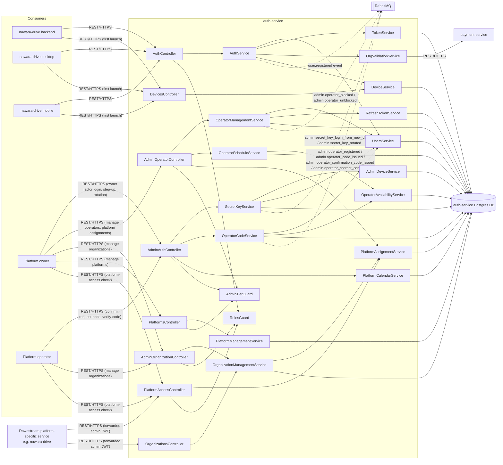

# auth-service

- **Status:** Draft <!-- Draft | Reviewed | Implemented --> (revised per ADR-0024 after review; needs re-review)
- **Owners:** Anwar (project owner)
- **Related ADRs:** [0001](../adr/0001-generic-organization-id-scoping-claim.md) (generic `organizationId` scoping claim), [0002](../adr/0002-jwt-access-token-with-rotating-refresh-token.md) (JWT access token + DB-backed rotating refresh token), [0003](../adr/0003-postgresql-typeorm-persistence.md) (PostgreSQL + TypeORM persistence), [0004](../adr/0004-synchronous-fail-closed-license-validation.md) (synchronous, fail-closed license validation against payment-service), [0005](../adr/0005-bounded-time-license-subscription-revalidation.md) (bounded-time license/subscription re-validation on login and refresh), [0006](../adr/0006-per-user-subscription-reservation-on-license-lapse.md) (per-user subscription reservation on organization license lapse — `payment-service`'s decision, referenced here for the login/refresh contract it implies), [0009](../adr/0009-platform-scoped-admin-accounts.md) (platform-scoped Admin accounts — `platformId`, `adminTier` owner/operator tiers), [0010](../adr/0010-owner-secret-key-login-with-device-alerting.md) (owner permanent secret-key login with new-device alerting), [0011](../adr/0011-operator-time-boxed-login-code.md) (time-boxed operator login code with business-day gating), [0012](../adr/0012-owner-managed-operator-schedule-and-blocking.md) (owner-managed operator profile, schedule, and block/unblock), [0013](../adr/0013-operator-session-ceiling.md) (hard 8-hour session ceiling for operator refresh-token rotation), [0014](../adr/0014-schedule-anchored-operator-duration.md) (schedule-anchored operator login-code and session duration), [0015](../adr/0015-two-phase-operator-contact-confirmation.md) (two-phase operator contact confirmation before first login), [0016](../adr/0016-first-owner-bootstrap-command.md) (one-time bootstrap command for a platform's first owner account, and the accompanying null-`organizationId` login/refresh short-circuit), [0017](../adr/0017-single-owner-with-secret-key-force-reset.md) (single owner per Company, permanently, with a CLI secret-key force-reset tool — rewritten by ADR-0022 from its original platform-scoped framing), [0018](../adr/0018-rabbitmq-as-async-message-broker.md) (RabbitMQ as the async message broker, via `@golevelup/nestjs-rabbitmq`), [0019](../adr/0019-twilio-as-sms-gateway-provider.md) (Twilio as the SMS gateway provider), [0020](../adr/0020-organization-entity-and-platform-scoped-management.md) (`Organization` entity and platform-scoped organization management, with equal owner/operator rights), [0021](../adr/0021-payment-service-platform-scoped-authorization.md) (synchronous, fail-closed platform-scope check `payment-service` runs against `auth-service`'s organization-lookup and platform-access-check endpoints), [0022](../adr/0022-company-and-platform-entities-with-operator-assignment.md) (`Company`/`Platform` entities, many-to-many operator↔platform `PlatformAssignment`, dropping `User.platformId` and the JWT `platformId` claim entirely, and re-scoping the owner to be company-wide rather than platform-wide), [0023](../adr/0023-platform-access-check-and-operator-login-decoupling.md) (the generic `GET /auth/platform-access/:platformId` live-check endpoint, and decoupling operator login/session gating from any platform's calendar), [0024](../adr/0024-database-enforced-tenancy-and-authorization-integrity.md) (database-enforced tenancy and authorization integrity: `User.kind` + `Owner`/`Operator` subtype tables, mandatory `Organization`/`User` FKs, DB-level `PlatformAssignment` uniqueness and append-only history, reserved `role: 'admin'`), [0025](../adr/0025-owner-mfa-login-with-secret-key-step-up-and-recovery.md) (owner login is password + a second factor; the secret key is a step-up and recovery credential), [0026](../adr/0026-authentication-is-not-entitlement.md) (authentication is not entitlement: login/refresh no longer consult `payment-service`; `User.trialEndsAt` removed)
- **Related ADDs/SDDs:** See `docs/sdd/auth-service.md` for `auth-service`'s internal module/class design, data model, and API contract in detail.

## Scope

This document covers `auth-service`'s v1 architecture as a boundary within `nawara-core`:
how it verifies credentials, issues/rotates/revokes tokens, exposes the generic `role` and
`organizationId` claims other services and consuming apps rely on (per ADR-0001), and how it
gates registration on an organization's license validity via a synchronous call to
`payment-service` (per ADR-0004). (Trials are `payment-service` subscription state, not `auth-service` metadata — ADR-0026.) As of ADR-0026, login and token refresh do **not** re-validate a license or subscription:
authentication is not entitlement, so a lapsed license never blocks authentication and
`payment-service` availability does not affect login/refresh (only registration still asks). Per ADR-0001, `organizationId` is
required input on
every self-service `POST /auth/register` call — there is no org-less self-registration mode;
the only null-`organizationId` accounts are the platform's own `Admin` accounts, which are
provisioned out-of-band and never created through this public endpoint (see Context).

This document also covers capturing a best-effort device/network fingerprint at first app
launch, with a registration-time fallback if the first-launch call doesn't succeed (see
"Design rationale: device/network fingerprinting" below) — intended to give future
abuse-prevention/rate-limiting work an early signal to build on. Acting on that signal
(actual blocking, rate-limiting, or abuse scoring) is explicitly out of scope here; this
document covers capture only.

This document also now covers platform-scoped Admin accounts (per ADR-0009, as re-scoped by
ADR-0022): the `adminTier` claim distinguishing a company-wide owner from a delegated,
platform-scoped operator, and the two ways an Admin authenticates — an owner's password plus a second factor (TOTP or
passkey) with new-device alerting (per ADR-0010 as amended by ADR-0025: the secret key is now a
step-up and recovery credential, not a login credential), and an operator's time-boxed login code (per ADR-0011, with its original
platform-calendar business-day gate dropped by ADR-0023 — see below). It also covers the
minimal per-platform working-day calendar (`PlatformNonWorkingDay`) management endpoints,
which survive as platform-level reference data even though `auth-service`'s own login flow no
longer consults them.

This document now also covers a real `Company`/`Platform` hierarchy and a many-to-many,
append-only, auditable `PlatformAssignment` table (per ADR-0022): `platformId` is no longer an
opaque, unvalidated string on `User` — that column is dropped entirely — but a real, queryable
`Platform` entity, owned by a `Company` (today, practically a singleton). An owner's access is
now unconditional and **company-wide** by construction (`adminTier: 'owner'` alone), spanning
every platform their company owns; an operator's access to any specific platform is instead a
revocable, auditable `PlatformAssignment` grant, managed via new owner-only endpoints
(`POST`/`GET`/`GET :id`/`PATCH :id` under `/auth/admin/platforms`, and
`POST`/`DELETE`/`GET` under `/auth/admin/operators/:id/platform-assignments`). The JWT drops the
`platformId` claim entirely as a consequence — it can never again be trusted as a stale, cached
signal of an operator's platform access, since an assignment can be revoked at any time,
independently of a token's own lifetime.

This document now also covers a single, generic, live platform-access-check endpoint,
`GET /auth/platform-access/:platformId` (per ADR-0023): a reusable primitive any caller —
`auth-service` itself, or any downstream, platform-specific service (e.g. `nawara-drive`) —
uses to confirm, at request time, that a given admin (owner or operator) currently has access to
a given platform, without ever querying `auth-service`'s database directly. This document also
now covers decoupling operator login/session gating from any platform's calendar entirely (per
ADR-0023): an operator's ability to log in and hold a session depends only on their own
schedule/time-off (ADR-0012, unchanged), never on a platform's business-day calendar, since an
operator can now hold several concurrent `PlatformAssignment`s with no single platform whose
calendar could legitimately gate their login.

This document now also covers (per ADR-0024) moving the invariants that protect all of the above
out of application code and into the database, without changing the architecture: `Company →
Platform → Organization → User` is now backed by mandatory foreign keys (an organization cannot
exist without a platform, a member cannot exist without an organization); `adminTier` on `User` is
replaced by a single immutable `User.kind` discriminator (`member | owner | operator`) with
`Owner` and `Operator` subtype tables holding each tier's own fields — `Owner.companyId` is the
previously-implicit Owner → Company relationship; and `PlatformAssignment` is race-proof (a
partial unique index allows at most one active row per operator/platform) and append-only
(enforced by trigger), with the granting owner, the assignee operator and the platform pinned to
one company by composite foreign keys. `role: 'admin'` becomes a reserved value so it cannot be
forged through self-registration. Full detail, the access matrix, the authorization flow, the
constraint list and the migration plan are in the SDD's "Authorization architecture & database
integrity" section.

This document now also covers the owner's "manage agent" surface for operators it created
(per ADR-0012): viewing/listing operators, updating an operator's contact info, configuring a
per-operator schedule and individual time-off distinct from the platform-wide calendar, and
blocking/unblocking an operator's access (activating the previously-dormant `User.isActive`
field). It also covers the hard session ceiling placed on an operator's session once granted,
independent of ADR-0011's login-code redemption window (per ADR-0013).

This document now also covers making both of those windows track the operator's own
schedule rather than a flat duration — an operator's login-code redemption window and the
resulting session ceiling are both now anchored to their scheduled shift end for the day,
falling back to a flat 8 hours only for an operator with no configured `OperatorSchedule`
(per ADR-0014) — and a two-phase contact-confirmation step an operator must complete before
their first ordinary login code is ever sent, proving they actually own the email/phone an
owner registered them with (per ADR-0015).

This document now also covers a first-class `Organization` entity and the platform-scoped
organization-management surface built on top of it (per ADR-0020, rewritten by ADR-0022): a
platform's owner and every operator with **current, active access** to that platform — with
equal rights, deliberately not an owner-only surface — can create, list, view, and update the
organizations belonging to it, each carrying real business attributes (name, tax code, address,
phone, an opaque `type`). `Organization.platformId` is now a real foreign key to `Platform.id`
(per ADR-0022), not the opaque, unvalidated string ADR-0020 originally specified it as.
`organizationId`, as already used on `User` (per ADR-0001) and on `payment-service`'s
`License`/`Charge`/`UserSubscription` records, still refers to this entity's `id`, and stays
opaque wherever it crosses that service boundary — this document does not change anything about
how those existing records or fields behave.

**`Company` is not exposed as its own separate management capability.** It exists (per
ADR-0022) purely as the implicit, practically-singleton parent every `Platform` belongs to —
`POST /auth/admin/platforms` resolves `companyId` implicitly rather than accepting it as input,
and there is no `POST /auth/admin/companies` or equivalent CRUD surface for it. `Company` is
documented here as a data-model fact, not as a capability this service exposes to callers.

Explicitly out of scope:

- Any app-specific authorization semantics — what a given `role` (e.g. `Admin`,
  `SchoolAdmin`) is actually allowed to do inside a consuming app is that app's concern, not
  `auth-service`'s. `auth-service` only issues and verifies the claim; it never interprets it.
- The five features already deferred past v1: password reset, email verification, MFA,
  social login, and multi-session/device management. None of these are designed here.
- Any API-gateway design. No gateway exists in this repo today, and this document does not
  assume one will.
- The license/billing data model itself, and the individual-subscription freeze/resume
  ("reservation") mechanics from ADR-0006. Per `CLAUDE.md`, licenses and subscriptions are
  `payment-service` `Product`/`Charge` concepts; that model belongs in `payment-service`'s own
  ADD/SDD, not here. This document only covers the shape of `auth-service`'s (per ADR-0004, **at registration only** as narrowed by
  ADR-0026) call out to it, and how a `403` from that check is surfaced to the client. (This is distinct from the `Organization` *identity* entity — name,
  tax code, address, phone, `type` — which ADR-0020 does place in `auth-service`; see below.)
- Which roles or users ever get an individual subscription in the first place. That's a
  consuming-app decision (e.g. `nawara-drive` choosing which of its own roles must pay
  individually) — `auth-service` only ever observes whether `payment-service` reports a
  subscription for a given user, never why one does or doesn't exist (per ADR-0006).
- Any actual rate-limiting, blocking, or abuse-scoring logic built on top of captured
  `Device` records. As covered below, this document designs only how a device gets
  identified and recorded, not what happens once a pattern of abuse is detected.
- A real audit-log/"follow operator actions" capability (per ADR-0012). The `ownerId` already
  carried on `admin.operator_blocked`/`admin.operator_unblocked` is an incidental, minimal
  "who did it" record, not a designed audit trail — a real audit log is deferred, undesigned
  future work.
- Organization bulk-import, organization deletion/deactivation, and any Nawara-Drive-specific
  organization sub-concepts (e.g. licensing plans) (per ADR-0020). None of these are designed
  here — the last category is also permanently out of scope for this repo per `CLAUDE.md`.
- Actually onboarding a second `Company` (per ADR-0022). The `Company`/`Platform` hierarchy is
  deliberate groundwork against that possibility, not a currently-exercised multi-tenancy
  capability — there is no `Company`-selection or `Company`-switching UX/API of any kind, since
  exactly one `Company` row is ever expected to exist in the foreseeable future.
- Any domain-specific permission check on a platform-specific resource (e.g. "can this operator
  update Students"). Per ADR-0023 and `CLAUDE.md`'s "keep services generic" hard rule,
  `auth-service` only ever answers "does this admin have platform access" — never "can this
  admin perform this specific action." That question belongs entirely to whichever
  platform-specific service owns the resource in question.

## Context

`auth-service` is currently a bare, unmodified Nest CLI scaffold
(`apps/auth-service/src/app.controller.ts`, `app.service.ts`, `app.module.ts`, `main.ts` —
none of it touched yet). This ADD exists to give the first real implementation of that
scaffold a settled shape before code is written, expanding on the four ADRs above, which
resolved token strategy, persistence, the multi-tenancy claim, and the new cross-service
dependency, but did not describe how the resulting pieces fit together as a whole.

Today's and near-term callers of `auth-service`:

- **`nawara-drive`'s backend, desktop (Tauri), and mobile (Expo/React Native) apps** — the
  first real consumer, calling `auth-service` directly over REST/HTTPS. There is no API
  gateway in front of it today, so these clients hit `auth-service` the same way any external
  client would, consistent with this repo's "API is the only contract" principle.
- **Other `nawara-core` services**, potentially, if they need to validate an access token or
  look up minimal user data (e.g. `notification-service` resolving a `userId` to a delivery
  channel). Per ADR-0002, access-token verification is designed to happen without calling
  back into `auth-service` at all — any such service would hold the verification key locally
  — but a service might still need `auth-service`'s API for anything beyond bare
  verification (e.g. confirming a user still exists).
- **`daycare`**, named in this repo's own `CLAUDE.md` as a future migration target. It
  currently runs its own local, domain-agnostic auth/notification/license services and is not
  a current dependency of `auth-service` — it's noted here only because `auth-service`'s
  design should stay generic enough that `daycare` could plausibly adopt it later, per the
  "would an unrelated future app find this useful as-is?" test in `CLAUDE.md`.
- **A possible future API gateway.** No gateway design exists in this repo, and none should
  be assumed by anything in this document — `auth-service` must work correctly as a
  directly-called service.

New in this design, and worth calling out explicitly: `auth-service` now also depends on
**`payment-service`**, called synchronously to validate an organization's license status
during registration (ADR-0004). This is the first synchronous, service-to-service call of
any kind in `nawara-core` — until now, every service in this repo has been an independent,
directly-called leaf with no outbound dependency on another service in the repo.

Also new in this design: that same `payment-service` dependency is no longer limited to
registration. **As of ADR-0026 `POST /auth/login` and `POST /auth/refresh` no longer make that call** (ADR-0005
is superseded): entitlement is enforced by each platform service against `payment-service` at the
point of use, using the `organizationId`/`userId` from the verified token, and `auth-service` never
carries entitlement in a token. Authentication ≠ entitlement.

Per ADR-0001, `organizationId` is required input on every self-service registration — there
is no supported flow for an end user to register without one. The only accounts with a null
`organizationId` are the platform's own `Admin` accounts, and those are provisioned
out-of-band (seeded directly into the database, or via a separate internal/operator-only
mechanism — see Open questions), never through the public `POST /auth/register` endpoint
this document designs.

Also new in this design: `auth-service` now captures a device/network fingerprint as early
as first app launch — before a user has entered anything, including an organization id —
via a dedicated `POST /auth/devices/register` endpoint, with a fallback onto
`POST /auth/register` itself if that earlier call didn't succeed (see "Design rationale:
device/network fingerprinting" below). This is captured purely as a future
abuse-prevention signal; nothing in this design acts on it yet.

## Component overview

At the architecture level, `auth-service` is composed of the following logical components:

- **`AuthModule`** — the `AuthController` and `AuthService` handling registration, login,
  refresh, and logout. This is the module clients actually talk to.
- **`UsersModule`** — owns `User` persistence (credentials, `role`, `organizationId` per
  ADR-0001, trial-period metadata for B2B accounts). `AuthModule` depends on it; it has no
  outward-facing controller of its own in v1.
- **Token handling** — JWT signing/verification for access tokens, and DB-backed refresh
  token issuance/rotation/reuse-detection per ADR-0002. Access-token verification is a pure,
  local, stateless operation (no DB call); refresh-token rotation reads and writes the
  `RefreshToken` table.
- **`OrganizationsModule`** (organization-validation service) — implements
  `POST /auth/organizations/validate` and the server-side re-check inside registration,
  calling out to `payment-service` per ADR-0004. As of ADR-0026, only registration calls into
  this component; `login` and `refresh` do not. This is the only component in `auth-service` with an outbound
  network dependency on another service.
- **RBAC guards (`RolesGuard`)** — a generic Nest guard reading the `role` claim off the
  verified access token to gate `auth-service`'s own endpoints where needed (e.g. anything
  restricted to the platform's own `Admin` role, such as license generation triggers that
  live in `payment-service` but might need an `Admin`-authenticated call path). `RolesGuard`
  only understands the generic `role: string` — it has no built-in notion of what any
  particular role means.
- **`DevicesModule`** (`DevicesController`, `DeviceService`) — implements
  `POST /auth/devices/register`, the unauthenticated first-launch endpoint (see "Design
  rationale: device/network fingerprinting" below). Reads IP address and User-Agent
  directly off the incoming request (never trusting a client-supplied value for either),
  accepts the client's `installId` and optional device
  metadata, and idempotently upserts a `Device` record keyed by `installId`. Also owns the
  server-side handling of the `deviceFingerprint` fallback field on `POST /auth/register`
  when the dedicated call didn't succeed earlier. `DevicesModule` is independent of
  `AuthModule`'s login/refresh/logout flows — it is called before a user exists, and later
  linked to a `User` once one is created via registration.
- **`AdminModule`** (`AdminAuthController`, `SecretKeyService`, `OperatorCodeService`,
  `AdminDeviceService`, `PlatformCalendarService`, `AdminTierGuard`) — new, per ADR-0009/
  ADR-0010/ADR-0011, re-scoped by ADR-0022 (owner access is now company-wide, not derived from
  a `platformId` JWT claim, which no longer exists). Handles everything specific to
  platform-scoped Admin accounts that
  doesn't fit the generic email+password flow `AuthModule` already owns: `OwnerAuthService`
  verifies an owner's second factor (TOTP/passkey) after the password step and drives the `AdminDevice`
  new-device-alerting check (ADR-0010/ADR-0025); `SecretKeyService` verifies and rotates the secret
  key for **step-up and recovery only**, and `StepUpService`/`StepUpGuard` issue and transactionally
  consume `OwnerStepUp` records for sensitive owner operations (ADR-0025); `OperatorCodeService` issues/verifies an operator's
  time-boxed login code (ADR-0011) and, per ADR-0015, now also issues and verifies a
  separate, purpose-scoped confirmation code an operator must redeem before their first
  ordinary login code is ever sent — both the login code's redemption window and its
  resulting session ceiling are computed via the new
  `OperatorAvailabilityService.getShiftEndOrFallback` (per ADR-0014), while the confirmation
  code keeps a flat 8h duration unconditionally, since it's issued at registration time,
  outside the `isOperatorAvailable` gate a shift end could be anchored to;
  `PlatformCalendarService` owns the
  `PlatformNonWorkingDay` rows and the `isWorkingDay` check `OperatorCodeService` depends on;
  `AdminTierGuard` is a new, generic Nest guard reading the `adminTier` claim off the
  verified access token (no DB round-trip), analogous to `RolesGuard` but for the
  owner/operator distinction. `AdminAuthController` exposes all of this module's endpoints
  (owner second-factor login/step-up/rotation, operator registration, operator login, calendar management).
  `AdminModule` depends on `UsersModule` (it creates and reads `User` rows, per ADR-0009)
  and on token handling (it issues the same access/refresh token pairs `AuthModule` does),
  but is otherwise independent of `AuthModule` itself — an Admin never goes through
  `POST /auth/login`'s email+password path for the new owner/operator flows (an owner still
  can, via the existing endpoint, as the secret-key recovery path per ADR-0010).
- **`AdminOperatorController`, `OperatorManagementService`, `OperatorScheduleService`,
  `OperatorAvailabilityService`** (owner-managed operator administration, new per ADR-0012) —
  a new controller, sibling to `AdminAuthController` inside `AdminModule`, exposing the
  owner's "manage agent" surface: listing/viewing operators, updating contact info,
  block/unblock, and per-operator schedule/time-off management. `OperatorManagementService`
  owns operator profile reads/updates and the block/unblock actions (including activating the
  previously-dormant `User.isActive` field and revoking that operator's refresh tokens on
  block). `OperatorScheduleService` owns `OperatorSchedule`/`OperatorTimeOff` persistence.
  `OperatorAvailabilityService` originally composed `PlatformCalendarService.isWorkingDay` with
  per-operator schedule/time-off data to answer "can this operator log in right now?" — it is
  a distinct component from `PlatformCalendarService` (which stays platform-scoped only), and
  it's what `OperatorCodeService`'s `request-code` flow calls instead of calling
  `PlatformCalendarService` directly. **As of ADR-0023, it no longer consults
  `PlatformCalendarService`/`isWorkingDay` at all** — an operator can now hold several
  concurrent `PlatformAssignment`s (per ADR-0022), so no single platform's calendar can
  legitimately gate a given operator's login; availability is now derived purely from the
  operator's own time-off/schedule data. As of ADR-0014, `OperatorAvailabilityService` also
  exposes `getShiftEndOrFallback(operatorUserId, now)`, deriving a concrete shift-end
  timestamp (or a `+8h` fallback for an unscheduled operator) from the same
  `OperatorSchedule` data `isOperatorAvailable` already reads — `OperatorCodeService` calls
  it independently at both `requestCode()` (for the login code's `expiresAt`) and
  `verifyCode()` (for the session's `sessionExpiresAt`), never reusing one call's result for
  the other. All of `AdminOperatorController`'s endpoints are gated
  by the same `AdminTierGuard` `AdminAuthController` already uses — no new authorization
  mechanism.
- **Token handling** also now enforces a hard session ceiling for operator-issued tokens (new
  per ADR-0013): `RefreshTokenService.rotate()` gains a ceiling check (run before its existing
  reuse-detection check) against a new `RefreshToken.sessionExpiresAt` column, and
  `TokenService.signAccessToken()` gains an optional explicit-expiry parameter so an
  operator's final token before the ceiling has its own `exp` claim clamped to that ceiling.
  Both changes are inert (`null`/omitted-parameter default) for every non-operator caller.
- **`AdminOrganizationController`, `OrganizationManagementService`** (new, per ADR-0020,
  rewritten by ADR-0022) — a new controller, sibling to `AdminAuthController` and
  `AdminOperatorController` inside `AdminModule`, exposing create/list/view/update endpoints for
  the `Organization` entity (`platformId` — a real FK to `Platform.id`, per ADR-0022 — `name`,
  `taxCode`, `address`, `phone`, `type`). **Scoping is no longer a single caller-claimed
  `platformId`** (no such JWT claim exists, per ADR-0022): an owner has unconditional,
  company-wide access to any platform; an operator's access to a specific platform is checked
  live against `PlatformAssignmentService` (see below). `OrganizationManagementService` owns
  `Organization` persistence. Unlike every other controller in `AdminModule`, this one is gated
  by the existing, generic `RolesGuard` (`role: admin`) rather than `AdminTierGuard` — a
  deliberate choice, since an owner and every operator with access to a platform get equal
  rights to manage that platform's organizations (per ADR-0020), not an owner-only surface.
- **`PlatformsController`, `PlatformManagementService`** (new, per ADR-0022) — a new controller,
  sibling to the others inside `AdminModule`, exposing owner-only create/list/view/update
  endpoints for the `Platform` entity, resolving `companyId` implicitly against the (currently
  singleton) `Company` row rather than accepting it as input. Gated by `AdminTierGuard`, like
  every other owner-only surface in `AdminModule`.
- **`PlatformAssignmentService`** (new, per ADR-0022) — owns the append-only, many-to-many
  `PlatformAssignment` table recording which operator has, or has had, active access to which
  platform. Shared by three call sites: `AdminOperatorController`'s new platform-assignment
  endpoints (grant/revoke/list, owner-only), `OrganizationManagementService` (authorizing an
  operator's organization-management actions against their own active assignments, in-process),
  and `PlatformAccessController` (below). Its central invariant — at most one active
  assignment per `(operatorId, platformId)` — is held by a partial unique index, not by this
  service's own check (per ADR-0024), so concurrent grants cannot both succeed; the service only
  maps the resulting `23505` to `409`. The granting owner, the assignee operator and the target
  platform must all belong to one company, again by database constraint.
- **`Owner` / `Operator`** (new subtype entities, per ADR-0024) — owned by the same
  `UsersModule` as `User`, not separate components: `User.kind` says which identity a row is, and
  `Owner` (`companyId`, secret-key fields) / `Operator` (`companyId`, `contactVerifiedAt`) hold each
  tier's own state. `OperatorSchedule`, `OperatorTimeOff` and `AdminOperatorCode` hang off
  `Operator`; `AdminDevice` hangs off `Owner`.
- **`PlatformAccessController`** (new, per ADR-0023) — a new, independent entry point exposing
  the single generic endpoint `GET /auth/platform-access/:platformId`, deliberately routed
  outside the `/auth/admin/...` namespace (mirroring `OrganizationsController`'s own
  `GET /auth/organizations/:id`, per ADR-0021), since its caller is any already-authenticated
  admin — from `auth-service` itself, or from any downstream, platform-specific service (e.g.
  `nawara-drive`) — not an owner/operator browsing their own company's admin UI. Gated by the
  plain `RolesGuard` (`role: admin`, either tier), delegating to `PlatformAssignmentService` to
  decide the outcome (an owner's `adminTier` alone is sufficient; an operator's requires a live
  `PlatformAssignment` check).

Note on `OperatorAvailabilityService` in this diagram: as of ADR-0023 it no longer depends on
`PlatformCalendarService` at all (the edge shown in earlier revisions of this diagram is
removed) — see the Component overview above for why.

`AuthController` is the only entry point clients call for credential-based flows;
`UsersModule` and token handling both write to `auth-service`'s own dedicated Postgres
database (per ADR-0003), never shared with any other service. `OrgValidationService` is the
sole component with a solid, synchronous edge leaving `auth-service` (to `payment-service`);
that edge serves **registration only** (ADR-0026 removed the `login`/`refresh` calls ADR-0005 had added). The dashed edges to RabbitMQ
represent the v1 async events, described below — no longer just `user.registered`, now that
`AdminModule` also publishes admin-security and operator-lifecycle events.
`DevicesController` is a second, independent entry point consuming apps call directly at
first app launch (see "Design rationale: device/network fingerprinting" below) — its edge
in the diagram above is deliberately drawn separate from the `AuthController` flows, since
it fires before a user exists and does not depend on, or block, registration/login.
`AuthService` calls into `DeviceService` only for the registration-time `deviceFingerprint`
fallback described below. `AdminAuthController` is a third, independent entry point (per
ADR-0009/ADR-0010/ADR-0011): a company owner calls it directly to complete second-factor login, step-up and
rotation, and a platform operator calls it directly for the two-step request-code/
verify-code login — neither ever goes through `AuthController`'s email+password path for
these new flows. `AdminOperatorController` (per ADR-0012) is a fourth, independent entry
point, sibling to `AdminAuthController` inside the same `AdminModule` — only a platform owner
ever calls it, to list/view/update/block/unblock their own operators and manage per-operator
schedule/time-off data; an operator never reaches it, gated by the same `AdminTierGuard`.
`OperatorCodeService.requestCode` calls `OperatorAvailabilityService` instead of calling
`PlatformCalendarService` directly (per ADR-0012). **As of ADR-0023, `OperatorAvailabilityService`
no longer incorporates any platform-wide check at all** — the original business-day gate is
dropped entirely, not merely extended, since an operator can now hold several concurrent
`PlatformAssignment`s (per ADR-0022) and no single platform's calendar can legitimately gate
their login anymore. `AdminOrganizationController` (per ADR-0020, rewritten by ADR-0022) is a
fifth, independent entry point, also a sibling inside `AdminModule` — both a platform owner and
any operator with current access to that platform call it, to create/list/view/update the
organizations belonging to it. Unlike `AdminAuthController` and `AdminOperatorController`, it
is gated by the plain `RolesGuard` (`role: admin`), not `AdminTierGuard` — the deliberate,
equal-rights departure ADR-0020 decided on. `PlatformsController` (per ADR-0022) is a sixth,
independent entry point, owner-only, for managing the `Platform` registry itself.
`PlatformAccessController` (per ADR-0023) is a seventh, independent entry point exposing the
single generic `GET /auth/platform-access/:platformId` primitive any admin-authenticated caller
— including a downstream, platform-specific service outside this repo, forwarding an admin's
own JWT — uses to confirm platform access at request time.

At the class level, the same components resolve to:

```mermaid
classDiagram
  class AuthController
  class AuthService
  class UsersService
  class TokenService
  class OrgValidationService
  class RolesGuard
  class DevicesController
  class DeviceService
  class AdminAuthController
  class SecretKeyService
  class OperatorCodeService
  class AdminDeviceService
  class PlatformCalendarService
  class AdminTierGuard
  class AdminOperatorController
  class OperatorManagementService
  class OperatorScheduleService
  class OperatorAvailabilityService
  class RefreshTokenService
  class User
  class RefreshToken
  class Device
  class AdminDevice
  class AdminOperatorCode
  class PlatformNonWorkingDay
  class OperatorSchedule
  class OperatorTimeOff
  class AdminOrganizationController
  class OrganizationManagementService
  class Organization
  class Company
  class Platform
  class PlatformAssignment
  class Owner
  class Operator
  class PlatformsController
  class PlatformManagementService
  class PlatformAssignmentService
  class PlatformAccessController
  class PaymentService {
    <<external>>
  }

  AuthController --> AuthService
  AuthController --> RolesGuard
  AuthService --> UsersService
  AuthService --> TokenService
  AuthService --> OrgValidationService
  AuthService --> DeviceService
  DevicesController --> DeviceService
  AdminAuthController --> SecretKeyService
  AdminAuthController --> OperatorCodeService
  AdminAuthController --> PlatformCalendarService
  AdminAuthController --> AdminTierGuard
  SecretKeyService --> UsersService
  SecretKeyService --> AdminDeviceService
  SecretKeyService --> TokenService
  OperatorCodeService --> UsersService
  OperatorCodeService --> OperatorAvailabilityService
  OperatorCodeService --> TokenService
  UsersService --> User
  TokenService --> RefreshToken
  RefreshTokenService --> RefreshToken
  DeviceService --> Device
  AdminDeviceService --> AdminDevice
  OperatorCodeService --> AdminOperatorCode
  PlatformCalendarService --> PlatformNonWorkingDay
  OrgValidationService ..> PaymentService : REST/HTTPS
  AdminOperatorController --> OperatorManagementService
  AdminOperatorController --> OperatorScheduleService
  AdminOperatorController --> PlatformAssignmentService
  AdminOperatorController --> AdminTierGuard
  OperatorManagementService --> UsersService
  OperatorManagementService --> RefreshTokenService
  OperatorScheduleService --> OperatorAvailabilityService
  OperatorScheduleService --> OperatorSchedule
  OperatorScheduleService --> OperatorTimeOff
  OperatorSchedule --> User : belongs to
  OperatorTimeOff --> User : belongs to
  AdminOrganizationController --> OrganizationManagementService
  AdminOrganizationController --> RolesGuard
  OrganizationManagementService --> Organization
  OrganizationManagementService --> PlatformAssignmentService
  PlatformsController --> PlatformManagementService
  PlatformsController --> AdminTierGuard
  PlatformManagementService --> Platform
  PlatformManagementService --> Company
  Platform --> Company : belongs to
  Organization --> Platform : scoped by
  PlatformAssignmentService --> PlatformAssignment
  PlatformAssignment --> Operator : operator
  PlatformAssignment --> Owner : assignedBy / revokedBy
  Owner --|> User : kind=owner
  Operator --|> User : kind=operator
  Owner --> Company : administers
  Operator --> Company : managed within
  PlatformAssignment --> Platform : grants access to
  PlatformAccessController --> PlatformAssignmentService
  PlatformAccessController --> RolesGuard
```

This is an architecture-level view — components and the entities they own, no fields or method
signatures. See `docs/sdd/auth-service.md`'s "Key interfaces / classes" section for the full
class diagram with DTOs and field-level detail.

## Design rationale: device/network fingerprinting

`auth-service` needs a way to recognize and, eventually, rate-limit or block an abusive
device — before that device's user has provided any sensitive information at all,
including the organization id ADR-0004's B2B registration flow requires up front.
Waiting until registration to start collecting a device signal is too late: a bad actor
could otherwise script many failed or throwaway attempts per install with nothing
distinguishing one install from the next until a user account actually exists.
`auth-service` does not own any notion of what "abusive" means yet, nor any
rate-limiting/blocking logic — this rationale is scoped purely to how a device gets
*identified and recorded*, not to what happens once a pattern of abuse is detected.

A hard technical constraint shapes every option here: real hardware MAC addresses are
**not** obtainable from apps on modern platforms (iOS, Android, and browsers have all
blocked this since roughly 2016) — apps requesting a device's MAC address get a
randomized, per-app or per-session value instead. Any design assuming literal MAC capture
is not implementable on today's platforms.

Options considered:

- **Chosen — app-generated, locally-persisted `installId` + server-observed IP/User-Agent
  + optional client-supplied device metadata, via a dedicated first-launch endpoint, with
  a registration-time fallback.** The client generates a random `installId` on first run
  and persists it locally, sending it plus best-effort device metadata (model, OS
  version, app version, locale) to `POST /auth/devices/register` as early as possible.
  `auth-service` reads IP address and User-Agent directly off the incoming request rather
  than trusting any client-supplied value for either. If that first-launch call doesn't
  succeed (e.g. no connectivity yet), the same payload is instead attached to the
  subsequent `POST /auth/register` call, so the signal still gets captured. Gives the
  earliest possible signal in the common case, with a fallback that avoids losing it in
  the uncommon one, at the cost of one new endpoint and a small amount of client-side
  bookkeeping.
- **Passive-only capture** — attach the same signals to every existing auth request
  instead of adding a dedicated endpoint. Simpler, but loses the specifically wanted
  property of a signal captured *before the user does anything*: a device that never
  proceeds past the landing screen would leave no record at all.
- **Real MAC/IMEI-level hardware fingerprinting via native platform code** — rejected
  outright, not as a matter of preference but of platform capability, per the constraint
  above.
- **A third-party device-fingerprinting/fraud-prevention SDK or service** — would likely
  produce a richer, harder-to-spoof fingerprint, but is a materially bigger scope, cost,
  and vendor-dependency decision than this stage warrants, and raises its own
  data-sharing/privacy questions. Worth revisiting later if the in-house signals prove
  insufficient in practice; not chosen for v1.

Consequences carried into this design:

- No real MAC address or other hardware-level identifier is ever collected — a platform
  limitation, not a design choice.
- `installId` is self-reported and trivially reset by reinstalling the app — it is one
  input among several (combined with server-observed IP/User-Agent), not an unspoofable
  identity on its own. Any future abuse-detection logic built on top must account for
  this.
- This rationale covers only the *capture* of the device/network signal; any actual
  rate-limiting, blocking, or abuse-scoring logic that consumes `Device` records is
  explicitly out of scope and needs its own future design.
- Adds a new public, unauthenticated endpoint (`POST /auth/devices/register`) to
  `auth-service`'s surface area, callable before a user exists — its own abuse surface
  (e.g. being spammed to create many `Device` rows) should be considered when it's
  actually implemented.
- Storing IP addresses and device metadata ahead of any user identity raises an open
  data-retention/privacy-disclosure question for unlinked `Device` records — see Open
  questions.

## Communication & data flow

`auth-service`'s primary interface is synchronous REST/JSON, called directly by consuming
apps — there is no gateway or intermediary in v1, so `auth-service` must validate and
authenticate every request itself rather than trusting an upstream layer to have done so.

The following synchronous flows matter architecturally:

1. **Client ⇄ `auth-service`**: `POST /auth/register`, `POST /auth/login`,
   `POST /auth/refresh`, `POST /auth/logout`, and, for B2B registration,
   `POST /auth/organizations/validate`. All plain REST/JSON over HTTPS.
   `POST /auth/refresh` now also enforces a hard session ceiling for
   operator-issued refresh tokens (per ADR-0013): once `RefreshToken.sessionExpiresAt` is
   reached, rotation fails with `401 {reason: "session_ceiling_reached"}` instead of issuing
   a new pair — this is a no-op for every non-operator token, which never has
   `sessionExpiresAt` set. As of ADR-0014, that ceiling is anchored to the operator's own
   scheduled shift end for the day (falling back to `now + 8h` only for an operator with no
   configured `OperatorSchedule`), not a flat 8 hours.
2. **Platform owner/operator ⇄ `auth-service`** (new, per ADR-0009/ADR-0010/ADR-0011),
   also plain REST/JSON over HTTPS, never through the flows above:
   - `POST /auth/admin/login/secret-key` — body `{secretKey}`, no auth required (this is
     the owner's login). `200 {accessToken, refreshToken, expiresIn}` on match, `401`
     otherwise.
   - `POST /auth/admin/secret-key/rotate` — Bearer, `adminTier: owner` only. No body.
     `200 {secretKey, issuedAt}`, the raw key shown exactly once.
   - `POST /auth/admin/operators` — Bearer, `adminTier: owner` only. Body
     `{email?, phone?}` (exactly one required). **`platformId` is dropped from this body
     entirely, per ADR-0022** — creates an operator `User` row that is platform-**less** at
     creation (zero `PlatformAssignment` rows), with `contactVerifiedAt: null` (per ADR-0015);
     every platform grant happens afterward, explicitly, via the new
     `POST /auth/admin/operators/:id/platform-assignments` below. Also generates and sends a
     `purpose: 'confirmation'` code — distinct from a login code (flat
     `now + 8h` expiry,
     unconditionally — this call happens outside the `isOperatorAvailable` gate a shift end
     could anchor to), publishing a new `admin.operator_confirmation_code_issued` event
     alongside the existing `admin.operator_registered` event.
   - `POST /auth/admin/operators/confirm` — new (per ADR-0015), no auth required (the
     operator has no session yet). Body `{email?, phone?, code}`. `401` for an unknown or
     blocked identifier; `204` no-op, without validating `code` at all, if the operator's
     `contactVerifiedAt` is already set (idempotent retry); otherwise validates `code`
     against the operator's live `purpose: 'confirmation'` row with the same matching/lockout
     logic `verify-code` uses, `401` on a wrong/expired/exhausted code, and on a match sets
     `contactVerifiedAt = now`, publishes `admin.operator_contact_confirmed`, and internally
     triggers the same `requestCode()` path a self-triggered call would hit — sending the
     operator's real first `purpose: 'login'` code if they're currently available, or
     nothing if not (still `204` either way; the operator gets their first code at their next
     scheduled window instead).
   - `POST /auth/admin/login/operator/request-code` — body `{email?, phone?}`, no auth
     required. `204` on success (code delivered only via the published event/notification
     channel); `403 {reason: "non_working_day"}` if the operator isn't currently available
     per `OperatorAvailabilityService` (per-operator time off, or per-operator schedule — **no
     longer any platform calendar, per ADR-0023**; both remaining causes collapse to this one
     reason code);
     `401` if the identifier doesn't resolve to an active, contact-confirmed operator (unknown
     identifier, blocked operator, and not-yet-confirmed operator are all indistinguishable,
     per ADR-0012/ADR-0015). On success, the issued code's `expiresAt` is the operator's own
     scheduled shift end for the day, via `OperatorAvailabilityService.getShiftEndOrFallback`
     — falling back to `now + 8h` only if the operator has no configured `OperatorSchedule`
     (per ADR-0014).
   - `POST /auth/admin/login/operator/verify-code` — body `{email?, phone?, code}`, no
     auth required. `200 {accessToken, refreshToken, expiresIn}` on a valid, unexpired,
     unconsumed, not-yet-exhausted code, for a still-active, contact-confirmed operator;
     `401` otherwise (including for a now-blocked operator's leftover code, without
     incrementing `attemptCount`, per ADR-0012). On success, `sessionExpiresAt` is stamped
     with a fresh, independent call to `getShiftEndOrFallback` (per ADR-0014) — not reused
     from the value computed at request-code time — falling back to `now + 8h` only for an
     unscheduled operator.
   - `POST /auth/admin/platform/calendar` — Bearer, `adminTier: owner` only. Body
     `{platformId, type, date?, dayOfWeek?, label?}` — `platformId` must now be supplied
     explicitly (no JWT claim to imply it from, per ADR-0022).
   - `GET /auth/admin/platform/calendar` — Bearer, any admin, taking `platformId` as a
     required query parameter.
   - `DELETE /auth/admin/platform/calendar/:id` — Bearer, `adminTier: owner` only; `404`
     if the row doesn't exist.
   - `POST /auth/admin/operators/:id/platform-assignments` — new, per ADR-0022. Bearer,
     `adminTier: owner` only. Body `{platformId}`. Grants that operator an active
     `PlatformAssignment` to the given platform, with `assignedBy` set to the caller's own id.
     `404` if `:id` or `platformId` don't resolve; `409` if an active assignment for that
     exact pair already exists.
   - `DELETE /auth/admin/operators/:id/platform-assignments/:platformId` — new, per ADR-0022.
     Bearer, `adminTier: owner` only. Revokes the currently-active assignment for that pair.
     `404` if none is currently active. Does **not** force a logout (per ADR-0023) — only
     requests scoped to the revoked platform start failing, on their next platform-access
     check.
   - `GET /auth/admin/operators/:id/platform-assignments` — new, per ADR-0022. Bearer,
     `adminTier: owner` only. Lists that operator's full assignment history, active and
     revoked alike.

   See `docs/sdd/auth-service.md`'s API contract for exact request/response shapes.
3. **Platform owner ⇄ `auth-service`, operator management** (new, per ADR-0012, re-scoped by
   ADR-0022), Bearer, `adminTier: owner` only for every endpoint in this group, all `:id`
   lookups returning `404` (never `403`) on any mismatch:
   - `GET /auth/admin/operators` — list every operator in the (today, singleton) company —
     **no longer scoped by `platformId`** (per ADR-0022, an operator `User` row isn't tied to
     any single platform at all; the owner's own access is company-wide).
   - `GET /auth/admin/operators/:id` — view one operator's profile.
   - `PATCH /auth/admin/operators/:id/contact` — body `{email?, phone?}` (exactly one
     required); `400`/`409` as at creation time.
   - `POST /auth/admin/operators/:id/block` / `.../unblock` — set `User.isActive`;
     blocking also supersedes (marks `supersededAt`, per ADR-0024, rather than deleting) any live `AdminOperatorCode` row(s) regardless of `purpose`
     (confirmation or login — per ADR-0015) and revokes all of that operator's refresh tokens.
     This is a full account-level suspension, contrasted deliberately with a single
     `PlatformAssignment` revocation (per ADR-0023), which does **not** force a logout.
   - `PUT /auth/admin/operators/:id/schedule` — full-replace `{days: [...]}`.
   - `GET /auth/admin/operators/:id/schedule` — owner-only (deliberately not readable by
     the operator themselves, unlike the platform calendar's `GET`).
   - `POST /auth/admin/operators/:id/time-off`, `GET .../time-off`,
     `DELETE .../time-off/:timeOffId`.

   See `docs/sdd/auth-service.md`'s API contract for exact request/response shapes.
4. **Platform owner/operator ⇄ `auth-service`, organization management** (new, per
   ADR-0020, rewritten by ADR-0022), Bearer, **`role: admin`** (via the plain `RolesGuard`, not
   `AdminTierGuard`) — an owner and every operator with current access to a platform get equal
   access to every endpoint in this group:
   - `POST /auth/admin/organizations` — body `{platformId, name, taxCode?, address?, phone?,
     type?}`. **`platformId` must now be supplied explicitly** — no JWT claim exists to imply
     it (per ADR-0022). Owner: any real `platformId` accepted. Operator: must have an active
     `PlatformAssignment` for the given `platformId`, else `403` (a deliberate, narrow
     departure from this repo's collapsed-404 convention for this one create-action input —
     see ADR-0020's rewritten Decision).
   - `GET /auth/admin/organizations` — owner: every platform under the company by default,
     optionally narrowed by `?platformId=`; operator: only organizations under their own
     currently-active assigned platforms.
   - `GET /auth/admin/organizations/:id` — view one organization; `404` (never `403`) if
     `:id` doesn't resolve to an organization, or resolves to one under a platform the caller
     (if an operator) has no active assignment to.
   - `PATCH /auth/admin/organizations/:id` — body `{name?, taxCode?, address?, phone?,
     type?}`; same `404` scoping as the `GET` above.
   - `GET /auth/organizations/:id` — the narrow, service-to-service lookup `payment-service`
     depends on (per ADR-0021); returns `{id, platformId}` only, `404` if `:id` doesn't
     resolve to any organization, performing no admin-access authorization of its own.

   See `docs/sdd/auth-service.md`'s API contract for exact request/response shapes.
5. **Platform owner ⇄ `auth-service`, platform management** (new, per ADR-0022), Bearer,
   `adminTier: owner` only:
   - `POST /auth/admin/platforms` — body `{name}`; `companyId` resolved implicitly.
   - `GET /auth/admin/platforms` — list every platform under the caller's company.
   - `GET /auth/admin/platforms/:id` / `PATCH /auth/admin/platforms/:id` — collapsed-`404`
     `:id`-scoped lookup/update, same convention as elsewhere.
6. **Any admin ⇄ `auth-service`, or downstream service ⇄ `auth-service`, platform-access
   check** (new, per ADR-0023): `GET /auth/platform-access/:platformId` — Bearer, `role: admin`
   (either tier). Owner: always `200`. Operator: `200` if an active `PlatformAssignment`
   exists for `(caller, platformId)`, else `404` (never `403`) — a live database check on every
   call, never derived from a JWT claim or cached. This is the generic primitive any
   downstream, platform-specific service uses (paired with `GET /auth/organizations/:id`) to
   enforce the platform boundary on its own resources.
7. **`auth-service` ⇄ `payment-service`**: a synchronous call, `GET
   /payment/licenses/:organizationId/status`, its contract finalized by
   `docs/add/payment-service.md`/`docs/sdd/payment-service.md` (per ADR-0004). Invoked from
   `POST /auth/organizations/validate`, from inside `POST /auth/register` itself (so
   registration never trusts that an earlier validate call is still accurate, closing the
   time-of-check-to-time-of-use gap, per ADR-0004), (registration only — ADR-0026 removed
   the login/refresh calls). `auth-service` stores no trial state: `payment-service` starts any trial
   subscription when it consumes `user.registered`.
8. ~~`auth-service` ⇄ `payment-service` subscription-status call from login/refresh~~ —
   **removed by ADR-0026.** `auth-service` no longer reads subscription status at all; platform
   services query `payment-service` (`GET /payment/subscriptions/:userId/status`, per ADR-0006) for
   entitlement themselves.

**Build-sequencing note: `OrganizationValidationService`/`PaymentServiceClient` built against
a stub in v1.** `auth-service`'s core-flow implementation (register/login/refresh) is built
against a **stub** `PaymentServiceClient` — implementing the same interface
(`getLicenseStatus(organizationId): LicenseStatus`, `getSubscriptionStatus(userId):
SubscriptionStatus`) with canned responses matching the shape `docs/add/payment-service.md`/
`docs/sdd/payment-service.md` already finalize: `GET /payment/licenses/:organizationId/status`
→ `{valid, expiresAt}`, and `GET /payment/subscriptions/:userId/status` → `{exists, valid,
expiresAt}` — both of which match `auth-service`'s own assumed `LicenseStatus`/
`SubscriptionStatus` DTOs field-for-field. Concretely, this means `auth-service`'s
implementation does not block on `payment-service`'s real HTTP endpoints existing — building
those is separate, parallel work tracked elsewhere. This is purely a living-doc note recording
a build-sequencing decision, not a new architectural decision needing its own ADR; it does not
amend ADR-0004's "assumed, not finalized" framing, which remains accurate as a historical
record of what was known when that ADR was written.

For side effects, this design recommends a small set of async events, consistent with
`CLAUDE.md`'s "async events for side effects" principle — no longer just the single v1 event
of the previous revision:

- **`user.registered`** — `{ userId, role, organizationId, timestamp }`, published after a
  successful registration so `notification-service` can react (e.g. send a welcome message)
  without `auth-service` taking on a direct dependency on `notification-service` or knowing
  anything about notification channels/templates.
- **`admin.operator_registered`** — `{ operatorId, ownerId, channel:
  "email"|"phone", timestamp }` (per ADR-0011), published when an owner creates an operator
  account, so `notification-service` can send a welcome message the same way it does for
  `user.registered`. **No `platformId`** (dropped per ADR-0022) — an operator is created
  platform-less; there is no platform to name at this point in the flow.
- **`admin.operator_code_issued`** — `{ userId, channel: "email"|"sms",
  destination, code, expiresAt, timestamp }` (per ADR-0011), published every time
  `POST /auth/admin/login/operator/request-code` succeeds. As of ADR-0014, `expiresAt` is the
  operator's own scheduled shift end (or `now + 8h` if unscheduled), not a flat 8-hour value.
  **No `platformId`** (dropped per ADR-0022) — an operator's platform access is no longer a
  single scalar value at all; it can be zero, one, or many platforms via `PlatformAssignment`.
- **`admin.operator_confirmation_code_issued`** — `{ userId, channel:
  "email"|"sms", destination, code, expiresAt, timestamp }` (per ADR-0015), published when
  `POST /auth/admin/operators` creates a new operator, carrying a `purpose: 'confirmation'`
  code with a flat `now + 8h` expiry. Distinct from `admin.operator_code_issued`, which only
  ever carries a `purpose: 'login'` code. **No `platformId`**, for the same reason as above.
- **`admin.operator_contact_confirmed`** — `{ operatorId, timestamp }` (per
  ADR-0015), published when `POST /auth/admin/operators/confirm` successfully matches a
  confirmation code. No `ownerId` — the confirming actor is the operator, not the owner,
  unlike `admin.operator_blocked`/`admin.operator_unblocked` below. **No `platformId`**, for the
  same reason as above.
- **`admin.secret_key_login_from_new_device`** — `{ userId, channel: "email",
  destination, ipAddress, userAgent, timestamp }` (per ADR-0010), published when an owner
  logs in via secret key from a fingerprint `AdminDeviceService` hasn't seen before. **No
  `platformId`** (dropped per ADR-0022) — an owner's access is company-wide and unconditional;
  there is no single platform to name.
- **`admin.secret_key_rotated`** — `{ userId, timestamp }` (per ADR-0010),
  published on every secret-key rotation. **No `platformId`**, for the same reason as above.
- **`admin.operator_blocked`** — `{ operatorId, ownerId, timestamp }` (per
  ADR-0012), published when an owner blocks an operator (`POST
  /auth/admin/operators/:id/block`). `ownerId` gives an incidental, minimal "who did it"
  record — not a substitute for a real audit log, which remains deferred (see Open
  questions). **No `platformId`** (dropped per ADR-0022) — block/unblock is a full
  account-level action, unaffected by which platforms (if any) the operator is assigned to.
- **`admin.operator_unblocked`** — `{ operatorId, ownerId, timestamp }` (per
  ADR-0012), published when an owner unblocks an operator. **No `platformId`**, for the same
  reason as above.
**No new event is published for granting or revoking a `PlatformAssignment`** — ADR-0022 doesn't
name one, and neither does this document invent one speculatively; the SDD's flows (q)/(r)
likewise publish nothing. Whether an `admin.platform_assignment_granted`/`_revoked` pair would be
useful (e.g. for `notification-service` to alert an operator they've gained or lost access to a
platform) is named as an open question below, not decided here.

**Why these carry contact info inline, unlike `user.registered`:** `admin.operator_code_issued`,
`admin.operator_confirmation_code_issued`, and `admin.secret_key_login_from_new_device` all
carry `destination`/`channel` (and, for both operator codes, the `code` itself) directly in
the event payload — a deliberate departure from `user.registered`'s shape, which carries no
contact info at all. Per this repo's database-per-service principle, only `auth-service` owns
`User.email`/`User.phone`; `notification-service` has no independent way to resolve a bare
`userId` to a contact address, and all three alerts are time-critical (a security
notification, and each operator code being that operator's sole means of completing
confirmation or login, respectively) — waiting on a separate synchronous lookup back into
`auth-service` would add latency and a new dependency to something meant to be immediate. See
ADR-0010, ADR-0011, and ADR-0015 for the full reasoning.

Two related events — `user.role_changed` and `user.organization_changed` — are explicitly
**not** designed for v1: there is no user-management endpoint in v1 that could mutate a
user's `role` or `organizationId` after creation, so there is nothing yet to trigger them.
They're noted here so a future user-management design doesn't have to rediscover the need.

**Infrastructure gap, resolved by [ADR-0018](../adr/0018-rabbitmq-as-async-message-broker.md):**
the broker, exchange, routing-key convention, and client library are now decided — a single
shared `nawara.events` topic exchange, routing key = event name verbatim (as already used
above), plain JSON message bodies with no added envelope, and `@golevelup/nestjs-rabbitmq` as
the NestJS client library. This is **local-dev-only for now, by deliberate choice** — ADR-0018
explicitly defers production deployment of the broker to a later step, once `notification-service`
has a real consumer to justify it. Every event above still has nowhere real to be delivered in
production today; what's resolved is the wire format each will use once a broker and a consumer
both exist, not the fact of deployment itself.

**Data ownership:** `auth-service` is the sole owner and writer of `User` and `RefreshToken`
records (per ADR-0003, its own dedicated Postgres database — no other service queries it
directly), and now also of `AdminDevice`, `AdminOperatorCode`, `PlatformNonWorkingDay`
(per ADR-0009/ADR-0010/ADR-0011), `OperatorSchedule`/`OperatorTimeOff` (per ADR-0012),
`Organization` (per ADR-0020), and `Company`/`Platform`/`PlatformAssignment` (per ADR-0022)
records. `organizationId` values are opaque to `auth-service` (per ADR-0001) — it stores and
echoes them but never validates their meaning, except for the one carve-out in ADR-0004 where
it checks license *status* against `payment-service`, not the organization id's validity
itself. As of ADR-0020, `organizationId` now refers to a real `Organization` row `auth-service`
itself owns, but this is unchanged in practice: `auth-service` still never validates that a
given `User.organizationId` (or a `payment-service` record's `organizationId`) actually
resolves to an existing `Organization` row — that remains undesigned, exactly as before.
**`platformId` is no longer opaque, and is no longer a `User` column at all (per ADR-0022):**
it now identifies a real, queryable `Platform` row that `auth-service` itself owns and can
validate against — `Organization.platformId` is an enforceable foreign key, not an unvalidated
string, because both tables live in the same database. `auth-service` still never interprets
what a "platform" *means* to any given consumer (that stays opaque, exactly like
`organizationId`); what changed is that its mere existence and identity are now real, checkable
facts, not an assumed-valid string. License/billing data, and individual-subscription data (per
ADR-0006), are owned entirely by `payment-service` — `auth-service` only ever reads their
*status*, on the same terms as the license check; `Organization`'s own business fields (name,
tax code, address, phone, type) are a separate, `auth-service`-owned identity concern, per
ADR-0020.

## Non-functional constraints

- **Authentication ≠ entitlement (ADR-0026).** `auth-service` answers who a user is and which
  tenant/platform boundary they may touch. Licenses, subscriptions, trials and billing are
  `payment-service`'s; business roles and permissions are the platform services'. No entitlement
  state is stored in, or gated by, `auth-service`.
- **High-assurance owner operations use step-up (ADR-0025).** Granting/revoking platform access,
  rotating the secret key, factor changes and platform/operator creation require a short-lived
  (≤15 min), single-use, session-bound re-verification consumed inside the operation's own
  transaction. The secret key is a step-up/recovery credential and is never stored in plaintext.

- **Integrity is enforced by the database, not just the service (ADR-0024).** Fundamental
  relationships and uniqueness — every `Organization` has a `Platform`, every member has an
  `Organization`, one active `PlatformAssignment` per operator/platform, append-only assignment
  history, subtype/kind consistency — are foreign keys, CHECKs, partial unique indexes or triggers,
  so they hold under concurrency and for any writer. The service layer still pre-validates (for
  friendly errors and authorization) but is never the only line of defence for these rules. The
  reference DDL and its executable invariant tests live in `apps/auth-service/db/`.
- **Authorization is resolved server-side from the resource.** Platform access is always derived
  `resource → organization → platform → actor's owner/assignment`, never from a client-supplied
  `platformId`/`organizationId`, and never from a cached claim; a revoked assignment denies on the
  next request.
- **Horizontal scalability of token verification.** Per ADR-0002, access-token verification
  must never require a database call, so `auth-service` itself — and any other service that
  chooses to verify tokens locally — can scale horizontally without a shared database becoming
  a bottleneck on the hot path.
- **Password hashing cost.** Tuned for roughly 250ms per hash (bcrypt). This is an
  implementation parameter decided at the SDD level, not significant/hard-to-reverse enough
  to warrant its own ADR.
- **Refresh-token storage growth.** Because refresh tokens are DB-backed and rotated per
  ADR-0002, `RefreshToken` rows accumulate (rotated-away and expired rows are never
  automatically deleted in v1). This implies an eventual token-pruning/cleanup job as a known
  operational need — not v1 code, just something the SDD/TDD should account for before this
  becomes a real table-bloat problem.
- **No secret-distribution mechanism yet.** There is currently no mechanism anywhere in this
  repo for distributing the JWT signing secret/key to other services (or a future gateway)
  that might want to verify tokens locally — no `.env`/secrets infrastructure exists anywhere
  yet. Any service wanting to verify `auth-service`'s tokens today would need an
  out-of-band-shared key, which is not a solved problem.
- **`payment-service` availability no longer affects login or refresh (ADR-0026).** Only new
  registrations still make a synchronous, fail-closed call to `payment-service` (ADR-0004, request
  timeout on the order of a few seconds). ADR-0005's wider coupling was removed.
- **Access-token TTL bounds staleness, not entitlement.** The 15-minute access-token TTL bounds how
  long a `role`/`organizationId` change, a blocked account, or a revoked operator session stays
  effective for stateless verifiers (see Open questions). It plays no role in license enforcement:
  ADR-0026 moved that to the platform services.
- **Rate limiting: global baseline resolved, per-endpoint limits still an undesigned gap.**
  A global, per-IP request-rate baseline (`@nestjs/throttler`, 100 requests/60s, applied to
  every route via a global guard) is now implemented — see
  [`docs/tdd/rate-limiting-baseline.md`](../tdd/rate-limiting-baseline.md). This closes the
  "no rate limiting exists anywhere in `auth-service`" gap, but is deliberately a blunt,
  permissive floor, not fine-grained protection for brute-force-sensitive endpoints. Stricter,
  per-endpoint limits remain undesigned for: `POST /auth/login`, `POST /auth/register`,
  `POST /auth/admin/login/operator/request-code`,
  `POST /auth/admin/login/operator/verify-code` (operator-code brute force, beyond
  ADR-0011's own 5-attempt-per-code lockout), `POST /auth/admin/operators/confirm`
  (confirmation-code brute force, reusing the same 5-attempt lockout, per ADR-0015), and
  `POST /auth/admin/login/secret-key` (secret-key brute force) — all four are
  unauthenticated, unthrottled-beyond-the-baseline endpoints in this design, the same
  undesigned gap as login/registration, not a separately-solved one. The
  new owner-only `AdminOperatorController` surface (per ADR-0012) inherits the same
  undesigned per-endpoint gap, even though it's Bearer-authenticated rather than public —
  only the global baseline covers it so far, no endpoint-specific rate-limiting design exists
  yet. The `AdminOrganizationController` surface (per ADR-0020) and the new `PlatformsController`/
  `PlatformAccessController` surfaces (per ADR-0022/ADR-0023) inherit the identical gap for the
  same reason.
- **`GET /auth/platform-access/:platformId` (per ADR-0023) is a new hard, synchronous runtime
  dependency for every downstream, platform-specific service.** Any service outside this repo
  (e.g. `nawara-drive`) that wants to enforce the platform boundary on its own resources now
  needs `auth-service` reachable, on every affected admin action, for both this endpoint and
  `GET /auth/organizations/:id` (ADR-0021) — the same category of tradeoff already accepted for
  `payment-service`'s own mirror-image dependency (ADR-0004/ADR-0021), extended here to a caller
  outside this repo. Performance/caching tradeoffs for a downstream service calling this on a
  hot path are explicitly out of this repo's scope to design (see ADR-0023's own Consequences) —
  `auth-service` itself rejects caching this result anywhere, including in the JWT, precisely
  because a stale answer would silently undo the whole point of a revocable `PlatformAssignment`.
- **Schedule-anchored session ceiling for operator sessions.** Per ADR-0013 (as amended by
  ADR-0014), an operator's session (from a successful `verify-code` onward) is capped at
  their own scheduled shift end for the day, falling back to `now + 8h` only for an operator
  with no configured `OperatorSchedule` — regardless of how often the refresh token is
  rotated within that window. This ceiling is distinct from, and not to be confused with,
  ADR-0011's login-*code* redemption window, which (per ADR-0014) is computed the same way
  but independently, at a different call site and moment. This is enforced server-side
  (`RefreshTokenService.rotate()`), not just client-side, and the final token before the
  ceiling carries the ceiling itself as its own JWT `exp`, so a client can implement a
  "session ending soon" warning purely from information it already has.

## Open questions

- The five v1-deferred features: password reset, email verification, MFA, social login, and
  multi-session/device management. None are designed here.
- ~~Who is responsible for the ongoing validity/meaning of an `organizationId` over time —
  e.g. if a consuming app's notion of "that organization" is later deleted, does anything in
  `auth-service` need to react, or is that entirely the consumer's problem?~~ **Resolved:**
  entirely the consuming app's own responsibility — `auth-service` takes no action.
  Consistent with ADR-0001's opacity principle, `auth-service` treats the value as fully
  opaque and non-authoritative for its own existence; it has no mechanism, and needs none, to
  learn that a consumer's organization was later deleted or deactivated.
- When (if ever) a cross-cutting "shared JWT validation" ADD becomes worth writing, once a
  second real service actually needs to verify `auth-service`'s tokens locally.
- ~~RabbitMQ infrastructure does not exist anywhere in this repo yet (broker, exchange/queue
  conventions) — needs its own follow-up before `user.registered` or any of the newer
  `admin.*` events can actually ship.~~ **Resolved by
  [ADR-0018](../adr/0018-rabbitmq-as-async-message-broker.md):** a single shared `nawara.events`
  topic exchange, routing key = event name verbatim, plain JSON payloads with no added envelope,
  and `@golevelup/nestjs-rabbitmq` as the client library. **Not fully closed as a deployment
  matter** — per ADR-0018, this is a local-dev-only decision for now; production deployment of
  the broker is explicitly deferred to a separate future step, once `notification-service` has a
  real consumer to justify standing it up.
- Multi-organization membership is explicitly out of scope per ADR-0001; if a future consumer
  needs it, that requires a new ADR superseding ADR-0001, not a change to this document alone.
- Whether an API gateway will ever front `auth-service` — no decision has been made either
  way, and this design deliberately does not assume one.
- Enumeration risk on `POST /auth/organizations/validate` if organization ids/keys turn out to
  be short, human-typed codes rather than high-entropy tokens — a candidate for rate-limiting
  that specific endpoint, not yet designed.
- Whether the v1 global trial-period default needs to become per-organization or
  per-license configurable, rather than a single fixed value (e.g. 14 days) for everyone.
- How captured `Device` records actually get acted upon — blocking, rate-limiting, or any
  other abuse-scoring logic. As covered above, this pass covers capture only; consuming
  that data is explicitly out of scope here and needs its own future design.
- `Device` data-retention policy, and whether collecting IP/device metadata ahead of user
  registration needs disclosure in a privacy policy. Flagged as an open follow-up above;
  unresolved by this document.
- ~~The internal mechanism for provisioning the platform's `Admin` accounts out-of-band (per
  ADR-0001) — e.g. a seed script vs. a separate internal/operator-only endpoint.~~ **Resolved
  by [ADR-0016](../adr/0016-first-owner-bootstrap-command.md)**, for a platform's *first*
  owner specifically: an idempotent, explicitly-invoked CLI command
  (`bootstrap-owner.ts`), writing through the existing `UsersService`, that seeds only an
  email+password credential — never a secret key — leaving the owner's first secret key to be
  obtained in-band via the existing password-login + `POST /auth/admin/secret-key/rotate`
  path (ADR-0010). Every operator, by contrast, is still provisioned in-band by an owner via
  `POST /auth/admin/operators` (ADR-0011), which was never part of this open question.
  ADR-0016 does **not** resolve ownership transfer, a second/standby owner, or recovery for a
  sole owner who loses both credentials — see ADR-0016's own Consequences for those as
  still-open follow-ons.
- Operator-code length/entropy tuning: ADR-0011 chose a 6-digit numeric code with a 5-attempt
  lockout as a starting point; whether that balance of usability vs. brute-force resistance
  needs revisiting (longer code, shorter validity window, etc.) is unresolved.
- ~~Per-platform timezone for evaluating "today" in `isWorkingDay` (per ADR-0011) — this
  document recommends UTC server-date as a default until, or unless, a timezone field is
  added; not designed here.~~ **Resolved:** UTC server-date is the v1 decision, not merely a
  recommendation — `isWorkingDay` and every shift-boundary evaluation (`OperatorSchedule`
  `startTime`/`endTime`, per ADR-0012) evaluate "today"/"now" against the server's UTC clock.
  A per-platform timezone field remains an explicit future enhancement, not designed here.
- **Single-owner-per-Company is a decided, permanent invariant, not an open question** (re-scoped
  from platform-wide to company-wide by ADR-0022). Per
  [ADR-0017](../adr/0017-single-owner-with-secret-key-force-reset.md), as rewritten to reflect
  ADR-0022's `Company`/`Platform` model, the company has, and will only ever have, exactly one
  `adminTier: "owner"` row, created once via ADR-0016's `bootstrap-owner.ts` (itself reworked by
  ADR-0022 to be globally- rather than platform-scoped). This was always the implicit assumption
  behind ADR-0009's "platform's top-level administrator" framing and ADR-0010's secret-key
  design; ADR-0017, now backed by ADR-0022's real `Company` entity, is what makes it explicit and
  final. There is no in-band owner-creation endpoint, no deactivate/activate pair, and no
  ownership-transfer mechanism — none is planned, and none should be assumed by any future design
  in this document. What ADR-0017 adds instead is narrower: a standalone, ops-only CLI tool,
  `reset-owner-secret-key.ts` (a new script, deliberately not a new mode on `bootstrap-owner.ts`
  — see ADR-0017's Decision for the naming reasoning), letting an owner who still has password
  access force-invalidate a secret key they suspect is compromised (per ADR-0010's
  `admin.secret_key_login_from_new_device`/`admin.secret_key_rotated` alerts) without depending
  on trusting the live API the way the existing `POST /auth/admin/secret-key/rotate` self-service
  path does. **Rekeyed by ADR-0022's rewrite of ADR-0017:** the tool no longer takes a
  `BOOTSTRAP_OWNER_PLATFORM_ID`-style scoping variable (that concept no longer exists); a single
  `OWNER_SECRET_KEY_RESET_EMAIL` env var now serves purely as a safety confirmation against the
  one globally-existing owner row, not a lookup key. **Accepted, permanent gap, now company-wide
  in blast radius, stated plainly per ADR-0017's Consequences:** if the company's sole owner
  loses **both** their password and their secret key, nothing in this design can recover admin
  access to any platform the company owns — there is no second owner to fall back on, and
  `reset-owner-secret-key.ts` only ever touches the secret key, never the password. This is the
  same catastrophic scenario ADR-0016 originally named ("Open question, not resolved here: what
  recovery path (if any) exists for that scenario") — ADR-0017 does not resolve it; by choosing
  strict single ownership, it accepts that gap as permanent rather than closing it with a
  second-owner mechanism.
- **Multi-company support (named as an open question by ADR-0022, not this document's own).**
  `Company` is modeled as a real table today even though exactly one row exists in practice —
  deliberate groundwork, not a currently-exercised capability.
- **Whether granting/revoking a `PlatformAssignment` should publish an `admin.*` event** (e.g.
  `admin.platform_assignment_granted`/`_revoked`), so `notification-service` could alert an
  operator of a platform-access change the way it does for `admin.operator_blocked`/
  `admin.operator_unblocked`. Not designed here — ADR-0022 doesn't name one, and none is added
  speculatively.
- **Operator revocation session semantics — resolved, not open, per ADR-0023.** Revoking one
  `PlatformAssignment` does not force a logout or touch any other active assignment the same
  operator holds for a different platform; only requests scoped to the revoked platform start
  failing, on their next `GET /auth/platform-access/:platformId` check. Deliberately different
  from `POST /auth/admin/operators/:id/block` (ADR-0012), which **does** force a full session
  revocation, since the two actions differ in kind (scoped access change vs. full account
  suspension).
- **Two genuine design judgment calls in ADR-0020's rewrite (per ADR-0022), flagged for
  visibility:** (1) `POST /auth/admin/organizations` returns a distinguishing `403`, not the
  usual collapsed `404`, when an operator supplies a real but inaccessible `platformId` — a
  deliberate, narrow departure from this repo's collapsed-404 convention, reasoned through in
  ADR-0020's Decision, worth revisiting if the resulting enumeration cost is judged too high.
  (2) `GET /auth/admin/organizations` defaults an owner's listing to every platform under their
  company, with an optional `?platformId=` filter, rather than requiring the filter always — a
  judgment call, not an ADR-mandated requirement.
- ~~The SMS-gateway/provider dependency for phone-registered operators (per ADR-0011) — no
  such infrastructure exists anywhere in this repo yet, so `admin.operator_code_issued`
  events for phone-registered operators are undeliverable until it lands. As of ADR-0015,
  this same gap now also covers `admin.operator_confirmation_code_issued` events for
  phone-registered operators — one shared, undesigned dependency, not two separate ones.~~
  **Provider resolved by [ADR-0019](../adr/0019-twilio-as-sms-gateway-provider.md):** Twilio is
  named as the SMS gateway, accessed through a generic `SmsGateway` interface, mirroring
  `payment-service`'s own gateway-adapter pattern. **`notification-service`'s actual
  integration remains entirely undesigned** — ADR-0019 is deliberately narrow (naming a
  provider only) and does not touch the much larger, separate gap that `notification-service`
  has no ADD or SDD of any kind. `auth-service`'s own design is unaffected either way: it never
  calls Twilio, or any SMS gateway, directly.
- ~~The access-token TTL value itself — not decided by ADR-0005 or this document, but it
  directly bounds how long a user stays logged in after their organization's license lapses.
  A shorter TTL means faster enforcement but more frequent `payment-service` calls (per the
  new availability coupling above); this tradeoff needs an explicit decision, likely at the
  SDD level or its own ADR if the choice turns out to be hard to reverse.~~ **Resolved:** 15
  minutes. Short enough to bound the stale-claim window (a `role`/`organizationId` change
  mid-session; ADR-0026 removed the license-lapse role this TTL used to have), refreshed
  transparently via the existing rotating refresh-token mechanism (ADR-0002).
- What mechanism actually detects that an organization's license has lapsed or been renewed,
  in order to trigger the suspend/resume flow from ADR-0006 — that detection lives entirely
  inside `payment-service` and is out of scope for this document.
- A real audit-log capability for owner actions taken against operators (per ADR-0012) —
  deferred as bigger scope than that ADR's pass warranted. Today's only trace is the
  incidental `ownerId` carried on `admin.operator_blocked`/`admin.operator_unblocked`, not a
  designed audit trail.
- ~~Per-operator timezone for evaluating `OperatorSchedule`'s `startTime`/`endTime` (per
  ADR-0012) — this extends, rather than resolves, ADR-0011's existing open question about
  the timezone `isWorkingDay` uses for "today"; neither is designed here.~~ **Resolved** by
  the same UTC-server-date decision above: `startTime`/`endTime` comparisons also evaluate
  "now" against the server's UTC clock. A per-operator timezone field remains an explicit
  future enhancement, not designed here.
- `OperatorSchedule`'s no-overnight-shift restriction (per ADR-0012) — a real v1 limitation
  for any platform whose operators work shifts crossing midnight; not designed here.
- Whether the operator session-ceiling/login-code fallback duration (per ADR-0013/ADR-0014,
  currently 8 hours, used only when an operator has no configured `OperatorSchedule`) should
  become configurable per platform, rather than a single hardcoded constant shared by every
  platform.
- A confirmation-code resend endpoint (per ADR-0015) is not designed — only the initial send
  (bundled into `POST /auth/admin/operators`) and `POST /auth/admin/operators/confirm` exist.
  An operator whose confirmation code expires or is exhausted before they complete
  confirmation has no self-service way to get a new one in v1; this would need its own
  follow-up design.
- The very short redemption/session window an operator could get if they request a login code
  moments before their shift ends (per ADR-0014) — accepted, not mitigated.
- ~~No first-class `Organization` entity exists anywhere in this repo. `organizationId` is,
  and remains after ADR-0016, purely an opaque string claim stamped onto `User`, `License`,
  `Charge`, and `UserSubscription` records (per ADR-0001) — there is no table, service, or API
  that treats "an organization" as a real, queryable thing with its own attributes. A direct
  consequence: there is currently no way for a platform's owner or operator to list, view, or
  otherwise manage the set of organizations that belong to their own platform — `auth-service`
  has no notion of "which organizations does this `platformId` own" at all, since
  `organizationId` and `platformId` are two independent opaque claims with no recorded
  relationship between them anywhere in this schema. This is a real gap, not a stylistic
  omission, and needs its own future ADR — likely introducing an `Organization` entity
  (plausibly carrying its own `platformId` field) plus admin-facing listing/management
  endpoints — rather than being solved incidentally as part of some other decision.~~
  **Resolved by [ADR-0020](../adr/0020-organization-entity-and-platform-scoped-management.md),
  and rewritten in place by ADR-0022:** a first-class `Organization` entity now lives in
  `auth-service` — `{id, platformId (non-null, **a real foreign key to `Platform.id`**, per
  ADR-0022 — amending ADR-0020's original opaque-string description), name (required), taxCode,
  address, phone, type (opaque, per the same treatment ADR-0001 gives `organizationId`),
  createdAt, updatedAt}` — and `organizationId`, everywhere it already appears (`User` here, and
  `License`/`Charge`/`UserSubscription` in `payment-service`, per ADR-0004/ADR-0006/ADR-0007),
  still refers to this entity's `id`. A new `AdminOrganizationController`/
  `OrganizationManagementService` (`POST`/`GET`/`GET :id`/`PATCH :id` under
  `/auth/admin/organizations`) lets a platform's owner and every operator with current access to
  that platform — deliberately with **equal** rights, gated by the plain `RolesGuard`
  (`role: admin`), not `AdminTierGuard` — list, view, create, and update the organizations
  belonging to it, authorized against a live `PlatformAssignment` check for operators (per
  ADR-0022/ADR-0023) rather than a JWT claim. **Not resolved by ADR-0020, and explicitly named as
  such:** no existence-validation is added anywhere that already accepts an `organizationId` at
  face value (`POST /auth/register`, or any `payment-service` write path), and organization
  bulk-import, deletion/deactivation, and any Nawara-Drive-specific organization sub-concepts
  remain undesigned. A related, separate gap in `payment-service`'s own license/cash-payment
  authorization is resolved by **ADR-0021**, likewise rewritten in place by ADR-0022/ADR-0023 to
  use `GET /auth/organizations/:id` plus `GET /auth/platform-access/:platformId` (a two-call
  chain) instead of a JWT-claim comparison — see that ADR and its own `docs/add/payment-service.md`/
  `docs/sdd/payment-service.md` sync (a separate, later pass, not this one) for the mechanics.
