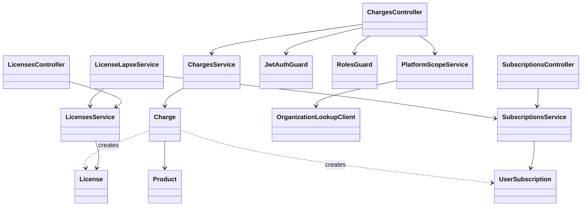

# payment-service

> **Superseded in its financial parts (2026-09-19).** The financial model below (`Product`, `Charge`, `License`, `UserSubscription` inside one payment-service, a JWT `organizationId` claim, the forwarded admin JWT, fire-and-forget events) is replaced by [`docs/architecture/financial-architecture.md`](../architecture/financial-architecture.md) and ADR-0035 to ADR-0038: billing-service (what is owed, entitlements), payment-service (how money moved), accounting-service (accounting effect). Read this document only for the history and for the rules of ADR-0006, ADR-0007 and ADR-0008 that survive.


- **Status:** Draft <!-- Draft | Reviewed | Implemented -->
- **Owners:** Anwar (project owner)
- **Related ADRs:** [0006](../adr/0006-per-user-subscription-reservation-on-license-lapse.md)
  (per-user subscription reservation on organization license lapse — the primary decision this
  document expands on). Also referenced: [0004](../adr/0004-synchronous-fail-closed-license-validation.md)
  (`auth-service`'s assumed license-status contract, finalized here),
  [0005](../adr/0005-bounded-time-license-subscription-revalidation.md) (`auth-service`'s
  login/refresh calls into the endpoints this document defines),
  [0007](../adr/0007-out-of-band-cash-payment-confirmation.md) (out-of-band cash payment
  confirmation via Admin role),
  [0008](../adr/0008-automatic-grace-license-on-license-lapse.md) (automatic 24-hour grace
  license on organization license lapse),
  [0020](../adr/0020-organization-entity-and-platform-scoped-management.md) (`auth-service`'s
  `Organization` entity and its `platformId` field, which ADR-0021 depends on), and
  [0021](../adr/0021-payment-service-platform-scoped-authorization.md) (synchronous, fail-closed
  platform-scope check, against `auth-service`, for `payment-service`'s organization-scoped
  admin actions).
- **Related ADDs/SDDs:** [docs/add/auth-service.md](./auth-service.md) is this document's main
  consumer (its `OrganizationValidationService` calls the endpoints defined here). A
  corresponding SDD, `docs/sdd/payment-service.md`, follows this ADD.

## Scope

This is `payment-service`'s first design document — until now it existed only as a bare Nest
CLI scaffold with a one-line description in `CLAUDE.md` (a gateway-agnostic billing engine
around a generic `Product`/`Charge` model). This document covers the slice of that model needed
to support `ADR-0006`: the two status endpoints `auth-service` depends on
(`GET /payment/licenses/:organizationId/status`, finalizing `ADR-0004`'s assumed contract, and
a new `GET /payment/subscriptions/:userId/status`), and the suspend/resume ("reservation")
mechanics that run when an organization's license lapses and later recovers, plus the events
`payment-service` publishes as a result.

Also covers `ADR-0007`'s out-of-band cash-payment request/confirm/reject/list endpoints and
`ADR-0008`'s automatic grace-license issuance on first license lapse — both narrow additions to
the same `LicenseLapseService`/`Charge` model this document already owns.

Explicitly out of scope:

- **The actual gateway purchase/checkout flow, and the `Charge → License`/`UserSubscription`
  issuance step itself** — how a `Product` gets bought and a `Charge` created in the first place
  for a *gateway* payment, and, more narrowly now, what actually writes a `License`/
  `UserSubscription` row once any `Charge` (gateway or cash) reaches `status = 'succeeded'`.
  `ADR-0007` adds a way to *request and confirm* a cash charge, but deliberately does not design
  what happens next — issuance is now a shared dependency of both the still-hypothetical gateway
  flow and the new cash-confirmation flow, not solved by either. Flagged as an open question,
  see Open questions.
- Payment gateway adapter specifics (Flouci, Konnect, Paymee, Stripe). `CLAUDE.md` already
  establishes that these live behind a common interface so adding a gateway doesn't touch
  business logic; this document doesn't design that interface's details.
- Which roles or users ever get a `UserSubscription` in the first place — that's a
  consuming-app decision (`nawara-drive` or any future app), never `payment-service`'s. This
  document only covers what happens to a `UserSubscription` that already exists.
- RabbitMQ infrastructure itself (broker, exchange/queue conventions, client library) — none
  exists anywhere in this repo yet, same gap already flagged in `auth-service`'s ADD.

## Context

`apps/payment-service/` is currently a bare, unmodified Nest CLI scaffold — no modules,
entities, or endpoints exist. This document gives it its first real shape, scoped narrowly to
what `ADR-0006` requires, rather than designing the whole billing engine `CLAUDE.md` describes
at once.

Today's and near-term callers of `payment-service`:

- **`auth-service`** — the first and, for now, only real consumer. Calls
  `GET /payment/licenses/:organizationId/status` from `POST /auth/organizations/validate`,
  and `POST /auth/register` (per `ADR-0004`). **As of `ADR-0026`, `auth-service` no longer calls
  `payment-service` from `POST /auth/login` or `POST /auth/refresh`, and no longer calls
  `GET /payment/subscriptions/:userId/status` at all** — `payment-service` being down blocks
  registration only, not authentication. Entitlement is checked by platform/consuming services,
  which become the callers of both status endpoints. `payment-service` also now owns trials: it
  starts a trial `UserSubscription` when it consumes `auth-service`'s `user.registered` event
  (`User.trialEndsAt` was removed from `auth-service`).
- **`notification-service`**, indirectly, via the async events `payment-service` publishes
  (below) — no direct API call.
- **Consuming apps** (e.g. `nawara-drive`), eventually, for the purchase/checkout flow itself —
  explicitly out of scope here (see Scope).

Per `ADR-0021`, `payment-service` is now also, for the first time, a **caller** of
`auth-service` — the reverse of every dependency direction described above. Before completing
`POST /payment/charges/:chargeId/cash/confirm`, `.../reject`, or filtering
`GET /payment/charges?method=cash&status=pending`, `payment-service` synchronously calls
`auth-service`'s new `GET /auth/organizations/:id` to confirm the target `Charge`'s
`organizationId` belongs to the acting admin's own platform, forwarding the same admin bearer
token it already verified locally. This mirrors `ADR-0004`'s existing `auth-service →
payment-service` license check, in the opposite direction, and is now `payment-service`'s own
first live synchronous dependency on another `nawara-core` service.

## Component overview

At the architecture level, this document adds four logical components to `payment-service`:

- **`LicensesModule`** (`LicensesController`, `LicensesService`) — owns the `License` entity
  (one per organization) and implements `GET /payment/licenses/:organizationId/status`,
  finalizing the contract `auth-service` has assumed since `ADR-0004`.
- **`SubscriptionsModule`** (`SubscriptionsController`, `SubscriptionsService`) — owns the
  `UserSubscription` entity (one per user who has ever purchased individual access) and
  implements `GET /payment/subscriptions/:userId/status`.
- **`LicenseLapseService`** — detects when a `License`'s status changes (active → expired,
  or expired → active again) and, on each transition, suspends or resumes every
  `UserSubscription` under that organization and publishes the lifecycle events below. The
  exact detection mechanism (a scheduled sweep vs. reacting to whatever process renews/revokes
  a license) is not decided by this document — see Open questions. Per `ADR-0008`, it now also
  decides, on a lapse, whether to auto-issue a 24-hour grace `License` (`type: 'standard' →
  'grace'`, no suspension) instead of immediately expiring, based on the lapsing row's current
  `type` — the existing expire/suspend behavior only runs once a `type = 'grace'` row also lapses.
- **`ProductsModule`/`ChargesModule`** — the generic catalog (`Product`) and payment-transaction
  (`Charge`) concepts from `CLAUDE.md`. A successful `Charge` against an `org_license`-type or
  `individual_subscription`-type `Product` is what creates the corresponding `License` or
  `UserSubscription` row in the first place — the purchase flow itself is out of scope here,
  but the resulting entities are what `LicensesModule`/`SubscriptionsModule` operate on. Per
  `ADR-0007`, `ChargesModule` now also owns the out-of-band cash-payment path: an organization
  submitting a cash-payment request (`POST /payment/charges/cash`), and the platform's Admin
  confirming, rejecting, or listing pending ones (`POST /payment/charges/:chargeId/cash/confirm`,
  `POST /payment/charges/:chargeId/cash/reject`, `GET /payment/charges?method=cash&status=pending`)
  — all four are `payment-service`'s first authenticated endpoints, gated by a new
  `JwtAuthGuard` (verifies the caller's JWT; required on all four), and the latter three
  additionally gated by a new `RolesGuard` (checks `role: admin`; required only on
  confirm/reject/list — see below). Per `ADR-0021`, those same three admin-only endpoints are
  now additionally gated by a new `PlatformScopeService` — checking that the target `Charge`'s
  `organizationId` belongs to the acting admin's own platform, via a live call to `auth-service`
  through a new `OrganizationLookupClient` — the mirror image, on `payment-service`'s side, of
  `auth-service`'s existing `OrganizationValidationService`/`PaymentServiceClient` split.

```mermaid
graph LR
  subgraph Consumers
    Auth[auth-service]
    OrgCaller[organization caller]
    Admin[Admin user]
  end

  Auth -- "REST/HTTPS (license status)" --> LicensesController
  Auth -- "REST/HTTPS (subscription status)" --> SubscriptionsController
  OrgCaller -- "REST/HTTPS (submit cash request)" --> ChargesController
  Admin -- "REST/HTTPS (confirm/reject/list, JWT role=admin)" --> ChargesController

  subgraph payment-service
    LicensesController --> LicensesService
    SubscriptionsController --> SubscriptionsService
    ChargesController --> JwtAuthGuard
    ChargesController --> RolesGuard
    ChargesController --> PlatformScopeService
    ChargesController --> ChargesService
    LicensesService --> LicenseLapseService
    LicenseLapseService --> SubscriptionsService
    PlatformScopeService --> OrganizationLookupClient
  end

  OrganizationLookupClient -- "REST/HTTPS (GET /auth/organizations/:id, forwarded admin JWT)" --> Auth

  LicensesService --> PaymentDB[(payment-service Postgres DB)]
  SubscriptionsService --> PaymentDB
  ChargesService --> PaymentDB
  LicenseLapseService -. license.expired / license.reactivated / license.grace_issued .-> Broker[[RabbitMQ]]
  SubscriptionsService -. subscription.suspended / subscription.resumed .-> Broker
  ChargesService -. charge.cash_requested .-> Broker
```

`auth-service` only ever calls the two `*Controller` read endpoints — it has no visibility into
`LicenseLapseService` or the event-publishing side, consistent with `payment-service` owning
this data end to end. `LicenseLapseService` is the only component that mutates a
`UserSubscription`'s status as a side effect of something other than its own owner's action
(purchase, or an eventual cancellation flow, both out of scope here). Per `ADR-0007`,
`ChargesController` now has two distinct kinds of caller with different auth requirements, both
enforced by two new guards — `payment-service`'s first authentication/authorization checks of
any kind. `JwtAuthGuard` verifies the caller's JWT and runs in front of all four `ChargesController`
endpoints; `RolesGuard` additionally checks `role: admin` and runs only on the three
confirm/reject/list endpoints, following the same generic `role: string` pattern `auth-service`'s
own `RolesGuard` already uses (see `docs/add/auth-service.md`'s "RBAC guards" component). Any
organization-scoped caller (JWT `organizationId` claim matching the org being billed, no extra
role) can submit a cash request past `JwtAuthGuard` alone; confirming, rejecting, or listing
pending cash requests additionally requires clearing `RolesGuard`. Per `ADR-0021`, those same
three admin actions additionally require clearing `PlatformScopeService` — a live check,
through `OrganizationLookupClient`, that the target `Charge`'s organization belongs to the
caller's own platform. `POST /payment/charges/cash` is unaffected: its `organizationId` comes
from the caller's own JWT claim, not an admin-supplied target, so there is no cross-platform
question to ask.

At the class level, the same components resolve to:



This is an architecture-level view — components and the entities they own, no fields or method
signatures. See `docs/sdd/payment-service.md`'s "Key interfaces / classes" section for the full
class diagram with DTOs and field-level detail.

## Communication & data flow

Two synchronous read endpoints, both consistent with this repo's "API is the only contract"
principle:

1. **`GET /payment/licenses/:organizationId/status`** → `{ valid: boolean, expiresAt: Date | null }`.
   Finalizes the shape `auth-service` has assumed since `ADR-0004`. Returns `{valid: false,
   expiresAt: null}` for both "no license exists for this organization" and "license expired" —
   deliberately not distinguished, mirroring the same enumeration-avoidance reasoning
   `auth-service` already applies to its own client-facing response.
2. **`GET /payment/subscriptions/:userId/status`** → `{ exists: boolean, valid: boolean,
   expiresAt: Date | null }`. `exists: false` means no `UserSubscription` row was ever created
   for this user — `auth-service` treats that as "not applicable," never as a reason to block
   login/refresh (per `ADR-0006`). `exists: true, valid: false` covers both `suspended` and
   naturally `expired` subscriptions.

Per `ADR-0007`, four new endpoints on `ChargesController`:

3. **`POST /payment/charges/cash`** — organization-scoped auth (JWT `organizationId` claim
   matches the org being billed, no extra role). Body `{ productId, beneficiaryUserId? }`;
   `beneficiaryUserId` required iff `Product.type === 'individual_subscription'`, rejected (400)
   if supplied for `org_license`, and 400 if `Product.type === 'one_time'` (out of scope).
   Creates a `pending`, `method = 'cash'` `Charge` and returns it.
4. **`POST /payment/charges/:chargeId/cash/confirm`** — Admin-only (`role: admin`). `409` unless
   `method = 'cash' && status = 'pending'`. Sets `status = 'succeeded'` and hands off to the
   still out-of-scope issuance step (see Scope).
5. **`POST /payment/charges/:chargeId/cash/reject`** — Admin-only, same `409` precondition, sets
   `status = 'failed'`.
6. **`GET /payment/charges?method=cash&status=pending`** — Admin-only listing, the Admin's only
   way to discover pending cash requests given no admin dashboard exists anywhere in this repo.

Six async events (four existing, two new by `ADR-0007`/`ADR-0008`), published for side effects
consistent with `CLAUDE.md`'s "async events for side effects" principle, and following the exact
conventions `auth-service`'s `user.registered` event already established (flat primitive
payload, `resource.past_tense_verb` naming, publisher stays decoupled from
`notification-service`'s channel/template concerns):

- **`license.expired`** / **`license.reactivated`** — `{ organizationId, ownerId, timestamp }`,
  where `ownerId` is the `userId` of whoever purchased the organization's license — published
  by `LicenseLapseService` so `notification-service` can inform that admin, without
  `payment-service` needing to know anything about notification channels or templates.
- **`subscription.suspended`** — `{ userId, organizationId, frozenRemainingSeconds, timestamp }`
- **`subscription.resumed`** — `{ userId, organizationId, restoredExpiresAt, timestamp }`
- **`license.grace_issued`** (new, per `ADR-0008`) — `{ organizationId, ownerId, expiresAt,
  timestamp }`, published by `LicenseLapseService` on the first lapse of a `type = 'standard'`
  license, instead of `license.expired`. Deliberately carries `expiresAt`, unlike its two
  siblings above, so the notified admin knows exactly when the grace window closes.
- **`charge.cash_requested`** (new, per `ADR-0007`) — `{ chargeId, productId, organizationId,
  payerId, submittedByUserId, amount, currency, timestamp }`, published by `ChargesService` when
  an organization submits a cash-payment request, so `notification-service` (or, eventually, an
  Admin-facing consumer) can surface it without polling the new listing endpoint.

`subscription.suspended`/`subscription.resumed` are published per-affected-user by
`SubscriptionsService` when `LicenseLapseService` triggers a suspend/resume pass over an
organization's subscriptions.

**Infrastructure gap:** no RabbitMQ broker, exchange/queue naming convention, or client library
exists anywhere in this repo yet (same gap already flagged in `auth-service`'s ADD) — all six
events above are design recommendations, not components that can be built today without that
follow-up infrastructure work landing first.

**Data ownership:** `payment-service` is the sole owner and writer of `Product`, `Charge`,
`License`, and `UserSubscription` records, in its own dedicated Postgres database, never shared
with any other service. `organizationId` and `userId` values stored on `License`/
`UserSubscription` are opaque foreign references (stamped from the JWT at purchase time) —
`payment-service` never queries `auth-service`'s database directly to resolve them, consistent
with this repo's database-per-service principle. `Charge.method` and `Charge.submittedByUserId`
(per `ADR-0007`) are likewise owned entirely by `payment-service`: `submittedByUserId` is stamped
from the confirmed-caller's JWT at request time, exactly like `payerId`/`organizationId`
elsewhere on this entity — never inferred or looked up from `auth-service`.

## Non-functional constraints

- **`payment-service` is no longer a dependency of authentication (`ADR-0026`, superseding
  `ADR-0005`).** It is a hard dependency only of registration and of whichever platform services
  enforce entitlement, so its availability no longer decides whether anyone can log in.
- **Status endpoints must stay cheap and fast.** Both endpoints are now called by platform services at the point of use (per `ADR-0026`; formerly on every login and
  refresh, per `ADR-0005`), so they stay hot and should be simple indexed lookups
  (`organizationId` on `License`, `userId` on `UserSubscription`), not anything requiring a
  join across gateway/payment-provider data on the hot path.
- **RabbitMQ infra gap** (as above) — the six lifecycle events are undeliverable until that
  infrastructure exists.
- **Idempotency of suspend/resume.** `LicenseLapseService` must treat re-triggering a
  suspend or resume pass on an already-suspended or already-active subscription as a no-op —
  whatever detection mechanism is chosen (see Open questions) may fire more than once for the
  same transition.
- **`payment-service` has no JWT verification or `RolesGuard` today.** Per `ADR-0007`, the three
  Admin-only cash endpoints need to verify a JWT and check `role: admin` locally, a capability
  that doesn't exist anywhere in `payment-service` yet (unlike `auth-service`, which already has
  both — see `docs/add/auth-service.md`'s "RBAC guards (`RolesGuard`)" component). Building this
  is now a blocking dependency, not optional hardening, and it inherits `auth-service`'s ADD's
  already-open "No secret-distribution mechanism yet" gap — there is still no mechanism anywhere
  in this repo for distributing the JWT signing secret/key to a service that needs to verify
  tokens locally. That gap previously only threatened a hypothetical future consumer; it now
  concretely blocks this decision.
- **`payment-service`'s three admin cash endpoints now have a hard runtime dependency on
  `auth-service`, per `ADR-0021`.** Before completing a confirm, reject, or pending-cash listing,
  `payment-service` synchronously calls `auth-service`'s `GET /auth/organizations/:id` to check
  platform ownership; any failure or timeout fails the action closed (see that ADR's Decision
  for exact response shapes). (`ADR-0026` removed `payment-service`'s former hard dependency from `auth-service`'s login/refresh,
  so the dependency is now mostly one-directional.) The two services still call each other for
  different flows. Filtering
  `GET /payment/charges?method=cash&status=pending` by platform costs one such call per
  **distinct** organization present in a given result page, not one per request, compounding
  this endpoint's already-open "no pagination in v1" question (see Open questions).

## Open questions

- The exact mechanism `LicenseLapseService` uses to detect that a license has lapsed or been
  renewed (a scheduled sweep over `License.expiresAt`, vs. reacting synchronously to whatever
  process renews/revokes a license) — not decided by this document; belongs in
  `docs/sdd/payment-service.md` or its own ADR if the choice turns out to be hard to reverse.
- The purchase/checkout API shape for creating a `Product`/`Charge`/`License`/
  `UserSubscription` in the first place, **and the `Charge → License`/`UserSubscription`
  issuance step a successful `Charge` hands off to** — explicitly out of scope for this pass,
  and now a dependency shared by both that still-hypothetical gateway flow and `ADR-0007`'s new
  cash-confirmation flow (see that ADR's Consequences).
- Payment gateway adapter interface specifics (Flouci, Konnect, Paymee, Stripe) — out of scope
  here, per `CLAUDE.md`.
- ~~Whether `License` should support a grace period between expiry and actually triggering
  suspension/logout (e.g. a few days of leeway)~~ — resolved by
  [`ADR-0008`](../adr/0008-automatic-grace-license-on-license-lapse.md): a single, automatic,
  24-hour grace `License` on first lapse per renewal cycle.
- A retry/outbox strategy for reliably publishing the six lifecycle events once RabbitMQ
  infrastructure actually exists, so a crash between suspending a subscription and publishing
  its event doesn't silently drop the notification.
- Building `payment-service`'s own JWT verification/`RolesGuard` capability, and how it obtains
  the JWT signing secret/key given the still-unsolved secret-distribution gap (see Non-functional
  constraints above and `docs/add/auth-service.md`'s own open item on the same gap).
- Whether `platformId` should eventually be denormalized onto `Charge`/`License`/
  `UserSubscription` rows at write time — `ADR-0021`'s Option 2, deferred rather than adopted —
  if the live per-request lookup's availability coupling or the pending-cash listing's
  per-organization batch-lookup cost ever prove unacceptable at scale.
- Whether the same platform-scoping check `ADR-0021` adds to today's cash-payment endpoints
  needs to be retrofitted onto the still-undesigned gateway purchase/checkout flow or the
  `Charge → License`/`UserSubscription` issuance step, once either is actually designed —
  `ADR-0021` does not decide this for flows that don't exist yet.
