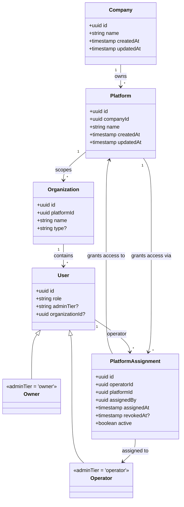

# 0022. Company and Platform entities, with many-to-many operator↔platform assignment

- **Status:** Proposed
- **Date:** 2026-09-18
- **Deciders:** Anwar (project owner)

> **Amended by [ADR-0024](./0024-database-enforced-tenancy-and-authorization-integrity.md)** (on the following point only; the rest of this ADR stands): The "at most one active row per `(operatorId, platformId)`, service layer only" position is reversed (partial unique index + append-only trigger), `assignedBy` must be an `Owner`, `revokedBy`/`companyId` are added, and the owner→company relationship is explicit — see ADR-0024.

## Context

Since ADR-0009, `platformId` has been a purely opaque string: a scalar column on `User`
(non-null for every `role: 'admin'` row, null otherwise), never validated against anything —
"auth-service never interprets its value beyond requiring it be present." ADR-0016's bootstrap
CLI takes it as a required, unvalidated env var (`BOOTSTRAP_OWNER_PLATFORM_ID`) and scopes its
owner-existence idempotency check to that raw string. ADR-0020 (still `Proposed`) introduces a
first-class `Organization` entity with a `platformId: string` field, but that field is likewise
unvalidated — `Organization.platformId` is stored and echoed, never checked against a real
`Platform` row, because no such row, or table, exists anywhere in this schema. There is no
`Company` entity either. Nothing in this design today can answer "does this platform id refer
to anything real," "what platforms exist," or "which operators currently have access to which
platform" — an operator's platform access has, until now, been exactly one scalar value
(`User.platformId`), set once at creation (per ADR-0011, "taken from the caller's own JWT
claim") and never revocable independently of blocking the operator's whole account (ADR-0012's
block/unblock is all-or-nothing across every platform an operator might ever need, since there
is currently only ever one).

Separately, `CLAUDE.md`'s own "Consumers" section already names two, and implicitly more,
separate consuming apps this repo is meant to serve as shared infrastructure — `nawara-drive`
today, and `daycare` as an eventual, explicitly-named future destination for these same
services. In practice, this repo already behaves as one system serving multiple platforms
(deployments), even though today's schema only models "one platform" as an unvalidated string
with no registry behind it.

Two structural gaps this ADR needs to resolve, distinct but related:

1. **No real `Company`/`Platform` hierarchy.** `platformId` needs to become a real, queryable
   entity — something `Organization.platformId` (ADR-0020) can actually be validated against —
   and, above that, a notion of who owns a platform in the first place (a `Company`), since
   ADR-0017's "single owner, permanently" decision was framed at the platform level without a
   concept of the company that platform belongs to.
2. **Operator platform access is a single scalar, not a revocable, auditable, many-to-many
   relationship.** An operator today can only ever be scoped to the one platform baked into
   their `User.platformId` at creation time, with no way to grant or revoke access to a second
   platform, and no history of when access was granted or by whom.

This ADR resolves both. It does not resolve, and explicitly leaves to follow-up ADRs named by
number below: ADR-0017's "one owner per platform" wording (which this ADR's Decision states
needs to become "one owner per company," rewritten in place in a later pass, not edited here),
and the concrete mechanism by which a downstream request proves an operator's platform access
is still active at request time (deferred to ADR-0023).

## Options considered

1. **Keep `platformId` as an opaque string everywhere, only add the many-to-many assignment
   table.** Solves the operator-assignment gap without touching the entity model — a
   `PlatformAssignment` row could reference a bare `platformId: string` with no `Platform`
   table behind it, exactly the way `Organization.platformId` (ADR-0020) already does.
   Rejected: it leaves the first gap completely open — there would still be no registry of what
   platforms exist, no way for the new Platform CRUD endpoints this ADR needs to have anything
   to list or validate against, and `Organization.platformId` would stay permanently
   unvalidatable even though both tables live in the same `auth-service` database and a real
   foreign key is trivially achievable. It also gives `PlatformAssignment.platformId` no
   integrity guarantee at all — a typo'd platform id in an assignment row would silently create
   an assignment to nothing.
2. **Model `Platform` as first-class but skip `Company` — platforms exist independently, with
   no parent entity.** Simpler: one fewer table, one fewer level of hierarchy to reason about,
   and today there is in practice only one company operating any of these platforms anyway.
   Rejected: it would make ADR-0017's upcoming "one owner per company" rewrite (see Decision
   below) impossible to express in the schema — a company-wide owner needs a `Company` row to
   be scoped to, not a `Platform` row, precisely because the whole point of that rewrite is that
   one owner spans *all* platforms, and "all platforms" isn't a well-defined set without a
   `Company` row that owns them. Introducing `Company` now, even as a practically-single-row
   table, avoids a second schema migration and a second owner-scoping rewrite later if a second
   company is ever onboarded — see Decision for why this is treated as deliberate, not
   speculative, groundwork.
3. **Full `Company`/`Platform` hierarchy plus an append-only, many-to-many
   `PlatformAssignment` table for operators (chosen).** Gives `Organization.platformId` (and,
   historically, every prior opaque `platformId` reference) a real row to point at, gives an
   owner a well-defined company-wide scope to match ADR-0017's upcoming rewrite, and replaces
   the single scalar `User.platformId` with a revocable, auditable, many-to-many relationship
   for operators specifically — the actual business need driving this decision.

## Decision

We chose **Option 3**. Concretely:

### New `Company` entity (auth-service, TypeORM per ADR-0003)

- `id: uuid` — primary key.
- `name: string` — required.
- `createdAt: timestamp`, `updatedAt: timestamp`.

**Deliberately modeled as a real table now, even though exactly one row exists in practice
today.** This is a stated, deliberate choice, not speculative over-engineering: per `CLAUDE.md`'s
own "Consumers" section, this repo already serves more than one separate consuming app
(`nawara-drive` today, `daycare` named as an eventual destination) as, in effect, one shared
system — a proper `Company`/`Platform` registry is the natural formalization of that fact, not
an invented one. Building `Platform.companyId` as a required foreign key from day one, even
against a single-row `Company` table, avoids a second, materially riskier migration later (an
`ALTER TABLE` introducing a required foreign key onto an already-populated `Platform` table) if
a second company is ever onboarded. Whether multi-company support is ever actually exercised is
named explicitly as an open question below — this ADR does not claim to have decided that it
will be, only that the schema shouldn't need a rewrite if it is.

### New `Platform` entity (auth-service, TypeORM per ADR-0003)

- `id: uuid` — primary key.
- `companyId: uuid` — required, FK → `Company.id`.
- `name: string` — required.
- `createdAt: timestamp`, `updatedAt: timestamp`.

**`Platform.id` is what every existing opaque `platformId` string reference actually refers
to**, stated explicitly because it is the central cross-cutting point of this decision:
`Organization.platformId` (ADR-0020) and, historically, `User.platformId` (ADR-0009, dropped by
this ADR — see below) were always meant to identify exactly this thing; they simply had no real
row to point at until now. `Organization.platformId` becomes a real foreign key to `Platform.id`
from this ADR forward — both tables live in `auth-service`'s own database, so, unlike the
`organizationId` cross-service references ADR-0020 explicitly left as unenforceable opaque
strings (because `auth-service` and `payment-service` each own their own database, per this
repo's database-per-service principle), this is an actual, enforceable referential-integrity
upgrade over today's unchecked opaque string. **This changes ADR-0020's `Organization.platformId`
field description slightly** (from an opaque, unvalidated string to a real FK); ADR-0020 itself
is a `Proposed`, not yet `Accepted`, ADR, and will be rewritten in place in a later pass to
reflect this — it is not edited as part of this ADR, only named here as a direct dependency.

### `User.platformId` is dropped entirely

ADR-0009's `platformId: string | null` column on `User` is removed by this ADR. This is safe
because every case that column previously covered now has an equivalent, or better, source of
truth:

- **Ordinary (non-admin) users** never had `platformId` populated in the first place (per
  ADR-0009, "a regular end user's `platformId` stays always-null"); their platform, when it
  matters, is already derivable via `organizationId → Organization.platformId` (ADR-0020),
  which this ADR upgrades to a real FK. No information is lost.
- **An Owner** is now scoped company-wide, not platform-wide (see below) — `adminTier: 'owner'`
  alone is sufficient to imply unconditional access across every platform under their company;
  a scalar `platformId` column would be actively wrong for this tier now, not merely redundant.
- **An Operator's** platform access no longer belongs on `User` as a single scalar at all — it
  now lives in the new `PlatformAssignment` table below, which can represent zero, one, or many
  platforms per operator, with full history, none of which a scalar column could ever express.

### New `PlatformAssignment` entity — append-only, many-to-many, auditable

- `id: uuid` — primary key.
- `operatorId: uuid` — required, FK → `User.id` (the operator).
- `platformId: uuid` — required, FK → `Platform.id`.
- `assignedBy: uuid` — required, FK → `User.id` (the owner who granted this assignment).
- `assignedAt: timestamp` — required.
- `revokedAt: timestamp | null`.
- `active: boolean` — required.

This table is **append-only history, not a mutable membership table**: revoking an assignment
sets `revokedAt` and `active: false` on the existing row — it is never deleted — and granting
access again after a revocation always inserts a **new** row rather than reactivating the old
one. This preserves a full, permanent audit trail of every grant and revocation an operator has
ever had, for every platform, exactly the same "old one is superseded, not deleted" philosophy
ADR-0010 already uses for secret-key rotation and ADR-0011 already uses for login codes.

**Invariant: at most one active row per `(operatorId, platformId)` pair, enforced at the service
layer, not a database constraint.** This mirrors how this repo already handles a structurally
similar invariant — ADR-0009's "every admin row has a non-null `platformId` iff `role: 'admin'`"
rule is likewise a service-layer, not schema-level, invariant. A partial unique index on
`(operatorId, platformId) WHERE active = true` was considered as a stronger, DB-enforced
alternative and is not ruled out for a future revision, but is not required by this decision;
the assignment-creation and revocation endpoints below are the sole write paths responsible for
upholding it in the meantime.

### Owner becomes company-wide, not platform-wide

This ADR changes the direction ADR-0017 (`Proposed`, unmerged) took: ADR-0017 permanently
decided "single owner **per platform**." This ADR instead makes an owner scoped to a
**company** — one owner has unconditional access across every platform that company owns, with
no per-platform assignment needed. ADR-0017 will be rewritten in place in a follow-up pass to
reflect "one owner per Company" rather than "one owner per platform" — consistent with this
repo's own precedent of rewriting still-`Proposed` ADRs in place rather than superseding them
(the same move ADR-0017 itself made when it replaced its own earlier multi-owner draft). That
rewrite is not performed here; it is only named as a direct, necessary dependency of this
decision.

### JWT payload change

The JWT (per ADR-0002) drops the `platformId` claim entirely. New shape:

```
{ sub, role, organizationId?, adminTier?, iat, exp }
```

- `adminTier: 'owner'` needs no platform claim at all: it implies unconditional, global access
  across the owner's entire company by construction — there is nothing for a claim to scope,
  since there is nothing an owner is ever excluded from.
- `adminTier: 'operator'` must **never** be trusted from a JWT for platform scoping, for a
  reason that didn't exist under the old scalar model: an assignment can now be revoked at any
  time, independently of the operator's token lifetime, and a stateless JWT claim has no way to
  reflect that revocation before the token's own expiry. Every operator request that needs
  platform scoping must perform a live `PlatformAssignment` check against the database at
  request time, not trust a cached claim. The concrete mechanism for that check (endpoint shape,
  guard, caching/performance tradeoffs) is deliberately not designed here — **see ADR-0023**,
  a follow-up ADR that owns this decision.

### New endpoints — Owner-only, gated by the existing `AdminTierGuard` (`adminTier: 'owner'`)

Following this repo's existing endpoint-design conventions (Bearer auth, DTOs, `201`/`200` on
success, collapsed `404` — never a distinguishing `403` — on any `:id` mismatch, per
ADR-0012/ADR-0017/ADR-0020's shared precedent):

- **`POST /auth/admin/platforms`** — creates a `Platform`. Body: `{name}`. `companyId` is not
  accepted in the body — it is implicit, resolved to the (currently singleton) `Company` row,
  since there is exactly one today (see multi-company as an open question below).
- **`GET /auth/admin/platforms`** — lists all platforms under the caller's company.
- **`GET /auth/admin/platforms/:id`** — `404` if `:id` doesn't resolve to a platform under the
  caller's own company.
- **`PATCH /auth/admin/platforms/:id`** — same lookup/`404` shape as `GET :id`. Body: `{name?}`.
- **`POST /auth/admin/operators/:id/platform-assignments`** — body `{platformId}`. Creates a new
  **active** `PlatformAssignment` row for that operator, with `assignedBy` set to the calling
  owner's own id (never accepted from the request body — the same "never trust a body-supplied
  identity when the caller's own claim already says who they are" pattern this repo already
  applies to scope ids, e.g. ADR-0007's `organizationId`, ADR-0011/ADR-0020's `platformId`).
  `404` if `:id` doesn't resolve to an operator, `404` if `platformId` doesn't resolve to a real
  `Platform`. `409` if an active assignment for that exact `(operatorId, platformId)` pair
  already exists — re-assigning an already-assigned pair is a no-op state, not silently
  accepted, so the caller isn't misled into thinking a second grant happened.
- **`DELETE /auth/admin/operators/:id/platform-assignments/:platformId`** — revokes the
  currently-active assignment for that operator+platform pair, setting `revokedAt`/
  `active: false` on the existing row. `404` if no assignment is currently active for that pair
  (whether none ever existed, or the only one that did is already revoked) — collapsing both
  cases into the same response, consistent with this repo's existing collapsed-`404` posture.
- **`GET /auth/admin/operators/:id/platform-assignments`** — lists the operator's full
  assignment history, active and revoked alike, ordered by `assignedAt`. `404` if `:id` doesn't
  resolve to an operator under the caller's own company.
- **`POST /auth/admin/operators`** (existing endpoint, ADR-0011) — **behavioral change to this
  endpoint's payload, not a supersession of ADR-0011 itself.** `platformId` is dropped from its
  creation body entirely: an operator is now created platform-less, with zero
  `PlatformAssignment` rows, and every platform grant happens afterward, explicitly, via
  `POST /auth/admin/operators/:id/platform-assignments` above. ADR-0011's other content — the
  time-boxed login code mechanism, the request-code/verify-code flow, the business-day gating —
  is untouched by this ADR.

### Bootstrap CLI rework

This is the concrete mechanism by which this ADR supersedes ADR-0016. `bootstrap-owner.ts`'s
env vars and idempotency logic change as follows:

- **Env vars:** `BOOTSTRAP_COMPANY_NAME`, `BOOTSTRAP_OWNER_EMAIL`, `BOOTSTRAP_OWNER_PASSWORD` —
  all required, fail-closed, checked before any database write, exactly matching ADR-0016's own
  fail-closed posture for its three env vars. `BOOTSTRAP_OWNER_PLATFORM_ID` no longer exists —
  there is no per-platform scoping left for a company-wide owner to be bootstrapped against.
- **Idempotency, re-scoped from per-platform to global**, evaluated in this order:
  1. If no `Company` row exists yet, create one using `BOOTSTRAP_COMPANY_NAME`. (In practice,
     under today's single-company assumption, this only ever runs once, on the very first
     invocation in a fresh environment — mirroring ADR-0016's own observation that a fresh
     database is the normal, not edge, case for this design.)
  2. Check **globally** — not scoped to any platform, since there is no longer a platform to
     scope by — whether any `role: 'admin' AND adminTier: 'owner'` row already exists anywhere.
     If yes: no-op/refuse, mirroring ADR-0016's original fail-closed idempotency philosophy,
     re-scoped from "per platform" to "globally" (per this ADR's own company-wide owner model,
     there is now only ever one meaningful scope to check against, not one per platform).
  3. If no owner exists yet: create the owner row with `organizationId: null`, `role: 'admin'`,
     `adminTier: 'owner'` — no `platformId` to set, since that column no longer exists.

ADR-0016's other decisions — writing through the real `UsersService` rather than raw SQL, never
minting a secret key at bootstrap time, the three-required-env-vars-as-the-gate posture, the
non-HTTP `NestFactory.createApplicationContext` entrypoint shape — are unaffected in spirit and
are expected to carry forward into the reworked command; this ADR only changes what the command
is scoped and keyed by, not the operational shape ADR-0016 established.

### Domain model



**Owner and Operator are not separate physical tables.** Exactly as ADR-0009 originally
established (and as this ADR's own "`User.platformId` is dropped" section relies on), both
remain plain `User` rows discriminated only by `adminTier`; the `Owner`/`Operator` boxes above
are stereotyped subtypes shown for clarity of the access-flow relationships they participate
in, not new entities this ADR introduces.

### Access-flow explanation

Two distinct flows result from this decision, with no overlap:

- **Owner:** `Owner → Company → all Platforms → all Organizations → all Users → all platform
  resources`. No `PlatformAssignment` row is ever consulted for an owner — company-wide access
  is unconditional and implicit in `adminTier: 'owner'` alone, by construction.
- **Operator:** `Operator → PlatformAssignment (active) → assigned Platforms only →
  Organizations inside those Platforms → Users/resources per permissions`. Critically,
  fine-grained in-platform permissions — e.g. "can this operator update Students" — are
  **not** `auth-service`'s concern at all. `auth-service` only ever proves *platform access*
  (whether a live, active `PlatformAssignment` row exists for this operator/platform pair); each
  downstream, platform-specific service decides its own domain permissions on top of that,
  exactly per `CLAUDE.md`'s "keep services generic" hard rule — a driving-school-specific notion
  like "can manage Students" must never be modeled inside `auth-service`.

## Consequences

- **Closes ADR-0016's gap for a real reason, not just supersession bookkeeping**: bootstrap no
  longer needs an unvalidated, deployer-invented `platformId` string at all — a company-wide
  owner has nothing platform-scoped left to bootstrap into.
- **Supersedes ADR-0009 and ADR-0016.** Per this repo's ADR-immutability rule, both ADRs' own
  text is left unedited except for their status line and a backlink to this ADR — they remain
  accurate history of what was decided at the time, not rewritten to match this ADR's model.
- **Directly modifies ADR-0011's `POST /auth/admin/operators` payload** (dropping `platformId`
  from operator creation) without superseding ADR-0011 as a whole — the same "modify in the
  new ADR's Decision, don't edit the old ADR's text" move ADR-0016 already used for ADR-0005's
  login/refresh gap, and ADR-0012 already used for ADR-0011's own request-code check.
- **Creates two named, concrete follow-up ADRs this decision depends on but does not perform
  itself:**
  - ADR-0017 (currently `Proposed`) needs to be rewritten in place to reflect "one owner per
    Company," not "one owner per platform" — not done here.
  - ADR-0020 (currently `Proposed`) needs its `Organization.platformId` field description
    updated from an opaque string to a real FK to `Platform.id` — not done here.
  - ADR-0023 (not yet written) needs to define the concrete live-check mechanism (endpoint
    shape, guard, performance/caching tradeoffs) that proves an operator's platform access is
    still active at request time, now that a JWT claim can no longer be trusted for this. This
    ADR only establishes that such a check must exist and must be live, not how.
- **`docs/adr/README.md`, `docs/add/auth-service.md`, and `docs/sdd/auth-service.md` are not
  updated by this ADR** — deliberately deferred to a later pass once ADR-0023 also exists, so
  those living documents only need to be revised once for the full resulting picture rather than
  twice in quick succession.
- **A real, if currently narrow, referential-integrity upgrade**: `Organization.platformId` (and
  the new `PlatformAssignment.platformId`) can no longer silently reference a nonexistent
  platform, since both tables live in `auth-service`'s own database — unlike the
  `organizationId` references crossing into `payment-service`'s separate database (ADR-0020),
  which remain, and will always remain, unenforceable opaque strings under this repo's
  database-per-service principle.
- **Widens the append-only-audit-trail pattern already used elsewhere in this design** (secret
  key rotation per ADR-0010, login codes per ADR-0011) to a new, genuinely many-to-many
  relationship — `PlatformAssignment` is this repo's first entity of that shape, and any future
  many-to-many, revocable grant (should one arise) now has a concrete precedent to follow.
- **The service-layer-only "at most one active assignment per pair" invariant is a real,
  accepted risk under concurrent writes** — two simultaneous `POST .../platform-assignments`
  calls for the same operator/platform pair could, in principle, both observe "no active row"
  and both insert one, momentarily violating the invariant until whichever check-then-insert
  loses the race is caught by a subsequent read. This is the same category of risk ADR-0009's
  own service-layer, non-null-`platformId`-iff-admin invariant already accepts, not a new kind
  of gap this ADR introduces.
- **Owner-tier lockout risk is now company-wide, not platform-wide** — ADR-0017's still-unedited
  "sole owner loses both password and secret key" risk, once ADR-0017 is rewritten per this
  ADR's Decision, will apply to the entire company's access, not to one platform in isolation.
  This is named here as a direct, foreseeable consequence of the company-wide owner model, not
  a new decision — the actual severity/mitigation question belongs to ADR-0017's own rewrite.

## Open questions

- **Is multi-company support ever actually needed?** Today, and for the foreseeable future,
  exactly one `Company` row exists in practice. This ADR treats the table as deliberate
  groundwork against a future second company (see Decision, Option 2's rejection), but whether
  that future ever materializes is genuinely unknown — this is named as an open question rather
  than a settled justification.
- **What happens to an operator's other active assignments/session when one is revoked?** This
  ADR does **not** force a full logout, and does not revoke any other active
  `PlatformAssignment` the same operator may hold for a different platform. Only requests scoped
  to the specifically revoked platform are denied going forward, and only once the live check
  (per **ADR-0023**, not designed here) is actually consulted on a per-request basis. Whether
  that leaves a meaningful stale-access window on the revoked platform between revocation and
  the next live check, and how narrow that window needs to be, is ADR-0023's decision to make,
  not this one's.
- **Should the "at most one active `PlatformAssignment` per pair" invariant eventually become a
  DB-level partial unique index** (`(operatorId, platformId) WHERE active = true`) instead of a
  service-layer-only check? Named in Consequences as an accepted, not resolved, gap.
