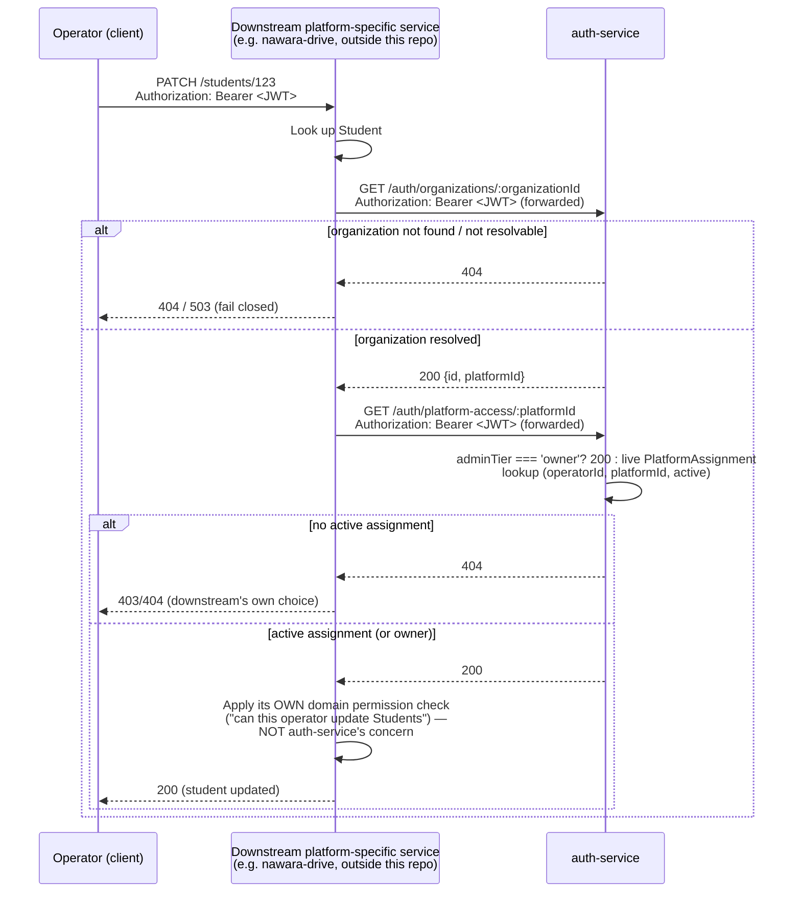

# 0023. Generic platform-access check, and decoupling operator login/session gating from any Platform's calendar

- **Status:** Proposed
- **Date:** 2026-09-18
- **Deciders:** Anwar (project owner)

> **Amended by [ADR-0024](./0024-database-enforced-tenancy-and-authorization-integrity.md)** (on the following point only; the rest of this ADR stands): the platform-access check no longer returns `200` unconditionally for an owner — it requires the platform to exist in the owner's own company and the account to be active — see ADR-0024.

## Context

ADR-0022 replaced the single scalar `User.platformId` with a many-to-many, revocable,
auditable `PlatformAssignment {id, operatorId, platformId, assignedBy, assignedAt, revokedAt?,
active}` table, dropped `User.platformId` entirely, and removed the `platformId` claim from the
JWT (new shape: `{sub, role, organizationId?, adminTier?, iat, exp}`). It explicitly named, and
deferred, two problems it created but did not solve:

1. **How does any request — inside `auth-service` or in a downstream, platform-specific
   service — actually verify that an operator's access to a given platform is still live right
   now**, given the JWT can no longer carry a trustworthy `platformId` claim (an assignment can
   be revoked mid-session, and a stateless JWT has no way to reflect that before its own
   expiry)? ADR-0022's own Decision states this plainly: "the concrete mechanism for that check
   ... is deliberately not designed here — see ADR-0023."
2. A related, narrower problem ADR-0022 surfaced but didn't name as its own open question: two
   pieces of `auth-service`'s existing operator-login design were built assuming an operator
   has **exactly one** platform, identified by the (now-removed) `User.platformId` scalar:
   - ADR-0011's business-day gating (`PlatformNonWorkingDay`, `isWorkingDay(platformId, date)`),
     consulted via `OperatorAvailabilityService.isOperatorAvailable(operatorUserId, now)`'s
     first step (per ADR-0012, which added that composed method and swapped
     `request-code`'s direct `isWorkingDay` call for it).
   - The invariant `OperatorAvailabilityService.getShiftEndOrFallback(operatorUserId, now)`
     (ADR-0014) relies on — that "today's `OperatorSchedule` row is guaranteed to exist" was, at
     `requestCode()`'s call site, derived from an immediately preceding `isOperatorAvailable`
     call succeeding, which in turn depended on that single-platform `isWorkingDay` check having
     already passed.

   Once an operator can hold several concurrent `PlatformAssignment`s, there is no longer one
   platform whose calendar can legitimately gate that operator's login or session at all — an
   operator assigned to both Platform A (open today) and Platform B (closed today, per its own
   `PlatformNonWorkingDay` rows) has no single correct answer to "is today a working day for
   this operator" if the check stays platform-anchored.

This ADR resolves both. **It deliberately does not touch ADR-0012, ADR-0013, or ADR-0015.**
ADR-0012's `OperatorSchedule {userId, dayOfWeek, startTime, endTime}` and
`OperatorTimeOff {userId, date}` tables are keyed by `userId` alone — they were never
platform-scoped in the first place, because the project owner had already decided, independent
of this ADR, that operator schedules stay per-operator rather than per-`PlatformAssignment`.
ADR-0012's own contribution to `isOperatorAvailable` (its steps checking `OperatorTimeOff` and
`OperatorSchedule`) needs no change at all under a multi-platform operator, and stays exactly as
decided. ADR-0013's 8-hour session-ceiling-on-refresh-token-rotation mechanism is likewise
untouched — it operates on whatever `sessionExpiresAt` it's handed, regardless of how that value
was derived. ADR-0015's two-phase contact confirmation is unrelated to calendars or platform
scoping entirely. Naming this explicitly here so a reader of this ADR, or of ADR-0012/0013/0015
themselves, knows the scoping was a deliberate boundary, not an oversight.

Separately, ADR-0022's Decision section already sketches the *shape* of the concrete example
this ADR needs to design for: an operator acting on a resource that lives entirely outside
`auth-service` (e.g., in a `nawara-drive`-style downstream service, which lives outside this
repo per `CLAUDE.md`) needs that downstream service to be able to confirm, on every request,
that the calling operator still has live access to the platform the resource belongs to —
without that downstream service ever querying `auth-service`'s database directly, per this
repo's database-per-service principle. ADR-0021 already introduced half of this chain
(`GET /auth/organizations/:id` → `{id, platformId}`, resolving an `Organization` to its
`Platform`); nothing yet resolves the second half — confirming the *calling operator* actually
has access to that resolved `platformId`.

## Options considered

### For the platform-access check

1. **Cache the platform-access result in the JWT, or in a short-TTL side-channel claim/token,
   refreshed periodically.** Would avoid a live database round-trip on every downstream
   request. Rejected for the identical reason ADR-0022 removed the `platformId` claim from the
   JWT in the first place: any cached or claim-based result, no matter how short its TTL, is a
   window during which a revoked `PlatformAssignment` still appears valid. ADR-0022's whole
   point was that an assignment can be revoked at any time, independently of token lifetime —
   reintroducing a cache here, even a short-lived one, would silently undo that guarantee for
   the sake of a performance optimization nothing has yet shown to be needed.
2. **Have each downstream service query `auth-service`'s database (or a read replica) directly**
   for `PlatformAssignment` rows. Rejected outright: it violates this repo's database-per-service
   principle (`CLAUDE.md`) — no service queries another's database directly — for the same
   reason ADR-0021 rejected the equivalent option for `payment-service`/`Organization` lookups.
3. **A new, generic, live-lookup endpoint in `auth-service` — `GET /auth/platform-access/:platformId`
   — called synchronously on every request that needs the answer (chosen).** Structurally the
   same shape as ADR-0004's/ADR-0021's already-accepted synchronous, fail-closed cross-service
   check pattern: a live database read behind a narrow, purpose-built endpoint, with no caching
   layer of its own.

### For operator login/session gating

1. **Require every operator to resolve to exactly one "primary" platform for gating purposes**
   (e.g., "gate against whichever assignment is oldest/first," or add a new
   `PlatformAssignment.isPrimary` flag). Rejected: it invents a concept — a distinguished
   "primary" platform — that nothing in ADR-0022's design or the underlying business need calls
   for, and it produces an arbitrary, surprising result for an operator working two platforms
   with different calendars (why should Platform A's holiday calendar, and not Platform B's,
   ever gate this operator's ability to log in and work Platform B today?). It also reintroduces
   exactly the kind of single-scalar assumption ADR-0022 was written to remove, just moved one
   level down.
2. **Gate login/session on the intersection (or union) of every currently-assigned platform's
   calendar** — e.g., only allow login if *all* assigned platforms are open today, or if *any*
   one is. Rejected: both variants make an operator's ability to log in and start a session
   depend on a platform they may not even be trying to work that day, which is a stranger and
   more surprising rule than option 3 below, and gets more expensive and harder to reason about
   as an operator accumulates assignments — the check would need to enumerate every active
   `PlatformAssignment` on every login attempt for no benefit tied to an actual product need.
3. **Drop platform-calendar gating from login/session entirely; gate solely on the operator's
   own `OperatorSchedule`/`OperatorTimeOff` (ADR-0012, already per-operator, unchanged), and
   leave per-platform access enforcement to the new platform-access check above, applied later
   by whichever platform-specific resource the operator is actually trying to act on (chosen).**
   This cleanly separates two questions that were previously conflated under a single-platform
   assumption: "is this operator working right now" (a per-operator question, answered by
   ADR-0012's tables) versus "does this operator have access to *this specific* platform" (a
   per-assignment question, answered by this ADR's new endpoint, asked by whichever downstream
   service needs the answer, when it needs it).

## Decision

We chose **Option 3** in both cases. Concretely:

### 1. Operator login/session gating no longer consults any Platform's calendar

**This supersedes ADR-0011's business-day-gating portion** (the `PlatformNonWorkingDay`
consultation and the `isWorkingDay(platformId, date)` check as a login/session gate — not the
time-boxed login-code mechanism itself, the request-code/verify-code endpoints, the code hashing,
the 5-attempt lockout, or the not-found-before-day-check ordering, all of which are untouched)
**and ADR-0014's platform-calendar-combination portion** (the guarantee `getShiftEndOrFallback`'s
invariant text relied on — that `isOperatorAvailable` had already validated the operator's
platform-wide calendar before `getShiftEndOrFallback` runs — not `getShiftEndOrFallback`'s own
algorithm, which never took a `platformId` parameter and never queried `PlatformNonWorkingDay`
directly, only the composed guarantee one of its two call sites depended on).

Concretely:

- `OperatorAvailabilityService.isOperatorAvailable`'s step 1 — the direct call into
  ADR-0011's `isWorkingDay(operator.platformId, now.date)` — is dropped. There is no longer a
  single `operator.platformId` scalar to pass it (ADR-0022 removed that column), and, per the
  Options considered above, no multi-platform replacement is substituted: an operator's
  ability to log in and hold a session no longer depends on any platform's calendar at all.
  `isOperatorAvailable`'s remaining steps — the `OperatorTimeOff` check and the
  `OperatorSchedule` whitelist check, both ADR-0012's own, per-operator (`userId`-keyed)
  contribution — are completely unchanged and continue to govern availability on their own.
  `isOperatorAvailable`'s signature stays `(operatorUserId, now)` — it already never took a
  `platformId` parameter at the call-site level; only its internal use of `operator.platformId`
  is removed.
- `OperatorAvailabilityService.getShiftEndOrFallback(operatorUserId, now)` needs **no change to
  its own algorithm or signature** — it already only reads `OperatorSchedule` rows and never
  queried `PlatformNonWorkingDay` or took a `platformId` parameter. What changes is the
  correctness reasoning behind its "today's row is guaranteed to exist" invariant at the
  `requestCode()` call site: that guarantee no longer has a platform-calendar precondition baked
  into it (there wasn't one to begin with, once step 1 above is dropped) — it now follows purely
  and directly from `isOperatorAvailable`'s remaining, per-operator steps having returned `true`
  for the same `now`. The guarantee itself is unweakened; only what it's derived from changes.
- `PlatformNonWorkingDay` **is not deleted**. It survives, unmodified, as platform-level
  reference data — ADR-0011's calendar-management endpoints
  (`POST`/`GET`/`DELETE /auth/admin/platform/calendar`) are untouched and keep working exactly
  as before. A downstream, platform-specific service remains free to read that data (via its own
  future endpoint, not designed here) to do something platform-specific with it — e.g., closing
  its own bookings on a holiday — `auth-service`'s login/session flow is simply no longer one of
  its readers.
- **ADR-0012, ADR-0013, and ADR-0015 are unaffected and are not marked superseded** (see
  Context above for why this is a deliberate scoping choice). ADR-0012's own text describes
  `isOperatorAvailable`'s original four-step algorithm, including the now-dropped step 1; that
  text is not edited, per this repo's ADR-immutability rule — it remains an accurate record of
  what was decided at the time step 1 still made sense (when every operator had exactly one
  platform). A reader who wants `isOperatorAvailable`'s *current* behavior should read this ADR,
  not expect ADR-0012 to point forward to it — the identical reading convention ADR-0014 already
  established for itself relative to ADR-0011/ADR-0013.
- **`ADR-0011`'s and `ADR-0014`'s status lines and a backlink blockquote are updated** to
  `Superseded by ADR-0023`, using this repo's standard mechanism (the same one already applied to
  ADR-0009/ADR-0016 → ADR-0022). No other text in either file is touched.

### 2. New endpoint: `GET /auth/platform-access/:platformId`

Deliberately placed under `/auth/platform-access/...`, not `/auth/admin/platform-access/...` —
this mirrors ADR-0021's own reasoning for `GET /auth/organizations/:id` sitting under
`/auth/organizations/...` rather than `/auth/admin/organizations/...`: the caller is an already-
authenticated admin from *another service*, not this admin acting on their own service's admin
UI, so the route intentionally doesn't read as an "admin panel" endpoint even though it requires
an admin-tier claim to call.

Bearer-authenticated, gated by the existing generic `RolesGuard` (`role: admin`, **either**
tier) — deliberately not `AdminTierGuard`, because both an owner and an operator are legitimate
callers here, with different outcomes, exactly the same gating choice ADR-0020/ADR-0021 already
made for `GET /auth/organizations/:id` and the organization-CRUD endpoints (equal rights,
distinguished by branching inside the handler, not by which tier is allowed to call it at all).

- **`adminTier: 'owner'`** → always `200`. An owner's access is global across their entire
  company (per ADR-0022), so no `PlatformAssignment` lookup is needed beyond trusting the
  `adminTier` claim itself — there is nothing an owner is ever excluded from, by construction.
- **`adminTier: 'operator'`** → a live query: does an **active** `PlatformAssignment` row exist
  for `(operatorId: caller's own JWT `sub`, platformId: the path parameter)`? `200` if yes,
  `404` if no. **Never `403`** — this repo's established collapsed-existence convention for
  `:id`-scoped lookups (per ADR-0012/ADR-0017/ADR-0020/ADR-0021's shared precedent), applied
  here to collapse "no such platform" and "a real platform this operator simply isn't assigned
  to" into the same response, for the identical reason those precedents already give: neither
  the caller nor whatever's behind it has any legitimate reason to learn that a platform id is
  real if this operator has no access to it.
- **This is a live database check on every single call, never derived from a JWT claim.**
  Stated explicitly because it's the entire point of this endpoint's existence: ADR-0022 removed
  `platformId` from the JWT specifically so this question could never again be answered from a
  stale, cached, or otherwise stateless claim. This is what makes a `PlatformAssignment`
  revocation (ADR-0022's `DELETE /auth/admin/operators/:id/platform-assignments/:platformId`)
  take effect immediately, on the very next check — not bounded by any token's remaining TTL.

**Who calls this, and why.** This is a generic, reusable primitive: **any** downstream,
platform-specific service (e.g. a `nawara-drive` or a future `nawara-school` backend — both of
which live outside this repo, per `CLAUDE.md`'s Consumers section) calls it to enforce the
Platform boundary on its own resources, without ever touching `auth-service`'s database
directly. Concretely, walking through the example that motivated this decision: an operator
wants to update Student #123, a resource that lives entirely in a downstream, platform-specific
service, **not** in `auth-service`.

1. The downstream service looks up which `Organization` Student #123 belongs to — its own
   concern, using its own data.
2. It calls this repo's existing `GET /auth/organizations/:id` (ADR-0021) with that
   `organizationId`, forwarding the calling operator's own JWT, to resolve `{id, platformId}` —
   which `Platform` that `Organization` belongs to.
3. It calls this ADR's new `GET /auth/platform-access/:platformId`, again forwarding the same
   JWT, to confirm the calling operator currently has live access to that platform.
4. If, and only if, both calls succeed, the downstream service applies its **own**
   domain-specific permission check — "can this operator update students" — which is
   **explicitly not `auth-service`'s concern**, per `CLAUDE.md`'s "keep services generic" hard
   rule. A driving-school-specific notion like "can manage Students" must never be modeled
   inside `auth-service`.

`auth-service` only ever answers "does this admin have platform access" — never "can this admin
perform this specific action." That second question belongs entirely to whichever
platform-specific service owns the resource in question, exactly as ADR-0022's own
Access-flow-explanation section already states for fine-grained in-platform permissions.

### Revocation semantics, contrasted with ADR-0012's block/unblock

Revoking one `PlatformAssignment`
(`DELETE /auth/admin/operators/:id/platform-assignments/:platformId`, per ADR-0022) does
**not** force-logout the operator, and does **not** invalidate their refresh token or session.
The operator may hold other active assignments and should keep using them, uninterrupted.
**Only requests scoped to the now-revoked platform start failing** — immediately, on their very
next `GET /auth/platform-access/:platformId` check, per the endpoint above.

This is deliberately different from ADR-0012's `POST /auth/admin/operators/:id/block`, which
**does** force a full session revocation (`RefreshTokenService.revokeAllForUser`), because the
two actions are not the same kind of event: a block is a full account-level suspension — the
operator should lose all access, everywhere, immediately. A single `PlatformAssignment`
revocation is scoped — it ends one relationship out of possibly several — and forcing a global
logout for a scoped revocation would needlessly interrupt an operator's legitimate, still-valid
work on every *other* platform they're assigned to, for no gain: the revoked platform is already
protected on its own next access check, without touching anything else.

## Consequences

- Closes the gap ADR-0022 explicitly deferred: any request, from `auth-service` or from any
  downstream service, now has a concrete, reusable way to prove an operator's platform access is
  currently live, without trusting a JWT claim.
- Gives every future downstream, platform-specific service (`nawara-drive` today; `daycare`,
  named in `CLAUDE.md`, potentially later) the same reusable two-call pattern
  (`GET /auth/organizations/:id` → `GET /auth/platform-access/:platformId`) to enforce the
  Platform boundary on its own resources, entirely over HTTP, with zero direct access to
  `auth-service`'s database — consistent with this repo's database-per-service principle.
- **Supersedes ADR-0011 and ADR-0014**, each only in the specific portion named above; per this
  repo's ADR-immutability rule, both files' text is left otherwise unedited, with only a status
  line and backlink blockquote added, exactly as already done for ADR-0009/ADR-0016 → ADR-0022.
- **Does not touch ADR-0012, ADR-0013, or ADR-0015** — a deliberate scoping choice, stated
  explicitly in Context, not an oversight: none of their own decisions (per-operator schedule/
  time-off tables, the session-ceiling mechanism, two-phase contact confirmation) depend on a
  single-platform assumption.
- An operator's ability to log in and hold a session is now governed **only** by their own
  schedule (ADR-0012), never by any platform's calendar — a deliberate simplification that also
  removes the only remaining piece of `auth-service`'s login path that depended on
  `operator.platformId`, clearing the way for that column's removal (ADR-0022) to be complete in
  practice, not just in the schema.
- `PlatformNonWorkingDay` becomes reference data with exactly one fewer reader
  (`auth-service`'s own login flow no longer consults it) but is not deleted and its management
  endpoints are unaffected — a downstream, platform-specific service remains free to build its
  own consumer of that data later; doing so is not designed here.
- Adds a new hard, synchronous runtime dependency from every downstream, platform-specific
  service onto `auth-service`'s availability, for every platform-scoped admin action those
  services perform — the same category of tradeoff ADR-0004/ADR-0021 already accepted for their
  own synchronous, fail-closed cross-service checks, extended here to a caller outside this repo
  entirely. A downstream service that wants a fail-closed posture consistent with this repo's own
  precedent should treat a lookup failure (timeout, network error, unexpected status) as `503`,
  not silently permit the action — the exact convention ADR-0004/ADR-0021 already established,
  though enforcing it is that downstream service's own responsibility, outside this repo's reach.
- Named directly, not solved here: performance/caching tradeoffs for a downstream service that
  needs to call this endpoint on every request are explicitly left to that service — this ADR
  rejects caching the result inside `auth-service` or the JWT (see Options considered), but does
  not prescribe how a downstream service should manage the added latency of two extra
  synchronous HTTP calls per admin action; that is out of this repo's scope to design, since it
  concerns a service `nawara-core` doesn't own.
- `docs/adr/README.md`, `docs/add/auth-service.md`, and `docs/sdd/auth-service.md` are not
  updated by this ADR — deliberately deferred to a later pass, the same "batch the living-doc
  update once both this ADR and ADR-0022 exist" reasoning ADR-0022 already stated for itself.

## Open questions

- **Should `GET /auth/platform-access/:platformId` be extended to accept a batch of platform ids
  in one call**, for a downstream service that needs to check access across several platforms at
  once (mirroring ADR-0021's own per-distinct-organization batching cost for
  `GET /payment/charges?method=cash&status=pending`)? Not needed by the one concrete use case this
  ADR designs for (a single resource, a single platform), and not added speculatively — left for
  a future ADR if a real batched use case appears.
- **What is the actual added latency/availability cost, in practice, of the two-call chain
  (`GET /auth/organizations/:id` + `GET /auth/platform-access/:platformId`) on a downstream
  service's hot paths?** This ADR names the dependency and its fail-closed posture but does not
  measure or bound it — genuinely unknown until a real downstream service adopts this pattern.
- **Is a stale-access window meaningfully narrowed by this design, or just relocated?** ADR-0022
  left this as its own open question; this ADR's answer is "the window is now exactly one
  downstream request wide, per resource access, rather than bounded by token TTL" — whether that
  is narrow enough for every future consumer's needs is not something this repo can decide on
  their behalf.
