# auth-service

- **Status:** Partially implemented <!-- Draft | Reviewed | Implemented --> — the authentication, session, MFA, step-up, recovery, operator-code and platform-authorization surface is implemented and tested (`apps/auth-service`); the rest is still design. Needs re-review after ADR-0024/0025/0026/0027.
- **Canonical references:** the migrations (`apps/auth-service/db/migrations/0001…0004`) are the schema of record; ADR-0026 is the data-model/entitlement reference and [ADR-0027](../adr/0027-service-layer-security-model.md) the service-layer model; the implementation report is [`docs/security/auth-service-security-review.md`](../security/auth-service-security-review.md). Older PDFs of this model (`auth-service-data-model.pdf`, `…-adr-0024.pdf`) are **superseded**.
- **Owners:** Anwar (project owner)
- **Related ADD:** [docs/add/auth-service.md](../add/auth-service.md)
- **Related ADRs:** [0001](../adr/0001-generic-organization-id-scoping-claim.md) (generic
  `organizationId` scoping claim), [0002](../adr/0002-jwt-access-token-with-rotating-refresh-token.md)
  (JWT access token + DB-backed rotating refresh token), [0003](../adr/0003-postgresql-typeorm-persistence.md)
  (PostgreSQL + TypeORM persistence), [0004](../adr/0004-synchronous-fail-closed-license-validation.md)
  (synchronous, fail-closed license validation against payment-service),
  [0005](../adr/0005-bounded-time-license-subscription-revalidation.md) (bounded-time
  license/subscription re-validation on login and refresh),
  [0006](../adr/0006-per-user-subscription-reservation-on-license-lapse.md) (per-user
  subscription reservation on organization license lapse — `payment-service`'s decision),
  [0009](../adr/0009-platform-scoped-admin-accounts.md) (platform-scoped Admin accounts —
  `platformId`, `adminTier` owner/operator tiers), [0010](../adr/0010-owner-secret-key-login-with-device-alerting.md)
  (owner permanent secret-key login with new-device alerting — the *login* mechanism is superseded by ADR-0025; alerting and rotation survive),
  [0011](../adr/0011-operator-time-boxed-login-code.md) (time-boxed operator login code with
  business-day gating), [0012](../adr/0012-owner-managed-operator-schedule-and-blocking.md)
  (owner-managed operator profile, schedule, and block/unblock),
  [0013](../adr/0013-operator-session-ceiling.md) (hard 8-hour session ceiling for operator
  refresh-token rotation), [0014](../adr/0014-schedule-anchored-operator-duration.md)
  (schedule-anchored operator login-code and session duration),
  [0015](../adr/0015-two-phase-operator-contact-confirmation.md) (two-phase operator contact
  confirmation before first login), [0016](../adr/0016-first-owner-bootstrap-command.md)
  (one-time bootstrap command for a platform's first owner account, and the accompanying
  null-`organizationId` login/refresh short-circuit),
  [0017](../adr/0017-single-owner-with-secret-key-force-reset.md) (single owner per Company,
  permanently, with a CLI secret-key force-reset tool), [0018](../adr/0018-rabbitmq-as-async-message-broker.md)
  (RabbitMQ as the async message broker, via `@golevelup/nestjs-rabbitmq`),
  [0019](../adr/0019-twilio-as-sms-gateway-provider.md) (Twilio as the SMS gateway provider),
  [0020](../adr/0020-organization-entity-and-platform-scoped-management.md) (`Organization`
  entity and platform-scoped organization management, with equal owner/operator rights),
  [0021](../adr/0021-payment-service-platform-scoped-authorization.md) (synchronous, fail-closed
  platform-scope check `payment-service` runs against `auth-service`'s organization-lookup and
  platform-access-check endpoints — designed by that ADR, not `ADR-0020`, and documented
  minimally here), [0022](../adr/0022-company-and-platform-entities-with-operator-assignment.md)
  (`Company`/`Platform` entities, many-to-many operator↔platform `PlatformAssignment`, dropping
  `User.platformId` and the JWT `platformId` claim entirely, and re-scoping the owner to be
  company-wide rather than platform-wide),
  [0023](../adr/0023-platform-access-check-and-operator-login-decoupling.md) (the generic
  `GET /auth/platform-access/:platformId` live-check endpoint, and decoupling operator login/
  session gating from any platform's calendar, since an operator can no longer be assumed to
  have exactly one platform).
  [0024](../adr/0024-database-enforced-tenancy-and-authorization-integrity.md) (database-enforced
  tenancy and authorization integrity: `User.kind` + `Owner`/`Operator` subtype tables replacing
  `adminTier`, mandatory `Organization`/`User` FKs, a database-level partial unique index and
  append-only trigger on `PlatformAssignment`, reserved `role: 'admin'`, and the explicit
  Owner→Company relationship).
  [0025](../adr/0025-owner-mfa-login-with-secret-key-step-up-and-recovery.md) (owner login is
  password + a second factor; the secret key becomes a step-up and recovery credential, no longer a
  login credential), [0026](../adr/0026-authentication-is-not-entitlement.md) (authentication is
  not entitlement: login/refresh no longer consult `payment-service`; `User.trialEndsAt` removed).
  [0027](../adr/0027-service-layer-security-model.md) (service-layer security model: cool-down
  recovery, password-only enrollment limited to never-enrolled owners, live authorization, shared
  security state — challenges/recovery/throttle/audit —, key management).
  Device/network fingerprinting rationale lives in the ADD's "Design rationale: device/network
  fingerprinting" section, not a standalone ADR.

## Responsibility

`auth-service` owns `User` identity, credential verification, and the full JWT
access-token/refresh-token lifecycle. It also now owns capturing — but not acting on —
device/network fingerprint signals for future abuse-prevention work. It exposes generic
`role` and `organizationId` claims to every other service and consuming app. (ADR-0005's per-login/per-refresh
license and subscription re-check was **removed by ADR-0026**: authentication is not
entitlement, so login and refresh never consult `payment-service` — see "Authentication ≠
entitlement" below.)

As of ADR-0009/ADR-0010/ADR-0011, `auth-service` also owns platform-scoped Admin accounts:
the `platformId`/`adminTier` claims distinguishing a platform's owner from its delegated
operators, an owner's authentication (originally a permanent secret-key login, **replaced by ADR-0025** with
password + a second factor, the secret key becoming a step-up/recovery credential) with new-device
alerting, an operator's time-boxed login code, and the minimal per-platform working-day
calendar (`PlatformNonWorkingDay`) that gates when an operator code can be issued.

As of ADR-0012, `auth-service` also owns the owner's "manage agent" surface for its own
operators: profile view/update, per-operator schedule and time-off (originally composed with
the platform calendar via `OperatorAvailabilityService`, though as of ADR-0023 that composition
no longer includes the platform calendar — see below), and block/unblock (activating the
previously-dormant `User.isActive` field). As of ADR-0013, it also owns enforcing a hard
ceiling on an operator's session once granted, independent of, and not to be confused
with, ADR-0011's login-code redemption window. As of ADR-0014, both that session ceiling
and the login-code redemption window are anchored to the operator's own scheduled shift end
for the day, each computed independently via `OperatorAvailabilityService`, with a flat 8
hours retained only as the fallback duration for an operator with no configured
`OperatorSchedule`. As of ADR-0015, `auth-service` also owns a two-phase contact-confirmation
step an operator must complete — proving they own the email/phone an owner registered them
with, via a separate confirmation code — before they can ever request or use an ordinary
login code.

As of ADR-0020, `auth-service` also owns a first-class `Organization` entity — a real,
queryable thing with its own business attributes (name, tax code, address, phone, an opaque
`type`), scoped by `platformId` — and the platform-scoped organization-management surface
built on top of it: a platform's owner and every operator with access to that platform, with
**equal** rights, can create, list, view, and update the organizations belonging to it.
`organizationId`, as already used on `User` (per ADR-0001) and on `payment-service`'s
`License`/`Charge`/`UserSubscription` records, now refers to this entity's `id`.

As of ADR-0022, `auth-service` also owns a real `Company`/`Platform` hierarchy — replacing
`platformId`'s previous life as an opaque, unvalidated string with two first-class, queryable
entities — and a many-to-many, append-only, auditable `PlatformAssignment` table recording
which operators currently have (or historically had) access to which platforms. `User.platformId`
(ADR-0009) is dropped entirely: an owner's access is now company-wide and unconditional by
construction (being an `Owner`, scoped by `Owner.companyId` — ADR-0024), and an operator's platform access lives exclusively
in `PlatformAssignment`, revocable independently of that operator's session. The JWT no longer
carries a `platformId` claim at all (per ADR-0022). As of ADR-0023, `auth-service` also owns a
single, generic, live platform-access-check endpoint (`GET /auth/platform-access/:platformId`)
that any caller — `auth-service` itself, or any downstream, platform-specific service — uses to
confirm an admin's platform access at request time, and no longer consults any platform's
calendar (`PlatformNonWorkingDay`) when gating an operator's login or session, since an operator
can no longer be assumed to have exactly one platform to gate against.

As of ADR-0024, the invariants that protect all of the above are enforced by the database rather
than by application code alone: an `Organization` cannot exist without a `Platform`, a member
cannot exist without an `Organization`, an operator cannot hold two active grants for one
platform (even under concurrent requests), a grant can only be made by an owner of the platform's
own company to an operator of that company, and grant history can never be deleted or rewritten.
`User.kind` (with `Owner`/`Operator` subtype tables) is the single source of truth for whether an
identity is a member, an owner, or an operator — see "Authorization architecture & database
integrity" below.

It explicitly does **not** own:

- What a given `role` or `organizationId` value *means* semantically to any consumer —
  those are fully opaque strings to `auth-service` (per ADR-0001).
- License, billing, or individual-subscription data. That belongs to `payment-service`'s
  `Product`/`Charge` model (per `CLAUDE.md`); `auth-service` only asks `payment-service`
  one yes/no question — whether an organization currently holds a valid license — and only at
  **registration** (per ADR-0004, as narrowed by ADR-0026). It never asks at login or refresh, never
  stores license/subscription/trial/plan state, and never decides who gets a subscription.
- Any actual blocking, rate-limiting, or abuse-scoring logic built on top of `Device`
  records. That is future work consuming what this service captures — this design covers
  capture only (see the ADD's "Design rationale: device/network fingerprinting").
- The freeze/resume ("reservation") mechanics for a lapsed organization's individual
  subscriptions, or the notifications sent when a license/subscription changes state. Both
  are `payment-service`'s responsibility, per ADR-0006.
- A real audit-log/"follow operator actions" capability (per ADR-0012). Deferred, undesigned
  future work — the `ownerId` on `admin.operator_blocked`/`admin.operator_unblocked` is only
  an incidental byproduct of the existing event shape, not a designed audit trail.
- Existence-validation of `organizationId` against the new `Organization` table (per
  ADR-0020) on any path that already accepts it at face value — `POST /auth/register` and
  every `payment-service` write path keep behaving exactly as their own ADRs already
  describe; `Organization` gives `organizationId` something real to point at without this
  design deciding that anything should start checking it.
- Organization bulk-import, deletion/deactivation, or any Nawara-Drive-specific organization
  sub-concept (per ADR-0020). None are designed here.

## Data model


```mermaid
erDiagram
    COMPANY ||--o{ PLATFORM : "owns"
    PLATFORM ||--o{ ORGANIZATION : "contains"
    ORGANIZATION ||--o{ USER : "members (kind=member)"
    USER ||--o| OWNER : "kind=owner"
    USER ||--o| OPERATOR : "kind=operator"
    COMPANY ||--o{ OWNER : "administered by"
    COMPANY ||--o{ OPERATOR : "managed within"
    OPERATOR ||--o{ PLATFORM_ASSIGNMENT : "holds"
    PLATFORM ||--o{ PLATFORM_ASSIGNMENT : "granted via"
    OWNER ||--o{ PLATFORM_ASSIGNMENT : "assignedBy / revokedBy"
    USER ||--o{ REFRESH_TOKEN : "has"
    USER ||--o{ DEVICE : "has"
        OWNER ||--o{ ADMIN_DEVICE : "has"
    OWNER ||--o{ OWNER_AUTH_FACTOR : "enrolls (TOTP / passkey)"
        OWNER ||--o{ OWNER_STEP_UP : "re-verifies"
    OWNER ||--o{ OWNER_AUTH_CHALLENGE : "login / enrollment / step-up challenges"
    OWNER ||--o{ OWNER_RECOVERY_REQUEST : "recovery requests (cool-down)"

    OWNER_AUTH_FACTOR ||--o{ OWNER_STEP_UP : "used by"

    OPERATOR ||--o{ ADMIN_OPERATOR_CODE : "has"
    OPERATOR ||--o{ OPERATOR_SCHEDULE : "has"
    OPERATOR ||--o{ OPERATOR_TIME_OFF : "has"
    PLATFORM ||--o{ PLATFORM_NON_WORKING_DAY : "has"

    COMPANY {
        uuid id PK
        string name
        timestamp createdAt
        timestamp updatedAt
    }

    PLATFORM {
        uuid id PK
        uuid companyId FK "NOT NULL, immutable"
        string name
        timestamp createdAt
        timestamp updatedAt
    }

    ORGANIZATION {
        uuid id PK
        uuid platformId FK "NOT NULL, immutable (ADR-0020, ADR-0022, ADR-0024)"
        string name "required"
        string taxCode "nullable"
        string address "nullable"
        string phone "nullable"
        string type "nullable, opaque (ADR-0020)"
        timestamp createdAt
        timestamp updatedAt
    }

    USER {
        uuid id PK
        string kind "member|owner|operator, NOT NULL, immutable - the ONE identity discriminator (ADR-0024)"
        string email UK "nullable; email OR phone required (members and owners: email/phone + password)"
        string phone UK "nullable"
        string passwordHash "NULL iff kind=operator"
        string role "opaque for members; 'admin' reserved for owner/operator"
        uuid organizationId FK "NOT NULL iff kind=member, NULL otherwise"
        boolean isActive "block/unblock (ADR-0012) writes this for operators"
        
        timestamp createdAt
        timestamp updatedAt
    }

    OWNER {
        uuid userId PK "FK User(id, kind=owner)"
        uuid companyId FK "NOT NULL; UNIQUE per company in v1 (ADR-0017)"
        string secretKeyHash "nullable; 64-hex SHA-256; step-up/recovery credential, NOT daily login (ADR-0025)"
        timestamp secretKeyIssuedAt "set iff secretKeyHash set"
    }

    OPERATOR {
        uuid userId PK "FK User(id, kind=operator)"
        uuid companyId FK "NOT NULL"
        timestamp contactVerifiedAt "nullable (ADR-0015)"
    }

    PLATFORM_ASSIGNMENT {
        uuid id PK
        uuid operatorId FK "Operator"
        uuid platformId FK
        uuid companyId "integrity column pinned by 3 composite FKs"
        uuid assignedBy FK "Owner"
        timestamp assignedAt
        timestamp revokedAt "nullable"
        uuid revokedBy FK "Owner, nullable, set iff revokedAt set"
        boolean active "UNIQUE(operatorId, platformId) WHERE active; append-only"
        timestamp createdAt
        timestamp updatedAt
    }

    REFRESH_TOKEN {
        uuid id PK
        uuid userId FK
        string tokenHash UK
        uuid familyId
        timestamp revokedAt "nullable"
        timestamp expiresAt
        uuid replacedByTokenId FK "nullable, self-referencing"
        timestamp sessionExpiresAt "nullable, operator sessions only (ADR-0013, ADR-0014)"
        timestamp createdAt
    }

    OPERATOR_SCHEDULE {
        uuid id PK
        uuid userId FK "Operator; UNIQUE(userId, dayOfWeek)"
        int dayOfWeek "0-6 Sun-Sat"
        string startTime "HH:mm"
        string endTime "HH:mm"
        timestamp createdAt
        timestamp updatedAt
    }

    OPERATOR_TIME_OFF {
        uuid id PK
        uuid userId FK "Operator; UNIQUE(userId, date)"
        date date
        string label "nullable"
        timestamp createdAt
    }

    DEVICE {
        uuid id PK
        string installId UK
        string ipAddress "server-observed"
        string userAgent "server-observed"
        string deviceModel "nullable"
        string osVersion "nullable"
        string appVersion "nullable"
        string locale "nullable"
        uuid userId FK "nullable"
        timestamp firstSeenAt
        timestamp lastSeenAt
    }

    ADMIN_DEVICE {
        uuid id PK
        uuid userId FK "Owner; UNIQUE(userId, fingerprintHash)"
        string fingerprintHash "sha256 of normalized User-Agent - a signal, not identity proof"
        string ipAddress "last-seen, informational only"
        timestamp firstSeenAt
        timestamp lastSeenAt
    }

    ADMIN_OPERATOR_CODE {
        uuid id PK
        uuid userId FK "Operator"
        string purpose "confirmation|login (ADR-0015)"
        string codeHash "64-hex HMAC-SHA-256(pepper, operatorId+purpose+code); raw code never stored"
        timestamp expiresAt "login: shift end via getShiftEndOrFallback (ADR-0014); confirmation: issuedAt + 8h flat (ADR-0015)"
        int attemptCount "0..5, default 0"
        timestamp consumedAt "nullable; means verified"
        timestamp supersededAt "nullable; set when a newer code is issued (ADR-0024)"
        timestamp createdAt
    }

        OWNER_AUTH_FACTOR {
        uuid id PK
        uuid ownerId FK "Owner"
        string type "totp|webauthn"
                bytes secretCiphertext "totp only: ENCRYPTED shared secret (never plaintext, never hashed)"
        string secretKeyId "totp only: which encryption key sealed it (rotation)"
        bigint lastUsedCounter "totp only: last accepted time step (replay protection)"
        string transports "webauthn only, informational"
        bytes credentialId UK "webauthn only"
        bytes publicKey "webauthn only"
        bigint signCount "webauthn only"
        timestamp confirmedAt "nullable; unusable until set"
        timestamp lastUsedAt "nullable"
        timestamp revokedAt "nullable"
        timestamp createdAt
    }

    OWNER_STEP_UP {
        uuid id PK
        uuid ownerId FK "Owner"
        string method "secret_key|totp|webauthn"
        uuid factorId FK "same owner; NULL iff method=secret_key"
        string purpose "e.g. platform_assignment.grant"
        uuid sessionFamilyId "refresh-token family it was performed in"
        timestamp verifiedAt
        timestamp expiresAt "at most 15 minutes after verifiedAt (CHECK)"
        timestamp consumedAt "nullable; single use"
    }

        OWNER_AUTH_CHALLENGE {
        uuid id PK
        uuid ownerId FK "Owner"
        string kind "login_mfa|enrollment|webauthn_registration|step_up"
        string tokenHash UK "SHA-256 of a 256-bit bearer token; NULL for session-bound kinds"
        string webauthnChallenge "single-use server challenge"
        uuid sessionFamilyId "session (or enrollment id) it is bound to"
        string purpose "step_up only"
        int attempts "0..10; challenge dies after 5 failures"
        timestamp expiresAt "at most 30 minutes after createdAt"
        timestamp consumedAt "single use"
    }

    OWNER_RECOVERY_REQUEST {
        uuid id PK
        uuid ownerId FK "Owner; one pending per owner"
        string tokenHash UK "SHA-256 of the one-time recovery token"
        string status "pending|cancelled|completed"
        timestamp availableAt "cool-down end; immutable"
        timestamp expiresAt
        timestamp resolvedAt "set iff not pending"
    }

    AUTH_THROTTLE {
        string bucket PK
        string key PK "HMAC of identifier / IP - no raw PII"
        timestamp windowStart
        int count
    }

    AUTH_AUDIT_EVENT {
        bigint id PK
        string type "dotted vocabulary, e.g. owner.login"
        string outcome "success|failure|denied"
        uuid actorId "no FK - trail outlives rows"
        uuid targetId
        jsonb metadata "sanitized, < 2 KB, no secrets"
        timestamp occurredAt "append-only"
    }

    PLATFORM_NON_WORKING_DAY {
        uuid id PK
        uuid platformId FK "NOT NULL (ADR-0024); reference data owned by auth-service"
        string type "holiday|weekly_weekend"
        date date "required iff type=holiday"
        int dayOfWeek "0-6 Sun-Sat, required iff type=weekly_weekend"
        string label
        timestamp createdAt
    }
```

Notes:

- **`User.organizationId` is `NOT NULL` with a real FK to `Organization.id` for every member
  (`kind = 'member'`), and `NULL` for owners and operators (per ADR-0024, amending ADR-0001/
  ADR-0020).** `CHECK ((kind = 'member') = (organizationId IS NOT NULL))` makes both halves
  database-enforced: a member cannot be created without an organization or with a nonexistent
  one, and a management identity cannot be given one. The nullable-`organizationId` convention
  ADR-0016 relied on is thus now an explicit, checked consequence of `kind`. It was required
  as input on the public `POST /auth/register` endpoint; **since ADR-0028 the client sends only a join code and the
  organization is resolved server-side**, still never validated *against
  `payment-service`* beyond the license check (no cross-service FK is possible or attempted), and
  `User` still gains no access to `Organization`'s business fields.
- **`User.platformId` (ADR-0009) is dropped entirely, per ADR-0022, and must never be
  reintroduced (ADR-0024).** No table has a `platformId` column that competes with the canonical
  path `User → Organization → Platform → Company`, which is exposed once, as the `user_platform`
  view. Every case it previously covered has a better source of truth: a member's platform is
  `organizationId → Organization.platformId`; an owner is company-wide by being an `Owner`
  (`Owner.companyId`); an operator's platform access lives entirely in `PlatformAssignment`, which
  can represent zero, one, or many platforms with full history — something a scalar column could
  never express. See ADR-0022 and ADR-0024.
- **`User.kind` (per ADR-0024, replacing `adminTier`)** — `member | owner | operator`, `NOT NULL`,
  immutable (trigger) — is the **one** authoritative answer to "what is this identity?". The JWT's
  `adminTier` claim (`owner`/`operator`, absent for members) is derived from it at token issuance
  and is what guards read; nothing else (`role`, `secretKeyHash`, `organizationId IS NULL`) is ever
  used to decide owner-versus-operator. `Owner` and `Operator` are subtype tables sharing `User.id`
  as their primary key, attached via composite FK `(userId, kind) → User(id, kind)` with `kind`
  pinned by a CHECK, so the database refuses a subtype row on a user of the wrong kind and a
  deferred trigger refuses an owner/operator `User` with no subtype row. Owner-only fields
  (`secretKeyHash`, `secretKeyIssuedAt`, `companyId`) exist only on `Owner`; operator-only fields
  (`contactVerifiedAt`, `companyId`) only on `Operator` — a member row physically cannot carry
  either, and neither can be mistaken for the other's credentials.
- **`role = 'admin'` is reserved** for owners and operators (`CHECK ((kind='member') = (role <>
  'admin'))`). `POST /auth/register` no longer accepts a `role` at all (ADR-0028: it is the opaque join-code audience, and `admin`
  is refused as an audience at code creation), and the JWT `role: 'admin'` claim other
  services already read keeps its meaning. Every other `role` string stays opaque (ADR-0001); a
  platform's own "administrator"-style member role must use a different value.
- `User.email` and `User.passwordHash` are **nullable** (per ADR-0009) only where the database allows it:
  `CHECK ((kind = 'operator') = (passwordHash IS NULL))` — operators never hold a password (they
  authenticate via the time-boxed login code), everyone else always does — and `CHECK (email IS NOT
  NULL OR phone IS NOT NULL)`. **As of ADR-0025/0026 (migration `0002`) an email is no longer forced
  for members and owners**: a member or an owner may authenticate with **email or phone + password**
  (the earlier `email IS NOT NULL` rule for non-operators is dropped). Exactly one of `{email, phone}`
  is still required when an owner creates an operator, enforced at that endpoint (ADR-0011).
- `User.phone` is new (per ADR-0009), unique when present, nullable otherwise.
- `Owner.secretKeyHash`/`Owner.secretKeyIssuedAt` (per ADR-0010; moved off `User` onto the `Owner`
  table by ADR-0024, both null or both set) exist only for owners — one active key per owner, no
  history table in v1. **As of ADR-0025 the secret key is a step-up and recovery credential, not the
  owner's login credential**, and the database refuses any value that is not a 64-hex digest, so a
  plaintext key is structurally unstorable. **`secretKeyHash: null` is a legitimate,
  expected owner state, not an error case** (per ADR-0016): a freshly bootstrapped owner (see
  ADR-0016) has no secret key at all until their first `POST /auth/admin/secret-key/rotate`
  call. Any verification of the key (step-up or recovery) must treat a null hash as "no key set"
  and never match — a null/empty input must not be able to compare equal to a null column. **Hashed with SHA-256, not bcrypt:** a
  secret key is a high-entropy, server-generated value, not a low-entropy, human-chosen
  password, so it doesn't need bcrypt's deliberate slowness to resist brute force — the same
  reasoning applies to ADR-0002's refresh tokens, which are likewise persisted only as a hash
  rather than a bcrypt digest, though ADR-0002 itself doesn't name a specific algorithm or
  spell out this entropy-based rationale (ADR-0010 states it explicitly). Rotation overwrites
  both fields atomically, instantly invalidating the old key. Per ADR-0017, a company has, and
  will only ever have, exactly one owner (v1 policy, enforced by the single droppable unique
  index `owner_single_per_company_v1` on `Owner(companyId)` — nothing else in the model assumes it) — there is no second, in-band owner-creation path that
  could land a different owner in this state. Instead, ADR-0017 adds a standalone, ops-only CLI
  tool, `reset-owner-secret-key.ts`, that overwrites an **existing** owner's
  `secretKeyHash`/`secretKeyIssuedAt` atomically (the same two columns rotation already
  overwrites, just invoked out-of-band) for the case where the owner suspects the key leaked but
  still has password access; it deliberately never touches `passwordHash` (see Open questions
  below).
- **`User.trialEndsAt` is removed (ADR-0026, migration `0002`).** A trial is subscription state;
  `payment-service` creates it when it consumes `user.registered`. `auth-service` stores **no**
  license, subscription, trial, plan or billing state on any table (a database test asserts no such
  columns). The migration refuses if any row still holds a value, unless the operator exported it and
  explicitly acknowledges (`SET auth.ack_trial_ends_at_moved = 'on'`).
- `User.isActive` is no longer just schema-only groundwork: as of ADR-0012, the new
  `POST /auth/admin/operators/:id/block` / `.../unblock` endpoints are the first to actually
  write it (`false`/`true` respectively). There is no owner-side equivalent — per ADR-0017,
  a platform's single owner row is never deactivated/reactivated in-band; `isActive` is written
  for operators only. It remains generically named and generically checked at login/refresh
  (see Error handling & edge cases) — nothing about it is operator-specific at the schema
  level, only the endpoint that writes it currently is.
- `OwnerAuthFactor` is new (ADR-0025): an owner's TOTP or passkey/WebAuthn second factor. A TOTP
  secret must be recoverable to verify a code, so it is stored **encrypted** (`secretCiphertext`,
  application-level AEAD, key held outside the database) — never plaintext and never a hash; a
  passkey stores only public material (`credentialId` globally unique, `publicKey`, `signCount`).
  `CHECK`s force each type's exact column shape; a factor is unusable until `confirmedAt`; only an
  `Owner` can hold one (FK).
- **Migration `0003` tables (ADR-0027).** `OwnerAuthChallenge` holds single-use, short-lived challenges
  (bearer kinds stored only as a SHA-256 digest of a 256-bit token; session-bound kinds addressed by id;
  ≤ 30 min; 5 wrong attempts kill it). `OwnerRecoveryRequest` is a recovery **request** with an immutable
  cool-down (`availableAt > createdAt`), at most one pending per owner, undeletable. `AuthThrottle` holds
  fixed-window counters keyed by HMAC (shared across instances, self-expiring). `AuthAuditEvent` is
  append-only, capped at 2 KB per row and populated only through a sanitizer that drops any credential-like
  key. `OwnerAuthFactor` gains `secretKeyId` (which key sealed the TOTP secret), `lastUsedCounter` (a TOTP
  time step is accepted at most once) and `transports`.
- `OwnerStepUp` is new (ADR-0025): one row per successful step-up (`secret_key | totp | webauthn`), bound
  to an owner, one `purpose` and one session (`sessionFamilyId`), valid for **at most 15 minutes** (a
  `CHECK`, whatever the service requests) and **single-use** (`consumedAt`). Same-owner factor is a
  composite FK. Rows are immutable except for consumption and cannot be deleted (audit trail).
- `Operator.contactVerifiedAt` is new (per ADR-0015; lives on the `Operator` table per ADR-0024, so
  owners and members cannot have it at all). Null until an operator successfully redeems a
  `purpose: 'confirmation'` code via `POST /auth/admin/operators/confirm`; never reset once
  set. `POST /auth/admin/login/operator/request-code` and `.../verify-code` both additionally
  require this to be non-null (see API contract below) — an operator cannot obtain or use an
  ordinary login code until they've confirmed.
- `RefreshToken.tokenHash` is the only representation of the refresh token ever
  persisted — the raw token itself is never stored (per ADR-0002).
- `RefreshToken.sessionExpiresAt` is new (per ADR-0013). **Null for every refresh token
  issued by any path other than operator verify-code** — registration, member password login, and
  owner second-factor login are all unaffected, a purely additive column with zero behavior change for
  them. Set exactly once, at a successful `OperatorCodeService.verifyCode()`, to
  `OperatorAvailabilityService.getShiftEndOrFallback(operator.id, now)` — the operator's own
  scheduled shift end for the day, falling back to `now + 8h` only if the operator has no
  configured `OperatorSchedule` (per ADR-0014, superseding ADR-0013's original flat
  `now + 8h` formula) — and copied forward **unchanged** on every subsequent rotation within
  that token family — never recomputed from "now" — so it is a fixed ceiling anchored to the
  original login moment, not a sliding window. **Enforced in the data layer (ADR-0025's
  companion migration `0002`):** operator refresh tokens *must* carry it and non-operator tokens *must
  not* (trigger), and no refresh token may outlive it (`expiresAt <= sessionExpiresAt`, CHECK) — so an
  operator session cannot be extended past its ceiling even by a buggy `UPDATE`. The access token's
  own `exp` is clamped to it by `TokenService` (see "Operator working session" below). Deliberately a
  separate column from `RefreshToken.expiresAt` (per ADR-0002), which means something different: that one token's
  own short validity before it must be rotated, not the whole session's lifetime. Per
  ADR-0014, this value is computed **independently** of, not reused from,
  `AdminOperatorCode.expiresAt` — see the API contract and flow (l) below for why recomputing
  is both safe and the better design choice.
- `Device` is new (see the ADD's "Design rationale: device/network fingerprinting").
  `ipAddress` and `userAgent` are always server-observed from the incoming request, never
  client-supplied. A device starts unlinked (`userId = null`) and is linked once its
  owner registers or logs in from it.
- **No real MAC address or other hardware-level device identifier field exists on
  `Device`.** This is a deliberate omission, not an oversight: real MAC addresses are not
  obtainable from apps on modern mobile platforms or browsers (blocked since roughly
  2016), so no such field could ever be populated meaningfully — see the ADD's "Design
  rationale: device/network fingerprinting".
- `AdminDevice` is new (per ADR-0010), deliberately **not** a reuse of `Device`: `Device` is
  keyed by a client-generated `installId` from an app's first-launch flow and starts
  unlinked to any user, neither of which applies to an owner login (no app/install
  context, and an admin-security record is meaningless unlinked — it must always be tied to
  a specific owner from creation). `fingerprintHash` is a SHA-256 hash of the normalized
  User-Agent header only — `ipAddress` is deliberately **excluded** from the identity hash
  (`UNIQUE(userId, fingerprintHash)` does not include it) and is carried only as last-seen
  context. This is an accepted weak-fingerprint tradeoff, not a gap to silently fix later: an
  owner on a mobile/dynamic IP would otherwise trigger a false "new device" alert on every IP
  change, drowning the one signal that actually matters.
- `AdminOperatorCode` is new (per ADR-0011) and references `Operator.userId` (ADR-0024), so only an
  operator can hold one. **`codeHash` is a 64-hex HMAC-SHA-256 keyed with a server-side pepper over
  `operatorId ‖ purpose ‖ code`, not a bare SHA-256** (a bare hash of a 6-digit code is recovered by
  a 10^6 offline search the moment the table leaks); the database refuses anything that is not a
  64-hex digest. **The working code is one-time and bounded by the database:** a code can never be
  consumed after it expired (`consumedAt <= expiresAt`) nor after being locked out
  (`consumedAt` set ⇒ `attemptCount < 5`). Requesting a new code **supersedes** the previous live code for the same
  operator and same `purpose` (per ADR-0015) by setting its `supersededAt` — it is **no longer
  physically deleted** (ADR-0024; audit history is retained, and `consumedAt` keeps meaning
  exclusively "this code was actually verified", enforced by `CHECK (consumedAt IS NULL OR
  supersededAt IS NULL)`). Issuance is *two sequential statements in one transaction*: supersede,
  then insert (a single data-modifying CTE does not order them and the index below would still see
  the old row). `UNIQUE(userId, purpose) WHERE consumedAt IS NULL AND supersededAt IS NULL` makes
  "only the latest live code can authenticate" a database guarantee; verification still considers
  only that one row, unexpired, with `attemptCount < 5`. `attemptCount` reaching 5 permanently
  invalidates the code even against a subsequently correct guess, forcing a fresh request — a
  necessary companion control given a 6-digit code is low-entropy relative to its validity window.
  Block (`isActive = false`) likewise supersedes rather than deletes.
- `AdminOperatorCode.purpose` is new (per ADR-0015): `"confirmation" | "login"`, required on
  every row. All of ADR-0011's matching/lockout logic (hash comparison in application code,
  `attemptCount < 5`, permanent invalidation at 5 attempts, no-row-found not incrementing
  `attemptCount`, "requesting a new code supersedes the previous live row" — per ADR-0024) is fully
  reused for both purposes, deliberately — only scoped one dimension finer, by
  `(userId, purpose)` instead of just `userId`, so a fresh confirmation code never
  invalidates a live login code and vice versa. `expiresAt`'s computation differs by
  `purpose`, not by mechanism: `purpose: 'login'` rows use
  `OperatorAvailabilityService.getShiftEndOrFallback` (per ADR-0014); `purpose: 'confirmation'`
  rows use a flat `now + 8h` unconditionally, since confirmation codes are issued at
  owner-driven registration time, outside the `isOperatorAvailable` gate a shift end could be
  anchored to (per ADR-0015).
- `PlatformNonWorkingDay` is new (per ADR-0011) — a deliberately minimal, generic business-day
  model with no calendar-library dependency and no hardcoded weekend convention, so
  `auth-service` stays culture/region-agnostic. **`platformId` is `uuid NOT NULL` with a real FK to
  `Platform.id` (ADR-0024)** — it was a loose string. **Ownership:** `auth-service` owns this table
  as *platform-level reference data* (it owns `Platform`; no other service owns or has requested
  per-platform working-day data); it is not an authoritative business calendar and auth-service is
  not its long-term home. A platform with zero configured rows is fail-open — every day counts as
  a working day. **As of ADR-0023, this table is no longer consulted at operator login/session-gating
  time at all** — `OperatorAvailabilityService`'s step 1 (the `isWorkingDay` call) is dropped, since
  an operator can hold several concurrent `PlatformAssignment`s and no single platform's calendar
  can legitimately gate that operator's login. Its management endpoints (`POST`/`GET`/`DELETE
  /auth/admin/platform/calendar`) survive, now authorized against the `Platform` row (see
  "Ownership of `PlatformNonWorkingDay`" below), and a downstream, platform-specific service remains
  free to read it for its own purposes.
- `Company` is new (per ADR-0022) — `auth-service`'s first-class representation of the (today,
  practically singleton) entity that owns one or more `Platform`s. `name` is required. Exactly
  one row exists in practice today; the table exists as deliberate groundwork against a future
  second company, not as a currently-exercised capability (see ADR-0022's Open questions).
- `Platform` is new (per ADR-0022) — `id`, a required `companyId` FK to `Company.id`, `name`,
  timestamps. This is the real, queryable entity every historical opaque `platformId` string
  reference (on `User`, before ADR-0022 dropped that column, and on `Organization`, per ADR-0020
  as amended by ADR-0022) was always meant to identify. An owner's access spans every `Platform`
  their company owns, unconditionally; an operator's access to a specific `Platform` is governed
  entirely by `PlatformAssignment` below.
- `PlatformAssignment` is new (per ADR-0022, hardened by ADR-0024) — an **append-only,
  many-to-many** table recording which operator has, or has had, access to which platform:
  `operatorId`, `platformId`, `assignedBy` (the granting **owner**, derived server-side, never from
  the client), `assignedAt`, `revokedAt` (nullable), `revokedBy` (nullable, the revoking owner),
  `active`, and an integrity-only `companyId`. All four ids are real FKs; via the composite FKs
  `(operatorId, companyId) → Operator`, `(platformId, companyId) → Platform`, `(assignedBy,
  companyId) → Owner` (and the same for `revokedBy`) the database guarantees the assignee **is an
  operator**, the granter **is an owner**, and all three are in **the same company** —
  `Operator.userId`/`Owner.userId` are themselves FKs to `User.id`. `companyId` is redundant by
  design and never read for authorization. **Invariant, enforced by the database, not the service:
  at most one active row per `(operatorId, platformId)`** — `CREATE UNIQUE INDEX
  platform_assignment_one_active … (operatorId, platformId) WHERE active`. Two concurrent grants
  both pass any "does one exist?" check; the second `INSERT` blocks on the index and fails with
  `23505` (mapped to `409`). `CHECK (active = (revokedAt IS NULL))` keeps the two fields
  consistent. **History is append-only, enforced by trigger:** no `DELETE`; the only permitted
  `UPDATE` is the one-way revocation (`active: true → false`, setting `revokedAt`/`revokedBy`);
  grant fields are immutable; a revoked row can never be reactivated. Re-granting after a
  revocation always inserts a **new** row, preserving the full audit trail (the same "superseded,
  not deleted" philosophy ADR-0010 uses for secret-key rotation and ADR-0011 for login codes).
  Owners never have rows (an owner cannot satisfy the `operatorId` FK). Revoking one assignment does
  **not** force a logout or touch any other assignment (per ADR-0023) — it is a scoped action, not
  an account-level suspension like ADR-0012's block/unblock.
- `OperatorSchedule` is new (per ADR-0012) — one contiguous `[startTime, endTime)` window per
  working day for a given operator, `UNIQUE(userId, dayOfWeek)`. No split or overnight
  (wrap-past-midnight) shifts in v1 — the same deliberate minimalism ADR-0011 already applied
  to `PlatformNonWorkingDay`. Zero rows for an operator is **fail-open** (available every
  day/hour), the identical fail-open philosophy ADR-0011 established for
  `PlatformNonWorkingDay`; replacing an operator's schedule with `{days: []}` via
  `PUT /auth/admin/operators/:id/schedule` is the documented way to deliberately revert to
  this state. **This is an intentional invariant, not an accident:** "no schedule configured"
  means "no schedule restriction", never "configuration failure", and must not be read as denial —
  see "No schedule versus every other denial" below for the distinct reasons that must not be
  conflated with it. `OperatorSchedule.userId` references `Operator.userId`.
- `OperatorTimeOff` is new (per ADR-0012) — per-operator individual holiday/time-off dates,
  `UNIQUE(userId, date)`, `userId` referencing `Operator.userId`, distinct from the platform-wide `PlatformNonWorkingDay` calendar.
- `OperatorAvailabilityService.isOperatorAvailable` originally composed `OperatorTimeOff`/
  `OperatorSchedule` (both ADR-0012, per-operator) with `PlatformCalendarService.isWorkingDay`
  as a platform-wide baseline consulted first (per ADR-0012), and is what
  `OperatorCodeService.requestCode` calls instead of calling `isWorkingDay` directly. **As of
  ADR-0023, the `isWorkingDay` step is dropped entirely** — there is no longer a single platform
  whose calendar can legitimately gate a given operator's login now that an operator can hold
  several concurrent `PlatformAssignment`s (ADR-0022), and no multi-platform replacement is
  substituted: an operator's ability to log in and hold a session no longer depends on any
  platform's calendar at all. `isOperatorAvailable`'s remaining steps — the `OperatorTimeOff`
  check and the `OperatorSchedule` whitelist check, both per-operator (`userId`-keyed) — are
  completely unchanged and continue to govern availability on their own. Its signature stays
  `(operatorUserId, now)` — it never took a `platformId` parameter at the call-site level, only
  its internal use of the (now-removed) `operator.platformId` is gone. See API contract and
  flows below.
- `OperatorAvailabilityService.getShiftEndOrFallback(operatorUserId, now)` (per ADR-0014) needs
  **no change to its own algorithm or signature** under ADR-0023 — it already only reads
  `OperatorSchedule` rows and never queried `PlatformNonWorkingDay` or took a `platformId`
  parameter: loads the operator's `OperatorSchedule` rows; zero rows → fail-open fallback,
  `now + 8h`; otherwise, today's row's `endTime` combined with today's date. Documented
  invariant: only ever called immediately after `isOperatorAvailable` has already returned
  `true` for the same `now`, so if any schedule rows exist, today's row is guaranteed to exist —
  this guarantee now follows purely from `isOperatorAvailable`'s remaining, per-operator steps
  (per ADR-0023), since there is no platform-calendar precondition baked into it anymore.
  `OperatorCodeService` calls this independently at both `requestCode()`
  (for `AdminOperatorCode.expiresAt`) and `verifyCode()` (for `RefreshToken.sessionExpiresAt`)
  — never threading one call's result into the other (see API contract and flow (l) below).
- `Organization` is new (per ADR-0020) — `auth-service`'s first-class representation of "an
  organization," carrying real business attributes rather than being just an opaque string
  claim. It has no foreign key to `User`; it is scoped by `platformId`, which is **a real,
  enforceable foreign key to `Platform.id`** (per ADR-0022, amending ADR-0020's original
  description of this field as an opaque, unvalidated string) — both `Organization` and
  `Platform` live in `auth-service`'s own database, so, unlike `organizationId` itself (which
  stays opaque wherever it crosses into `payment-service`'s separate database),
  `Organization.platformId` is an actual, checkable relationship. `name` is the only required
  field — every other field (`taxCode`, `address`, `phone`, `type`) can legitimately be filled
  in later, but an unnamed organization isn't a usefully manageable row. `type` is deliberately
  generic and opaque, exactly like `organizationId` (ADR-0001) — `auth-service` never
  validates or interprets specific values, per this repo's `CLAUDE.md` hard rule against
  baking Nawara-Drive-specific concepts into a Core service. Future organization fields are
  added as ordinary typed columns via their own migration, the same way `User` has already
  been evolved field-by-field (ADR-0009, ADR-0010, ADR-0011), not as a metadata/JSON blob.
  `User.organizationId` (ADR-0001) and `payment-service`'s `License`/`Charge`/
  `UserSubscription.organizationId` (ADR-0004/ADR-0006/ADR-0007) now refer to this entity's
  `id` — no foreign-key constraint exists across that boundary (not possible under this
  repo's database-per-service principle), and none of those rows/services gain access to
  `Organization`'s business fields, only its `id`.
- Open naming question, flagged here rather than resolved: whether to add any generic
  profile field (e.g. `displayName`) to `User`. Recommendation for v1 is to keep
  `auth-service` strictly to identity + credentials and leave profile data to consuming
  apps, but this hasn't been formally decided.
- Password hashing: bcrypt, with the cost factor tuned for roughly 250ms per hash (an
  implementation parameter, not significant enough to warrant its own ADR — see the ADD's
  non-functional constraints).
- No individual-subscription entity exists in this schema, deliberately: per ADR-0006, that
  data is owned entirely by `payment-service`. `auth-service` only ever reads a subscription's
  current status at login/refresh time (see API contract below); it never stores one.

## Authorization architecture & database integrity (ADR-0024)

This section is the single, authoritative statement of how identities relate to
Company/Platform/Organization, who may access what, and which of those rules the **database**
enforces. Where it and an older paragraph elsewhere in this document disagree, this section (and
ADR-0024) wins; the reference DDL is
[`apps/auth-service/db/migrations/0001_identity_tenancy_platform_assignment.sql`](../../apps/auth-service/db/migrations/0001_identity_tenancy_platform_assignment.sql)
and it is exercised by
[`apps/auth-service/db/tests/`](../../apps/auth-service/db/tests/).

### Exactly one authoritative path for each question

| Question | The one path | Never |
|---|---|---|
| What is this identity? | `User.kind` (`member` \| `owner` \| `operator`), immutable; the JWT `adminTier` claim is derived from it | `role`, `secretKeyHash IS NOT NULL`, `organizationId IS NULL`, `contactVerifiedAt` |
| Which platform is a member on? | `User → Organization → Platform` (view `user_platform`) | a `User.platformId` column (does not exist, must not be added) |
| Which company is a platform/owner/operator in? | `Platform.companyId`, `Owner.companyId`, `Operator.companyId` | inferred from an env var or a JWT claim |
| Which platforms may an operator access? | active rows in `PlatformAssignment` (`active = true`) | a JWT claim, a cached list, `Organization`, a client-supplied id |
| Which platforms may an owner access? | every `Platform` where `Platform.companyId = Owner.companyId` | `PlatformAssignment` rows (owners have none) |

### Class diagram


```mermaid
classDiagram
    direction LR

    class Company {
      +uuid id PK
      +string name
    }
    class Platform {
      +uuid id PK
      +uuid companyId FK "NOT NULL"
      +string name
    }
    class Organization {
      +uuid id PK
      +uuid platformId FK "NOT NULL, immutable"
      +string name
      +string taxCode
      +string type "opaque"
    }
    class User {
      +uuid id PK
      +UserKind kind "member|owner|operator, immutable"
      +string email UK
      +string phone UK
      +string passwordHash "NULL iff operator"
      +string role "opaque; 'admin' reserved for owner/operator"
      +uuid organizationId FK "NOT NULL iff kind=member"
      +boolean isActive
    }
    class Owner {
      +uuid userId PK,FK
      +uuid companyId FK "NOT NULL"
      +string secretKeyHash
      +timestamp secretKeyIssuedAt
    }
    class Operator {
      +uuid userId PK,FK
      +uuid companyId FK "NOT NULL"
      +timestamp contactVerifiedAt
    }
    class PlatformAssignment {
      +uuid id PK
      +uuid operatorId FK
      +uuid platformId FK
      +uuid companyId "integrity column, pinned by 3 composite FKs"
      +uuid assignedBy FK "Owner"
      +timestamp assignedAt
      +timestamp revokedAt
      +uuid revokedBy FK "Owner"
      +boolean active
      UNIQUE(operatorId, platformId) WHERE active
      append-only
    }
    class RefreshToken {
      +uuid id PK
      +uuid userId FK
      +string tokenHash UK
      +uuid familyId
      +uuid replacedByTokenId FK "self"
      +timestamp revokedAt
      +timestamp expiresAt
      +timestamp sessionExpiresAt
    }
    class Device {
      +uuid id PK
      +string installId UK
      +uuid userId FK "nullable"
    }
    class AdminDevice {
      +uuid id PK
      +uuid userId FK "Owner"
      +string fingerprintHash
      UNIQUE(userId, fingerprintHash)
    }
        class OwnerAuthFactor {
      +uuid id PK
      +uuid ownerId FK "Owner"
      +FactorType type "totp|webauthn"
      +bytes secretCiphertext "totp: encrypted"
      +bytes credentialId "webauthn: unique"
      +timestamp confirmedAt
      +timestamp revokedAt
    }
    class OwnerStepUp {
      +uuid id PK
      +uuid ownerId FK "Owner"
      +uuid factorId FK "NULL iff secret_key"
      +string purpose
      +timestamp expiresAt "<= verifiedAt + 15 min"
      +timestamp consumedAt "single use"
    }
    class OwnerAuthChallenge {
      +uuid id PK
      +uuid ownerId FK "Owner"
      +ChallengeKind kind "login_mfa|enrollment|webauthn_registration|step_up"
      +string tokenHash "SHA-256 digest, bearer kinds only"
      +uuid sessionFamilyId "binding for session kinds"
      +int attempts "dies after 5 failures"
      +timestamp expiresAt "<= 30 min"
      +timestamp consumedAt "single use"
    }
    class OwnerRecoveryRequest {
      +uuid id PK
      +uuid ownerId FK "Owner, one pending"
      +string tokenHash "SHA-256 digest"
      +RecoveryStatus status "pending|cancelled|completed"
      +timestamp availableAt "cool-down end, immutable"
      +timestamp expiresAt
    }
    class AuthThrottle {
      +string bucket PK
      +string key PK "HMAC, no raw PII"
      +int count
      +timestamp windowStart
    }
    class AuthAuditEvent {
      +bigint id PK
      +string type
      +string outcome "success|failure|denied"
      +uuid actorId "no FK"
      +jsonb metadata "sanitized, no secrets"
      append-only
    }
    class AdminOperatorCode {
      +uuid id PK
      +uuid userId FK "Operator"
      +Purpose purpose "confirmation|login"
      +string codeHash
      +timestamp expiresAt
      +int attemptCount
      +timestamp consumedAt
      +timestamp supersededAt
    }
    class OperatorSchedule {
      +uuid userId FK "Operator"
      +int dayOfWeek
      UNIQUE(userId, dayOfWeek)
    }
    class OperatorTimeOff {
      +uuid userId FK "Operator"
      +date date
      UNIQUE(userId, date)
    }
    class PlatformNonWorkingDay {
      +uuid platformId FK "NOT NULL"
    }

    Company "1" --> "*" Platform : owns
    Platform "1" --> "*" Organization : contains
    Organization "1" --> "*" User : members (kind=member)
    User <|-- Owner : kind=owner
    User <|-- Operator : kind=operator
    Owner "*" --> "1" Company : administers
    Operator "*" --> "1" Company : managed within
    Operator "1" --> "*" PlatformAssignment : holds
    Platform "1" --> "*" PlatformAssignment : granted via
    PlatformAssignment "*" --> "1" Operator
    PlatformAssignment "*" --> "1" Platform
    PlatformAssignment "*" --> "1" Owner : assignedBy / revokedBy
    User "1" --> "*" RefreshToken
    User "1" --> "*" Device
        Owner "1" --> "*" AdminDevice : User → AdminDevice
    Owner "1" --> "*" OwnerAuthFactor : enrolls
    Owner "1" --> "*" OwnerStepUp : re-verifies
    OwnerStepUp "*" --> "0..1" OwnerAuthFactor : used
    Owner "1" --> "*" OwnerAuthChallenge : login / enrollment / step-up
    Owner "1" --> "*" OwnerRecoveryRequest : recovery (cool-down)
    Operator "1" --> "*" AdminOperatorCode : User → AdminOperatorCode
    Operator "1" --> "*" OperatorSchedule
    Operator "1" --> "*" OperatorTimeOff
    Platform "1" --> "*" PlatformNonWorkingDay
```

`Owner` and `Operator` are `User`s (shared primary key, discriminated by `User.kind`), so
"User → AdminDevice" and "User → AdminOperatorCode" hold only for the subtype they are meant for:
the database refuses an `AdminDevice` for an operator, an `AdminOperatorCode`, `OperatorSchedule`
or `OperatorTimeOff` for an owner or a member.

### The three access flows

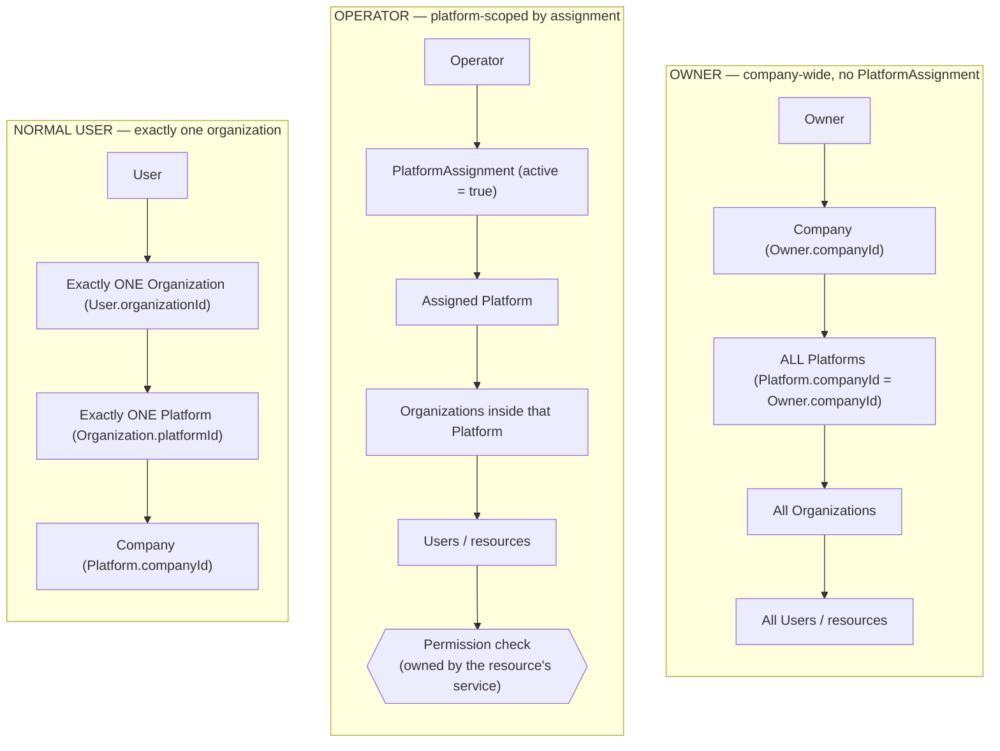
```mermaid
flowchart TB
    subgraph OWNER["OWNER — company-wide, no PlatformAssignment"]
      direction TB
      O1[Owner] --> O2["Company (Owner.companyId)"] --> O3["ALL Platforms (Platform.companyId = Owner.companyId)"] --> O4[All Organizations] --> O5["All Users / resources"]
    end
    subgraph OPERATOR["OPERATOR — platform-scoped by assignment"]
      direction TB
      P1[Operator] --> P2["PlatformAssignment (active = true)"] --> P3[Assigned Platform] --> P4["Organizations inside that Platform"] --> P5["Users / resources"] --> P6{{"Permission check<br/>(owned by the resource's service)"}}
    end
    subgraph MEMBER["NORMAL USER — exactly one organization"]
      direction TB
      U1[User] --> U2["Exactly ONE Organization (User.organizationId)"] --> U3["Exactly ONE Platform (Organization.platformId)"] --> U4["Company (Platform.companyId)"]
    end
```

### Access matrix

"Application permissions" for members and "permissions" for operators are decided by the
**platform-specific service that owns the resource** (per this repo's platform-agnostic rule);
`auth-service` decides only the identity/company/platform/organization boundary, plus the
organization-management and assignment surfaces it owns itself.

| Resource | Owner | Operator | Normal User |
|---|---|---|---|
| Company | Full | No global access | No |
| All Platforms (list/select/manage) | Full | Only Platforms with an active `PlatformAssignment` | No direct global access |
| Unassigned Platform | Full | **Denied** | Denied |
| Organizations | Full (every Platform in own company) | Per assigned Platform + permissions (org management: equal to owner, ADR-0020) | Own Organization, per application permissions |
| Users | Full | Users within assigned Platforms, per permissions | Users/data permitted inside own Organization |
| Platform resources | Full | Assigned Platform + permissions | Own Organization + application permissions |
| Assign Platform to Operator | **Yes** | **No** | **No** |
| Revoke Platform Assignment | **Yes** | **No** | **No** |
| Modify an Operator's assignments | **Yes** | **No** | **No** |

Nothing about an owner depends on `PlatformAssignment`; an owner row can never be the target of
one (the `operatorId` FK requires an `Operator`), so assignment logic cannot accidentally restrict
an owner.

### Authorization flow (per protected request)

The platform is **never** accepted from the client. For any protected request, the backend
resolves, in order:

```
authenticated sub
  → (1) actor row: kind, isActive, and (owner) Owner.companyId       — from the DB, not the JWT
requested resource
  → (2) resource.organizationId                                       — from the resource's own row
  → (3) Organization.platformId  →  Platform.companyId                — the ONLY way a platform is derived
  → (4) decision by kind:
        owner    : ALLOW iff Owner.companyId = Platform.companyId
        operator : ALLOW iff account active AND an active PlatformAssignment(operatorId, platformId) exists
        member   : ALLOW iff User.organizationId = resource.organizationId  (never crosses organizations)
  → (5) permission check for the specific action                      — the resource's service, not auth-service
```

Step (1) reads the *current* row, so a blocked account or a revoked assignment denies on the very
next request; nothing in the JWT is trusted for platform scoping (ADR-0022/0023). Step (4) is one
indexed lookup on `platform_assignment_one_active`. Client-supplied `platformId`/`organizationId`
values are only ever *inputs to a lookup that is then authorized* (e.g. `POST
/auth/admin/organizations {platformId}` — the given platform is authorized against the actor), never
a substitute for step (3).

Distinct internal reasons (logged; externally collapsed to the existing `403`/`404` shapes so
nothing is leaked):

| Reason | Meaning |
|---|---|
| `DENY_PLATFORM_NOT_FOUND` / `DENY_ORGANIZATION_NOT_FOUND` | the resource resolves to nothing |
| `DENY_NOT_MANAGEMENT_IDENTITY` | actor is a member, or unknown |
| `DENY_ACCOUNT_INACTIVE` | blocked operator/owner (`isActive = false`) |
| `DENY_OTHER_COMPANY` | owner of a different company |
| `DENY_NO_ACTIVE_ASSIGNMENT` | operator with no assignment, or a revoked one |
| `ALLOW_OWNER` / `ALLOW_OPERATOR` | allowed at the platform boundary |

The executable reference for step (4) is `pg_temp.platform_access` in
`apps/auth-service/db/tests/invariants.sql`; `PlatformAssignmentService.checkAccess` must be
semantically identical, and the same query backs `GET /auth/platform-access/:platformId`:

```sql
SELECT CASE
  WHEN p.id IS NULL                      THEN 'DENY_PLATFORM_NOT_FOUND'
  WHEN u.id IS NULL OR u.kind = 'member' THEN 'DENY_NOT_MANAGEMENT_IDENTITY'
  WHEN NOT u."isActive"                  THEN 'DENY_ACCOUNT_INACTIVE'
  WHEN u.kind = 'owner'                  THEN CASE WHEN o."companyId" = p."companyId"
                                                   THEN 'ALLOW_OWNER' ELSE 'DENY_OTHER_COMPANY' END
  WHEN a.id IS NOT NULL                  THEN 'ALLOW_OPERATOR'
  ELSE 'DENY_NO_ACTIVE_ASSIGNMENT'
END
FROM (SELECT $2::uuid AS pid) req
LEFT JOIN platform p ON p.id = req.pid
LEFT JOIN "user" u   ON u.id = $1
LEFT JOIN owner o    ON o."userId" = u.id
LEFT JOIN platform_assignment a ON a."operatorId" = u.id AND a."platformId" = p.id AND a.active;
```

**Guards.** Every route documented above as "`role: admin`, either tier" (`RolesGuard`) is, as of
ADR-0024, evaluated as "the `adminTier` claim is `owner` or `operator`". The claim is derived from
`User.kind` at issuance, and the database makes `role = 'admin'` and `kind <> 'member'`
equivalent, so the two can no longer disagree — a self-registered member can never present either.
`AdminTierGuard` (owner-only routes) is unchanged. Guards are a cheap first filter; the checks
above are what authorize.

**Granting a platform (ADR-0022 §13, hardened by ADR-0024).** `POST
/auth/admin/operators/:id/platform-assignments {platformId}`:

1. authenticated identity → load actor row; require `kind = 'owner'` and `isActive` (else `403`);
2. company context = `Owner.companyId` (never a body/claim value);
3. target operator: `Operator` where `userId = :id AND companyId = <owner company>` (else `404`);
4. target platform: `Platform` where `id = body.platformId AND companyId = <owner company>` (else `404`);
5. `INSERT` with `assignedBy = <owner userId>` and `companyId = <owner company>` — `assignedBy` is
   never read from the request. `23505` on `platform_assignment_one_active` → `409` (this is what
   makes concurrent grants safe: the check in steps 3–4 does not need to be race-free, the index
   is); `23503` here can only mean a concurrent delete → `404`.

Revocation is a single `UPDATE … SET active = false, revokedAt = now(), revokedBy = <owner>
WHERE operatorId = :id AND platformId = :p AND active` (0 rows → `404`); it never deletes and never
touches other assignments or the operator's sessions (ADR-0023). Re-granting later inserts a new row.

### "No schedule" versus every other denial

`OperatorSchedule` with zero rows for an operator means **"no schedule restriction"** — available
every day and hour. This is an intentional, security-reviewed fail-open (ADR-0011/0012), *not* a
configuration failure, and must never be read as "denied". `OperatorAvailabilityService` returns a
typed reason so callers cannot conflate the cases:

| Reason | Layer | Outcome |
|---|---|---|
| `NO_SCHEDULE_CONFIGURED` | availability | **allowed** (fail-open) |
| `WITHIN_SCHEDULE` | availability | allowed |
| `DAY_OFF` (schedule exists, no row for today) | availability | denied at login only |
| `TIME_OFF` (`OperatorTimeOff` row for today) | availability | denied at login only |
| `OUTSIDE_WORKING_HOURS` | availability | denied at login only |
| `ACCOUNT_INACTIVE` (`isActive = false`) | account | denied everywhere |
| `CONTACT_UNCONFIRMED` (`contactVerifiedAt IS NULL`) | account | denied at login |
| `DENY_NO_ACTIVE_ASSIGNMENT` | authorization | denied per request, per platform |
| `SESSION_EXPIRED` (`sessionExpiresAt` reached) | token | `401`, re-login |

### Who owns what: identity, authentication, authorization, entitlement

| Concern | Question | Owner |
|---|---|---|
| Identity | who is this? (`member` / `owner` / `operator`, company, organization) | **auth-service** |
| Authentication | can they prove it? (password, owner second factor, operator working code, sessions, step-up) | **auth-service** |
| Authorization — boundary | which company / platform / organization may they touch? | **auth-service** (owner by company, operator by live `PlatformAssignment`, member by organization) |
| Authorization — business | what may they *do* inside the platform (student, teacher, manager, administrator, staff…)? | **platform/domain services** (`role` is opaque to auth for members) |
| Entitlement | has this organization/user **paid** (license, subscription, trial, billing)? | **payment-service** |

Consequences enforced in this design: an expired organization license or user subscription never
invalidates or blocks an identity (ADR-0026); `auth-service` stores no entitlement state (asserted by
a database test); platform services perform their own entitlement check against `payment-service` with
the `organizationId`/`userId` from the verified token; and `auth-service` answers only "who, and which
tenant/platform boundary".

### Owner authentication and step-up (ADR-0025)

There is **one Company and one Owner** (the Owner index is the v1 policy). The Owner's access to a
platform is `User.kind = 'owner' AND Owner.companyId = Platform.companyId` — no `PlatformAssignment`,
and no platform-specific key is ever entered.

| Stage | Mechanism |
|---|---|
| Sign-in | `POST /auth/login` with email **or** phone + password → for an owner, an `mfa_required` challenge (`enrollment_required` only if the owner has **never** had a confirmed factor — the bootstrap state; if a
factor once existed and none is confirmed now, `recovery_required` and no token: a password alone can
never plant a factor, ADR-0027 §2) — never tokens on the password alone |
| Second factor | TOTP code or WebAuthn/passkey assertion against the owner's confirmed `OwnerAuthFactor`; then normal tokens; new-device check (`AdminDevice`) on every owner login, alert-only |
| Session | ordinary access + refresh tokens; owner tokens additionally carry `sid` (refresh-family id) so a step-up can be bound to the session |
| Sensitive operation | requires a **step-up**: re-verify with the secret key, TOTP or passkey (per-purpose allowed methods, ADR-0025 table) → `OwnerStepUp` row + step-up token, ≤15 min, single-use, operation-bound, session-bound; consumed **in the same transaction** as the operation |
| Recovery | password + secret key **start** a cool-down request (alerts; the owner can cancel; nothing changes) → after the cool-down, recovery token + key **complete** it: all factors and sessions revoked, key spent, **enrollment token only** → enroll a new factor → session (ADR-0027) |

The secret key is **never** the daily credential, is never stored or returned in plaintext after
issuance (SHA-256 digest only; the database rejects a non-digest value), and cannot by itself rotate
itself (`owner.secret_key.rotate` accepts only TOTP/passkey). `assignedBy` / `revokedBy` are derived
from the authenticated owner, never the request, and the step-up proves re-verification without
replacing that derivation.

### Operator working session — where each rule is enforced

Operators have no password. The intended day is: request working code → eligibility checked → code
issued → operator submits it → temporary session → works within the allowed period → session ends →
new code next day.

| Rule | Layer | Enforced by |
|---|---|---|
| Only an eligible operator gets a code (active, contact confirmed, available today per own schedule/time-off) | service | `OperatorCodeService.requestCode` + `OperatorAvailabilityService` |
| Only a digest is stored | service + **database** | HMAC-SHA-256 with pepper; `aoc_code_hash_format` rejects a raw code |
| Code expires (end of the working period, per ADR-0014) | service + **database** | `expiresAt`; `aoc_consumed_before_expiry` — a code can never have been consumed after expiry |
| Bounded attempts | service + **database** | `attemptCount` 0..5; `aoc_consumed_not_locked_out` — a locked-out code can never be consumed |
| One-time use | **database** | `consumedAt`; partial unique index leaves only one live code per (operator, purpose) |
| History preserved | **database** | supersede (`supersededAt`), never delete; `consumedAt ⊕ supersededAt` |
| A working code opens a temporary session | service | `verifyCode` issues tokens with `sessionExpiresAt = getShiftEndOrFallback(...)` |
| The session cannot outlive its ceiling | service + **database** | `TokenService` clamps access-token `exp <= sessionExpiresAt`; rotation copies the ceiling forward unchanged; `refresh_token_within_session_ceiling` and the by-kind trigger forbid a longer or missing ceiling |
| The next working day needs a new code | service | expired ceiling ⇒ refresh → `401 session_ceiling_reached` (family revoked) ⇒ new `request-code` |
| No code needed per API request | service | the session token authenticates; the code is only for starting a session |
| Platform access is live, not from the token | service | `PlatformAssignmentService.checkAccess` on every platform-scoped call (ADR-0022/0023); revocation denies on the next request even with an unexpired token |

**Schedule semantics (intentional, documented consequence).** Zero `OperatorSchedule` rows means "no
schedule restriction" (fail-open), **not** a configuration failure — the implementation
(`OperatorAvailabilityService`) and this document agree. Consequence to be aware of: a newly created
operator with no schedule yet may start a session on any day and hour, with the flat 8-hour fallback
ceiling, until an owner configures a schedule. If the business ever wants "no schedule ⇒ cannot
work", that is a deliberate behavior change to `isOperatorAvailable`/`getShiftEndOrFallback` and this
document together — not something to do silently.

**Business calendar vs authentication.** `PlatformNonWorkingDay` is platform-level *business*
reference data. It is not consulted by any login, session or authorization decision (ADR-0023).

### Database constraints and indexes


| Table | Constraint / index | Enforces |
|---|---|---|
| `company` | PK `id`; `name` non-blank | — |
| `platform` | PK; `companyId NOT NULL` FK → `company` (RESTRICT); `UNIQUE(id, companyId)`; `companyId` immutable; **`platform_company_idx`** on `companyId` (owner authorization path: `Owner.companyId = Platform.companyId`) | Company 1→N Platform; target for same-company composite FKs |
| `organization` | PK; `platformId NOT NULL` FK → `platform` (RESTRICT); `platformId` immutable; index on `platformId` | Platform 1→N Organization; no orphan org |
| `user` | PK; `kind` enum NOT NULL, immutable; `UNIQUE(id, kind)`; FK `organizationId` → `organization` (RESTRICT); `CHECK (kind='member') = (organizationId IS NOT NULL)`; `CHECK (kind='member') = (role <> 'admin')`; `CHECK (kind='operator') = (passwordHash IS NULL)`; `CHECK email IS NOT NULL OR phone IS NOT NULL`; `UNIQUE(email)`, `UNIQUE(phone)`; **no `platformId` column, no license/subscription/trial column** | Organization 1→N member; tenantless member impossible; single identity source of truth; no forged admin role; authentication ≠ entitlement |
| `owner` | PK/FK `(userId, kind='owner') → user(id, kind)`; `companyId NOT NULL` FK; `UNIQUE(userId, companyId)`; `UNIQUE(companyId)` (`owner_single_per_company_v1`, one Owner per Company — v1 policy, droppable); key pair CHECK; **`owner_secret_key_hash_format`** (64-hex digest only); **`owner_company_immutable`** trigger (`companyId`, `userId` cannot change); **`owner_row_required`** deferred trigger (a `kind='owner'` user can never lose its Owner row) | Owner → Company; one Owner; tenancy anchor immutable; no plaintext secret key |
| `operator` | PK/FK `(userId, kind='operator') → user(id, kind)`; `companyId NOT NULL` FK; `UNIQUE(userId, companyId)`; **`operator_company_immutable`** trigger (`companyId`, `userId`); **`operator_row_required`** deferred trigger | Operator identity + company; immutable company anchor for the same-company FKs |
| `user` (trigger) | deferred: `kind` owner/operator ⇒ subtype row exists | no half-created owner/operator |
| `platform_assignment` | PK; composite FKs `(operatorId, companyId)→operator`, `(platformId, companyId)→platform`, `(assignedBy, companyId)→owner`, `(revokedBy, companyId)→owner`; **`UNIQUE(operatorId, platformId) WHERE active`** (`platform_assignment_one_active`); `CHECK active = (revokedAt IS NULL)`; `CHECK (revokedAt IS NULL) = (revokedBy IS NULL)`; `CHECK revokedAt >= assignedAt`; append-only trigger (no DELETE, one-way revoke only, grant fields immutable) | race-proof single active grant; assigner is an owner, assignee an operator, all same company; immutable audit history |
| `refresh_token` | PK; `tokenHash UNIQUE`; self-FK `replacedByTokenId`; `CHECK replacedByTokenId <> id`; `CHECK replacedByTokenId IS NULL OR revokedAt IS NOT NULL`; `UNIQUE(replacedByTokenId) WHERE NOT NULL`; **`refresh_token_within_session_ceiling`** (`expiresAt <= sessionExpiresAt`); **`refresh_token_session_ceiling_by_kind`** trigger (operator tokens must, all others must not, carry `sessionExpiresAt`) | hash-only storage; linear, traceable chain; a replaced token is always revoked; operator sessions are time-bounded in the data layer |
| `device` | PK; `installId UNIQUE`; nullable FK `userId` → `user` | general device/network signal (server-observed IP/UA) |
| `admin_device` | FK `userId` → `owner`; **`UNIQUE(userId, fingerprintHash)`** | owner-only secret-key-login alerting; fingerprint is a signal, not identity proof |
| `admin_operator_code` | FK `userId` → `operator`; `purpose` enum; `attemptCount` CHECK 0..5; `CHECK consumedAt IS NULL OR supersededAt IS NULL`; `UNIQUE(userId, purpose) WHERE consumedAt IS NULL AND supersededAt IS NULL`; **`aoc_code_hash_format`** (64-hex digest only); **`aoc_consumed_not_locked_out`**; **`aoc_consumed_before_expiry`** | only the latest live code per (operator, purpose); history kept; a raw code is unstorable; expired/locked-out codes can never have been consumed |
| `owner_auth_factor` | FK `ownerId` → `owner`; `UNIQUE(id, ownerId)`; `UNIQUE(credentialId)`; TOTP/WebAuthn shape CHECKs (TOTP ⇒ ciphertext only; passkey ⇒ credentialId+publicKey+signCount, no shared secret) | only an Owner holds second factors; TOTP secret is never plaintext; passkey public material only |
| `owner_step_up` | FK `ownerId` → `owner`; composite FK `(factorId, ownerId) → owner_auth_factor`; `CHECK (method='secret_key') = (factorId IS NULL)`; **`CHECK expiresAt <= verifiedAt + 15 min`**; consumed-in-window CHECK; guard trigger (immutable except one-time consumption, no DELETE); | short-lived, single-use, same-owner, undeletable step-up audit |
| `operator_schedule` | FK → `operator`; **`UNIQUE(userId, dayOfWeek)`**; `dayOfWeek` 0..6; HH:mm regex; `endTime > startTime` | one shift/day, no overnight |
| `operator_time_off` | FK → `operator`; **`UNIQUE(userId, date)`** | — |
| `platform_non_working_day` | `platformId NOT NULL` FK → `platform` (RESTRICT); type/shape CHECK | see ownership below |

`Device` and `AdminDevice` remain **separate** entities: `Device` is the general first-launch /
device / network abuse-prevention signal (keyed by a client `installId`, starts unlinked);
`AdminDevice` exists only for owner secret-key-login alerting. The normalized User-Agent
fingerprint is a security signal, not proof of physical device ownership, and `ipAddress` /
`userAgent` are always server-observed, never client-authoritative.

**Ownership of `PlatformNonWorkingDay`.** `auth-service` owns it, as *platform-level reference
data*, because it owns `Platform` and no other service owns or has requested per-platform
working-day data. No `auth-service` login, session, or authorization decision reads it (ADR-0023);
downstream services may read it through the existing endpoints. It is not an authoritative
business calendar and auth-service is not its long-term home (ADR-0024). Its `platformId` is a real
FK. Its endpoints authorize against the `Platform` row: `POST` — owner, platform in own company;
`GET` — owner (own company) or operator with an **active assignment** to that platform (previously
open to any admin for any platform); `DELETE :id` — owner whose company owns the row's platform;
anything else is the collapsed `404`.

### Error mapping for the invariants above

| SQLSTATE | Meaning here | Response |
|---|---|---|
| `23505` on `platform_assignment_one_active` | concurrent/duplicate active grant | `409` |
| `23505` on `owner_single_per_company_v1` | second owner (v1 policy) | bootstrap/CLI refuses, non-zero exit |
| `23505` on `admin_operator_code_one_live` | code issuance did not supersede first | `500` (service bug — supersede then insert, in one transaction) |
| `23503` on `user_organizationId_fkey` | unknown organization | register: the same generic `403` used for "no valid license" (never reveals existence) + integrity alert |
| `23514` on `user_admin_role_reserved` | `role: 'admin'` on a member (registration cannot supply a role since ADR-0028; a join code with audience `admin` is refused when created) | `400` at code creation |
| any other `23xxx` | invariant the service failed to pre-empt | `500` + alert |

### Migration

No `auth-service` schema has ever been deployed (the service is still the Nest scaffold), so there
is no legacy data and no prior migration to preserve. `0001` is therefore a **greenfield** migration
that *refuses to run* if any of its tables already exist (it lists them and aborts inside its
transaction, leaving the database untouched) rather than guessing how to reconcile them.

If a legacy schema built from an earlier draft of this design (with `User.platformId`,
`User.adminTier`, nullable `User.organizationId`, no FKs) is ever found, the upgrade is an
expand/contract migration that **detects, reports and either repairs deterministically or aborts** —
it never assigns a user to an arbitrary organization or platform:

1. **Preflight (read-only).** Collect every violation below into one report (counts + sample ids)
   and abort if any *non-repairable* row exists.
2. **Expand.** Create the new tables/columns/`kind` (nullable at first); no constraint that could
   fail yet.
3. **Backfill only what is deterministic**, then re-run the preflight.
4. **Constrain.** Add FKs `NOT VALID` then `VALIDATE`, then the CHECKs, unique and partial-unique
   indexes (`CREATE UNIQUE INDEX CONCURRENTLY` on populated tables).
5. **Contract** (a later release): drop `adminTier`, `platformId`, and the owner/operator columns on
   `user`.

| Legacy condition | Handling |
|---|---|
| member row with `organizationId IS NULL` | **abort** — list ids; a human decides the organization |
| `organizationId` not present in `organization` | **abort** — list ids |
| `organization.platformId` null, or not matching a `Platform` | **abort** unless an operator-supplied mapping *legacy platform string → Platform id* is provided; even then only exact matches are applied |
| `role = 'admin'` with `adminTier` null, or a non-admin/`member` row carrying `role = 'admin'` | **abort** — these are exactly the forgeable-admin rows; never auto-promoted to owner/operator |
| `adminTier = 'owner'` with no derivable company (no unambiguous platform→company) | **abort** |
| operator with a `passwordHash` | **abort** (operators never hold a password) |
| duplicate active `PlatformAssignment` for one `(operatorId, platformId)` | **repair, access-neutral**: keep the earliest `assignedAt` active; set the later duplicates `active = false`, `revokedAt = <migration time>`, `revokedBy = <the duplicate's own assignedBy>`, and report each. The set of platforms an operator can reach is unchanged |
| several live `AdminOperatorCode` rows for one `(userId, purpose)` | **repair**: keep the newest by `createdAt`, set `supersededAt` on the rest (older ones are already unusable by the "latest only" rule) |
| `PlatformNonWorkingDay.platformId` not matching a `Platform` | **abort** unless covered by the mapping above |
| two owners in one company | **abort** (v1 policy, ADR-0017) |

**Migration `0002`** (`0002_owner_operator_hardening_and_owner_step_up.sql`, rollback in
`db/migrations/down/`) adds, on top of `0001`: immutability of `Owner`/`Operator` `companyId`/`userId`;
deferred subtype-row-required triggers on `DELETE`; operator-code consume checks and digest-format
checks; refresh-token session-ceiling checks; `owner_auth_factor` / `owner_step_up`; the
`platform(companyId)` index; and drops `user.trialEndsAt` and the "email required for non-operators"
rule. Its safety model: (1) a **preflight** checks every new constraint against existing rows,
collects *all* violations into one report and aborts before changing anything; (2) the one
destructive step (`trialEndsAt`) refuses unless the data was exported and explicitly acknowledged
with `SET auth.ack_trial_ends_at_moved = 'on'`; (3) the rollback restores the schema shape and
refuses if it would destroy enrolled factors or the step-up audit trail (it cannot restore the
dropped `trialEndsAt` *values*). Triggers and FKs are bypassed by `session_replication_role =
replica` and `TRUNCATE`; the application role must have neither privilege.

### Tests


Every case that the database can decide is executed by `apps/auth-service/db/tests/run.sh` against a scratch PostgreSQL, including a
12-way concurrent-grant race for N and the migration-`0002` safety scenarios (a refused migration
reports every violation and changes nothing; the `trialEndsAt` drop needs explicit acknowledgement;
rollback then re-apply round-trips). The new guards were each verified by mutation (removing the
guard makes its tests fail). The remaining cases are service/guard behavior, specified in
[`docs/tdd/platform-assignment-and-tenancy.md`](../tdd/platform-assignment-and-tenancy.md) and to be
implemented with the services.

## Key interfaces / classes


```mermaid
classDiagram
    class AuthController {
      +register(dto: RegisterDto) AuthTokensResponse
      +login(dto: LoginDto) AuthTokensResponse
      +refresh(dto: RefreshTokenDto) AuthTokensResponse
      +logout(dto: RefreshTokenDto, user: JwtPayload) void
      +me(user: JwtPayload) UserResponseDto
    }
    class AuthService {
      -usersService: UsersService
      -tokenService: TokenService
      -refreshTokenService: RefreshTokenService
      -organizationValidationService: OrganizationValidationService
      -deviceService: DeviceService
      +register(dto: RegisterDto) AuthTokensResponse
      +validateCredentials(email, password) User
      +login(user: User) AuthTokensResponse
      +refresh(rawToken: string) AuthTokensResponse
      +logout(rawToken: string) void
    }
    class UsersService {
      -usersRepository: Repository~User~
      +create(kind, email?, phone?, passwordHash?, role, organizationId?, companyId?) User
      +createOwner(companyId, email, passwordHash) User
      +createOperator(companyId, email?, phone?) User
      +findByEmail(email) User
      +findById(id) User
      +findByEmailOrPhone(email?, phone?, kind?, isActive?, contactVerifiedAt?) User
    }
    class TokenService {
      +signAccessToken(payload: JwtPayload, sessionExpiresAt?: Date) string
      +verifyAccessToken(token: string) JwtPayload
    }
    class RefreshTokenService {
      -refreshTokenRepository: Repository~RefreshToken~
      +issue(userId, familyId?, sessionExpiresAt?: Date) RawAndStoredToken
      +rotate(rawToken: string) RawAndStoredToken
      +revoke(rawToken: string) void
      +revokeFamily(familyId: string) void
      +revokeAllForUser(userId: string) void
      -hash(rawToken: string) string
    }
    class JwtStrategy {
      +validate(payload: JwtPayload) JwtPayload
    }
    class RolesGuard {
      +canActivate(context) boolean
    }
    class OrganizationsController {
      +validate(dto: ValidateOrganizationDto) OrganizationValidationResponse
      +getPlatformOwnership(id: string, user: JwtPayload) OrganizationLookupResponse
    }
    class OrganizationLookupResponse {
      +id: string
      +platformId: string
    }
    class OrganizationValidationService {
      -paymentServiceClient: PaymentServiceClient
      +checkLicense(organizationId) LicenseStatus
      
    }
    class PaymentServiceClient {
      +getLicenseStatus(organizationId) LicenseStatus
      
    }
    class LicenseStatus {
      +valid: boolean
      +expiresAt: Date?
    }
    class DevicesController {
      +register(dto: DeviceFingerprintDto, req: Request) void
    }
    class DeviceService {
      -deviceRepository: Repository~Device~
      +upsert(fingerprint: DeviceFingerprintDto, ip: string, userAgent: string, userId?: string) Device
      +linkToUser(installId: string, userId: string) void
    }
    class User {
      +id: string
      +email: string?
      +phone: string?
      +passwordHash: string?
      +role: string
      +kind: UserKind
      +organizationId: string?
      +isActive: boolean
      
      +createdAt: Date
      +updatedAt: Date
    }
    class Owner {
      +userId: string
      +companyId: string
      +secretKeyHash: string?
      +secretKeyIssuedAt: Date?
    }
    class Operator {
      +userId: string
      +companyId: string
      +contactVerifiedAt: Date?
    }
    class RefreshToken {
      +id: string
      +userId: string
      +tokenHash: string
      +familyId: string
      +revokedAt: Date?
      +expiresAt: Date
      +replacedByTokenId: string?
      +sessionExpiresAt: Date?
      +createdAt: Date
    }
    class Device {
      +id: string
      +installId: string
      +ipAddress: string
      +userAgent: string
      +deviceModel: string?
      +osVersion: string?
      +appVersion: string?
      +locale: string?
      +userId: string?
      +firstSeenAt: Date
      +lastSeenAt: Date
    }
    class RegisterDto {
      +email: string
      +password: string
      +role: string
      +organizationId: string
      +deviceFingerprint: DeviceFingerprintDto?
    }
    class LoginDto { +email: string +password: string }
    class RefreshTokenDto { +refreshToken: string }
    class ValidateOrganizationDto { +organizationId: string }
    class DeviceFingerprintDto {
      +installId: string
      +deviceModel: string?
      +osVersion: string?
      +appVersion: string?
      +locale: string?
    }
    class JwtPayload {
      +sub: string
      +role: string
      +organizationId: string?
      +adminTier: string?
      +iat: number
      +exp: number
    }
    class AdminAuthController {
            +ownerVerifyFactor(dto: OwnerVerifyDto, ip: string, userAgent: string) AuthTokensResponse
      +enrollFactor(dto: EnrollFactorDto, user: JwtPayload) EnrollFactorResponse
      +confirmFactor(dto: ConfirmFactorDto, user: JwtPayload) void
      +removeFactor(id: string, user: JwtPayload, stepUp: StepUpToken) void
      +stepUp(dto: StepUpDto, user: JwtPayload) StepUpResponse
      +recoverOwner(dto: OwnerRecoveryDto, ip: string, userAgent: string) EnrollmentResponse
      +rotateSecretKey(user: JwtPayload, stepUp: StepUpToken) SecretKeyRotationResponse

      +registerOperator(dto: RegisterOperatorDto, user: JwtPayload) OperatorResponseDto
      +confirmOperatorContact(dto: ConfirmOperatorContactDto) void
      +requestOperatorCode(dto: RequestOperatorCodeDto) void
      +verifyOperatorCode(dto: VerifyOperatorCodeDto) AuthTokensResponse
      +createNonWorkingDay(dto: PlatformNonWorkingDayDto, user: JwtPayload) PlatformNonWorkingDay
      +listNonWorkingDays(user: JwtPayload) PlatformNonWorkingDay[]
      +deleteNonWorkingDay(id: string, user: JwtPayload) void
    }
    class SecretKeyService {
      -usersRepository: Repository~User~
      -adminDeviceService: AdminDeviceService
            +verifyForStepUp(ownerId: string, secretKey: string) boolean
      +verifyForRecovery(ownerId: string, secretKey: string) boolean
      +rotate(ownerId: string) SecretKeyRotationResponse
      -hash(rawKey: string) string
    }
    class OwnerAuthService {
      +challenge(owner: User) LoginChallengeResponse
      +verifyFactor(challengeToken: string, method: string, proof: string) User
      +enroll(ownerId: string, type: string) EnrollFactorResponse
      +confirm(ownerId: string, factorId: string, proof: string) void
    }
    class StepUpService {
      +issue(ownerId: string, sessionFamilyId: string, method: string, purpose: string, proof: string) StepUpResponse
      +consumeInTransaction(tx: EntityManager, stepUpToken: string, ownerId: string, sessionFamilyId: string, purpose: string) void
    }
    class StepUpGuard {
      +canActivate(ctx) boolean
    }
    class AdminDeviceService {
      -adminDeviceRepository: Repository~AdminDevice~
      +checkAndRecord(userId: string, userAgent: string, ip: string) NewDeviceCheckResult
      -hashFingerprint(userAgent: string) string
    }
    class OperatorCodeService {
      -usersRepository: Repository~User~
      -operatorCodeRepository: Repository~AdminOperatorCode~
      -operatorAvailabilityService: OperatorAvailabilityService
      +requestCode(email?, phone?) void
      +verifyCode(email?, phone?, code: string) AuthTokensResponse
      +sendConfirmationCode(operator: User) void
      +confirmContact(email?, phone?, code: string) void
      -generateCode() string
      -hash(rawCode: string) string
    }
    class PlatformCalendarService {
      -nonWorkingDayRepository: Repository~PlatformNonWorkingDay~
      +isWorkingDay(platformId: string, date: Date) boolean
      +create(dto: PlatformNonWorkingDayDto, platformId: string) PlatformNonWorkingDay
      +list(platformId: string) PlatformNonWorkingDay[]
      +delete(id: string, platformId: string) void
    }
    class AdminTierGuard {
      +canActivate(context) boolean
    }
    class AdminOperatorController {
      +list(user: JwtPayload) OperatorResponseDto[]
      +getOne(id: string, user: JwtPayload) OperatorResponseDto
      +updateContact(id: string, dto: UpdateOperatorContactDto, user: JwtPayload) OperatorResponseDto
      +block(id: string, user: JwtPayload) void
      +unblock(id: string, user: JwtPayload) void
      +replaceSchedule(id: string, dto: ReplaceOperatorScheduleDto, user: JwtPayload) OperatorSchedule[]
      +getSchedule(id: string, user: JwtPayload) OperatorSchedule[]
      +createTimeOff(id: string, dto: CreateOperatorTimeOffDto, user: JwtPayload) OperatorTimeOff
      +listTimeOff(id: string, user: JwtPayload) OperatorTimeOff[]
      +deleteTimeOff(id: string, timeOffId: string, user: JwtPayload) void
      +assignPlatform(id: string, dto: CreatePlatformAssignmentDto, user: JwtPayload) PlatformAssignmentResponseDto
      +revokePlatformAssignment(id: string, platformId: string, user: JwtPayload) void
      +listPlatformAssignments(id: string, user: JwtPayload) PlatformAssignmentResponseDto[]
    }
    class OperatorManagementService {
      -usersRepository: Repository~User~
      -operatorCodeRepository: Repository~AdminOperatorCode~
      -refreshTokenService: RefreshTokenService
      +list() User[]
      +findOneOrNotFound(id: string) User
      +updateContact(id: string, email?, phone?) User
      +block(id: string, ownerId: string) void
      +unblock(id: string, ownerId: string) void
    }
    class OperatorScheduleService {
      -scheduleRepository: Repository~OperatorSchedule~
      -timeOffRepository: Repository~OperatorTimeOff~
      +replaceSchedule(userId: string, days: ScheduleDayDto[]) OperatorSchedule[]
      +getSchedule(userId: string) OperatorSchedule[]
      +createTimeOff(userId: string, date: string, label?: string) OperatorTimeOff
      +listTimeOff(userId: string) OperatorTimeOff[]
      +deleteTimeOff(userId: string, timeOffId: string) void
    }
    class OperatorAvailabilityService {
      -scheduleRepository: Repository~OperatorSchedule~
      -timeOffRepository: Repository~OperatorTimeOff~
      +isOperatorAvailable(operatorUserId: string, now: Date) boolean
      +getShiftEndOrFallback(operatorUserId: string, now: Date) Date
    }
    class AdminOrganizationController {
      +create(dto: CreateOrganizationDto, user: JwtPayload) OrganizationResponseDto
      +list(user: JwtPayload, platformId?: string) OrganizationResponseDto[]
      +getOne(id: string, user: JwtPayload) OrganizationResponseDto
      +update(id: string, dto: UpdateOrganizationDto, user: JwtPayload) OrganizationResponseDto
    }
    class OrganizationManagementService {
      -organizationRepository: Repository~Organization~
      -platformAssignmentService: PlatformAssignmentService
      +create(callerId: string, adminTier: string, dto: CreateOrganizationDto) Organization
      +list(callerId: string, adminTier: string, platformId?: string) Organization[]
      +findOneOrNotFound(id: string, callerId: string, adminTier: string) Organization
      +update(id: string, callerId: string, adminTier: string, dto: UpdateOrganizationDto) Organization
    }
    class AdminDevice {
      +id: string
      +userId: string
      +fingerprintHash: string
      +ipAddress: string
      +firstSeenAt: Date
      +lastSeenAt: Date
    }
    class AdminOperatorCode {
      +id: string
      +userId: string
      +purpose: string
      +codeHash: string
      +expiresAt: Date
      +attemptCount: number
      +consumedAt: Date?
      +createdAt: Date
    }
    class PlatformNonWorkingDay {
      +id: string
      +platformId: string
      +type: string
      +date: Date?
      +dayOfWeek: number?
      +label: string
      +createdAt: Date
    }
    class OperatorSchedule {
      +id: string
      +userId: string
      +dayOfWeek: number
      +startTime: string
      +endTime: string
      +createdAt: Date
      +updatedAt: Date
    }
    class OperatorTimeOff {
      +id: string
      +userId: string
      +date: Date
      +label: string?
      +createdAt: Date
    }
    class Organization {
      +id: string
      +platformId: string
      +name: string
      +taxCode: string?
      +address: string?
      +phone: string?
      +type: string?
      +createdAt: Date
      +updatedAt: Date
    }
    class OwnerVerifyDto { +challengeToken: string
      +method: string
      +proof: string }
    class StepUpDto { +purpose: string
      +method: string
      +credential: string }
    class OwnerRecoveryDto { +email: string
      +phone: string
      +password: string
      +secretKey: string }
    class RegisterOperatorDto { +email: string? +phone: string? }
    class ConfirmOperatorContactDto { +email: string? +phone: string? +code: string }
    class RequestOperatorCodeDto { +email: string? +phone: string? }
    class VerifyOperatorCodeDto { +email: string? +phone: string? +code: string }
    class PlatformNonWorkingDayDto {
      +type: string
      +date: string?
      +dayOfWeek: number?
      +label: string?
    }
    class UpdateOperatorContactDto { +email: string? +phone: string? }
    class ScheduleDayDto { +dayOfWeek: number +startTime: string +endTime: string }
    class ReplaceOperatorScheduleDto { +days: ScheduleDayDto[] }
    class CreateOperatorTimeOffDto { +date: string +label: string? }
    class CreateOrganizationDto {
      +platformId: string
      +name: string
      +taxCode: string?
      +address: string?
      +phone: string?
      +type: string?
    }
    class UpdateOrganizationDto {
      +name: string?
      +taxCode: string?
      +address: string?
      +phone: string?
      +type: string?
    }
    class Company {
      +id: string
      +name: string
      +createdAt: Date
      +updatedAt: Date
    }
    class Platform {
      +id: string
      +companyId: string
      +name: string
      +createdAt: Date
      +updatedAt: Date
    }
    class PlatformAssignment {
      +id: string
      +operatorId: string
      +platformId: string
      +companyId: string
      +assignedBy: string
      +assignedAt: Date
      +revokedAt: Date?
      +revokedBy: string?
      +active: boolean
    }
    class PlatformsController {
      +create(dto: CreatePlatformDto, user: JwtPayload) PlatformResponseDto
      +list(user: JwtPayload) PlatformResponseDto[]
      +getOne(id: string, user: JwtPayload) PlatformResponseDto
      +update(id: string, dto: UpdatePlatformDto, user: JwtPayload) PlatformResponseDto
    }
    class PlatformManagementService {
      -platformRepository: Repository~Platform~
      -companyRepository: Repository~Company~
      +create(dto: CreatePlatformDto) Platform
      +list() Platform[]
      +findOneOrNotFound(id: string) Platform
      +update(id: string, dto: UpdatePlatformDto) Platform
    }
    class CreatePlatformDto { +name: string }
    class UpdatePlatformDto { +name: string? }
    class PlatformAssignmentService {
      -assignmentRepository: Repository~PlatformAssignment~
      -platformRepository: Repository~Platform~
      +assign(operatorId: string, platformId: string, assignedBy: string) PlatformAssignment
      +revoke(operatorId: string, platformId: string) void
      +listForOperator(operatorId: string) PlatformAssignment[]
      +hasActiveAssignment(operatorId: string, platformId: string) boolean
      +listActivePlatformIdsForOperator(operatorId: string) string[]
    }
    class CreatePlatformAssignmentDto { +platformId: string }
    class PlatformAssignmentResponseDto {
      +id: string
      +platformId: string
      +assignedBy: string
      +assignedAt: Date
      +revokedAt: Date?
      +active: boolean
    }
    class PlatformAccessController {
      +checkAccess(platformId: string, user: JwtPayload) void
    }
    AuthController --> AuthService
    AuthService --> UsersService
    AuthService --> TokenService
    AuthService --> RefreshTokenService
    AuthService --> OrganizationValidationService
    AuthService --> DeviceService
    OrganizationsController --> OrganizationValidationService
    OrganizationsController --> OrganizationManagementService
    OrganizationsController ..> OrganizationLookupResponse
    OrganizationValidationService --> PaymentServiceClient
    PaymentServiceClient ..> LicenseStatus
    
    DevicesController --> DeviceService
    DeviceService --> Device
    UsersService --> User
    RefreshTokenService --> RefreshToken
    RefreshToken --> User : belongs to
    Device --> User : linked to
    AuthController ..> RegisterDto
    AuthController ..> LoginDto
    AuthController ..> RefreshTokenDto
    OrganizationsController ..> ValidateOrganizationDto
    DevicesController ..> DeviceFingerprintDto
    RegisterDto ..> DeviceFingerprintDto
    TokenService ..> JwtPayload
    JwtStrategy ..> JwtPayload
    RolesGuard ..> JwtPayload
        AdminAuthController --> SecretKeyService
    AdminAuthController --> OwnerAuthService
    AdminAuthController --> StepUpService
    StepUpGuard --> StepUpService
    OwnerAuthService --> UsersService
    OwnerAuthService --> AdminDeviceService
    OwnerAuthService --> TokenService
    OwnerAuthService --> RefreshTokenService

    AdminAuthController --> OperatorCodeService
    AdminAuthController --> PlatformCalendarService
    AdminAuthController --> AdminTierGuard
    AdminAuthController --> UsersService
    SecretKeyService --> UsersService
    SecretKeyService --> AdminDeviceService
    
    AdminDeviceService --> AdminDevice
    OperatorCodeService --> UsersService
    OperatorCodeService --> OperatorAvailabilityService
    OperatorCodeService --> TokenService
    OperatorCodeService --> RefreshTokenService
    OperatorCodeService --> AdminOperatorCode
    PlatformCalendarService --> PlatformNonWorkingDay
    AdminDevice --> User : belongs to
    AdminOperatorCode --> User : belongs to
        AdminAuthController ..> OwnerVerifyDto
    AdminAuthController ..> StepUpDto
    AdminAuthController ..> OwnerRecoveryDto
    AdminAuthController ..> RegisterOperatorDto
    AdminAuthController ..> ConfirmOperatorContactDto
    AdminAuthController ..> RequestOperatorCodeDto
    AdminAuthController ..> VerifyOperatorCodeDto
    AdminAuthController ..> PlatformNonWorkingDayDto
    AdminTierGuard ..> JwtPayload
    AdminOperatorController --> OperatorManagementService
    AdminOperatorController --> OperatorScheduleService
    AdminOperatorController --> PlatformAssignmentService
    AdminOperatorController --> AdminTierGuard
    OperatorManagementService --> UsersService
    OperatorManagementService --> RefreshTokenService
    OperatorScheduleService --> OperatorAvailabilityService
    OperatorScheduleService --> OperatorSchedule
    OperatorScheduleService --> OperatorTimeOff
    OperatorAvailabilityService --> OperatorSchedule
    OperatorAvailabilityService --> OperatorTimeOff
    OperatorSchedule --> User : belongs to
    OperatorTimeOff --> User : belongs to
    AdminOperatorController ..> UpdateOperatorContactDto
    AdminOperatorController ..> ReplaceOperatorScheduleDto
    AdminOperatorController ..> CreateOperatorTimeOffDto
    AdminOperatorController ..> CreatePlatformAssignmentDto
    AdminOperatorController ..> PlatformAssignmentResponseDto
    ReplaceOperatorScheduleDto ..> ScheduleDayDto
    AdminOrganizationController --> OrganizationManagementService
    AdminOrganizationController --> RolesGuard
    OrganizationManagementService --> Organization
    OrganizationManagementService --> PlatformAssignmentService
    AdminOrganizationController ..> CreateOrganizationDto
    AdminOrganizationController ..> UpdateOrganizationDto
    PlatformsController --> PlatformManagementService
    PlatformsController --> AdminTierGuard
    PlatformManagementService --> Platform
    PlatformManagementService --> Company
    PlatformsController ..> CreatePlatformDto
    PlatformsController ..> UpdatePlatformDto
    Platform --> Company : belongs to
    Organization --> Platform : scoped by
    PlatformAssignmentService --> PlatformAssignment
    PlatformAssignmentService --> Platform
    PlatformAssignment --> Operator : operator
    PlatformAssignment --> Owner : assignedBy / revokedBy
    Owner --|> User : kind=owner
    Operator --|> User : kind=operator
    PlatformAssignment --> Platform : grants access to
    PlatformAccessController --> PlatformAssignmentService
    PlatformAccessController --> RolesGuard
```

Module boundaries: `AuthModule` (`AuthController`/`AuthService`) is the entry point for
credential-based flows (register/login/refresh/logout/me). `UsersModule`
(`UsersService`/`User` entity) owns user persistence and has no controller of its own.
Token handling is deliberately split in two: `TokenService` is a pure, stateless JWT
signer/verifier with no database access, while `RefreshTokenService` is the DB-backed
component owning issuance, rotation, and reuse-detection of refresh tokens (per
ADR-0002) — this split keeps access-token verification usable by any future
service/gateway without a database dependency, while confining all stateful
rotation/revocation bookkeeping to one place. `TokenService.signAccessToken`'s
`sessionExpiresAt` parameter (per ADR-0013) is **not** a raw override — when present,
`TokenService` computes `exp = min(now + <normal TTL>, sessionExpiresAt)` internally on every
call, rather than assigning the passed value directly. This matters concretely: the same fixed
`sessionExpiresAt` ceiling — per ADR-0014, the operator's own scheduled shift end for the day,
or `now + 8h` only if unscheduled — is passed on every rotation throughout an operator's
whole session, not just the final one, so a literal "use this value as `exp`" reading would give
every operator access token — not just the last — a session-length lifetime, silently
defeating ADR-0002's short-lived-access-token model for that token class. `OrganizationsModule`
(`OrganizationsController`/`OrganizationValidationService`/`PaymentServiceClient`) is the
only module with an outbound network dependency on another service, implementing the
license-check contract from ADR-0004. **As of ADR-0026 it is called from registration only**:
`AuthService.login`/`AuthService.refresh` no longer call it, and the subscription-check contract
(ADR-0005/ADR-0006) is no longer a dependency of `auth-service` at all — platform services call
`payment-service` for entitlement themselves. As of ADR-0021, `OrganizationsController` also gains a small new dependency
on `OrganizationManagementService` (imported from wherever `AdminOrganizationController`'s
module exports it) to serve `GET /auth/organizations/:id` — the one narrow lookup
`payment-service` depends on; this is the only cross-module wiring ADR-0021 adds to
`auth-service`'s own module graph, and it introduces no new outbound dependency, since
`auth-service` is the callee here, not the caller. `DevicesModule` (`DevicesController`/
`DeviceService`/`Device` entity) is an independent entry point that fires
before any user exists — it has no dependency on `AuthModule`, and `AuthModule` depends
on it (not the other way around) only for the registration-time `deviceFingerprint`
fallback. `JwtStrategy` and `RolesGuard` are cross-cutting: they authorize incoming
requests to protected routes regardless of which module owns the route.

`AdminModule` (`AdminAuthController`/`SecretKeyService`/`OperatorCodeService`/
`AdminDeviceService`/`PlatformCalendarService`/`AdminTierGuard`, per ADR-0009/ADR-0010/
ADR-0011) is a new, independent entry point for everything specific to platform-scoped Admin
accounts. It depends on `UsersModule` (creating and reading `User` rows) and on token
handling (`TokenService`/`RefreshTokenService`, to issue the same access/refresh token pairs
`AuthModule` does), but has no dependency on, and is not depended on by, `AuthModule`
itself — an operator authenticating through `AdminModule`'s login-code flow never touches `POST
/auth/login`. **As of ADR-0025 an owner's sign-in *does* begin at `POST /auth/login`**
(email/phone + password, like a member) and is completed in `AdminModule` by `OwnerAuthService`,
which verifies the second factor (TOTP or passkey), delegates new-device detection to
`AdminDeviceService` (which owns `AdminDevice` persistence) and issues the tokens. `SecretKeyService`
now owns only the secret key's **step-up and recovery** roles (verify, rotate) — it no longer logs
anyone in. `StepUpService`/`StepUpGuard` own `OwnerStepUp`: issuing a step-up after re-verification and
consuming it **inside the operation's own database transaction** (grant/revoke assignment, rotate,
factor removal, platform/operator creation), so an operation that fails never burns the step-up and one
that succeeds always does. `OperatorCodeService` owns issuing/verifying an operator's
time-boxed code and, as of ADR-0012, delegates the availability check to the new
`OperatorAvailabilityService` (no longer calling `PlatformCalendarService` directly). **As of
ADR-0023, `OperatorAvailabilityService` no longer depends on `PlatformCalendarService` at
all** — its original platform-wide `isWorkingDay` baseline step is dropped entirely (an operator
can now hold several concurrent `PlatformAssignment`s, per ADR-0022, so there is no longer one
platform whose calendar can legitimately gate that operator's login); `isOperatorAvailable` is
now composed purely from the per-operator `OperatorTimeOff`/`OperatorSchedule` checks. As of
ADR-0015, `OperatorCodeService` also owns issuing and verifying an operator's separate,
purpose-scoped confirmation code (`sendConfirmationCode`/`confirmContact`), reusing the same
matching/lockout logic as its existing login-code methods; as of ADR-0014, both the login code's
`expiresAt` and the resulting session's `sessionExpiresAt` are computed via
`OperatorAvailabilityService.getShiftEndOrFallback`, called independently at each site, rather
than via a flat duration. `PlatformCalendarService` itself is otherwise unchanged, still owning
`PlatformNonWorkingDay` persistence and still called directly by `AdminAuthController` for the
calendar-management endpoints — it simply has one fewer reader now that `auth-service`'s own
login flow no longer consults it (per ADR-0023); a downstream, platform-specific service remains
free to build its own consumer of that data later. `AdminTierGuard` is cross-cutting like
`RolesGuard`, authorizing owner-only routes off the `adminTier` JWT claim with no database
round-trip.

`PlatformsModule` (`PlatformsController`/`PlatformManagementService`, per ADR-0022) is a new,
independent entry point, a sibling to `AdminOrganizationController` inside `AdminModule` — it
depends on `UsersModule` only indirectly (via the cross-cutting `AdminTierGuard`, which reads
`adminTier` off the JWT with no database round-trip) and owns `Company`/`Platform` persistence.
It is Owner-only (`AdminTierGuard`), consistent with every other entity-CRUD surface in this
design that isn't explicitly given equal owner/operator rights the way `AdminOrganizationController`
is. `PlatformAssignmentService` (per ADR-0022) owns `PlatformAssignment` persistence — the
append-only, many-to-many operator↔platform grant/revoke history — and is shared by three
different call sites: `AdminOperatorController`'s new platform-assignment endpoints (create/
revoke/list, nested under `/auth/admin/operators/:id/platform-assignments`), the new
`PlatformAccessController` (per ADR-0023, below), and `OrganizationManagementService` (per
ADR-0020's rewrite), which calls it in-process to authorize an operator's organization-management
actions against their currently-active platform assignments rather than making a second HTTP
round-trip to its own service. `PlatformAccessController` (per ADR-0023) is a new, independent
entry point exposing the single generic endpoint `GET /auth/platform-access/:platformId` —
deliberately routed outside the `/auth/admin/...` namespace, mirroring `OrganizationsController`'s
own `GET /auth/organizations/:id` (ADR-0021), since its caller is any already-authenticated admin
from *this or another service*, not an owner/operator browsing their own company's admin UI. It
is gated by the plain `RolesGuard` (`role: admin`, either tier), not `AdminTierGuard` — both an
owner and an operator are legitimate callers, with different outcomes decided inside
`PlatformAssignmentService` itself (an owner's `adminTier` alone is sufficient; an operator's
requires a live `hasActiveAssignment` check).

`AdminOperatorController` (per ADR-0012) is a new controller, a sibling to
`AdminAuthController` inside the same `AdminModule` — not a new module, since it shares the
same dependencies (`UsersModule`, token handling) and the same `AdminTierGuard`
authorization. `OperatorManagementService` owns operator profile reads/updates and the
block/unblock actions: it writes `User.isActive`, supersedes any live `AdminOperatorCode`
on block (ADR-0024), and calls the new `RefreshTokenService.revokeAllForUser` to end that operator's
sessions. **As of ADR-0022, `User.platformId` no longer exists, so `OperatorManagementService`'s
methods (`list`/`findOneOrNotFound`/`updateContact`/`block`/`unblock`) no longer take a
`platformId` scoping parameter** — since the owner calling this controller has unconditional,
company-wide access (per ADR-0022) and an operator `User` row is no longer tied to any single
platform at all (platform access lives entirely in `PlatformAssignment`, orthogonal to the
operator's own profile), these methods now simply operate over every operator in the (today,
singleton) company. `OperatorScheduleService` owns `OperatorSchedule`/`OperatorTimeOff`
persistence and the full-replace/time-off endpoints. `OperatorAvailabilityService` is shared by
both `OperatorCodeService` (the login-time check) and `OperatorScheduleService`'s own read
paths — as of ADR-0023, it composes **only** per-operator time off and per-operator schedule
into one availability answer (the platform-calendar baseline step is dropped entirely — see
above), and, as of ADR-0014, it's also the single place that derives a concrete shift-end
timestamp (`getShiftEndOrFallback`) from the same `OperatorSchedule` data. `RefreshTokenService`
and `TokenService` (per ADR-0013) gain the session-ceiling logic described in the API contract
and flows below; both changes are additive and inert for every non-operator caller. As of
ADR-0022, `AdminOperatorController` also gains three new endpoints, nested under
`/auth/admin/operators/:id/platform-assignments`, delegating to the new
`PlatformAssignmentService` (shared with `PlatformAccessController` and
`OrganizationManagementService` — see above) to grant, revoke, and list an operator's platform
assignments.

`AdminOrganizationController` (per ADR-0020, as rewritten per ADR-0022) is a new controller, a
sibling to `AdminAuthController` and `AdminOperatorController` inside the same `AdminModule` —
it shares the same dependencies (`UsersModule` is not needed here; token handling for JWT
verification via the cross-cutting guards, plus a new dependency on `PlatformAssignmentService`
to authorize an operator caller's access to a given platform). `OrganizationManagementService`
owns `Organization` persistence: creation, listing, and the collapsed-404
`findOneOrNotFound`/`update` lookups. **Authorization is no longer a single `WHERE platformId =
<JWT claim>` predicate** (no such claim exists, per ADR-0022) — it now branches on the caller's
`adminTier`: an owner's access is unconditional and company-wide; an operator's access to a
specific platform (on create, and on the `:id`-scoped lookups) is checked live against
`PlatformAssignmentService`, and their `list()` call is scoped to a join across their own
currently-active assignments. See the API contract below for the exact shape of each endpoint's
check. Unlike `AdminAuthController` and `AdminOperatorController`, which are both gated by
`AdminTierGuard`, `AdminOrganizationController` is gated by the cross-cutting `RolesGuard`
(`role: admin`) — the same guard `AuthController` already uses — since an owner and every
operator with access to a platform get equal rights to manage that platform's organizations
(per ADR-0020), not an owner-only capability.

## API contract

- **`POST /auth/devices/register`** — body `{installId, deviceModel?, osVersion?,
  appVersion?, locale?}`. `ipAddress`/`userAgent` are read server-side from the request,
  never client-supplied. → `204` always (fire-and-forget from the client's perspective;
  upserts a `Device` row keyed by `installId`, unlinked to any user yet). Called
  proactively at first app launch, best-effort — never blocks app usage.

- **`POST /auth/organizations/validate`** — body `{organizationId}`.
  - Valid, non-expired license (verified via `payment-service`) → `200 {allowed: true}` (ADR-0026 removed the `trialEndsAt` preview: trials are
    `payment-service`'s).
  - Invalid, not-found, or expired → `403 {allowed: false, message: "Your organization
    does not have a valid license. Please contact your organization."}` — the exact same
    status and message for both "not found" and "expired," deliberately, to avoid
    confirming which organization ids exist.
  - `payment-service` unreachable or times out → `503` (fail closed, per ADR-0004).

- **`POST /auth/register`** — **superseded by ADR-0028: the body is now `{joinCode, email?, phone?, password}`; `role`,
  `organizationId`, `platformId` and `audience` are rejected, and the organization/audience/approval behaviour
  come from the join code (see "Organization onboarding" below). The text that follows describes the previous
  contract and is kept for history.** Previously: body `{email?, phone?, password, role, organizationId,
  deviceFingerprint?}` — at least one of `email`/`phone` (ADR-0025: members authenticate with email or phone + password). Always creates a `kind = 'member'` user; no request can create an
  owner or operator through this endpoint. **`role: 'admin'` is reserved (ADR-0024) → `400`**; any
  other `role` string is stored opaquely as before. Unknown `platformId`/`adminTier`/`kind`
  fields are rejected by the DTO whitelist (`forbidNonWhitelisted`), never ignored silently.
  If `payment-service` reports a valid license for an `organizationId` that has no `Organization`
  row in this database, the FK rejects the insert (`23503`) and the endpoint returns the same
  generic `403` as "no valid license" (existence is never revealed) and raises an integrity alert.
  - `organizationId` is **required**; missing → `400`, a standard validation error,
    distinct from the license-related `403` below.
  - The endpoint independently re-validates license status server-side — it never trusts
    a prior `/auth/organizations/validate` call (closing the TOCTOU gap per ADR-0004) —
    and, on success, publishes `user.registered`; any trial subscription is created by `payment-service`
    from that event (ADR-0026) — `auth-service` stores no trial/subscription state.
  - `deviceFingerprint`, if present, is the registration-time fallback path (see the
    ADD's "Design rationale: device/network fingerprinting"), used only if the
    client's earlier `/auth/devices/register` call didn't succeed. `AuthService` upserts/
    links the `Device` record the same way (via `DeviceService`) regardless of which path
    delivered it.
  - Responses: `201 {accessToken, refreshToken, expiresIn}` on success; `400` if
    `organizationId` is missing or other validation fails; `409` on duplicate email/phone;
    `403` with the same "contact your organization" message if `organizationId` doesn't
    resolve to a valid-license organization; `503` if `payment-service` is unreachable
    during the check.

- **`POST /auth/login`** — body `{email?, phone?, password}` (exactly one of `email`/`phone`).
  - `401` on any credential failure, identical generic message whether the account doesn't exist,
    has no password (an **operator** — they authenticate by working code, not here), is blocked
    (`isActive = false`), or the password is wrong.
  - **Member** → `200 {accessToken, refreshToken, expiresIn}`.
  - **Owner** (`kind = 'owner'`) → a correct password does **not** issue tokens (ADR-0025): `200
    {status: "mfa_required", challengeToken, methods: ["totp"|"webauthn", ...]}`, or `200 {status:
    "enrollment_required", enrollmentToken}` when the owner has no confirmed factor (a freshly
    bootstrapped owner). The challenge/enrollment token is short-lived, single-purpose and carries no
    API authority; the flow completes at `POST /auth/admin/login/owner/verify`.
  - **No license or subscription check happens here** (ADR-0026, superseding ADR-0005): login never
    calls `payment-service`, never returns the organization-license or `subscription_invalid` `403`,
    and never returns `503` because `payment-service` is down. A user whose organization's license has
    lapsed still authenticates; the platform service decides what that blocks.

- **`POST /auth/refresh`** — body `{refreshToken}`.
  - For an **operator-issued** token (`sessionExpiresAt` non-null): if `now >=
    sessionExpiresAt`, checked **before** the existing revoked/reuse check below, the token
    family is revoked (a clean session-end, not a theft signal) and the endpoint returns
    `401 {reason: "session_ceiling_reached", message: "Your session has ended. Please
    request a new login code to continue."}` (per ADR-0013; the reworded message drops the
    old flat "8-hour" wording now that the ceiling tracks the operator's own shift, per
    ADR-0014). This ordering matters: running
    it after the reuse-detection check would misclassify an expected session end as a
    reused/stolen token on any retry.
    - `401` if the refresh token itself is not found, expired, or already-rotated (reused), checked
    after the ceiling check above. Reuse of a rotated/revoked token revokes the whole family and is
    logged as a security event.
  - `401` if the owning user is blocked (`isActive = false`); the family is revoked.
  - **No license or subscription check happens here either** (ADR-0026, superseding ADR-0005):
    refresh never calls `payment-service`, so it is not gated by, and does not fail with, license
    lapse or `503`. It only rotates.
- `200 {accessToken, refreshToken, expiresIn}` new token pair on success. For an
    operator-issued token, the new refresh token carries `sessionExpiresAt` copied forward
    unchanged from the old one (per ADR-0013), and the new access token's `exp` is
    `min(now + <normal TTL>, sessionExpiresAt)` — on the final rotation before the ceiling,
    `exp` equals the ceiling itself, giving the client everything it needs to show a
    "session ending soon" warning without any new backend field.

- **`POST /auth/logout`** — body `{refreshToken}`, requires a valid `Authorization:
  Bearer` access token → `204` on success; revokes only that specific refresh token
  (family-wide "logout everywhere" is out of v1 — see Open questions).

- **`GET /auth/me`** — requires `Authorization: Bearer` → `200 {id, email, phone, role,
  organizationId, adminTier, isActive, contactVerifiedAt,
  createdAt}` (`trialEndsAt` removed, ADR-0026). `phone`, `adminTier`, and `contactVerifiedAt` were added to this
  contract as a living-doc correction — these fields have existed on `User` since ADR-0009
  (`phone`, `adminTier`) and ADR-0015 (`contactVerifiedAt`), but were never
  reflected in this endpoint's response shape until now. All three are `null` for a non-admin
  end user, exactly as they are on the `User` entity itself. **`platformId` is no longer part of
  this response** — per ADR-0022, `User.platformId` is dropped entirely; an operator's platform
  access is now queried separately via `GET /auth/admin/operators/:id/platform-assignments`
  (owner-facing) or inferred by the operator's own calls to
  `GET /auth/platform-access/:platformId` (per ADR-0023), not read off their own profile.

- **~~`POST /auth/admin/login/secret-key`~~ — removed by ADR-0025.** The secret key is no longer a
  login credential. The endpoint (and the `secretKeyHash = hash(input)` lookup it performed with no
  identity in the request) no longer exists.

- **`POST /auth/admin/login/owner/verify`** (new, ADR-0025) — no Bearer; body `{challengeToken,
  method: "totp"|"webauthn", code | assertion}`. Verifies a TOTP code against the owner's confirmed,
  non-revoked `OwnerAuthFactor` (decrypting `secretCiphertext`; a code may not be replayed within its
  time step) or a WebAuthn assertion (signature over the challenge, origin/RP check, `signCount` must
  strictly increase when the authenticator reports one). Then hashes the normalized User-Agent and
  checks `AdminDevice` — an unrecognized fingerprint inserts a row and publishes
  `admin.owner_login_from_new_device`, but never blocks the login (the fingerprint is a signal, not a
  factor). `200 {accessToken, refreshToken, expiresIn}` (owner access token carries `sid`, the
  refresh-family id); generic `401` on any failure; rate-limited per owner and per IP.

- **`POST /auth/admin/factors/totp`**, **`POST /auth/admin/factors/totp/confirm`**,
  **`POST /auth/admin/factors/webauthn/options`**, **`POST /auth/admin/factors/webauthn`** (new,
  ADR-0025) — enroll a second factor. Bearer (`adminTier: owner`) *or* the `enrollmentToken` from an
  `enrollment_required` login. A factor is unusable until confirmed. Adding a factor when one already
  exists requires step-up (`owner.factor.enroll`). **`DELETE /auth/admin/factors/:id`** requires
  step-up `owner.factor.remove` with a factor method and refuses to remove the last confirmed factor.

- **`POST /auth/admin/step-up`** (new, ADR-0025) — Bearer, `adminTier: owner`. Body `{purpose,
  method: "secret_key"|"totp"|"webauthn", credential}`. `purpose` must be on the server-side allowlist
  and `method` acceptable for it (`owner.secret_key.rotate` accepts only `totp`/`webauthn`). Verifies
  the credential (secret key: SHA-256 of the input compared to `Owner.secretKeyHash` in constant time),
  inserts an `OwnerStepUp` (`expiresAt` ≤ now + 15 min, bound to `sid` and `purpose`) and returns `200
  {stepUpToken, expiresAt}`. Rate-limited; failures are generic `401`.

- **Owner recovery — three routes (ADR-0027, amending ADR-0025).** Recovery is a *request with a
  cool-down*, never an immediate change.
  - **`POST /auth/admin/recovery/start`** — no Bearer; body `{email|phone, password, secretKey}`. Verifies
    both (dummy work when the account is unknown) → `202 {recoveryToken, availableAt}`; otherwise a single
    generic `401`. Creates a **pending** request (a new start supersedes an older pending one), publishes
    `admin.owner_recovery_requested`, and changes **nothing else**: factors, sessions and the key stay valid
    and login still demands MFA. Rate limited (per IP, per identifier).
  - **`POST /auth/admin/recovery/cancel`** — owner Bearer (a session that still has a working factor) →
    `204`; cancels the pending request.
  - **`POST /auth/admin/recovery/complete`** — no Bearer; body `{recoveryToken, secretKey}`. Refused
    (`403`) before `availableAt`; needs the one-time token **and the key again** (`401` otherwise). On
    success, in one transaction: request → `completed`, every factor revoked, every session revoked, the
    key **spent** (`secretKeyHash := NULL`), outstanding challenges consumed, and an **enrollment token**
    returned — **never a session**. A session exists only after a new factor is confirmed via that token.

- **`POST /auth/admin/secret-key/rotate`** (per ADR-0010, **step-up added by ADR-0025**) — Bearer,
  `adminTier: owner` only, plus `X-Step-Up-Token` for purpose `owner.secret_key.rotate` (TOTP/passkey
  only — a leaked key cannot rotate itself). No body. Overwrites `secretKeyHash`/`secretKeyIssuedAt`
  atomically in the same transaction that consumes the step-up, instantly invalidating the old key,
  and publishes `admin.secret_key_rotated`. Returns the new raw key exactly once: `200 {secretKey,
  issuedAt}` — never retrievable again, never logged.

- **`POST /auth/admin/operators`** (per ADR-0011, updated by ADR-0015, **payload changed by
  ADR-0022**) — Bearer, `adminTier: owner` only (`AdminTierGuard`). Body `{email?, phone?}` —
  exactly one required, `400` otherwise; `409` on duplicate. **`platformId` is dropped from this
  body entirely, per ADR-0022** — an operator is now created platform-less, with zero
  `PlatformAssignment` rows, and every platform grant happens afterward, explicitly, via the new
  `POST /auth/admin/operators/:id/platform-assignments` below. Creates, in **one transaction**, a
  `User` row (`kind: 'operator'`, `role: 'admin'`, `email`/`phone` as given, `passwordHash: null`)
  and its `Operator` row (`companyId` = the calling owner's company, read from the database, never
  the request; `contactVerifiedAt: null`) — per ADR-0024. Publishes `admin.operator_registered`. Also generates and sends a
  `purpose: 'confirmation'` `AdminOperatorCode` (flat `now + 8h` expiry, unconditionally — see
  ADR-0015), publishing `admin.operator_confirmation_code_issued`. `201 {id, email?, phone?,
  adminTier}` on success — **no `platformId` in the response**, for the same reason.

- **`POST /auth/admin/operators/:id/platform-assignments`** (new, per ADR-0022) — Bearer,
  `adminTier: owner` only (`AdminTierGuard`). Body `{platformId}`. `404` if `:id` doesn't resolve
  to an operator, `404` if `platformId` doesn't resolve to a real `Platform`. `409` if an active
  assignment for that exact `(operatorId, platformId)` pair already exists. Creates a new
  **active** `PlatformAssignment` row, with `assignedBy` set to the calling owner's own id
  (**requires step-up `platform_assignment.grant`**, consumed in the same transaction as the insert;
  `assignedBy`/`companyId` are never accepted from the request body — the same "never trust a body-supplied identity when
  the caller's own claim already says who they are" pattern this repo already applies to scope
  ids elsewhere). `201 {id, platformId, assignedBy, assignedAt, revokedAt: null, active: true}`.

- **`DELETE /auth/admin/operators/:id/platform-assignments/:platformId`** (new, per ADR-0022) —
  Bearer, `adminTier: owner` only. Requires step-up `platform_assignment.revoke`. Revokes the currently-active assignment for that
  operator+platform pair, setting `revokedAt`/`active: false` and `revokedBy` (the authenticated owner,
  never the request) on the existing row. `404` if no
  assignment is currently active for that pair (whether none ever existed, or the only one that
  did is already revoked) — collapsing both cases into the same response. `204` on success. Does
  **not** force a logout or touch any other active assignment the same operator holds (per
  ADR-0023) — only requests scoped to the revoked platform start failing, on their very next
  `GET /auth/platform-access/:platformId` check.

- **`GET /auth/admin/operators/:id/platform-assignments`** (new, per ADR-0022) — Bearer,
  `adminTier: owner` only. Lists the operator's full assignment history, active and revoked
  alike, ordered by `assignedAt`. `404` if `:id` doesn't resolve to an operator. `200
  [{id, platformId, assignedBy, assignedAt, revokedAt?, active}, ...]`.

- **`POST /auth/admin/operators/confirm`** (new, per ADR-0015) — public, no auth required
  (the operator has no session yet). Body `{email?, phone?, code}` — `400` if neither/both of
  `email`/`phone`, or `code` missing.
  - Not found (no `User` with `adminTier = 'operator' AND isActive = true` matching the
    identifier) → generic `401`.
  - `contactVerifiedAt` already non-null → idempotent no-op, `204`, **without validating
    `code` at all** — an already-confirmed operator retrying this call is always harmless,
    regardless of what they submit.
  - Otherwise, validates `code` against the operator's live `purpose: 'confirmation'` row
    using the exact same matching/lockout logic `verify-code` uses (hash comparison in
    application code, `attemptCount` increment on a wrong guess, permanent invalidation at 5
    attempts). Wrong/expired/exhausted/no-row → generic `401`.
  - On a match: marks the confirmation row consumed, sets `contactVerifiedAt = now`, publishes
    `admin.operator_contact_confirmed`, then internally calls `requestCode()` directly (the
    same code path a self-triggered call would hit, gated by the same
    `isOperatorAvailable` check) — sending the operator's real first `purpose: 'login'` code
    if they're currently available, or nothing if not. `204` in both sub-cases.
  - **Accepted side channel** (per ADR-0015, same spirit as ADR-0011's own): because the
    idempotent-`204` branch doesn't depend on the submitted code being correct while the
    real-validation branch does, a caller submitting a deliberately wrong code can
    distinguish "already-confirmed operator" (`204`) from "unconfirmed or unknown" (`401`).

- **`POST /auth/admin/login/operator/request-code`** (per ADR-0011, updated by ADR-0012/
  ADR-0014/ADR-0015) — no auth required. Body `{email?, phone?}` — `400` if neither or both
  given.
  - Not found (no `User` with `adminTier = 'operator' AND isActive = true AND
    contactVerifiedAt IS NOT NULL` matching the identifier) → generic `401`, checked
    **before** the availability check below. A blocked operator (`isActive = false`) and a
    not-yet-confirmed operator (`contactVerifiedAt IS NULL`) are both indistinguishable from
    an unknown identifier here — this is deliberate, per ADR-0012/ADR-0015 (unlike
    ADR-0013's `session_ceiling_reached`, this endpoint has no proof of legitimacy from the
    caller — see ADR-0015's Decision for the full contrast), so this doesn't widen the small
    enumeration side-channel ADR-0011's own Consequences already accept (not close) via the
    day check.
  - Found, active, and confirmed, but `OperatorAvailabilityService.isOperatorAvailable(operator.id,
    now)` is `false` (per ADR-0012 as amended by ADR-0023 — this operator's own time off, or
    this operator's own schedule; **no longer any platform calendar**, since ADR-0023 drops that
    step entirely — both remaining causes collapse to the same outcome) → `403 {reason:
    "non_working_day", message: "You're outside your scheduled login window. Try again during
    your next scheduled shift."}` — reworded from ADR-0011's calendar-specific message to stay
    reason-agnostic across the remaining underlying causes. No code generated, no event
    published.
  - Available → generates a 6-digit `purpose: 'login'` code, stores `AdminOperatorCode` with
    `expiresAt = OperatorAvailabilityService.getShiftEndOrFallback(operator.id, issuedAt)`
    (the operator's own scheduled shift end for the day, or `issuedAt + 8h` only if the
    operator has no configured `OperatorSchedule` — per ADR-0014, superseding ADR-0011's
    original flat `issuedAt + 8h`), superseding (`supersededAt`, not deleting — ADR-0024) any previous live `purpose: 'login'` code
    row for that operator first (per ADR-0015, scoped by `(userId, purpose)` — a live
    confirmation code, if any, is untouched), publishes `admin.operator_code_issued`. `204` —
    the code itself never appears in the response body.

- **`POST /auth/admin/login/operator/verify-code`** (per ADR-0011, updated by ADR-0012/
  ADR-0013/ADR-0014/ADR-0015) — no auth required. Body `{email?, phone?, code}`. Validates
  against `AdminOperatorCode` (`purpose: 'login'`) joined to a `User` with
  `adminTier = 'operator' AND isActive = true AND contactVerifiedAt IS NOT NULL` (matching
  hash, unexpired, unconsumed, `attemptCount < 5`). The `contactVerifiedAt` check here is
  defense-in-depth — by construction a live `purpose: 'login'` code can never exist for an
  unconfirmed operator, since nothing issues one until confirmation succeeds.
  - No matching row (including a blocked or unconfirmed operator's leftover code, if one
    somehow survived — `block()` already deletes it) → generic `401`. `attemptCount` is
    **not** incremented in this case — it isn't a wrong-code guess (per ADR-0012).
  - Success → marks the code consumed, stamps the issued refresh token's
    `sessionExpiresAt = OperatorAvailabilityService.getShiftEndOrFallback(operator.id, now)`
    — computed **fresh, independently** of the value computed at request-code time, not
    reused from `AdminOperatorCode.expiresAt` (per ADR-0014; see flow (l) below for why
    recomputing is guaranteed to land on the same calendar day as request-code, and is the
    better design choice regardless — though not guaranteed to match byte-for-byte if the
    owner edits the operator's schedule in between, an accepted edge case) —
    and returns `200 {accessToken, refreshToken, expiresIn}` — the access token's own `exp` is
    `now + <normal TTL>` (far from the ceiling at this point, for all but a pathologically
    short remaining shift).
  - Wrong code (row found, hash mismatch) → increments `attemptCount`, generic `401`. At
    `attemptCount = 5` the code is permanently invalidated even against a subsequently
    correct guess.

- **`POST /auth/admin/platform/calendar`** (per ADR-0011; scoping mechanism updated by ADR-0022,
  see note below) — Bearer, `adminTier: owner` only (`AdminTierGuard`). Body `{platformId, type,
  date?, dayOfWeek?, label?}` — `date` required iff `type = 'holiday'`, `dayOfWeek` required iff
  `type = 'weekly_weekend'`; `400` otherwise; `404` if `platformId` doesn't resolve to a real
  `Platform` under the caller's own company. `201 {id, platformId, type, date?, dayOfWeek?,
  label, createdAt}`.

- **`GET /auth/admin/platform/calendar`** (per ADR-0011; scoping mechanism updated by ADR-0022,
  authorization tightened by ADR-0024) — Bearer, owner or operator. Takes `platformId` as a query
  parameter (required) — an *input to be authorized*, never trusted: an owner is allowed for any
  platform in their own company, an operator only with an **active `PlatformAssignment`** to that
  platform (previously any admin could read any platform's calendar); otherwise the collapsed
  `404`. `200 [{id, type,
  date?, dayOfWeek?, label, createdAt}, ...]`.

- **`DELETE /auth/admin/platform/calendar/:id`** (per ADR-0011) — Bearer, `adminTier: owner`
  only (`AdminTierGuard`). `204` on success; `404` if the row doesn't exist **or its platform
  belongs to a different company than the caller's** (ADR-0024).

  **Note on this whole endpoint group, flagged explicitly rather than silently patched over:**
  ADR-0011 originally scoped `POST`/`GET /auth/admin/platform/calendar` by "the caller's own
  `platformId` JWT claim" — a claim ADR-0022 removes entirely. ADR-0023's own Context states
  these three endpoints are "untouched and keep working exactly as before," but that statement
  is about `PlatformNonWorkingDay` surviving as reference data, not a re-design of *how* these
  endpoints determine which platform they're scoped to — neither ADR-0022 nor ADR-0023 actually
  re-specifies this mechanism. This document infers the minimal consequential change (an explicit
  `platformId` body/query parameter, `404` on an unresolvable platform, no live
  `PlatformAssignment` check performed here since these are owner-only per ADR-0011) needed to
  keep these endpoints callable at all now that the claim they depended on no longer exists —
  this is a documentation inference, not a separately decided ADR position, and is called out
  here explicitly so it can be revisited if a future ADR designs this mechanism deliberately.

- **`GET /auth/admin/operators`** (per ADR-0012; re-scoped by ADR-0022) — Bearer,
  `adminTier: owner` only (`AdminTierGuard`). `200 [{id, email?, phone?, isActive, createdAt},
  ...]`. **No longer scoped by `platformId`** — per ADR-0022, an operator `User` row is created
  platform-less (platform access lives entirely in `PlatformAssignment`, orthogonal to the
  operator's own profile), and the owner's own access is company-wide, so this lists every
  operator in the (today, singleton) company.

- **`GET /auth/admin/operators/:id`** (per ADR-0012) — Bearer, `adminTier: owner` only.
  `200 {id, email?, phone?, isActive, createdAt}`; `404` if `:id` doesn't resolve to an
  operator (never `403` — same collapsed-404 pattern as
  `DELETE /auth/admin/platform/calendar/:id`).

- **`PATCH /auth/admin/operators/:id/contact`** (per ADR-0012) — Bearer, `adminTier: owner`
  only. Body `{email?, phone?}` — exactly one required, `400` otherwise; `409` on duplicate;
  `404` per the collapsed pattern above. `200 {id, email?, phone?, isActive, createdAt}`.

- **`POST /auth/admin/operators/:id/block`** (per ADR-0012) — Bearer, `adminTier: owner`
  only. Sets `isActive = false`, supersedes any live `AdminOperatorCode` row(s) for that
  operator regardless of `purpose` (confirmation or login — per ADR-0015), calls
  `RefreshTokenService.revokeAllForUser(id)`, publishes
  `admin.operator_blocked`. `204`; `404` per the collapsed pattern above.

- **`POST /auth/admin/operators/:id/unblock`** (per ADR-0012) — Bearer, `adminTier: owner`
  only. Sets `isActive = true`, publishes `admin.operator_unblocked`. No refresh-token
  action — re-entry is via a fresh request-code/verify-code cycle. `204`; `404` per the
  collapsed pattern above.

- **`PUT /auth/admin/operators/:id/schedule`** (per ADR-0012) — Bearer, `adminTier: owner`
  only. Body `{days: [{dayOfWeek, startTime, endTime}, ...]}`. Full-replace: deletes all
  existing `OperatorSchedule` rows for that operator and inserts the given set,
  transactionally. `400` on a duplicate `dayOfWeek` within the array or `startTime >=
  endTime` for any entry; `404` per the collapsed pattern above. `{days: []}` is the
  documented way to revert the operator to the fail-open state. `200 [{id, dayOfWeek,
  startTime, endTime}, ...]`.

- **`GET /auth/admin/operators/:id/schedule`** (per ADR-0012) — Bearer, `adminTier: owner`
  only. **Deliberately not** open to any admin the way `GET /auth/admin/platform/calendar`
  is — an operator must never read even their own schedule through this surface.
  `200 [{id, dayOfWeek, startTime, endTime}, ...]`; `404` per the collapsed pattern above.

- **`POST /auth/admin/operators/:id/time-off`** (per ADR-0012) — Bearer, `adminTier: owner`
  only. Body `{date, label?}`. `409` on duplicate `(userId, date)`; `404` per the collapsed
  pattern above. `201 {id, date, label?, createdAt}`.

- **`GET /auth/admin/operators/:id/time-off`** (per ADR-0012) — Bearer, `adminTier: owner`
  only. `200 [{id, date, label?, createdAt}, ...]`; `404` per the collapsed pattern above.

- **`DELETE /auth/admin/operators/:id/time-off/:timeOffId`** (per ADR-0012) — Bearer,
  `adminTier: owner` only. `204` on success; `404` if either `:id` isn't the caller's own
  operator or `:timeOffId` doesn't belong to that operator (same collapsed pattern).

- **`POST /auth/admin/organizations`** (per ADR-0020, **rewritten** by ADR-0022) — Bearer,
  `role: admin` (via the plain `RolesGuard`, **not** `AdminTierGuard` — owner and operator both
  allowed, per ADR-0020's equal-rights decision). Body `{platformId, name, taxCode?, address?,
  phone?, type?}` — **`platformId` must now be supplied explicitly in the body**, since no JWT
  claim carries it anymore (per ADR-0022); `name` is required, `400` if missing or empty; every
  other field is optional. Authorization branches on `adminTier`:
  - Owner — any `platformId` that resolves to a real `Platform` is accepted (company-wide
    access); `404` if it doesn't resolve to any real `Platform`.
  - Operator — the given `platformId` must resolve to a platform the operator currently has an
    **active** `PlatformAssignment` for (a live, in-process check via `PlatformAssignmentService`
    — the same primitive `GET /auth/platform-access/:platformId`, per ADR-0023, uses). **`403`
    (not the usual collapsed `404`)** if the platform exists but the operator has no active
    assignment to it — a deliberate, narrow departure from this repo's collapsed-404 convention,
    reasoned through in ADR-0020's own rewritten Decision: `platformId` here is a body-supplied
    input to a *create* action, not a `:id` path parameter resolving an existing resource, so
    there is no existing-resource ambiguity to collapse against.

  Creates an `Organization` row. `201 {id, platformId, name, taxCode?, address?, phone?, type?,
  createdAt, updatedAt}`.

- **`GET /auth/admin/organizations`** (per ADR-0020, **rewritten** by ADR-0022) — Bearer,
  `role: admin`. Optional `?platformId=` query parameter. Scope and authorization branch on
  `adminTier`:
  - Owner — lists organizations across **every** platform under the owner's company by default;
    `?platformId=` narrows the list to one platform.
  - Operator — lists organizations only across the operator's **currently-active** assigned
    platforms (a join against `PlatformAssignment`); an operator with zero active assignments
    sees an empty list.

  `200 [{id, platformId, name, taxCode?, address?, phone?, type?, createdAt, updatedAt}, ...]`.

- **`GET /auth/admin/organizations/:id`** (per ADR-0020, **rewritten** by ADR-0022) — Bearer,
  `role: admin`. Looked up by `id` alone first (no platform predicate in the initial lookup —
  there is no single caller-claimed `platformId` to filter by anymore), then authorized against
  the resolved organization's own `platformId`: unconditional for an owner; requires an active
  `PlatformAssignment` for an operator. `200 {id, platformId, name, taxCode?, address?, phone?,
  type?, createdAt, updatedAt}`; `404` (never `403`) on any mismatch — an unknown `:id`, or a
  real organization whose platform the operator has no active assignment to — the same
  collapsed-404 pattern `DELETE /auth/admin/platform/calendar/:id` and every `:id`-scoped
  operator lookup above already use (unaffected by the removal of the `platformId` JWT claim —
  only what the check is computed against changes, not the response shape).

- **`PATCH /auth/admin/organizations/:id`** (per ADR-0020, **rewritten** by ADR-0022) — Bearer,
  `role: admin`. Same lookup-then-authorize shape and `404` collapsed pattern as the `GET` above.
  Body `{name?, taxCode?, address?, phone?, type?}` — every field optional on update (unlike
  creation, where `name` is required); `400` if `name` is present but empty. `200 {id,
  platformId, name, taxCode?, address?, phone?, type?, createdAt, updatedAt}`.

- **`GET /auth/organizations/:id`** (per **ADR-0021**, not `ADR-0020`) — a narrow,
  service-to-service lookup, distinct from the four owner/operator-facing CRUD endpoints above:
  its intended caller is `payment-service`, forwarding the acting admin's own bearer token, not
  an owner/operator browsing their own platform's organization list directly. Deliberately
  routed under `/auth/organizations/...`, mirroring `POST /auth/organizations/validate`
  (`ADR-0004`), rather than folded into the `/auth/admin/organizations` namespace above. Bearer,
  `role: admin` (the same plain `RolesGuard`, not `AdminTierGuard` — either tier's token works,
  since `payment-service`'s admin actions can originate from either). Reuses
  `OrganizationManagementService.findOneOrNotFound(id)` — by `id` alone, with **no admin-access
  authorization performed by this endpoint at all** (per ADR-0021's rewrite): it purely resolves
  `id → platformId`. Confirming the *calling admin's* access to that resolved platform is a
  separate step the caller (`payment-service`) performs against ADR-0023's own
  `GET /auth/platform-access/:platformId`, not this endpoint. Returns a deliberately minimal
  `200 {id, platformId}`, not the full `Organization` record: the calling service has no
  legitimate use for `name`/`taxCode`/`address`/`phone`/`type`. `404` if `:id` doesn't resolve to
  any organization at all. See `docs/sdd/payment-service.md` for how this endpoint, and
  `GET /auth/platform-access/:platformId` below, are consumed together.

- **`POST /auth/admin/platforms`** (new, per ADR-0022) — Bearer, `adminTier: owner` only
  (`AdminTierGuard`). Body `{name}` — `companyId` is not accepted; it's implicit, resolved to
  the (currently singleton) `Company` row. `201 {id, companyId, name, createdAt, updatedAt}`.

- **`GET /auth/admin/platforms`** (new, per ADR-0022) — Bearer, `adminTier: owner` only. Lists
  every platform under the caller's company. `200 [{id, companyId, name, createdAt, updatedAt},
  ...]`.

- **`GET /auth/admin/platforms/:id`** (new, per ADR-0022) — Bearer, `adminTier: owner` only.
  `404` if `:id` doesn't resolve to a platform under the caller's own company (collapsed-404,
  same convention as elsewhere). `200 {id, companyId, name, createdAt, updatedAt}`.

- **`PATCH /auth/admin/platforms/:id`** (new, per ADR-0022) — Bearer, `adminTier: owner` only.
  Same lookup/`404` shape as `GET :id`. Body `{name?}`. `200 {id, companyId, name, createdAt,
  updatedAt}`.

- **`GET /auth/platform-access/:platformId`** (new, per **ADR-0023**) — Bearer, `role: admin`
  (the plain `RolesGuard`, either tier — deliberately **not** `AdminTierGuard`, since both an
  owner and an operator are legitimate callers with different outcomes). This is a generic,
  reusable primitive callable by `auth-service` itself or by **any** downstream,
  platform-specific service (forwarding the calling admin's own JWT) to confirm platform access
  at request time, without ever querying `auth-service`'s database directly.
  - `adminTier: 'owner'` → `200` iff the platform exists **and belongs to the owner's own
    company** (`Owner.companyId = Platform.companyId`) and the owner's account is active
    (ADR-0024, tightening ADR-0023's "always `200`", which was unconditional even for a
    nonexistent platform or, in a future multi-company world, another company's); otherwise the
    collapsed `404`. No `PlatformAssignment` lookup is needed or ever consulted for an owner.
  - `adminTier: 'operator'` → a **live** query: does an active `PlatformAssignment` row exist for
    `(operatorId: caller's own JWT sub, platformId: the path parameter)`, and is the operator's
    account active (`isActive`)? `200` if yes, `404` if
    no — never `403`, collapsing "no such platform" and "a real platform this operator simply
    isn't assigned to" into the same response, the same collapsed-existence reasoning this repo
    already applies elsewhere.
  - This is a live database check on every single call, never derived from a JWT claim or
    cached anywhere — the entire point of this endpoint's existence (per ADR-0022/ADR-0023):
    a `PlatformAssignment` revocation takes effect immediately, on the very next check, not
    bounded by any token's remaining TTL.

- **JWT claims:** `sub`, `role`, `organizationId`, `adminTier`, `iat`, `exp` — **`platformId` is
  dropped entirely, per ADR-0022.** `adminTier` remains new (per ADR-0009) and is **derived from `User.kind` at issuance** (ADR-0024),
  always optional/absent for members, exactly like `organizationId` behaves for unscoped
  accounts. Deliberately no email or phone in the token. An owner's unconditional, company-wide
  access needs no platform claim at all (`adminTier: 'owner'` alone is sufficient); an
  operator's platform access must **never** be read from a JWT claim (none exists) and must
  always be confirmed via a live `PlatformAssignment` check (`GET
  /auth/platform-access/:platformId`, per ADR-0023) at the point it's needed.

## Important flows

**(a) Device fingerprint capture at first launch**

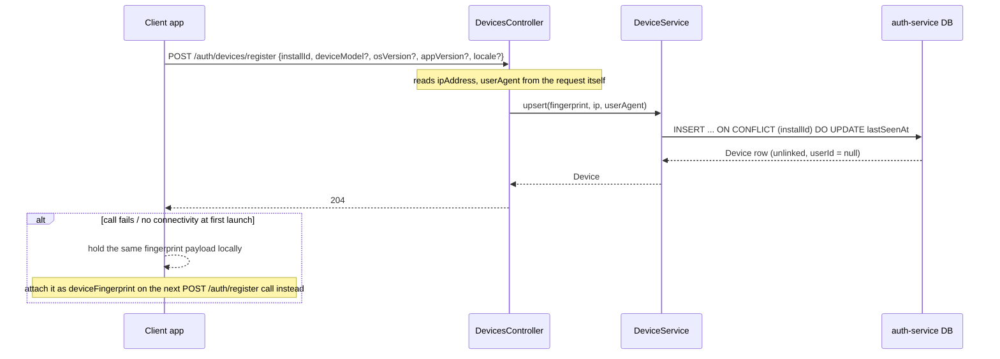
```mermaid
sequenceDiagram
    participant App as Client app
    participant DC as DevicesController
    participant DS as DeviceService
    participant DB as auth-service DB

    App->>DC: POST /auth/devices/register {installId, deviceModel?, osVersion?, appVersion?, locale?}
    Note over DC: reads ipAddress, userAgent from the request itself
    DC->>DS: upsert(fingerprint, ip, userAgent)
    DS->>DB: INSERT ... ON CONFLICT (installId) DO UPDATE lastSeenAt
    DB-->>DS: Device row (unlinked, userId = null)
    DS-->>DC: Device
    DC-->>App: 204

    alt call fails / no connectivity at first launch
        App-->>App: hold the same fingerprint payload locally
        Note over App: attach it as deviceFingerprint on the next POST /auth/register call instead
    end
```

**(b) Organization/license validation before registration**

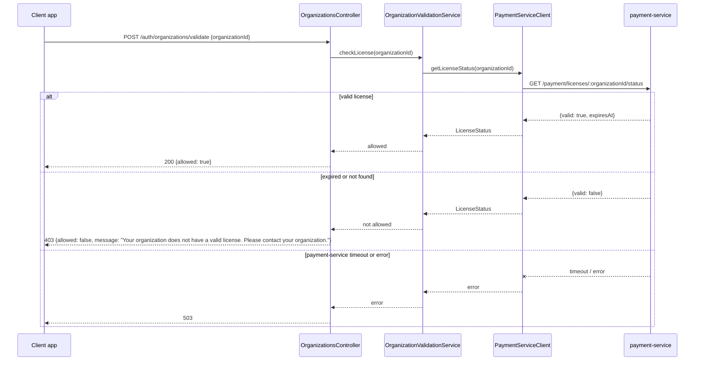
```mermaid
sequenceDiagram
    participant App as Client app
    participant OC as OrganizationsController
    participant OVS as OrganizationValidationService
    participant PSC as PaymentServiceClient
    participant PS as payment-service

    App->>OC: POST /auth/organizations/validate {organizationId}
    OC->>OVS: checkLicense(organizationId)
    OVS->>PSC: getLicenseStatus(organizationId)
    PSC->>PS: GET /payment/licenses/:organizationId/status
    alt valid license
        PS-->>PSC: {valid: true, expiresAt}
        PSC-->>OVS: LicenseStatus
        OVS-->>OC: allowed
                OC-->>App: 200 {allowed: true}
    else expired or not found
        PS-->>PSC: {valid: false}
        PSC-->>OVS: LicenseStatus
        OVS-->>OC: not allowed
        OC-->>App: 403 {allowed: false, message: "Your organization does not have a valid license. Please contact your organization."}
    else payment-service timeout or error
        PS--xPSC: timeout / error
        PSC-->>OVS: error
        OVS-->>OC: error
        OC-->>App: 503
    end
```

**(c) Registration**

```mermaid
sequenceDiagram
    participant App as Client app
    participant AC as AuthController
    participant AS as AuthService
    participant US as UsersService
    participant OVS as OrganizationValidationService
    participant DS as DeviceService
    participant TS as TokenService
    participant RTS as RefreshTokenService
    participant Broker as RabbitMQ

    Note over App,AC: SUPERSEDED (ADR-0028): the body is now {joinCode, email|phone, password}; organization and audience are resolved from the code
    App->>AC: POST /auth/register {email, password, role, organizationId, deviceFingerprint?}
    alt organizationId missing
        AC-->>App: 400 (no further processing)
    else organizationId present
        AC->>AS: register(dto)
        AS->>US: findByEmail(email)
        alt email already exists
            US-->>AS: User
            AS-->>App: 409
        else email available
            US-->>AS: null
            AS->>OVS: checkLicense(organizationId)
            alt invalid or expired
                OVS-->>AS: not allowed
                AS-->>App: 403 contact-your-organization message
            else payment-service unreachable
                OVS--xAS: error/timeout
                AS-->>App: 503
            else valid license
                OVS-->>AS: allowed
                AS->>AS: hash password (bcrypt)
                AS->>US: create(kind: 'member', email?, phone?, passwordHash, role, organizationId)
                US-->>AS: User
                AS->>DS: upsert/link Device (deviceFingerprint if present)
                DS-->>AS: Device
                AS->>TS: signAccessToken(payload)
                TS-->>AS: accessToken
                AS->>RTS: issue(userId)
                RTS-->>AS: refresh token
                AS-)Broker: publish user.registered {userId, role, organizationId, timestamp}
                AS-->>App: 201 {accessToken, refreshToken, expiresIn}
            end
        end
    end
```

**(d) Login (ADR-0025/ADR-0026: no entitlement check, owners get a second-factor challenge)**

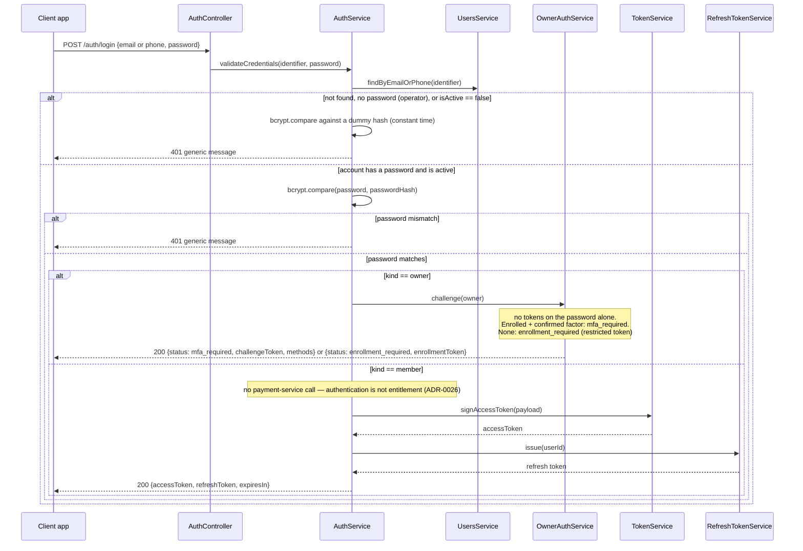
```mermaid
sequenceDiagram
    participant App as Client app
    participant AC as AuthController
    participant AS as AuthService
    participant US as UsersService
    participant OAS as OwnerAuthService
    participant TS as TokenService
    participant RTS as RefreshTokenService

    App->>AC: POST /auth/login {email or phone, password}
    AC->>AS: validateCredentials(identifier, password)
    AS->>US: findByEmailOrPhone(identifier)
    alt not found, no password (operator), or isActive == false
        AS->>AS: bcrypt.compare against a dummy hash (constant time)
        AS-->>App: 401 generic message
    else account has a password and is active
        AS->>AS: bcrypt.compare(password, passwordHash)
        alt password mismatch
            AS-->>App: 401 generic message
        else password matches
            alt kind == owner
                AS->>OAS: challenge(owner)
                Note over OAS: no tokens on the password alone.<br/>Enrolled + confirmed factor: mfa_required.<br/>None: enrollment_required (restricted token)
                OAS-->>App: 200 {status: mfa_required, challengeToken, methods} or {status: enrollment_required, enrollmentToken}
            else kind == member
                Note over AS: no payment-service call — authentication is not entitlement (ADR-0026)
                AS->>TS: signAccessToken(payload)
                TS-->>AS: accessToken
                AS->>RTS: issue(userId)
                RTS-->>AS: refresh token
                AS-->>App: 200 {accessToken, refreshToken, expiresIn}
            end
        end
    end
```

**(e) Refresh token rotation (ADR-0026: no license/subscription check)**

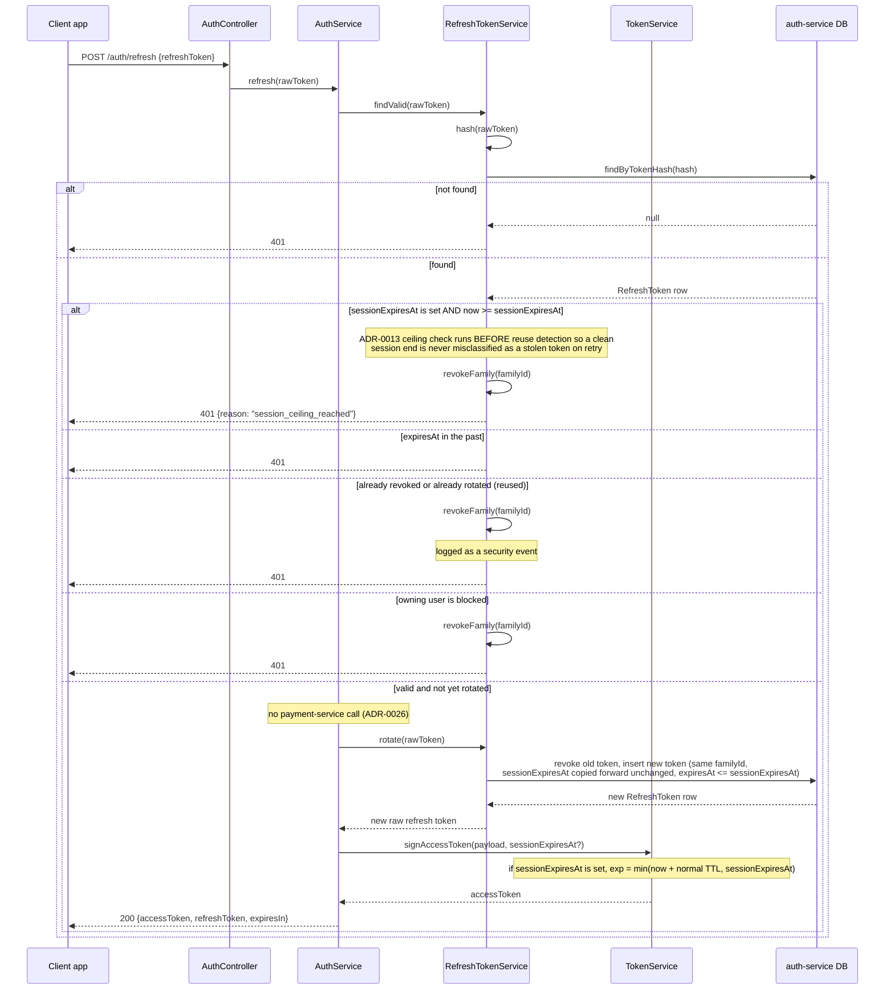
```mermaid
sequenceDiagram
    participant App as Client app
    participant AC as AuthController
    participant AS as AuthService
    participant RTS as RefreshTokenService
    participant TS as TokenService
    participant DB as auth-service DB

    App->>AC: POST /auth/refresh {refreshToken}
    AC->>AS: refresh(rawToken)
    AS->>RTS: findValid(rawToken)
    RTS->>RTS: hash(rawToken)
    RTS->>DB: findByTokenHash(hash)
    alt not found
        DB-->>RTS: null
        RTS-->>App: 401
    else found
        DB-->>RTS: RefreshToken row
        alt sessionExpiresAt is set AND now >= sessionExpiresAt
            Note over RTS: ADR-0013 ceiling check runs BEFORE reuse detection so a clean<br/>session end is never misclassified as a stolen token on retry
            RTS->>RTS: revokeFamily(familyId)
            RTS-->>App: 401 {reason: "session_ceiling_reached"}
        else expiresAt in the past
            RTS-->>App: 401
        else already revoked or already rotated (reused)
            RTS->>RTS: revokeFamily(familyId)
            Note over RTS: logged as a security event
            RTS-->>App: 401
        else owning user is blocked
            RTS->>RTS: revokeFamily(familyId)
            RTS-->>App: 401
        else valid and not yet rotated
            Note over AS: no payment-service call (ADR-0026)
            AS->>RTS: rotate(rawToken)
            RTS->>DB: revoke old token, insert new token (same familyId,<br/>sessionExpiresAt copied forward unchanged, expiresAt <= sessionExpiresAt)
            DB-->>RTS: new RefreshToken row
            RTS-->>AS: new raw refresh token
            AS->>TS: signAccessToken(payload, sessionExpiresAt?)
            Note over TS: if sessionExpiresAt is set, exp = min(now + normal TTL, sessionExpiresAt)
            TS-->>AS: accessToken
            AS-->>App: 200 {accessToken, refreshToken, expiresIn}
        end
    end
```

**(f) Logout**

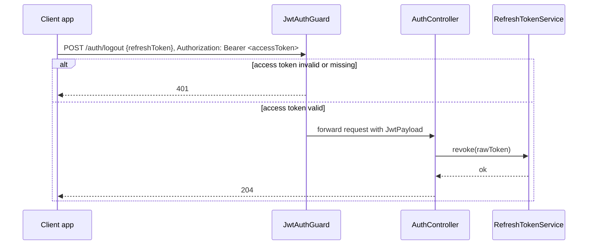
```mermaid
sequenceDiagram
    participant App as Client app
    participant Guard as JwtAuthGuard
    participant AC as AuthController
    participant RTS as RefreshTokenService

    App->>Guard: POST /auth/logout {refreshToken}, Authorization: Bearer <accessToken>
    alt access token invalid or missing
        Guard-->>App: 401
    else access token valid
        Guard->>AC: forward request with JwtPayload
        AC->>RTS: revoke(rawToken)
        RTS-->>AC: ok
        AC-->>App: 204
    end
```

**(g) Downstream consumer authorizing a request from the JWT alone**

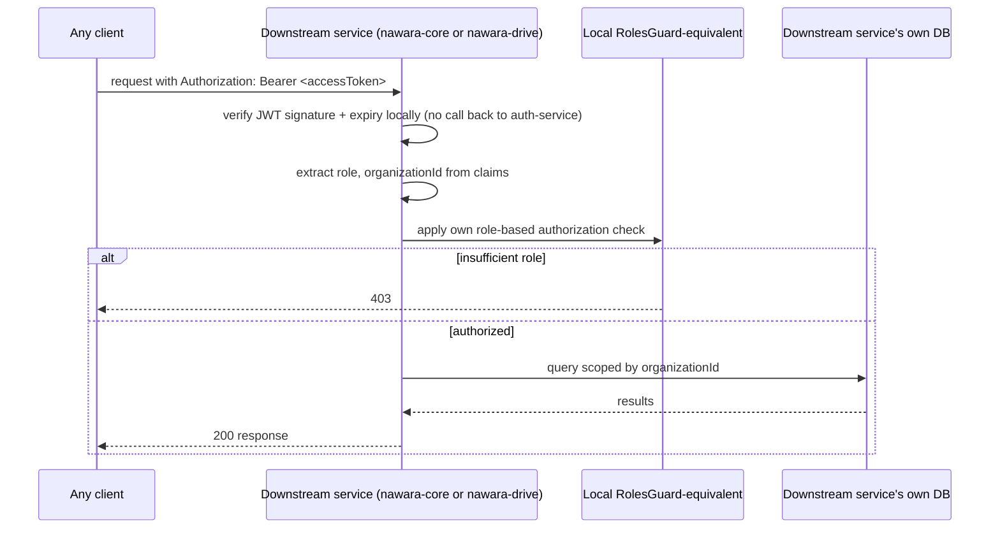
```mermaid
sequenceDiagram
    participant Client as Any client
    participant Svc as Downstream service (nawara-core or nawara-drive)
    participant Guard as Local RolesGuard-equivalent
    participant DB as Downstream service's own DB

    Client->>Svc: request with Authorization: Bearer <accessToken>
    Svc->>Svc: verify JWT signature + expiry locally (no call back to auth-service)
    Svc->>Svc: extract role, organizationId from claims
    Svc->>Guard: apply own role-based authorization check
    alt insufficient role
        Guard-->>Client: 403
    else authorized
        Svc->>DB: query scoped by organizationId
        DB-->>Svc: results
        Svc-->>Client: 200 response
    end
```

This last flow operationalizes `nawara-drive`'s deferred school-scoping need from
ADR-0001: `auth-service` never sees this request at all — the downstream service holds
its own verification key and applies its own meaning to `role`/`organizationId`.

**(h) Owner login: password, then second factor, with new-device check (ADR-0025)**

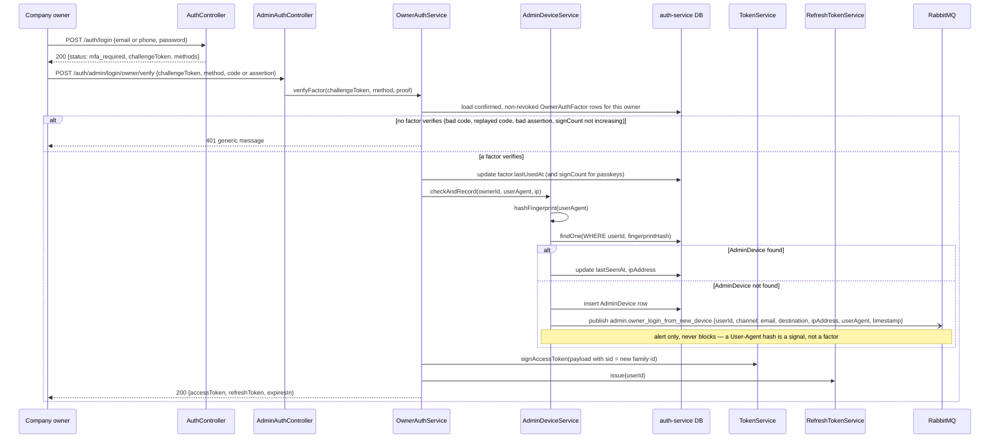
```mermaid
sequenceDiagram
    participant Owner as Company owner
    participant AC as AuthController
    participant AAC as AdminAuthController
    participant OAS as OwnerAuthService
    participant ADS as AdminDeviceService
    participant DB as auth-service DB
    participant TS as TokenService
    participant RTS as RefreshTokenService
    participant Broker as RabbitMQ

    Owner->>AC: POST /auth/login {email or phone, password}
    AC-->>Owner: 200 {status: mfa_required, challengeToken, methods}
    Owner->>AAC: POST /auth/admin/login/owner/verify {challengeToken, method, code or assertion}
    AAC->>OAS: verifyFactor(challengeToken, method, proof)
    OAS->>DB: load confirmed, non-revoked OwnerAuthFactor rows for this owner
    alt no factor verifies (bad code, replayed code, bad assertion, signCount not increasing)
        OAS-->>Owner: 401 generic message
    else a factor verifies
        OAS->>DB: update factor.lastUsedAt (and signCount for passkeys)
        OAS->>ADS: checkAndRecord(ownerId, userAgent, ip)
        ADS->>ADS: hashFingerprint(userAgent)
        ADS->>DB: findOne(WHERE userId, fingerprintHash)
        alt AdminDevice found
            ADS->>DB: update lastSeenAt, ipAddress
        else AdminDevice not found
            ADS->>DB: insert AdminDevice row
            ADS-)Broker: publish admin.owner_login_from_new_device {userId, channel: email, destination, ipAddress, userAgent, timestamp}
            Note over ADS,Broker: alert only, never blocks — a User-Agent hash is a signal, not a factor
        end
        OAS->>TS: signAccessToken(payload with sid = new family id)
        OAS->>RTS: issue(userId)
        OAS-->>Owner: 200 {accessToken, refreshToken, expiresIn}
    end
```

After this the owner reaches **every** platform in the company with no platform-specific key:
authorization is `User.kind = owner AND Owner.companyId = Platform.companyId`.

**(i) Owner step-up, then secret-key rotation (ADR-0025)**

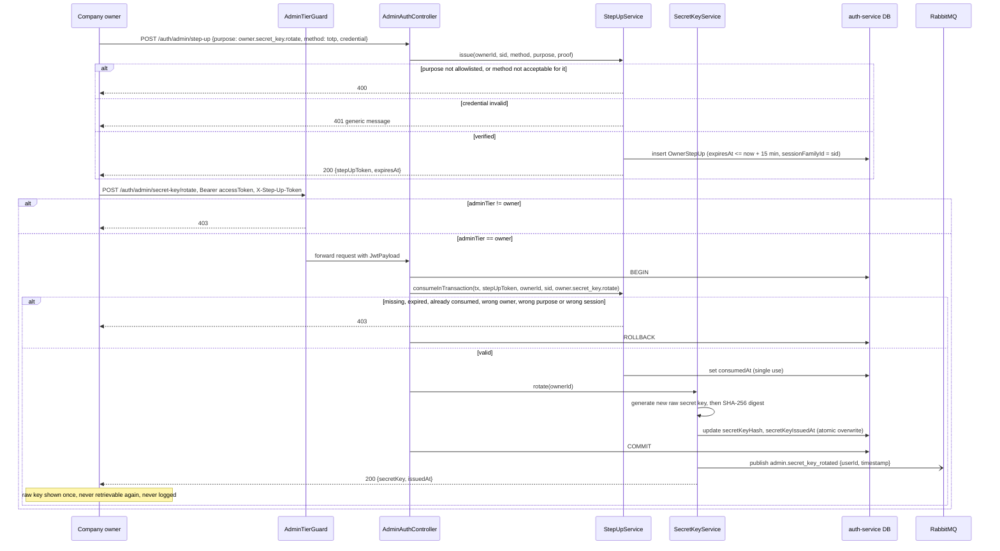
```mermaid
sequenceDiagram
    participant Owner as Company owner
    participant Guard as AdminTierGuard
    participant AAC as AdminAuthController
    participant SUS as StepUpService
    participant SKS as SecretKeyService
    participant DB as auth-service DB
    participant Broker as RabbitMQ

    Owner->>AAC: POST /auth/admin/step-up {purpose: owner.secret_key.rotate, method: totp, credential}
    AAC->>SUS: issue(ownerId, sid, method, purpose, proof)
    alt purpose not allowlisted, or method not acceptable for it
        SUS-->>Owner: 400
    else credential invalid
        SUS-->>Owner: 401 generic message
    else verified
        SUS->>DB: insert OwnerStepUp (expiresAt <= now + 15 min, sessionFamilyId = sid)
        SUS-->>Owner: 200 {stepUpToken, expiresAt}
    end
    Owner->>Guard: POST /auth/admin/secret-key/rotate, Bearer accessToken, X-Step-Up-Token
    alt adminTier != owner
        Guard-->>Owner: 403
    else adminTier == owner
        Guard->>AAC: forward request with JwtPayload
        AAC->>DB: BEGIN
        AAC->>SUS: consumeInTransaction(tx, stepUpToken, ownerId, sid, owner.secret_key.rotate)
        alt missing, expired, already consumed, wrong owner, wrong purpose or wrong session
            SUS-->>Owner: 403
            AAC->>DB: ROLLBACK
        else valid
            SUS->>DB: set consumedAt (single use)
            AAC->>SKS: rotate(ownerId)
            SKS->>SKS: generate new raw secret key, then SHA-256 digest
            SKS->>DB: update secretKeyHash, secretKeyIssuedAt (atomic overwrite)
            AAC->>DB: COMMIT
            SKS-)Broker: publish admin.secret_key_rotated {userId, timestamp}
            SKS-->>Owner: 200 {secretKey, issuedAt}
            Note over Owner: raw key shown once, never retrievable again, never logged
        end
    end
```

The same guard-then-transactional-consume pattern protects granting and revoking a
`PlatformAssignment`, removing a factor, and creating a platform or operator; on a failed operation
the step-up is not burned because it is consumed inside the operation's own transaction.

**(j) Operator registration (updated per ADR-0015: also issues a confirmation code)**

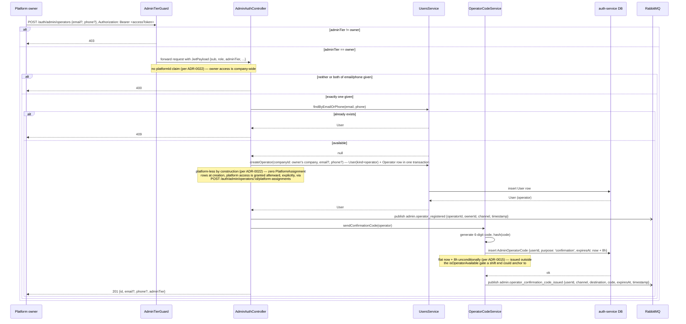
```mermaid
sequenceDiagram
    participant Owner as Platform owner
    participant Guard as AdminTierGuard
    participant AAC as AdminAuthController
    participant US as UsersService
    participant OCS as OperatorCodeService
    participant DB as auth-service DB
    participant Broker as RabbitMQ

    Owner->>Guard: POST /auth/admin/operators {email?, phone?}, Authorization: Bearer <accessToken>
    alt adminTier != owner
        Guard-->>Owner: 403
    else adminTier == owner
        Guard->>AAC: forward request with JwtPayload {sub, role, adminTier, ...}
        Note over Guard,AAC: no platformId claim (per ADR-0022) — owner access is company-wide
        alt neither or both of email/phone given
            AAC-->>Owner: 400
        else exactly one given
            AAC->>US: findByEmailOrPhone(email, phone)
            alt already exists
                US-->>AAC: User
                AAC-->>Owner: 409
            else available
                US-->>AAC: null
                AAC->>US: createOperator(companyId: owner's company, email?, phone?) — User(kind=operator) + Operator row in one transaction
                Note over AAC: platform-less by construction (per ADR-0022) — zero PlatformAssignment<br/>rows at creation, platform access is granted afterward, explicitly, via<br/>POST /auth/admin/operators/:id/platform-assignments
                US->>DB: insert User row
                DB-->>US: User (operator)
                US-->>AAC: User
                AAC-)Broker: publish admin.operator_registered {operatorId, ownerId, channel, timestamp}
                AAC->>OCS: sendConfirmationCode(operator)
                OCS->>OCS: generate 6-digit code, hash(code)
                OCS->>DB: insert AdminOperatorCode {userId, purpose: 'confirmation', expiresAt: now + 8h}
                Note over OCS: flat now + 8h unconditionally (per ADR-0015) — issued outside<br/>the isOperatorAvailable gate a shift end could anchor to
                DB-->>OCS: ok
                OCS-)Broker: publish admin.operator_confirmation_code_issued {userId, channel, destination, code, expiresAt, timestamp}
                AAC-->>Owner: 201 {id, email?, phone?, adminTier}
            end
        end
    end
```

**(k) Operator request-code with availability gate (updated per ADR-0012/ADR-0014/ADR-0015;
platform-calendar step dropped per ADR-0023)**

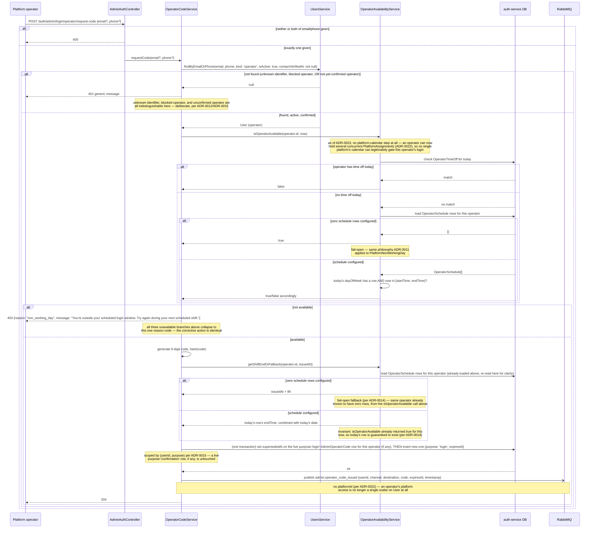
```mermaid
sequenceDiagram
    participant Operator as Platform operator
    participant AAC as AdminAuthController
    participant OCS as OperatorCodeService
    participant US as UsersService
    participant OAS as OperatorAvailabilityService
    participant DB as auth-service DB
    participant Broker as RabbitMQ

    Operator->>AAC: POST /auth/admin/login/operator/request-code {email?, phone?}
    alt neither or both of email/phone given
        AAC-->>Operator: 400
    else exactly one given
        AAC->>OCS: requestCode(email?, phone?)
        OCS->>US: findByEmailOrPhone(email, phone, kind: 'operator', isActive: true, contactVerifiedAt: not null)
        alt not found (unknown identifier, blocked operator, OR not-yet-confirmed operator)
            US-->>OCS: null
            OCS-->>Operator: 401 generic message
            Note over OCS: unknown identifier, blocked operator, and unconfirmed operator are<br/>all indistinguishable here — deliberate, per ADR-0012/ADR-0015
        else found, active, confirmed
            US-->>OCS: User (operator)
            OCS->>OAS: isOperatorAvailable(operator.id, now)
            Note over OAS: as of ADR-0023, no platform-calendar step at all — an operator can now<br/>hold several concurrent PlatformAssignments (ADR-0022), so no single<br/>platform's calendar can legitimately gate this operator's login
            OAS->>DB: check OperatorTimeOff for today
                alt operator has time off today
                    DB-->>OAS: match
                    OAS-->>OCS: false
                else no time off today
                    DB-->>OAS: no match
                    OAS->>DB: load OperatorSchedule rows for this operator
                    alt zero schedule rows configured
                        DB-->>OAS: []
                        OAS-->>OCS: true
                        Note over OAS: fail-open — same philosophy ADR-0011<br/>applies to PlatformNonWorkingDay
                    else schedule configured
                        DB-->>OAS: OperatorSchedule[]
                        OAS->>OAS: today's dayOfWeek has a row AND now in [startTime, endTime)?
                        OAS-->>OCS: true/false accordingly
                    end
                end
            alt not available
                OCS-->>Operator: 403 {reason: "non_working_day", message: "You're outside your scheduled login window. Try again during your next scheduled shift."}
                Note over OCS: all three unavailable branches above collapse to<br/>this one reason code — the corrective action is identical
            else available
                OCS->>OCS: generate 6-digit code, hash(code)
                OCS->>OAS: getShiftEndOrFallback(operator.id, issuedAt)
                OAS->>DB: load OperatorSchedule rows for this operator (already loaded above, re-read here for clarity)
                alt zero schedule rows configured
                    OAS-->>OCS: issuedAt + 8h
                    Note over OAS: fail-open fallback (per ADR-0014) — same operator already<br/>known to have zero rows, from the isOperatorAvailable call above
                else schedule configured
                    OAS-->>OCS: today's row's endTime, combined with today's date
                    Note over OAS: invariant: isOperatorAvailable already returned true for this<br/>now, so today's row is guaranteed to exist (per ADR-0014)
                end
                OCS->>DB: (one transaction) set supersededAt on the live purpose:'login' AdminOperatorCode row for this operator (if any), THEN insert new one {purpose: 'login', expiresAt}
                Note over OCS: scoped by (userId, purpose) per ADR-0015 — a live<br/>purpose:'confirmation' row, if any, is untouched
                DB-->>OCS: ok
                OCS-)Broker: publish admin.operator_code_issued {userId, channel, destination, code, expiresAt, timestamp}
                Note over OCS,Broker: no platformId (per ADR-0022) — an operator's platform<br/>access is no longer a single scalar on User at all
                OCS-->>Operator: 204
            end
        end
    end
```

**(l) Operator verify-code (updated per ADR-0012: `isActive` join, no `attemptCount`
increment on a no-row-found result; per ADR-0013: `sessionExpiresAt` stamped on success; per
ADR-0014: `sessionExpiresAt` computed via `getShiftEndOrFallback`, fresh and independent of
request-code's own computation; per ADR-0015: `contactVerifiedAt` join)**

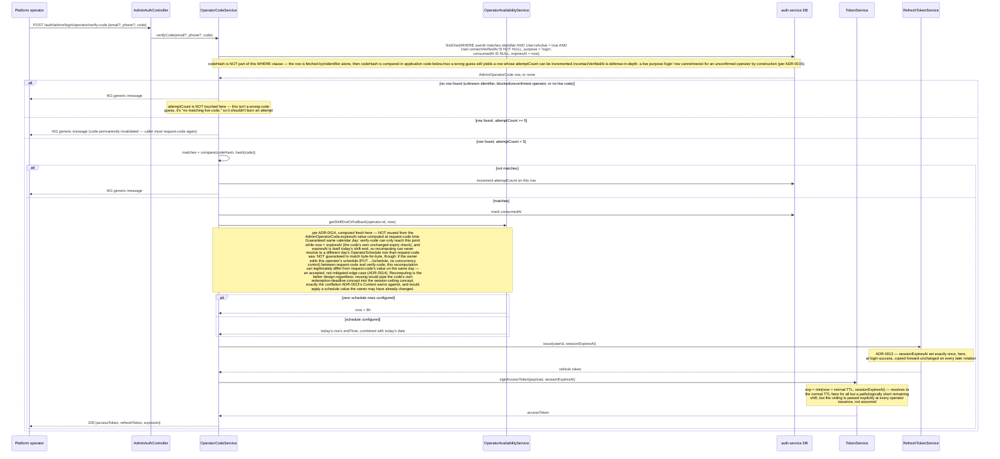
```mermaid
sequenceDiagram
    participant Operator as Platform operator
    participant AAC as AdminAuthController
    participant OCS as OperatorCodeService
    participant OAS as OperatorAvailabilityService
    participant DB as auth-service DB
    participant TS as TokenService
    participant RTS as RefreshTokenService

    Operator->>AAC: POST /auth/admin/login/operator/verify-code {email?, phone?, code}
    AAC->>OCS: verifyCode(email?, phone?, code)
    OCS->>DB: findOne(WHERE userId matches identifier AND User.isActive = true AND<br/>User.contactVerifiedAt IS NOT NULL, purpose = 'login',<br/>consumedAt IS NULL, expiresAt > now)
    Note over OCS,DB: codeHash is NOT part of this WHERE clause — the row is fetched by\nidentifier alone, then codeHash is compared in application code below,\nso a wrong guess still yields a row whose attemptCount can be incremented.\ncontactVerifiedAt is defense-in-depth: a live purpose:'login' row cannot\nexist for an unconfirmed operator by construction (per ADR-0015).
    DB-->>OCS: AdminOperatorCode row, or none
    alt no row found (unknown identifier, blocked/unconfirmed operator, or no live code)
        OCS-->>Operator: 401 generic message
        Note over OCS: attemptCount is NOT touched here — this isn't a wrong-code<br/>guess, it's "no matching live code," so it shouldn't burn an attempt
    else row found, attemptCount >= 5
        OCS-->>Operator: 401 generic message (code permanently invalidated — caller must request-code again)
    else row found, attemptCount < 5
        OCS->>OCS: matches = compare(codeHash, hash(code))
        alt not matches
            OCS->>DB: increment attemptCount on this row
            OCS-->>Operator: 401 generic message
        else matches
            OCS->>DB: mark consumedAt
            OCS->>OAS: getShiftEndOrFallback(operator.id, now)
            Note over OCS,OAS: per ADR-0014, computed fresh here — NOT reused from the<br/>AdminOperatorCode.expiresAt value computed at request-code time.<br/>Guaranteed same calendar day: verify-code can only reach this point<br/>while now < expiresAt (the code's own unchanged expiry check), and<br/>expiresAt is itself today's shift-end, so recomputing can never<br/>resolve to a different day's OperatorSchedule row than request-code<br/>saw. NOT guaranteed to match byte-for-byte, though: if the owner<br/>edits this operator's schedule (PUT .../schedule, no concurrency<br/>control) between request-code and verify-code, this recomputation<br/>can legitimately differ from request-code's value on the same day —<br/>an accepted, not-mitigated edge case (ADR-0014). Recomputing is the<br/>better design regardless: reusing would pipe the code's own<br/>redemption-deadline concept into the session-ceiling concept,<br/>exactly the conflation ADR-0013's Context warns against, and would<br/>apply a schedule value the owner may have already changed.
            alt zero schedule rows configured
                OAS-->>OCS: now + 8h
            else schedule configured
                OAS-->>OCS: today's row's endTime, combined with today's date
            end
            OCS->>RTS: issue(userId, sessionExpiresAt)
            Note over RTS: ADR-0013 — sessionExpiresAt set exactly once, here,<br/>at login success, copied forward unchanged on every later rotation
            RTS-->>OCS: refresh token
            OCS->>TS: signAccessToken(payload, sessionExpiresAt)
            Note over TS: exp = min(now + normal TTL, sessionExpiresAt) — resolves to<br/>the normal TTL here for all but a pathologically short remaining<br/>shift, but the ceiling is passed explicitly at every operator<br/>issuance, not assumed
            TS-->>OCS: accessToken
            OCS-->>Operator: 200 {accessToken, refreshToken, expiresIn}
        end
    end
```

**(m) Owner blocks an operator (updated per ADR-0015: deletes unconsumed codes of either
`purpose`)**

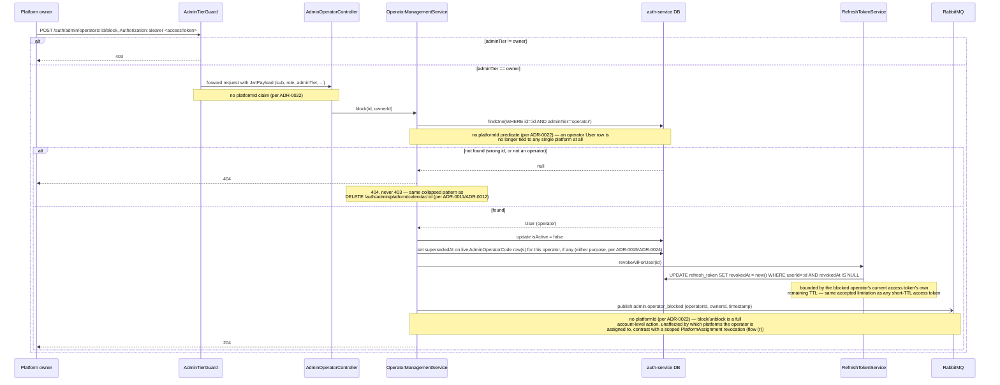
```mermaid
sequenceDiagram
    participant Owner as Platform owner
    participant Guard as AdminTierGuard
    participant AOC as AdminOperatorController
    participant OMS as OperatorManagementService
    participant DB as auth-service DB
    participant RTS as RefreshTokenService
    participant Broker as RabbitMQ

    Owner->>Guard: POST /auth/admin/operators/:id/block, Authorization: Bearer <accessToken>
    alt adminTier != owner
        Guard-->>Owner: 403
    else adminTier == owner
        Guard->>AOC: forward request with JwtPayload {sub, role, adminTier, ...}
        Note over Guard,AOC: no platformId claim (per ADR-0022)
        AOC->>OMS: block(id, ownerId)
        OMS->>DB: findOne(WHERE id=:id AND adminTier='operator')
        Note over OMS,DB: no platformId predicate (per ADR-0022) — an operator User row is<br/>no longer tied to any single platform at all
        alt not found (wrong id, or not an operator)
            DB-->>OMS: null
            OMS-->>Owner: 404
            Note over OMS: 404, never 403 — same collapsed pattern as<br/>DELETE /auth/admin/platform/calendar/:id (per ADR-0011/ADR-0012)
        else found
            DB-->>OMS: User (operator)
            OMS->>DB: update isActive = false
            OMS->>DB: set supersededAt on live AdminOperatorCode row(s) for this operator, if any (either purpose, per ADR-0015/ADR-0024)
            OMS->>RTS: revokeAllForUser(id)
            RTS->>DB: UPDATE refresh_token SET revokedAt = now() WHERE userId=:id AND revokedAt IS NULL
            Note over RTS: bounded by the blocked operator's current access token's own<br/>remaining TTL — same accepted limitation as any short-TTL access token
            OMS-)Broker: publish admin.operator_blocked {operatorId, ownerId, timestamp}
            Note over OMS,Broker: no platformId (per ADR-0022) — block/unblock is a full<br/>account-level action, unaffected by which platforms the operator is<br/>assigned to, contrast with a scoped PlatformAssignment revocation (flow (r))
            OMS-->>Owner: 204
        end
    end
```

**(n) Owner unblocks an operator**

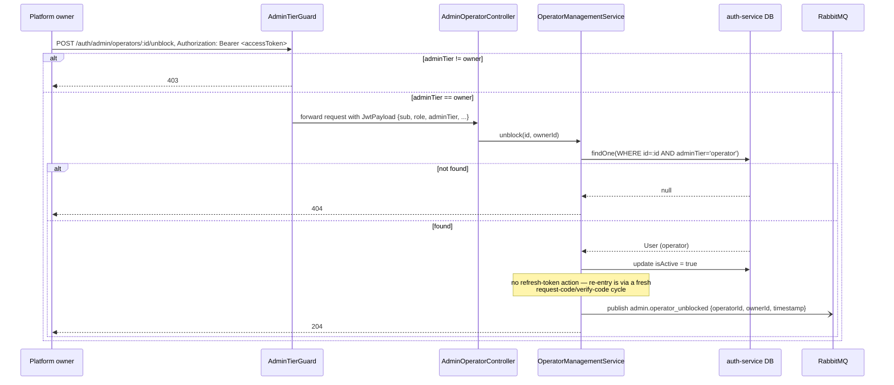
```mermaid
sequenceDiagram
    participant Owner as Platform owner
    participant Guard as AdminTierGuard
    participant AOC as AdminOperatorController
    participant OMS as OperatorManagementService
    participant DB as auth-service DB
    participant Broker as RabbitMQ

    Owner->>Guard: POST /auth/admin/operators/:id/unblock, Authorization: Bearer <accessToken>
    alt adminTier != owner
        Guard-->>Owner: 403
    else adminTier == owner
        Guard->>AOC: forward request with JwtPayload {sub, role, adminTier, ...}
        AOC->>OMS: unblock(id, ownerId)
        OMS->>DB: findOne(WHERE id=:id AND adminTier='operator')
        alt not found
            DB-->>OMS: null
            OMS-->>Owner: 404
        else found
            DB-->>OMS: User (operator)
            OMS->>DB: update isActive = true
            Note over OMS: no refresh-token action — re-entry is via a fresh<br/>request-code/verify-code cycle
            OMS-)Broker: publish admin.operator_unblocked {operatorId, ownerId, timestamp}
            OMS-->>Owner: 204
        end
    end
```

**(o) Operator contact confirmation (new, per ADR-0015)**

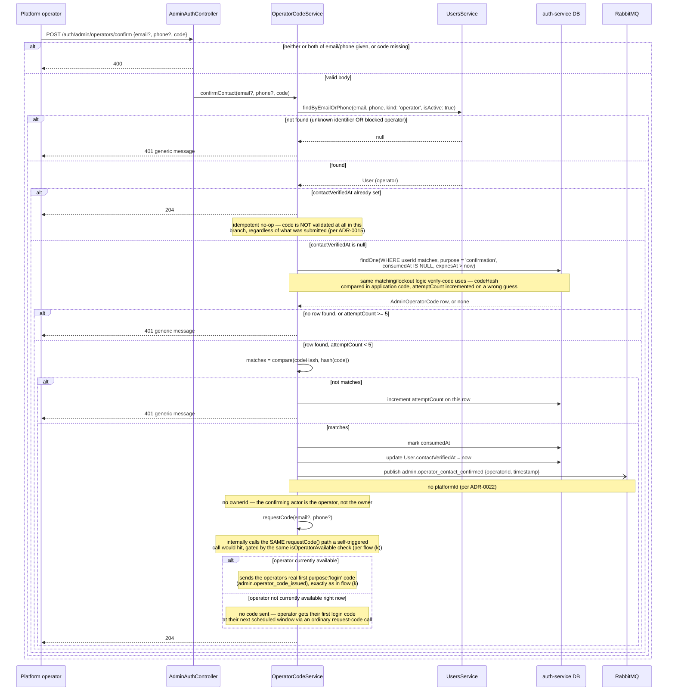
```mermaid
sequenceDiagram
    participant Operator as Platform operator
    participant AAC as AdminAuthController
    participant OCS as OperatorCodeService
    participant US as UsersService
    participant DB as auth-service DB
    participant Broker as RabbitMQ

    Operator->>AAC: POST /auth/admin/operators/confirm {email?, phone?, code}
    alt neither or both of email/phone given, or code missing
        AAC-->>Operator: 400
    else valid body
        AAC->>OCS: confirmContact(email?, phone?, code)
        OCS->>US: findByEmailOrPhone(email, phone, kind: 'operator', isActive: true)
        alt not found (unknown identifier OR blocked operator)
            US-->>OCS: null
            OCS-->>Operator: 401 generic message
        else found
            US-->>OCS: User (operator)
            alt contactVerifiedAt already set
                OCS-->>Operator: 204
                Note over OCS: idempotent no-op — code is NOT validated at all in this<br/>branch, regardless of what was submitted (per ADR-0015)
            else contactVerifiedAt is null
                OCS->>DB: findOne(WHERE userId matches, purpose = 'confirmation',<br/>consumedAt IS NULL, expiresAt > now)
                Note over OCS,DB: same matching/lockout logic verify-code uses — codeHash<br/>compared in application code, attemptCount incremented on a wrong guess
                DB-->>OCS: AdminOperatorCode row, or none
                alt no row found, or attemptCount >= 5
                    OCS-->>Operator: 401 generic message
                else row found, attemptCount < 5
                    OCS->>OCS: matches = compare(codeHash, hash(code))
                    alt not matches
                        OCS->>DB: increment attemptCount on this row
                        OCS-->>Operator: 401 generic message
                    else matches
                        OCS->>DB: mark consumedAt
                        OCS->>DB: update User.contactVerifiedAt = now
                        OCS-)Broker: publish admin.operator_contact_confirmed {operatorId, timestamp}
                        Note over OCS,Broker: no platformId (per ADR-0022)
                        Note over OCS: no ownerId — the confirming actor is the operator, not the owner
                        OCS->>OCS: requestCode(email?, phone?)
                        Note over OCS: internally calls the SAME requestCode() path a self-triggered<br/>call would hit, gated by the same isOperatorAvailable check (per flow (k))
                        alt operator currently available
                            Note over OCS: sends the operator's real first purpose:'login' code<br/>(admin.operator_code_issued), exactly as in flow (k)
                        else operator not currently available right now
                            Note over OCS: no code sent — operator gets their first login code<br/>at their next scheduled window via an ordinary request-code call
                        end
                        OCS-->>Operator: 204
                    end
                end
            end
        end
    end
```

**(p) Organization creation (new, per ADR-0020, rewritten by ADR-0022)**

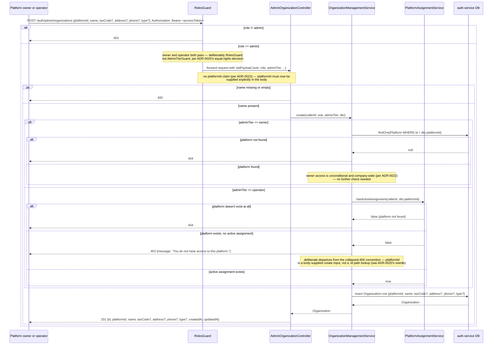
```mermaid
sequenceDiagram
    participant Admin as Platform owner or operator
    participant Guard as RolesGuard
    participant AOC as AdminOrganizationController
    participant OMS as OrganizationManagementService
    participant PAS as PlatformAssignmentService
    participant DB as auth-service DB

    Admin->>Guard: POST /auth/admin/organizations {platformId, name, taxCode?, address?, phone?, type?}, Authorization: Bearer <accessToken>
    alt role != admin
        Guard-->>Admin: 403
    else role == admin
        Note over Guard: owner and operator both pass — deliberately RolesGuard,<br/>not AdminTierGuard, per ADR-0020's equal-rights decision
        Guard->>AOC: forward request with JwtPayload {sub, role, adminTier, ...}
        Note over Guard,AOC: no platformId claim (per ADR-0022) — platformId must now be<br/>supplied explicitly in the body
        alt name missing or empty
            AOC-->>Admin: 400
        else name present
            AOC->>OMS: create(callerId: sub, adminTier, dto)
            alt adminTier == owner
                OMS->>DB: findOne(Platform WHERE id = dto.platformId)
                alt platform not found
                    DB-->>OMS: null
                    OMS-->>Admin: 404
                else platform found
                    Note over OMS: owner access is unconditional and company-wide (per ADR-0022)<br/>— no further check needed
                end
            else adminTier == operator
                OMS->>PAS: hasActiveAssignment(callerId, dto.platformId)
                alt platform doesn't exist at all
                    PAS-->>OMS: false (platform not found)
                    OMS-->>Admin: 404
                else platform exists, no active assignment
                    PAS-->>OMS: false
                    OMS-->>Admin: 403 {message: "You do not have access to this platform."}
                    Note over OMS: deliberate departure from the collapsed-404 convention — platformId<br/>is a body-supplied create input, not a :id path lookup (see ADR-0020's rewrite)
                else active assignment exists
                    PAS-->>OMS: true
                end
            end
            OMS->>DB: insert Organization row {platformId, name, taxCode?, address?, phone?, type?}
            DB-->>OMS: Organization
            OMS-->>AOC: Organization
            AOC-->>Admin: 201 {id, platformId, name, taxCode?, address?, phone?, type?, createdAt, updatedAt}
        end
    end
```

Listing (`GET /auth/admin/organizations`, owner: every platform under the company by default,
optionally narrowed by `?platformId=`; operator: a join across their own currently-active
`PlatformAssignment`s) and the `:id`-scoped `GET`/`PATCH` pair (looked up by `id` alone, then
authorized against the resolved organization's own `platformId` — unconditional for an owner,
requiring an active `PlatformAssignment` for an operator — `404`, never `403`, on any mismatch,
the same collapsed pattern flow (m) already uses for `AdminOperatorController`) follow the
shape described in the API contract above and are not separately diagrammed.

**(q) Owner assigns a platform to an operator (new, per ADR-0022)**

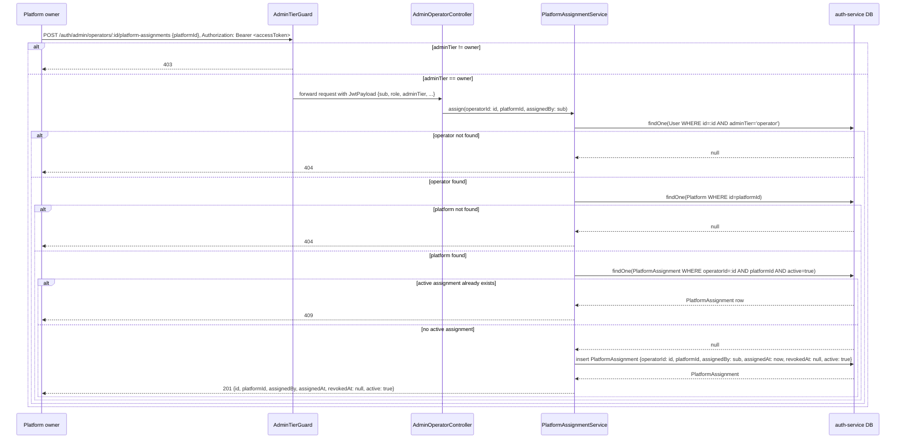
```mermaid
sequenceDiagram
    participant Owner as Platform owner
    participant Guard as AdminTierGuard
    participant AOC as AdminOperatorController
    participant PAS as PlatformAssignmentService
    participant DB as auth-service DB

    Owner->>Guard: POST /auth/admin/operators/:id/platform-assignments {platformId}, Authorization: Bearer <accessToken>
    alt adminTier != owner
        Guard-->>Owner: 403
    else adminTier == owner
        Guard->>AOC: forward request with JwtPayload {sub, role, adminTier, ...}
        AOC->>PAS: assign(operatorId: id, platformId, assignedBy: sub)
        PAS->>DB: findOne(User WHERE id=:id AND adminTier='operator')
        alt operator not found
            DB-->>PAS: null
            PAS-->>Owner: 404
        else operator found
            PAS->>DB: findOne(Platform WHERE id=platformId)
            alt platform not found
                DB-->>PAS: null
                PAS-->>Owner: 404
            else platform found
                PAS->>DB: findOne(PlatformAssignment WHERE operatorId=:id AND platformId AND active=true)
                alt active assignment already exists
                    DB-->>PAS: PlatformAssignment row
                    PAS-->>Owner: 409
                else no active assignment
                    DB-->>PAS: null
                    PAS->>DB: insert PlatformAssignment {operatorId: id, platformId, assignedBy: sub, assignedAt: now, revokedAt: null, active: true}
                    DB-->>PAS: PlatformAssignment
                    PAS-->>Owner: 201 {id, platformId, assignedBy, assignedAt, revokedAt: null, active: true}
                end
            end
        end
    end
```

**(r) Owner revokes a platform assignment (new, per ADR-0022)**

```mermaid
sequenceDiagram
    participant Owner as Platform owner
    participant Guard as AdminTierGuard
    participant AOC as AdminOperatorController
    participant PAS as PlatformAssignmentService
    participant DB as auth-service DB

    Owner->>Guard: DELETE /auth/admin/operators/:id/platform-assignments/:platformId, Authorization: Bearer <accessToken>
    alt adminTier != owner
        Guard-->>Owner: 403
    else adminTier == owner
        Guard->>AOC: forward request with JwtPayload {sub, role, adminTier, ...}
        AOC->>PAS: revoke(operatorId: id, platformId)
        PAS->>DB: findOne(PlatformAssignment WHERE operatorId=:id AND platformId AND active=true)
        alt no active assignment (none ever existed, or already revoked)
            DB-->>PAS: null
            PAS-->>Owner: 404
        else active assignment found
            DB-->>PAS: PlatformAssignment row
            PAS->>DB: update revokedAt = now(), active = false (row never deleted)
            DB-->>PAS: ok
            PAS-->>Owner: 204
        end
    end
```

Note: this does **not** force a logout or touch any other active assignment the same operator
holds for a different platform (per ADR-0023, contrasted explicitly with flow (m)'s block/
unblock, which **does** revoke every refresh token) — only requests scoped to this specific
platform start failing, on their very next `GET /auth/platform-access/:platformId` check (flow
(t) below).

**(s) Operator denied access to a platform they have no assignment for (new, per ADR-0022/
ADR-0023)**

```mermaid
sequenceDiagram
    participant Operator as Platform operator
    participant Guard as RolesGuard
    participant PAC as PlatformAccessController
    participant PAS as PlatformAssignmentService
    participant DB as auth-service DB

    Operator->>Guard: GET /auth/platform-access/:platformId, Authorization: Bearer <accessToken>
    Guard->>PAC: forward request with JwtPayload {sub, role: admin, adminTier: operator, ...}
    PAC->>PAS: hasActiveAssignment(operatorId: sub, platformId)
    PAS->>DB: findOne(PlatformAssignment WHERE operatorId=sub AND platformId AND active=true)
    DB-->>PAS: null
    Note over PAS,DB: no active row — whether none ever existed, the platform doesn't<br/>exist, or a prior assignment was revoked (flow (r)) — all collapse identically
    PAS-->>PAC: false
    PAC-->>Operator: 404
    Note over PAC: never 403 — collapsed-existence convention (ADR-0012/0017/0020/0021/0023)
```

**(t) Downstream service enforcing the platform boundary on its own resource (new, per
ADR-0023)**

```mermaid
sequenceDiagram
    participant Op as Operator (client)
    participant Downstream as Downstream platform-specific service<br/>(e.g. nawara-drive, outside this repo)
    participant OC as OrganizationsController
    participant PAC as PlatformAccessController

    Op->>Downstream: PATCH /students/123, Authorization: Bearer <JWT>
    Downstream->>Downstream: look up Student #123's own organizationId (downstream's own data)
    Downstream->>OC: GET /auth/organizations/:organizationId, Authorization: Bearer <JWT> (forwarded)
    alt organization not found
        OC-->>Downstream: 404
        Downstream-->>Op: 404 / 503 (fail closed)
    else organization resolved
        OC-->>Downstream: 200 {id, platformId}
        Downstream->>PAC: GET /auth/platform-access/:platformId, Authorization: Bearer <JWT> (forwarded)
        alt no active assignment (operator) — owner always 200
            PAC-->>Downstream: 404
            Downstream-->>Op: 403/404 (downstream's own choice)
        else access confirmed
            PAC-->>Downstream: 200
            Downstream->>Downstream: apply its OWN domain permission check<br/>("can this operator update Students") — NOT auth-service's concern
            Downstream-->>Op: 200 (student updated)
        end
    end
```

This is the same two-call chain ADR-0023 itself diagrams in its own Decision section — included
here, in this document's own numbering, purely so this SDD's "Important flows" section has a
complete, self-contained picture of every flow touching `auth-service`'s API, including one
whose other participant lives entirely outside this repo.

Per ADR-0017 (as rewritten to reflect ADR-0022's `Company`/`Platform` model), the company has,
and will only ever have, exactly one owner — there is no in-band owner-creation, deactivation,
or activation flow, so no sequence diagram exists for one here. The one new operational tool
ADR-0017 does add, `reset-owner-secret-key.ts`, is a CLI command with no HTTP request/response
shape to diagram, exactly like ADR-0016's `bootstrap-owner.ts` before it (which likewise has no
sequence diagram in this document) — see Open questions below for its implementation-level
spec.

## Error handling & edge cases

- Missing `organizationId` on register → `400` (distinct from the license-related `403`s
  below — this is a client/validation error, not a business-rule rejection).
- Duplicate email → `409`.
- Wrong password or unknown email on login → `401` with an identical message
  (enumeration mitigation).
- Malformed or not-found refresh token → `401`.
- Expired refresh token → `401`.
- Reused/already-rotated refresh token → `401` **and** the entire token family is
  revoked (theft signal; structured log, no alerting mechanism exists yet in v1).
- An operator-issued refresh token presented at or after its `sessionExpiresAt` ceiling →
  `401 {reason: "session_ceiling_reached"}` **and** the token family is revoked, checked
  **before** the reuse-detection check above (per ADR-0013). This is a clean, expected
  session end, not a theft signal — see flow (e)'s ordering note for why the check must run
  first.
- Inactive user (`isActive=false`) attempting login or refresh → `401`. As of ADR-0012, this
  is no longer just schema-only groundwork: `POST /auth/admin/operators/:id/block` is the
  first endpoint to actually set `isActive=false`, for an operator specifically.
- Invalid/expired/malformed JWT on any protected route → `401`.
- Valid JWT but insufficient role → `403`.
- Other DTO validation failures → `400`, via Nest's `ValidationPipe` + `class-validator`.
- `organizationId` present but not found, or its license has expired → `403` with the
  exact "Your organization does not have a valid license. Please contact your
  organization." message, identical wording regardless of the specific reason, to avoid
  confirming which organization ids exist.
- `payment-service` unreachable or timing out during either `/auth/organizations/validate`
  or `/auth/register` → `503`, per ADR-0004's fail-closed decision.
- **Login and refresh never fail because of a license or subscription** (ADR-0026, superseding
  ADR-0005): a lapsed organization license or a suspended/expired `UserSubscription` does not block
  authentication, and a `payment-service` outage does not make login or refresh return `503`.
  Registration is the only path that still consults `payment-service` (fail-closed, ADR-0004). What a
  lapse *blocks* is decided by each platform service against `payment-service`, using the token's
  `organizationId`/`userId`; a platform service that forgets this check fails **open**, which is the
  accepted trade-off of moving entitlement out of authentication.
- A license that expires in the window between a successful
  `/auth/organizations/validate` call and a later `/auth/register` call → register's own
  server-side re-check catches this and returns `403`; this is documented as expected,
  intentional behavior, not a bug.
- Device-fingerprint call failing at first launch → silently handled client-side, never
  surfaced as an error to the user, retried via the registration-time fallback field —
  device capture is best-effort and never blocks app usage.
- `installId` seen before on a repeat device-fingerprint call → idempotent upsert, just
  updates `lastSeenAt`.
- Login/registration brute-force is a known, currently undesigned gap (no rate-limiting
  yet).
- `POST /auth/login` for an owner with a correct password → never tokens: `mfa_required` /
  `enrollment_required`. Wrong password, unknown account, blocked account, or an operator identifier →
  the same generic `401`.
- `POST /auth/admin/login/owner/verify` with a wrong/replayed TOTP code, a bad passkey assertion, a
  non-increasing `signCount`, or an expired/consumed `challengeToken` → generic `401`.
- `POST /auth/admin/step-up` with a non-allowlisted purpose or an unacceptable method → `400`; a bad
  credential → generic `401`. A step-up endpoint call and the sensitive call must come from the same
  session (`sid`), else `403`.
- A sensitive endpoint called without `X-Step-Up-Token`, or with an expired, consumed,
  other-owner, other-purpose or other-session token → `403`, and nothing is changed.
- `POST /auth/admin/secret-key/rotate` called by a non-owner admin (or a non-admin) → `403`, via
  `AdminTierGuard`; called without a valid `owner.secret_key.rotate` step-up → `403`.
- `POST /auth/admin/recovery/start` with a wrong password or secret key, or for an unknown/disabled owner →
  the same generic `401`, rate limited; a successful start alerts the owner. `…/complete` before the
  cool-down → `403`; with a wrong/replayed/expired token or wrong key → generic `401`.
- `POST /auth/admin/operators` with neither or both of `email`/`phone` → `400`; with a
  duplicate `email`/`phone` → `409`; called by a non-owner admin → `403`.
- `POST /auth/admin/operators/confirm` (per ADR-0015) with neither or both of `email`/`phone`,
  or missing `code` → `400`; unknown identifier or blocked operator → generic `401`; an
  already-confirmed operator (`contactVerifiedAt` non-null) → idempotent `204`, **without**
  validating the submitted `code` at all; a not-yet-confirmed operator's wrong, expired,
  already-consumed, or attempt-exhausted `purpose: 'confirmation'` code → generic `401`, with
  the same `attemptCount` increment/5-attempt-lockout behavior `verify-code` uses. **Accepted
  account-enumeration side channel (per ADR-0015, same spirit as ADR-0011's):** because the
  idempotent-`204` branch doesn't depend on the submitted code being correct while the
  real-validation branch does, a caller submitting a deliberately wrong code can distinguish
  "already-confirmed operator" (`204`) from "unconfirmed or unknown" (`401`); not
  re-engineered around here.
- `POST /auth/admin/login/operator/request-code` with neither or both of `email`/`phone` →
  `400`; unknown identifier, **a blocked operator, or a not-yet-confirmed operator**
  (`contactVerifiedAt IS NULL`) → generic `401` (checked before the
  availability check, per ADR-0012/ADR-0015 — a blocked or unconfirmed operator is
  deliberately indistinguishable from an unknown identifier here, so this doesn't widen the
  small enumeration side-channel ADR-0011's own Consequences already accept, not close, for
  unknown-vs-non-working-day; see ADR-0015's Decision for the explicit contrast with
  ADR-0013's opposite choice for `session_ceiling_reached`);
  known, active, confirmed operator
  identifier outside their available window (own time off, or own schedule — **no longer any
  platform calendar**, per ADR-0023 — both remaining causes collapse to the same reason) →
  `403 {reason: "non_working_day"}`.
  **Accepted account-enumeration side channel (per ADR-0011, still applicable):** because the
  not-found check runs first, only a valid, active, confirmed operator identifier can ever
  produce the `403 non_working_day` response — an invalid, blocked, or unconfirmed identifier
  always gets `401` regardless of availability. This is in the same spirit as the
  already-accepted enumeration risk on `POST /auth/organizations/validate`; it is not
  re-engineered around here.
- `POST /auth/admin/login/operator/verify-code` with a wrong, expired, already-consumed, or
  attempt-exhausted code → generic `401`, `attemptCount` incremented on a wrong-but-otherwise
  -matching code; once `attemptCount` reaches 5 the code is permanently invalidated even
  against a subsequently correct guess, forcing a fresh `request-code` call. **A blocked or
  not-yet-confirmed operator's leftover code (if one somehow survived — `block()` already
  supersedes it, and a live `purpose: 'login'` code cannot exist for an unconfirmed operator by
  construction) or an
  unknown identifier** → generic `401` via the same no-row-found branch, and — deliberately,
  per ADR-0012 — `attemptCount` is **not** incremented in this case, since it isn't a
  wrong-code guess.
- `POST /auth/admin/platform/calendar` with `type = 'holiday'` and no `date` (or
  `type = 'weekly_weekend'` and no `dayOfWeek`) → `400`; called by a non-owner admin → `403`.
- `DELETE /auth/admin/platform/calendar/:id` for a row belonging to a different platform →
  `404` (never `403`, to avoid confirming the row exists at all).
- Phone-registered operator's `admin.operator_code_issued` event is currently undeliverable
  in practice — the SMS **provider** is now named (Twilio, per
  [ADR-0019](../adr/0019-twilio-as-sms-gateway-provider.md)), but `notification-service`'s
  actual integration (consuming the event, calling the gateway, retry/failure handling) remains
  entirely undesigned — `notification-service` has no ADD or SDD of any kind yet. As of
  ADR-0015, this same gap also covers `admin.operator_confirmation_code_issued` events for
  phone-registered operators. `auth-service` itself is unaffected either way — it never calls
  an SMS gateway directly.
- `isWorkingDay`'s notion of "today" is evaluated as **UTC server-date** — the v1 decision
  (per ADR-0011; see the ADD's Open questions), not merely a recommendation.
  `OperatorAvailabilityService`'s time-of-day comparison (per ADR-0012) uses the same UTC
  server clock for `startTime`/`endTime`. A per-platform/per-operator timezone field remains
  an explicit future enhancement, not designed here.
- Any `GET/PATCH/POST/DELETE /auth/admin/operators/:id...` call where `:id` doesn't resolve
  to any operator at all → `404` (never `403`), the same collapsed pattern as
  `DELETE /auth/admin/platform/calendar/:id` (per ADR-0011/ADR-0012). **No longer a
  platform-scoping check** — per ADR-0022, an operator `User` row isn't tied to any single
  platform, and the owner calling this controller has unconditional, company-wide access.
- `PATCH /auth/admin/operators/:id/contact` with neither or both of `email`/`phone` → `400`;
  duplicate `email`/`phone` → `409` (per ADR-0012).
- `PUT /auth/admin/operators/:id/schedule` with a duplicate `dayOfWeek` in the array, or any
  entry where `startTime >= endTime` → `400` (per ADR-0012).
- `POST /auth/admin/operators/:id/time-off` with a duplicate `(userId, date)` → `409` (per
  ADR-0012).
- `GET /auth/admin/operators/:id/schedule` called by anyone other than the platform's owner
  (including the operator themselves) → `403`/`404` via `AdminTierGuard`/the collapsed-404
  scoping above — deliberately **not** given the platform calendar's more permissive
  any-admin-can-read treatment (per ADR-0012).
- The new owner-only `AdminOperatorController` surface is unauthenticated-adjacent in the
  sense that it inherits the same undesigned rate-limiting gap as the rest of
  `auth-service` — see the ADD's non-functional constraints.
- There is no in-band owner-creation, deactivation, or activation surface (per ADR-0017, as
  rewritten to reflect ADR-0022) — the company's one owner row is created exactly once,
  out-of-band, via ADR-0016's `bootstrap-owner.ts`, and never changed in-band thereafter. There
  is accordingly no "last owner" invariant to enforce and no corresponding `409` response shape.
- `reset-owner-secret-key.ts` (per ADR-0017) revokes all of the target owner's existing refresh
  tokens unconditionally, on every invocation — not only when there's specific evidence of
  compromise. This is a deliberately defensive posture: "the owner lost the key" and "an
  attacker has the key and is actively using it" are indistinguishable from the tool's point of
  view, so both are treated identically and all existing sessions are ended, the same posture
  ADR-0010 already takes for a suspicious secret-key rotation.
- `POST /auth/admin/organizations` with a missing or empty `name` → `400` (per ADR-0020);
  called by a non-admin (a regular end user or an unauthenticated caller) → `403`/`401` via
  the plain `RolesGuard` — **not** `AdminTierGuard`, so an operator's call succeeds exactly
  like an owner's.
- Any `GET/PATCH /auth/admin/organizations/:id` call where `:id` doesn't resolve to any
  organization, or resolves to one whose platform the calling operator has no active
  `PlatformAssignment` for → `404` (never `403`), the same collapsed pattern used throughout
  `AdminOperatorController` and `DELETE /auth/admin/platform/calendar/:id` (per ADR-0011/
  ADR-0012/ADR-0020) — unaffected by ADR-0022's removal of the `platformId` JWT claim, since
  only what the check is computed against changed (a live `PlatformAssignment` lookup instead of
  a token claim), not the response shape. **`POST /auth/admin/organizations` is the one
  exception**, returning a distinguishing `403` instead for an operator-supplied, real-but-
  inaccessible `platformId` — see the API contract above and ADR-0020's rewritten Decision for
  why that endpoint doesn't follow the same collapsed pattern.
- `PATCH /auth/admin/organizations/:id` with `name` present but empty → `400` (per ADR-0020);
  every other field is optional on update, unlike creation.
- The new `AdminOrganizationController` surface inherits the same undesigned per-endpoint
  rate-limiting gap as the rest of `auth-service`'s Bearer-authenticated surfaces (per
  ADR-0012's precedent) — only the global baseline covers it so far.

## Organization onboarding: join codes, membership, organization admins (ADR-0028)

Implemented by migration `0004`. The decisions and their alternatives are in
[ADR-0028](../adr/0028-organization-join-codes-membership-and-organization-admin.md); this section is the
implementation view.

**Ownership.** Auth owns identity, authentication, membership and organization access state. payment-service
owns subscriptions, licenses, payments, entitlements. The platform application (e.g. Nawara Drive) owns
business roles (student, teacher, instructor, manager). `User.kind` stays `member | owner | operator`.

**Data.** `organization_join_code` (HMAC of the code, audience label, `requiresApproval`,
`requiresSubscription`, expiry, `maxUses`/`usedCount`, revocation), `organization_membership`
(`pending | active | rejected`, decision actors, `isOrganizationAdmin`), `member_contact_verification`,
`platform.key`, `"user"."contactVerifiedAt"`. Integrity is in the database: composite FK
`(organizationId, platformId)` on the code, composite FK `(userId, organizationId)` on the membership,
`UNIQUE (userId, organizationId)`, status CHECKs, and triggers for the status machine and immutability.

**Student flow.** `POST /auth/onboarding/resolve` (optional) -> `POST /auth/register {joinCode, ...}` ->
membership `active` (code says no approval) -> app shows the payment-required hint -> payment-service decides
entitlement. Auth stores no subscription state.

**Teacher flow.** resolve -> register -> membership `pending` (authenticated, not admitted; `GET /auth/me`
reports `membership.status`) -> `POST .../memberships/:id/approve` by an owner, an assigned operator or an
organization admin -> `active`, effective on the next request with the same token. `reject` is final.

**Authorization.** `PlatformAccessService.organizationAuthority(actor, organizationId)` returns `owner`,
`operator`, `org_admin` or null (collapsed 404), from current rows. `memberBelongsTo` requires an `active`
membership (and, when `REQUIRE_CONTACT_VERIFICATION=true`, a verified contact).

**Registration transaction.** One conditional `UPDATE` spends a use of the code (never above `maxUses`), the
user and membership are created, audit rows are written; any failure rolls the use back.

**Rate limits and audit.** See ADR-0028. Join codes are never stored, logged or audited in plaintext.

**Not built (documented, not guessed).** Delivery of verification codes and approval notices (event only),
the outbox, teacher-approval license re-check, membership revocation/suspension, multiple organizations per
user, student checkout entry point. See the ADR's unresolved questions.

## Open questions

- **ADR-0024 follow-ups.** (1) `role: 'admin'` is now reserved for owners/operators — any consumer
  that used `admin` as its own member role must rename it (see ADR-0024). (2) `Operator.companyId`
  is kept explicit because the composite FKs need a real column; an operator serving several
  companies would need a join table and is a security-model decision, not a schema tweak.
  (3) Whether `PlatformAssignment` should ever carry a per-assignment permission set is deferred:
  platform-specific permissions stay in each platform's own service.

- ~~Password complexity policy (not yet defined).~~ **Resolved:** minimum 8 characters, no
  forced composition rules (no required uppercase/digit/symbol mix) — NIST 800-63B-style
  guidance, where length matters more than composition-rule theater. No breach-corpus/
  pwned-password check in v1; that's separate future scope.
- ~~Login rate-limiting — `@nestjs/throttler` is a likely candidate, deferred to a future
  TDD.~~ **Resolved by [`docs/tdd/rate-limiting-baseline.md`](../tdd/rate-limiting-baseline.md),
  for the global baseline only:** `@nestjs/throttler`, applied globally (100 requests/60s per
  IP) via a global `APP_GUARD`, not per-endpoint. Stricter, per-endpoint limits for
  `/auth/login`, `/auth/register`, and the admin/operator endpoints named in the ADD's
  non-functional constraints remain each endpoint's own future TDD's job, once that endpoint
  is actually implemented.
- ~~Whether a "logout everywhere" (family-wide refresh-token revoke) endpoint is needed.~~
  **Resolved:** out of v1 scope — grouped with the other already-deferred v1 cuts below (MFA,
  multi-session/device management) rather than built now.
- The five explicit v1-deferred auth features (password reset, email verification, MFA,
  social login, multi-session/device management), now joined by "logout everywhere"
  (family-wide refresh-token revoke, resolved above) — the current additive-only schema
  design is intended not to block adding these later.
- ~~The stale-claim window when a user's role or organizationId changes mid-session —
  current mitigation is a short access-token TTL; whether that's sufficient is
  unresolved. (ADR-0005's license-lapse role for this TTL was removed by ADR-0026.)~~ **Resolved:** 15 minutes (see the ADD's Open questions for the
  full rationale) — short enough to bound the role/organizationId stale-claim window, refreshed transparently via the existing rotating
  refresh-token mechanism.
- Rate-limiting `/auth/organizations/validate` specifically, given organization ids/keys
  may be short, human-typed codes rather than high-entropy tokens (an enumeration risk).
- ~~Per-organization/per-license custom trial length~~ — trials are `payment-service`'s (ADR-0026);
  `auth-service` has no trial configuration.
- **ADR-0025/0027 follow-ups.** Recovery hardening beyond the cool-down (out-of-band confirmation); where the TOTP
  encryption key lives and how it is rotated; whether a step-up should bind to target ids rather than
  only to `purpose`; WebAuthn RP/origin configuration per deployment.
- **ADR-0026 follow-up.** Whether the registration-time license check should also move out of
  `auth-service`; every platform service must implement its own entitlement check.
- How `installId` collisions or resets (e.g. app reinstall) should be handled —
  currently just looks like a new device, no special handling designed.
- `Device` data-retention period and whether it needs privacy-policy disclosure
  (unresolved — see the ADD's "Design rationale: device/network fingerprinting").
- What actually consumes `Device` records for blocking/rate-limiting is out of scope for
  this pass — capture only.
- ~~The internal mechanism for provisioning platform Admin accounts out-of-band is
  deliberately left unspecified in this pass (per ADR-0001's revision).~~ **Resolved by
  [ADR-0016](../adr/0016-first-owner-bootstrap-command.md)**, for the company's *first* owner:
  `apps/auth-service/src/cli/bootstrap-owner.ts`, an idempotent CLI command (not a migration —
  ADR-0016 keeps `apps/auth-service/src/migrations/` schema-only) that seeds only an
  email+password credential through the real `UsersService`, deliberately minting no secret
  key and enrolling no second factor. **Per ADR-0025**, the seeded owner's first sign-in returns
  `enrollment_required`; they enroll a TOTP/passkey factor, and only then can issue the first secret
  key through step-up-protected `POST /auth/admin/secret-key/rotate` (ADR-0010). **Reworked by ADR-0022** to be scoped globally rather than per-platform: env
  vars are now `BOOTSTRAP_COMPANY_NAME`, `BOOTSTRAP_OWNER_EMAIL`, `BOOTSTRAP_OWNER_PASSWORD` —
  `BOOTSTRAP_OWNER_PLATFORM_ID` no longer exists as a concept. Idempotency now checks, in order:
  (1) create a `Company` row if none exists yet (using `BOOTSTRAP_COMPANY_NAME`); (2) check
  **globally**, not per-platform, whether any `Owner` row already exists — if so,
  no-op/refuse; (3) otherwise, **in one transaction**, create the `User` with `kind: 'owner'`, `role: 'admin'`,
  `organizationId: null` **and** its `Owner` row with `companyId` set to that company (ADR-0024 —
  the deferred constraint rejects a half-created owner) — no `platformId` to set, since that
  column no longer exists (ADR-0022). The global "does an owner exist" check is `EXISTS (SELECT 1
  FROM owner)`, backed by the `owner_single_per_company_v1` unique index, which also makes two
  concurrent bootstrap runs safe (the loser gets `23505` and exits non-zero).
  Operators remain provisioned in-band by an owner, via `POST /auth/admin/operators` (ADR-0011,
  payload changed by ADR-0022 to drop `platformId`) — that path was never part of this open
  question. Ownership transfer, a second/standby owner, and sole-owner credential-loss recovery
  remain unresolved — see ADR-0016's own Consequences. **Addendum, per
  [ADR-0017](../adr/0017-single-owner-with-secret-key-force-reset.md), as rewritten to reflect
  ADR-0022's company-wide model:** ownership transfer and a second/standby owner are not addenda
  but a closed door — ADR-0017 decides, permanently, that the company has exactly one owner,
  created only by this script, never joined or replaced in-band. What ADR-0017 does add is a
  separate, purpose-built script, `apps/auth-service/src/cli/reset-owner-secret-key.ts`
  (deliberately **not** a new mode on `bootstrap-owner.ts` — see ADR-0017's Decision for why
  extending this script was rejected), for an owner who still has password access but suspects
  their secret key has leaked (per ADR-0010's new-device/rotation alerts) and wants to
  invalidate it out-of-band rather than through the live `POST /auth/admin/secret-key/rotate`
  endpoint:
  - **Identification, rekeyed by ADR-0022's rewrite of ADR-0017:** `BOOTSTRAP_OWNER_PLATFORM_ID`
    no longer exists as a concept (ADR-0022 dropped it along with `User.platformId`), so this
    tool no longer keys its lookup on it. A single required env var,
    `OWNER_SECRET_KEY_RESET_EMAIL`, is used purely as a **safety confirmation**, not a scoping
    key: the tool first finds the one existing `Owner` row (joined to its `User`),
    globally (there is at most one, by construction, per ADR-0022) — no match → exit
    non-zero, no writes (nothing to reset). If a row is found, its `email` column must match
    `OWNER_SECRET_KEY_RESET_EMAIL` **exactly**, or the tool fails closed with a clear error and
    performs no write — this is a mandatory confirmation that the invoker actually knows the
    real owner's email before overwriting the highest-privilege credential in the system, not a
    lookup predicate (the same one row would be found regardless of what email is supplied).
    This is the same fail-closed posture ADR-0016 established for its own required-env-var
    checks, checked before any database write is attempted.
  - **Action, atomic, on a match:** generate a new high-entropy raw secret key, hash it with
    SHA-256 (per ADR-0010's entropy-based rationale, restated in ADR-0017), and overwrite
    `secretKeyHash`/`secretKeyIssuedAt` on the matched row in one write — the same
    database-level effect `POST /auth/admin/secret-key/rotate` already produces, invoked
    out-of-band instead of over HTTP. `passwordHash` is never read or written by this script.
  - Also calls the existing `RefreshTokenService.revokeAllForUser(ownerId)`, unconditionally,
    on every invocation — not only when there's specific evidence of compromise. "The owner
    lost the key" and "an attacker has the key and is actively using it" are indistinguishable
    from this tool's point of view, so both are treated identically and every existing session
    is ended, the same posture ADR-0010 already takes for a suspicious rotation.
  - Prints the new raw key **exactly once**, in the command's own output — mirroring
    `POST /auth/admin/secret-key/rotate`'s own "returned exactly once, never persisted in
    plaintext" property field-for-field. Never logged or persisted anywhere else in plaintext.
  - Resolves the same `SecretKeyService` (or equivalent DI-resolved service) that
    `POST /auth/admin/secret-key/rotate` already uses from a
    `NestFactory.createApplicationContext(AppModule)` context — no HTTP listener, no raw SQL —
    for the identical reason ADR-0016 rejected a manual SQL runbook for `bootstrap-owner.ts`.
  - No HTTP surface, never auto-invoked (no startup hook, no CI step), no `admin.*` event
    published (no authenticated caller to attribute one to — the same accepted gap ADR-0016
    already accepts for the ordinary bootstrap path). Requires direct server/deploy access,
    exactly like `bootstrap-owner.ts`.
  - **Not idempotent the way `bootstrap-owner.ts` is:** every successful invocation always
    mints a fresh key and overwrites the previous one — there is no "already reset" no-op
    branch. Running it twice in a row simply invalidates the first new key with a second one.
- **SHA-256, not bcrypt, for `secretKeyHash`/`codeHash`:** stated explicitly here, not just
  referenced. For `secretKeyHash`, the reasoning is entropy-based — the secret key is a
  high-entropy, server-generated value, not a low-entropy human-chosen password, so it doesn't
  need bcrypt's deliberate slowness to resist brute force; the same reasoning applies to
  ADR-0002's refresh tokens (also hashed rather than bcrypted), though ADR-0002 itself doesn't
  name a specific algorithm or spell out this rationale. For `codeHash` the reasoning is
  different: a 6-digit operator code is genuinely **low**-entropy (10⁶ possibilities), so a
  fast hash is *not* justified by entropy — it's justified because the compensating control is
  the 5-attempt lockout and the code's own validity window (whichever duration applies — see
  below), which cap an online guesser to 5 tries
  regardless of hash speed. This applies identically to both `purpose: 'login'` and
  `purpose: 'confirmation'` codes (per ADR-0015) — the reasoning doesn't depend on which
  purpose or duration a given row has. This does leave an accepted, not-re-litigated-here gap: an offline
  attacker who obtains a leaked `codeHash` row directly (e.g. a database breach) could brute
  force the full 10⁶ space quickly against SHA-256, where bcrypt would have slowed that down —
  a real tradeoff, not an oversight, since the primary threat model here is an online guesser
  against the live endpoint, not a DB-breach scenario.
- Whether the 5-attempt operator-code lockout threshold (per ADR-0011) should be
  configurable per platform, rather than a single hardcoded value for every platform.
- Operator-code length/entropy tuning — whether a 6-digit code with a shift-anchored (or,
  for confirmation codes, flat 8-hour) validity
  window and 5-attempt lockout is the right balance, or needs revisiting (per ADR-0011,
  ADR-0014, ADR-0015).
- ~~Per-platform timezone for `isWorkingDay`'s "today" — recommended as UTC server-date for
  now (per ADR-0011); not designed here.~~ **Resolved:** UTC server-date is the v1 decision,
  not merely a recommendation — see the ADD's "Timezone default for `isWorkingDay`/
  shift-boundary evaluation" open-question resolution. A per-platform timezone field remains
  an explicit future enhancement.
- ~~The single-owner-per-platform assumption — no ownership-transfer mechanism is designed if
  a platform's owner needs to be replaced (per ADR-0009/ADR-0010).~~ **Resolved by
  [ADR-0017](../adr/0017-single-owner-with-secret-key-force-reset.md), by deciding not to
  build one — and re-scoped from platform-wide to company-wide by ADR-0022:** single-owner-per-
  **Company** is now a decided, permanent invariant, not an ownership model with a gap (the
  earlier "per platform" framing is superseded by ADR-0022's `Company`/`Platform` model, which
  gives the owner a real, company-wide scope to be exactly-one-of, rather than an unscoped
  assumption). The company has, and will only ever have, exactly one `Owner` row,
  created once via `bootstrap-owner.ts` (ADR-0016, reworked by ADR-0022 to be globally- rather
  than platform-scoped); there is no in-band owner creation, deactivation, or transfer
  mechanism, and none is planned. The one concrete gap ADR-0017 does close is narrower:
  `reset-owner-secret-key.ts` (see the bootstrap-mechanism bullet above) gives an owner who
  still has password access, and suspects their secret key has leaked, an out-of-band way to
  force-invalidate it without depending on the live API. **Accepted, permanent gap, now
  company-wide in blast radius:** if the company's sole owner loses **both** their password and
  their secret key, nothing in this design can recover admin access to any platform the company
  owns — there is no second owner to fall back on, and `reset-owner-secret-key.ts` never touches
  `passwordHash`. This is exactly the scenario ADR-0016's own Consequences already named as an
  unresolved open question; ADR-0017 does not resolve it, it accepts it as the permanent cost of
  keeping the owner tier strictly single-owner.
- **Multi-company support (named as an open question by ADR-0022, not this document's own).**
  `Company` is modeled as a real table today even though exactly one row exists in practice —
  deliberate groundwork, not a currently-exercised capability. Whether a second company is ever
  actually onboarded is genuinely unknown; nothing in this design currently exercises more than
  one.
- **Operator revocation session semantics — resolved, not open, per ADR-0023.** Revoking one
  `PlatformAssignment` does **not** force a logout or touch any other active assignment the same
  operator holds for a different platform — only requests scoped to the revoked platform start
  failing, on their very next `GET /auth/platform-access/:platformId` check. This is a settled
  answer, not a gap: it deliberately contrasts with ADR-0012's block/unblock, which **does**
  force a full session revocation, because the two actions are different in kind (a scoped
  access change versus a full account-level suspension).
- ~~The SMS-gateway/provider dependency for phone-registered operators (per ADR-0011) — no
  such infrastructure exists anywhere in this repo yet. As of ADR-0015, this same gap also
  covers confirmation-code delivery.~~ **Provider resolved by
  [ADR-0019](../adr/0019-twilio-as-sms-gateway-provider.md)**: Twilio, behind a generic
  `SmsGateway` interface mirroring `payment-service`'s own gateway-adapter pattern.
  **`notification-service`'s actual integration remains entirely undesigned** — that service
  has no ADD or SDD of any kind yet, and ADR-0019 deliberately does not attempt to design it;
  it only names the provider. `auth-service` never touches Twilio, or any SMS gateway,
  directly — this resolution doesn't change anything about `auth-service`'s own design.
- A real audit-log capability for owner actions against operators (per ADR-0012) — deferred
  as bigger scope than that ADR's pass warranted. Today's only trace is the incidental
  `ownerId` on `admin.operator_blocked`/`admin.operator_unblocked`, not a designed audit
  trail.
- ~~Per-operator timezone for evaluating `OperatorSchedule.startTime`/`endTime` (per
  ADR-0012) — this extends, rather than resolves, the existing `isWorkingDay`-timezone open
  question above; neither is designed here.~~ **Resolved** by the same UTC-server-date
  decision above: `startTime`/`endTime` comparisons also evaluate "now" against the server's
  UTC clock. A per-operator timezone field remains an explicit future enhancement, not
  designed here.
- `OperatorSchedule`'s no-overnight-shift restriction (per ADR-0012) — a real v1 limitation
  for a platform whose operators work shifts crossing midnight; not designed here.
- Whether the operator session-ceiling/login-code fallback duration (per ADR-0013/ADR-0014,
  currently 8 hours, used only when an operator has no configured `OperatorSchedule`) should
  become configurable per platform, rather than a single hardcoded constant shared by every
  platform.
- A confirmation-code resend endpoint (per ADR-0015) is not designed — only the initial send
  (bundled into `POST /auth/admin/operators`) and `POST /auth/admin/operators/confirm` exist.
  An operator whose confirmation code expires or is exhausted before they complete
  confirmation has no self-service way to get a new one in v1.
- The very short redemption/session window an operator could get if they request a login code
  moments before their shift ends (per ADR-0014) — an accepted, not-mitigated edge case.
- ~~No first-class `Organization` entity exists anywhere in this repo. `organizationId` is
  purely an opaque string claim stamped onto `User` (this document), and onto `License`,
  `Charge`, and `UserSubscription` in `payment-service` — there is no `Organization` table or
  service anywhere. Concretely, `auth-service` has no way to answer "list the organizations
  under my platform," because `organizationId` and `platformId` are two independent, opaque
  claims (per ADR-0001/ADR-0009) with no recorded relationship between them in this schema —
  an owner or operator has no endpoint here to list, view, or manage the organizations
  belonging to their own platform. Not designed here; needs its own future ADR (likely a new
  `Organization` entity carrying its own `platformId`, plus admin-facing
  listing/management endpoints), not an incidental extension of this document.~~ **Resolved by
  [ADR-0020](../adr/0020-organization-entity-and-platform-scoped-management.md), and rewritten
  in place by ADR-0022:** a first-class `Organization` entity now exists in `auth-service`'s own
  schema — `{id, platformId (non-null, **a real foreign key to `Platform.id`**, per ADR-0022 —
  amending ADR-0020's original description of this field as an opaque, unvalidated string),
  name (required — the only required field; every other field can be filled in later), taxCode,
  address, phone, type (generic and opaque, exactly like `organizationId`, per ADR-0001),
  createdAt, updatedAt}`, with future fields expected to arrive as ordinary typed columns via
  their own migration, not a metadata/JSON blob (the same pattern `User` has already been
  evolved by). `organizationId`, everywhere it already appears — `User.organizationId` here, and
  `License`/`Charge`/`UserSubscription.organizationId` in `payment-service` (per ADR-0004/
  ADR-0006/ADR-0007) — now refers to this entity's `id`; the cross-service reference stays
  opaque (no foreign-key constraint is possible across the database-per-service boundary) and no
  existence-validation is added to any existing write path. A platform's owner and every
  operator with access to that platform, with **equal** rights (gated by the plain `RolesGuard`,
  `role: admin`, deliberately not `AdminTierGuard`), can now `POST`/`GET`/`GET :id`/`PATCH :id`
  under `/auth/admin/organizations` — see the API contract and flow (p) above. **Not resolved by
  ADR-0020, named explicitly as still open:** organization bulk-import, deletion/deactivation,
  and any Nawara-Drive-specific organization sub-concept remain undesigned. **The related,
  separate gap in `payment-service`'s own license/cash-payment authorization is now resolved by
  [ADR-0021](../adr/0021-payment-service-platform-scoped-authorization.md), likewise rewritten in
  place by ADR-0022/ADR-0023:** a two-call chain — `GET /auth/organizations/:id` (see the API
  contract above) to resolve `organizationId → platformId`, then `GET
  /auth/platform-access/:platformId` (ADR-0023) to confirm the calling admin's access to that
  platform — lets `payment-service` confirm a target `Charge`'s organization belongs to a
  platform the caller has current authority over, before confirming, rejecting, or listing
  pending cash payments. `payment-service`'s own design documents
  (`docs/add/payment-service.md`/`docs/sdd/payment-service.md`) own the mechanics of how that
  check is applied on its side, and are updated in a later, separate pass, not this one.
- **Two genuine, narrow design judgment calls made in ADR-0020's rewrite, flagged here for
  visibility rather than buried in the ADR alone:** (1) `POST /auth/admin/organizations` returns
  a distinguishing `403` (not the usual collapsed `404`) when an operator supplies a real but
  inaccessible `platformId` in the request body — reasoned as a deliberate, narrow departure from
  this repo's collapsed-404 convention, since `platformId` here is a body-supplied create input
  with no existing `:id` resource to collapse against, not a `:id`-scoped lookup; worth
  revisiting if the resulting enumeration cost (confirming a `platformId` is real, even if
  inaccessible) is judged too high. (2) `GET /auth/admin/organizations` defaults an owner's
  listing to **every** platform under their company, with an optional `?platformId=` filter,
  rather than requiring the filter always — chosen because an owner managing several platforms
  has a legitimate need to search across all of them at once, but this is a judgment call, not a
  requirement handed down by any ADR, and could reasonably have gone the other way.
