# auth-service

- **Status:** Reviewed <!-- Draft | Reviewed | Implemented -->
- **Owners:** Anwar (project owner)
- **Related ADD:** [docs/add/auth-service.md](../add/auth-service.md)
- **Related ADRs:** [0001](../adr/0001-generic-organization-id-scoping-claim.md) (generic
  `organizationId` scoping claim), [0002](../adr/0002-jwt-access-token-with-rotating-refresh-token.md)
  (JWT access token + DB-backed rotating refresh token), [0003](../adr/0003-postgresql-typeorm-persistence.md)
  (PostgreSQL + TypeORM persistence), [0004](../adr/0004-synchronous-fail-closed-license-validation.md)
  (synchronous, fail-closed license validation against payment-service),
  [0005](../adr/0005-bounded-time-license-subscription-revalidation.md) (bounded-time
  license/subscription re-validation on login and refresh),
  [0006](../adr/0006-per-user-subscription-reservation-on-license-lapse.md) (per-user
  subscription reservation on organization license lapse — `payment-service`'s decision),
  [0009](../adr/0009-platform-scoped-admin-accounts.md) (platform-scoped Admin accounts —
  `platformId`, `adminTier` owner/operator tiers), [0010](../adr/0010-owner-secret-key-login-with-device-alerting.md)
  (owner permanent secret-key login with new-device alerting),
  [0011](../adr/0011-operator-time-boxed-login-code.md) (time-boxed operator login code with
  business-day gating), [0012](../adr/0012-owner-managed-operator-schedule-and-blocking.md)
  (owner-managed operator profile, schedule, and block/unblock),
  [0013](../adr/0013-operator-session-ceiling.md) (hard 8-hour session ceiling for operator
  refresh-token rotation), [0014](../adr/0014-schedule-anchored-operator-duration.md)
  (schedule-anchored operator login-code and session duration),
  [0015](../adr/0015-two-phase-operator-contact-confirmation.md) (two-phase operator contact
  confirmation before first login), [0016](../adr/0016-first-owner-bootstrap-command.md)
  (one-time bootstrap command for a platform's first owner account, and the accompanying
  null-`organizationId` login/refresh short-circuit),
  [0017](../adr/0017-owner-recovery-and-second-owner.md) (owner recovery via multi-owner
  support and CLI force-reset), [0018](../adr/0018-rabbitmq-as-async-message-broker.md)
  (RabbitMQ as the async message broker, via `@golevelup/nestjs-rabbitmq`),
  [0019](../adr/0019-twilio-as-sms-gateway-provider.md) (Twilio as the SMS gateway provider).
  Device/network fingerprinting rationale lives in the ADD's "Design rationale: device/network
  fingerprinting" section, not a standalone ADR.

## Responsibility

`auth-service` owns `User` identity, credential verification, and the full JWT
access-token/refresh-token lifecycle. It also now owns capturing — but not acting on —
device/network fingerprint signals for future abuse-prevention work. It exposes generic
`role` and `organizationId` claims to every other service and consuming app. As of ADR-0005,
it also owns re-checking, on every login and token refresh, that the requesting user's
organization still holds a valid license and — when one exists — that the user's own
individual subscription is still valid, rejecting the call with a distinct `403` for each
case when it isn't.

As of ADR-0009/ADR-0010/ADR-0011, `auth-service` also owns platform-scoped Admin accounts:
the `platformId`/`adminTier` claims distinguishing a platform's owner from its delegated
operators, an owner's permanent secret-key login and self-service rotation with new-device
alerting, an operator's time-boxed login code, and the minimal per-platform working-day
calendar (`PlatformNonWorkingDay`) that gates when an operator code can be issued.

As of ADR-0012, `auth-service` also owns the owner's "manage agent" surface for its own
operators: profile view/update, per-operator schedule and time-off (composed with the
platform calendar via `OperatorAvailabilityService`), and block/unblock (activating the
previously-dormant `User.isActive` field). As of ADR-0013, it also owns enforcing a hard
ceiling on an operator's session once granted, independent of, and not to be confused
with, ADR-0011's login-code redemption window. As of ADR-0014, both that session ceiling
and the login-code redemption window are anchored to the operator's own scheduled shift end
for the day, each computed independently via `OperatorAvailabilityService`, with a flat 8
hours retained only as the fallback duration for an operator with no configured
`OperatorSchedule`. As of ADR-0015, `auth-service` also owns a two-phase contact-confirmation
step an operator must complete — proving they own the email/phone an owner registered them
with, via a separate confirmation code — before they can ever request or use an ordinary
login code.

It explicitly does **not** own:

- What a given `role` or `organizationId` value *means* semantically to any consumer —
  those are fully opaque strings to `auth-service` (per ADR-0001).
- License, billing, or individual-subscription data. That belongs to `payment-service`'s
  `Product`/`Charge` model (per `CLAUDE.md`); `auth-service` only asks `payment-service`
  yes/no questions about whether a given organization currently holds a valid license (per
  ADR-0004) and whether a given user's individual subscription, if any, is currently valid
  (per ADR-0006). It never decides who gets a subscription in the first place.
- Any actual blocking, rate-limiting, or abuse-scoring logic built on top of `Device`
  records. That is future work consuming what this service captures — this design covers
  capture only (see the ADD's "Design rationale: device/network fingerprinting").
- The freeze/resume ("reservation") mechanics for a lapsed organization's individual
  subscriptions, or the notifications sent when a license/subscription changes state. Both
  are `payment-service`'s responsibility, per ADR-0006.
- A real audit-log/"follow operator actions" capability (per ADR-0012). Deferred, undesigned
  future work — the `ownerId` on `admin.operator_blocked`/`admin.operator_unblocked` is only
  an incidental byproduct of the existing event shape, not a designed audit trail.

## Data model

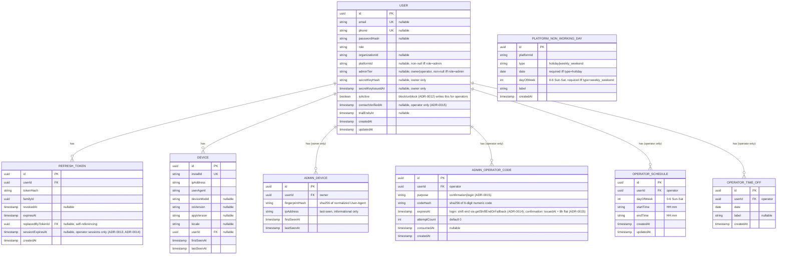

Notes:

- `User.organizationId` is nullable at the schema level per ADR-0001, but required as
  input on the public `POST /auth/register` endpoint. The only rows with a null
  `organizationId` are the platform's out-of-band-provisioned `Admin` accounts, which are
  never created through that endpoint.
- `User.platformId` (per ADR-0009) is a new, orthogonal scoping claim, opaque to
  `auth-service` exactly like `organizationId` — each consuming app decides what a
  "platform" means to it. It is deliberately independent of `organizationId`: an Admin's
  `organizationId` stays always-null (unchanged from ADR-0001), and a non-admin's
  `platformId` stays always-null. Enforced at the provisioning/registration layer, not a
  database constraint: every `role: "admin"` row must have a non-null `platformId`; every
  other row keeps it null. ADR-0009 neither amends nor supersedes ADR-0001 — both scoping
  claims coexist.
- `User.adminTier` (per ADR-0009) is `null` for every non-admin row, and required
  (`"owner"` or `"operator"`) for every `role: "admin"` row. It is what distinguishes a
  platform's top-level administrator from a delegated operator now that both share the
  single `role: "admin"` value; enforced the same way as `platformId`, at the
  provisioning/registration layer.
- `User.email` and `User.passwordHash` are now **nullable** (per ADR-0009): an operator
  registered by phone only (per ADR-0011) has no email, and operators never receive a
  password at all — they authenticate via the time-boxed login code described below instead.
  Exactly one of `{email, phone}` is required when an owner creates an operator, enforced at
  the operator-creation endpoint (`POST /auth/admin/operators`, per ADR-0011), not the
  schema.
- `User.phone` is new (per ADR-0009), unique when present, nullable otherwise.
- `User.secretKeyHash`/`User.secretKeyIssuedAt` (per ADR-0010) exist only for owners — one
  active key per owner, no history table in v1. **`secretKeyHash: null` is a legitimate,
  expected owner state, not an error case** (per ADR-0016): a freshly bootstrapped owner (see
  ADR-0016) has no secret key at all until their first `POST /auth/admin/secret-key/rotate`
  call — see "API contract" below for the defense-in-depth `AND secretKeyHash IS NOT NULL`
  predicate this adds to the secret-key login lookup. **Hashed with SHA-256, not bcrypt:** a
  secret key is a high-entropy, server-generated value, not a low-entropy, human-chosen
  password, so it doesn't need bcrypt's deliberate slowness to resist brute force — the same
  reasoning applies to ADR-0002's refresh tokens, which are likewise persisted only as a hash
  rather than a bcrypt digest, though ADR-0002 itself doesn't name a specific algorithm or
  spell out this entropy-based rationale (ADR-0010 states it explicitly). Rotation overwrites
  both fields atomically, instantly invalidating the old key. As of ADR-0017, a second, in-band
  creation path (`POST /auth/admin/owners`) lands a new owner in this exact same
  `secretKeyHash: null` state — not a new state this ADR introduces, only a second creation
  path that also reaches it — and a CLI-only `BOOTSTRAP_OWNER_FORCE_RESET` mode on
  `bootstrap-owner.ts` can overwrite an existing owner's `passwordHash` for credential-loss
  recovery while deliberately leaving `secretKeyHash`/`secretKeyIssuedAt` untouched (see Open
  questions below).
- `User.trialEndsAt` is stamped at registration time for every self-registered user
  (every self-registration now goes through the org/license-gated path — there is no
  separate "direct" mode), using a global config default trial length for v1.
- `User.isActive` is no longer just schema-only groundwork: as of ADR-0012, the new
  `POST /auth/admin/operators/:id/block` / `.../unblock` endpoints are the first to actually
  write it (`false`/`true` respectively). As of ADR-0017,
  `POST /auth/admin/owners/:id/deactivate` / `.../activate` write the same column for owners —
  deactivation is additionally gated by the "last owner" invariant (see API contract below),
  which has no operator-side equivalent. It remains generically named and generically checked
  at login/refresh (see Error handling & edge cases) — nothing about it is
  operator-or-owner-specific at the schema level, only the endpoints that write it currently
  are.
- `User.contactVerifiedAt` is new (per ADR-0015) — meaningful only for operators, always
  `null` for owners and non-admin users. Null until an operator successfully redeems a
  `purpose: 'confirmation'` code via `POST /auth/admin/operators/confirm`; never reset once
  set. `POST /auth/admin/login/operator/request-code` and `.../verify-code` both additionally
  require this to be non-null (see API contract below) — an operator cannot obtain or use an
  ordinary login code until they've confirmed.
- `RefreshToken.tokenHash` is the only representation of the refresh token ever
  persisted — the raw token itself is never stored (per ADR-0002).
- `RefreshToken.sessionExpiresAt` is new (per ADR-0013). **Null for every refresh token
  issued by any path other than operator verify-code** — registration, password login, and
  secret-key login are all unaffected, a purely additive column with zero behavior change for
  them. Set exactly once, at a successful `OperatorCodeService.verifyCode()`, to
  `OperatorAvailabilityService.getShiftEndOrFallback(operator.id, now)` — the operator's own
  scheduled shift end for the day, falling back to `now + 8h` only if the operator has no
  configured `OperatorSchedule` (per ADR-0014, superseding ADR-0013's original flat
  `now + 8h` formula) — and copied forward **unchanged** on every subsequent rotation within
  that token family — never recomputed from "now" — so it is a fixed ceiling anchored to the
  original login moment, not a sliding window. Deliberately a separate column from
  `RefreshToken.expiresAt` (per ADR-0002), which means something different: that one token's
  own short validity before it must be rotated, not the whole session's lifetime. Per
  ADR-0014, this value is computed **independently** of, not reused from,
  `AdminOperatorCode.expiresAt` — see the API contract and flow (l) below for why recomputing
  is both safe and the better design choice.
- `Device` is new (see the ADD's "Design rationale: device/network fingerprinting").
  `ipAddress` and `userAgent` are always server-observed from the incoming request, never
  client-supplied. A device starts unlinked (`userId = null`) and is linked once its
  owner registers or logs in from it.
- **No real MAC address or other hardware-level device identifier field exists on
  `Device`.** This is a deliberate omission, not an oversight: real MAC addresses are not
  obtainable from apps on modern mobile platforms or browsers (blocked since roughly
  2016), so no such field could ever be populated meaningfully — see the ADD's "Design
  rationale: device/network fingerprinting".
- `AdminDevice` is new (per ADR-0010), deliberately **not** a reuse of `Device`: `Device` is
  keyed by a client-generated `installId` from an app's first-launch flow and starts
  unlinked to any user, neither of which applies to a secret-key login (no app/install
  context, and an admin-security record is meaningless unlinked — it must always be tied to
  a specific owner from creation). `fingerprintHash` is a SHA-256 hash of the normalized
  User-Agent header only — `ipAddress` is deliberately **excluded** from the identity hash
  (`UNIQUE(userId, fingerprintHash)` does not include it) and is carried only as last-seen
  context. This is an accepted weak-fingerprint tradeoff, not a gap to silently fix later: an
  owner on a mobile/dynamic IP would otherwise trigger a false "new device" alert on every IP
  change, drowning the one signal that actually matters.
- `AdminOperatorCode` is new (per ADR-0011). Requesting a new code **deletes** any previous
  unconsumed row for the **same operator and same `purpose`** (per ADR-0015 — see below)
  before inserting the new one (not a status flag — there
  is no history table in v1, and `consumedAt` is reserved exclusively for "this code was
  actually verified," so overloading it to also mean "superseded by a newer request" would
  make it ambiguous which case a non-null `consumedAt` represents). Only the most recently
  issued code for a given `(userId, purpose)` is ever valid. `attemptCount` reaching 5
  permanently invalidates the code even
  against a subsequently correct guess, forcing a fresh request — a necessary companion
  control given a 6-digit code is low-entropy relative to its validity window.
- `AdminOperatorCode.purpose` is new (per ADR-0015): `"confirmation" | "login"`, required on
  every row. All of ADR-0011's matching/lockout logic (hash comparison in application code,
  `attemptCount < 5`, permanent invalidation at 5 attempts, no-row-found not incrementing
  `attemptCount`, "requesting a new code deletes the previous unconsumed row") is fully
  reused for both purposes, deliberately — only scoped one dimension finer, by
  `(userId, purpose)` instead of just `userId`, so a fresh confirmation code never
  invalidates a live login code and vice versa. `expiresAt`'s computation differs by
  `purpose`, not by mechanism: `purpose: 'login'` rows use
  `OperatorAvailabilityService.getShiftEndOrFallback` (per ADR-0014); `purpose: 'confirmation'`
  rows use a flat `now + 8h` unconditionally, since confirmation codes are issued at
  owner-driven registration time, outside the `isOperatorAvailable` gate a shift end could be
  anchored to (per ADR-0015).
- `PlatformNonWorkingDay` is new (per ADR-0011) — a deliberately minimal, generic business-day
  model with no calendar-library dependency and no hardcoded weekend convention, so
  `auth-service` stays culture/region-agnostic exactly like it stays app-agnostic for
  `organizationId`/`platformId`. It has no foreign key to `User`; it is scoped only by the
  opaque `platformId` string, the same way `organizationId` scopes other data. A platform
  with zero configured rows is fail-open — every day counts as a working day — so an owner
  who hasn't configured a calendar doesn't silently lock their operators out by default.
- `OperatorSchedule` is new (per ADR-0012) — one contiguous `[startTime, endTime)` window per
  working day for a given operator, `UNIQUE(userId, dayOfWeek)`. No split or overnight
  (wrap-past-midnight) shifts in v1 — the same deliberate minimalism ADR-0011 already applied
  to `PlatformNonWorkingDay`. Zero rows for an operator is **fail-open** (available every
  day/hour), the identical fail-open philosophy ADR-0011 established for
  `PlatformNonWorkingDay`; replacing an operator's schedule with `{days: []}` via
  `PUT /auth/admin/operators/:id/schedule` is the documented way to deliberately revert to
  this state.
- `OperatorTimeOff` is new (per ADR-0012) — per-operator individual holiday/time-off dates,
  `UNIQUE(userId, date)`, distinct from the platform-wide `PlatformNonWorkingDay` calendar.
- `OperatorAvailabilityService.isOperatorAvailable` composes both of the above with the
  existing `PlatformCalendarService.isWorkingDay` (platform baseline always wins first),
  and is what `OperatorCodeService.requestCode` now calls instead of calling
  `isWorkingDay` directly (per ADR-0012) — see API contract and flows below.
- `OperatorAvailabilityService.getShiftEndOrFallback(operatorUserId, now)` is new (per
  ADR-0014), on the same service: loads the operator's `OperatorSchedule` rows; zero rows →
  fail-open fallback, `now + 8h`; otherwise, today's row's `endTime` combined with today's
  date. Documented invariant: only ever called immediately after `isOperatorAvailable` has
  already returned `true` for the same `now`, so if any schedule rows exist, today's row is
  guaranteed to exist. `OperatorCodeService` calls this independently at both `requestCode()`
  (for `AdminOperatorCode.expiresAt`) and `verifyCode()` (for `RefreshToken.sessionExpiresAt`)
  — never threading one call's result into the other (see API contract and flow (l) below).
- Open naming question, flagged here rather than resolved: whether to add any generic
  profile field (e.g. `displayName`) to `User`. Recommendation for v1 is to keep
  `auth-service` strictly to identity + credentials and leave profile data to consuming
  apps, but this hasn't been formally decided.
- Password hashing: bcrypt, with the cost factor tuned for roughly 250ms per hash (an
  implementation parameter, not significant enough to warrant its own ADR — see the ADD's
  non-functional constraints).
- No individual-subscription entity exists in this schema, deliberately: per ADR-0006, that
  data is owned entirely by `payment-service`. `auth-service` only ever reads a subscription's
  current status at login/refresh time (see API contract below); it never stores one.

## Key interfaces / classes

```mermaid
classDiagram
    class AuthController {
      +register(dto: RegisterDto) AuthTokensResponse
      +login(dto: LoginDto) AuthTokensResponse
      +refresh(dto: RefreshTokenDto) AuthTokensResponse
      +logout(dto: RefreshTokenDto, user: JwtPayload) void
      +me(user: JwtPayload) UserResponseDto
    }
    class AuthService {
      -usersService: UsersService
      -tokenService: TokenService
      -refreshTokenService: RefreshTokenService
      -organizationValidationService: OrganizationValidationService
      -deviceService: DeviceService
      +register(dto: RegisterDto) AuthTokensResponse
      +validateCredentials(email, password) User
      +login(user: User) AuthTokensResponse
      +refresh(rawToken: string) AuthTokensResponse
      +logout(rawToken: string) void
    }
    class UsersService {
      -usersRepository: Repository~User~
      +create(email?, phone?, passwordHash?, role, organizationId?, platformId?, adminTier?, trialEndsAt?) User
      +findByEmail(email) User
      +findById(id) User
      +findByEmailOrPhone(email?, phone?, adminTier?, isActive?, contactVerifiedAt?) User
    }
    class TokenService {
      +signAccessToken(payload: JwtPayload, sessionExpiresAt?: Date) string
      +verifyAccessToken(token: string) JwtPayload
    }
    class RefreshTokenService {
      -refreshTokenRepository: Repository~RefreshToken~
      +issue(userId, familyId?, sessionExpiresAt?: Date) RawAndStoredToken
      +rotate(rawToken: string) RawAndStoredToken
      +revoke(rawToken: string) void
      +revokeFamily(familyId: string) void
      +revokeAllForUser(userId: string) void
      -hash(rawToken: string) string
    }
    class JwtStrategy {
      +validate(payload: JwtPayload) JwtPayload
    }
    class RolesGuard {
      +canActivate(context) boolean
    }
    class OrganizationsController {
      +validate(dto: ValidateOrganizationDto) OrganizationValidationResponse
    }
    class OrganizationValidationService {
      -paymentServiceClient: PaymentServiceClient
      +checkLicense(organizationId) LicenseStatus
      +checkSubscription(userId) SubscriptionStatus
    }
    class PaymentServiceClient {
      +getLicenseStatus(organizationId) LicenseStatus
      +getSubscriptionStatus(userId) SubscriptionStatus
    }
    class LicenseStatus {
      +valid: boolean
      +expiresAt: Date?
    }
    class SubscriptionStatus {
      +exists: boolean
      +valid: boolean
      +expiresAt: Date?
    }
    class DevicesController {
      +register(dto: DeviceFingerprintDto, req: Request) void
    }
    class DeviceService {
      -deviceRepository: Repository~Device~
      +upsert(fingerprint: DeviceFingerprintDto, ip: string, userAgent: string, userId?: string) Device
      +linkToUser(installId: string, userId: string) void
    }
    class User {
      +id: string
      +email: string?
      +phone: string?
      +passwordHash: string?
      +role: string
      +organizationId: string?
      +platformId: string?
      +adminTier: string?
      +secretKeyHash: string?
      +secretKeyIssuedAt: Date?
      +isActive: boolean
      +contactVerifiedAt: Date?
      +trialEndsAt: Date?
      +createdAt: Date
      +updatedAt: Date
    }
    class RefreshToken {
      +id: string
      +userId: string
      +tokenHash: string
      +familyId: string
      +revokedAt: Date?
      +expiresAt: Date
      +replacedByTokenId: string?
      +sessionExpiresAt: Date?
      +createdAt: Date
    }
    class Device {
      +id: string
      +installId: string
      +ipAddress: string
      +userAgent: string
      +deviceModel: string?
      +osVersion: string?
      +appVersion: string?
      +locale: string?
      +userId: string?
      +firstSeenAt: Date
      +lastSeenAt: Date
    }
    class RegisterDto {
      +email: string
      +password: string
      +role: string
      +organizationId: string
      +deviceFingerprint: DeviceFingerprintDto?
    }
    class LoginDto { +email: string +password: string }
    class RefreshTokenDto { +refreshToken: string }
    class ValidateOrganizationDto { +organizationId: string }
    class DeviceFingerprintDto {
      +installId: string
      +deviceModel: string?
      +osVersion: string?
      +appVersion: string?
      +locale: string?
    }
    class JwtPayload {
      +sub: string
      +role: string
      +organizationId: string?
      +platformId: string?
      +adminTier: string?
      +iat: number
      +exp: number
    }
    class AdminAuthController {
      +secretKeyLogin(dto: SecretKeyLoginDto) AuthTokensResponse
      +rotateSecretKey(user: JwtPayload) SecretKeyRotationResponse
      +registerOperator(dto: RegisterOperatorDto, user: JwtPayload) OperatorResponseDto
      +confirmOperatorContact(dto: ConfirmOperatorContactDto) void
      +requestOperatorCode(dto: RequestOperatorCodeDto) void
      +verifyOperatorCode(dto: VerifyOperatorCodeDto) AuthTokensResponse
      +createNonWorkingDay(dto: PlatformNonWorkingDayDto, user: JwtPayload) PlatformNonWorkingDay
      +listNonWorkingDays(user: JwtPayload) PlatformNonWorkingDay[]
      +deleteNonWorkingDay(id: string, user: JwtPayload) void
    }
    class SecretKeyService {
      -usersRepository: Repository~User~
      -adminDeviceService: AdminDeviceService
      +login(secretKey: string, ip: string, userAgent: string) AuthTokensResponse
      +rotate(ownerId: string) SecretKeyRotationResponse
      -hash(rawKey: string) string
    }
    class AdminDeviceService {
      -adminDeviceRepository: Repository~AdminDevice~
      +checkAndRecord(userId: string, userAgent: string, ip: string) NewDeviceCheckResult
      -hashFingerprint(userAgent: string) string
    }
    class OperatorCodeService {
      -usersRepository: Repository~User~
      -operatorCodeRepository: Repository~AdminOperatorCode~
      -operatorAvailabilityService: OperatorAvailabilityService
      +requestCode(email?, phone?) void
      +verifyCode(email?, phone?, code: string) AuthTokensResponse
      +sendConfirmationCode(operator: User) void
      +confirmContact(email?, phone?, code: string) void
      -generateCode() string
      -hash(rawCode: string) string
    }
    class PlatformCalendarService {
      -nonWorkingDayRepository: Repository~PlatformNonWorkingDay~
      +isWorkingDay(platformId: string, date: Date) boolean
      +create(dto: PlatformNonWorkingDayDto, platformId: string) PlatformNonWorkingDay
      +list(platformId: string) PlatformNonWorkingDay[]
      +delete(id: string, platformId: string) void
    }
    class AdminTierGuard {
      +canActivate(context) boolean
    }
    class AdminOperatorController {
      +list(user: JwtPayload) OperatorResponseDto[]
      +getOne(id: string, user: JwtPayload) OperatorResponseDto
      +updateContact(id: string, dto: UpdateOperatorContactDto, user: JwtPayload) OperatorResponseDto
      +block(id: string, user: JwtPayload) void
      +unblock(id: string, user: JwtPayload) void
      +replaceSchedule(id: string, dto: ReplaceOperatorScheduleDto, user: JwtPayload) OperatorSchedule[]
      +getSchedule(id: string, user: JwtPayload) OperatorSchedule[]
      +createTimeOff(id: string, dto: CreateOperatorTimeOffDto, user: JwtPayload) OperatorTimeOff
      +listTimeOff(id: string, user: JwtPayload) OperatorTimeOff[]
      +deleteTimeOff(id: string, timeOffId: string, user: JwtPayload) void
    }
    class OperatorManagementService {
      -usersRepository: Repository~User~
      -operatorCodeRepository: Repository~AdminOperatorCode~
      -refreshTokenService: RefreshTokenService
      +list(platformId: string) User[]
      +findOneOrNotFound(id: string, platformId: string) User
      +updateContact(id: string, platformId: string, email?, phone?) User
      +block(id: string, platformId: string, ownerId: string) void
      +unblock(id: string, platformId: string, ownerId: string) void
    }
    class OperatorScheduleService {
      -scheduleRepository: Repository~OperatorSchedule~
      -timeOffRepository: Repository~OperatorTimeOff~
      +replaceSchedule(userId: string, days: ScheduleDayDto[]) OperatorSchedule[]
      +getSchedule(userId: string) OperatorSchedule[]
      +createTimeOff(userId: string, date: string, label?: string) OperatorTimeOff
      +listTimeOff(userId: string) OperatorTimeOff[]
      +deleteTimeOff(userId: string, timeOffId: string) void
    }
    class OperatorAvailabilityService {
      -platformCalendarService: PlatformCalendarService
      -scheduleRepository: Repository~OperatorSchedule~
      -timeOffRepository: Repository~OperatorTimeOff~
      +isOperatorAvailable(operatorUserId: string, now: Date) boolean
      +getShiftEndOrFallback(operatorUserId: string, now: Date) Date
    }
    class AdminDevice {
      +id: string
      +userId: string
      +fingerprintHash: string
      +ipAddress: string
      +firstSeenAt: Date
      +lastSeenAt: Date
    }
    class AdminOperatorCode {
      +id: string
      +userId: string
      +purpose: string
      +codeHash: string
      +expiresAt: Date
      +attemptCount: number
      +consumedAt: Date?
      +createdAt: Date
    }
    class PlatformNonWorkingDay {
      +id: string
      +platformId: string
      +type: string
      +date: Date?
      +dayOfWeek: number?
      +label: string
      +createdAt: Date
    }
    class OperatorSchedule {
      +id: string
      +userId: string
      +dayOfWeek: number
      +startTime: string
      +endTime: string
      +createdAt: Date
      +updatedAt: Date
    }
    class OperatorTimeOff {
      +id: string
      +userId: string
      +date: Date
      +label: string?
      +createdAt: Date
    }
    class SecretKeyLoginDto { +secretKey: string }
    class RegisterOperatorDto { +email: string? +phone: string? }
    class ConfirmOperatorContactDto { +email: string? +phone: string? +code: string }
    class RequestOperatorCodeDto { +email: string? +phone: string? }
    class VerifyOperatorCodeDto { +email: string? +phone: string? +code: string }
    class PlatformNonWorkingDayDto {
      +type: string
      +date: string?
      +dayOfWeek: number?
      +label: string?
    }
    class UpdateOperatorContactDto { +email: string? +phone: string? }
    class ScheduleDayDto { +dayOfWeek: number +startTime: string +endTime: string }
    class ReplaceOperatorScheduleDto { +days: ScheduleDayDto[] }
    class CreateOperatorTimeOffDto { +date: string +label: string? }
    AuthController --> AuthService
    AuthService --> UsersService
    AuthService --> TokenService
    AuthService --> RefreshTokenService
    AuthService --> OrganizationValidationService
    AuthService --> DeviceService
    OrganizationsController --> OrganizationValidationService
    OrganizationValidationService --> PaymentServiceClient
    PaymentServiceClient ..> LicenseStatus
    PaymentServiceClient ..> SubscriptionStatus
    DevicesController --> DeviceService
    DeviceService --> Device
    UsersService --> User
    RefreshTokenService --> RefreshToken
    RefreshToken --> User : belongs to
    Device --> User : linked to
    AuthController ..> RegisterDto
    AuthController ..> LoginDto
    AuthController ..> RefreshTokenDto
    OrganizationsController ..> ValidateOrganizationDto
    DevicesController ..> DeviceFingerprintDto
    RegisterDto ..> DeviceFingerprintDto
    TokenService ..> JwtPayload
    JwtStrategy ..> JwtPayload
    RolesGuard ..> JwtPayload
    AdminAuthController --> SecretKeyService
    AdminAuthController --> OperatorCodeService
    AdminAuthController --> PlatformCalendarService
    AdminAuthController --> AdminTierGuard
    AdminAuthController --> UsersService
    SecretKeyService --> UsersService
    SecretKeyService --> AdminDeviceService
    SecretKeyService --> TokenService
    SecretKeyService --> RefreshTokenService
    AdminDeviceService --> AdminDevice
    OperatorCodeService --> UsersService
    OperatorCodeService --> OperatorAvailabilityService
    OperatorCodeService --> TokenService
    OperatorCodeService --> RefreshTokenService
    OperatorCodeService --> AdminOperatorCode
    PlatformCalendarService --> PlatformNonWorkingDay
    AdminDevice --> User : belongs to
    AdminOperatorCode --> User : belongs to
    AdminAuthController ..> SecretKeyLoginDto
    AdminAuthController ..> RegisterOperatorDto
    AdminAuthController ..> ConfirmOperatorContactDto
    AdminAuthController ..> RequestOperatorCodeDto
    AdminAuthController ..> VerifyOperatorCodeDto
    AdminAuthController ..> PlatformNonWorkingDayDto
    AdminTierGuard ..> JwtPayload
    AdminOperatorController --> OperatorManagementService
    AdminOperatorController --> OperatorScheduleService
    AdminOperatorController --> AdminTierGuard
    OperatorManagementService --> UsersService
    OperatorManagementService --> RefreshTokenService
    OperatorScheduleService --> OperatorAvailabilityService
    OperatorAvailabilityService --> PlatformCalendarService
    OperatorScheduleService --> OperatorSchedule
    OperatorScheduleService --> OperatorTimeOff
    OperatorAvailabilityService --> OperatorSchedule
    OperatorAvailabilityService --> OperatorTimeOff
    OperatorSchedule --> User : belongs to
    OperatorTimeOff --> User : belongs to
    AdminOperatorController ..> UpdateOperatorContactDto
    AdminOperatorController ..> ReplaceOperatorScheduleDto
    AdminOperatorController ..> CreateOperatorTimeOffDto
    ReplaceOperatorScheduleDto ..> ScheduleDayDto
```

Module boundaries: `AuthModule` (`AuthController`/`AuthService`) is the entry point for
credential-based flows (register/login/refresh/logout/me). `UsersModule`
(`UsersService`/`User` entity) owns user persistence and has no controller of its own.
Token handling is deliberately split in two: `TokenService` is a pure, stateless JWT
signer/verifier with no database access, while `RefreshTokenService` is the DB-backed
component owning issuance, rotation, and reuse-detection of refresh tokens (per
ADR-0002) — this split keeps access-token verification usable by any future
service/gateway without a database dependency, while confining all stateful
rotation/revocation bookkeeping to one place. `TokenService.signAccessToken`'s
`sessionExpiresAt` parameter (per ADR-0013) is **not** a raw override — when present,
`TokenService` computes `exp = min(now + <normal TTL>, sessionExpiresAt)` internally on every
call, rather than assigning the passed value directly. This matters concretely: the same fixed
`sessionExpiresAt` ceiling — per ADR-0014, the operator's own scheduled shift end for the day,
or `now + 8h` only if unscheduled — is passed on every rotation throughout an operator's
whole session, not just the final one, so a literal "use this value as `exp`" reading would give
every operator access token — not just the last — a session-length lifetime, silently
defeating ADR-0002's short-lived-access-token model for that token class. `OrganizationsModule`
(`OrganizationsController`/`OrganizationValidationService`/`PaymentServiceClient`) is the
only module with an outbound network dependency on another service, implementing the
license-check contract from ADR-0004 and, per ADR-0005, the subscription-check contract from
ADR-0006 — both are now also called from `AuthService.login`/`AuthService.refresh`, not just
from registration. `DevicesModule` (`DevicesController`/
`DeviceService`/`Device` entity) is an independent entry point that fires
before any user exists — it has no dependency on `AuthModule`, and `AuthModule` depends
on it (not the other way around) only for the registration-time `deviceFingerprint`
fallback. `JwtStrategy` and `RolesGuard` are cross-cutting: they authorize incoming
requests to protected routes regardless of which module owns the route.

`AdminModule` (`AdminAuthController`/`SecretKeyService`/`OperatorCodeService`/
`AdminDeviceService`/`PlatformCalendarService`/`AdminTierGuard`, per ADR-0009/ADR-0010/
ADR-0011) is a new, independent entry point for everything specific to platform-scoped Admin
accounts. It depends on `UsersModule` (creating and reading `User` rows) and on token
handling (`TokenService`/`RefreshTokenService`, to issue the same access/refresh token pairs
`AuthModule` does), but has no dependency on, and is not depended on by, `AuthModule`
itself — an owner or operator authenticating through `AdminModule`'s new flows never touches
`POST /auth/login`'s email+password path (an owner can still use that path directly, as the
secret-key recovery mechanism per ADR-0010, but that's a call to the existing `AuthModule`,
not a dependency between modules). `SecretKeyService` owns issuing/verifying/rotating an
owner's secret key and delegates new-device detection to `AdminDeviceService`, which owns
`AdminDevice` persistence. `OperatorCodeService` owns issuing/verifying an operator's
time-boxed code and, as of ADR-0012, delegates the availability check to the new
`OperatorAvailabilityService` (no longer calling `PlatformCalendarService` directly), which
internally still incorporates `PlatformCalendarService.isWorkingDay` as its platform-wide
baseline. As of ADR-0015, `OperatorCodeService` also owns issuing and verifying an operator's
separate, purpose-scoped confirmation code (`sendConfirmationCode`/`confirmContact`), reusing
the same matching/lockout logic as its existing login-code methods; as of ADR-0014, both the
login code's `expiresAt` and the resulting session's `sessionExpiresAt` are computed via
`OperatorAvailabilityService.getShiftEndOrFallback`, called independently at each site, rather
than via a flat duration. `PlatformCalendarService` itself is unchanged, still owning `PlatformNonWorkingDay`
persistence and still called directly by `AdminAuthController` for the calendar-management
endpoints. `AdminTierGuard` is cross-cutting like `RolesGuard`, authorizing owner-only routes
off the `adminTier` JWT claim with no database round-trip.

`AdminOperatorController` (per ADR-0012) is a new controller, a sibling to
`AdminAuthController` inside the same `AdminModule` — not a new module, since it shares the
same dependencies (`UsersModule`, token handling) and the same `AdminTierGuard`
authorization. `OperatorManagementService` owns operator profile reads/updates and the
block/unblock actions: it writes `User.isActive`, deletes any unconsumed `AdminOperatorCode`
on block, and calls the new `RefreshTokenService.revokeAllForUser` to end that operator's
sessions. `OperatorScheduleService` owns `OperatorSchedule`/`OperatorTimeOff` persistence and
the full-replace/time-off endpoints. `OperatorAvailabilityService` is shared by both
`OperatorCodeService` (the login-time check) and `OperatorScheduleService`'s own read paths —
it is the single place that composes the platform calendar, per-operator time off, and
per-operator schedule into one availability answer, per ADR-0012, and, as of ADR-0014, also
the single place that derives a concrete shift-end timestamp
(`getShiftEndOrFallback`) from the same `OperatorSchedule` data. `RefreshTokenService` and
`TokenService` (per ADR-0013) gain the session-ceiling logic described in the API contract
and flows below; both changes are additive and inert for every non-operator caller.

## API contract

- **`POST /auth/devices/register`** — body `{installId, deviceModel?, osVersion?,
  appVersion?, locale?}`. `ipAddress`/`userAgent` are read server-side from the request,
  never client-supplied. → `204` always (fire-and-forget from the client's perspective;
  upserts a `Device` row keyed by `installId`, unlinked to any user yet). Called
  proactively at first app launch, best-effort — never blocks app usage.

- **`POST /auth/organizations/validate`** — body `{organizationId}`.
  - Valid, non-expired license (verified via `payment-service`) → `200 {allowed: true,
    trialEndsAt}` (an informational preview of what registering now would grant).
  - Invalid, not-found, or expired → `403 {allowed: false, message: "Your organization
    does not have a valid license. Please contact your organization."}` — the exact same
    status and message for both "not found" and "expired," deliberately, to avoid
    confirming which organization ids exist.
  - `payment-service` unreachable or times out → `503` (fail closed, per ADR-0004).

- **`POST /auth/register`** — body `{email, password, role, organizationId,
  deviceFingerprint?}`.
  - `organizationId` is **required**; missing → `400`, a standard validation error,
    distinct from the license-related `403` below.
  - The endpoint independently re-validates license status server-side — it never trusts
    a prior `/auth/organizations/validate` call (closing the TOCTOU gap per ADR-0004) —
    and, on success, stamps `trialEndsAt = now + <configured trial days>` on the new user.
  - `deviceFingerprint`, if present, is the registration-time fallback path (see the
    ADD's "Design rationale: device/network fingerprinting"), used only if the
    client's earlier `/auth/devices/register` call didn't succeed. `AuthService` upserts/
    links the `Device` record the same way (via `DeviceService`) regardless of which path
    delivered it.
  - Responses: `201 {accessToken, refreshToken, expiresIn}` on success; `400` if
    `organizationId` is missing or other validation fails; `409` on duplicate email;
    `403` with the same "contact your organization" message if `organizationId` doesn't
    resolve to a valid-license organization; `503` if `payment-service` is unreachable
    during the check.

- **`POST /auth/login`** — body `{email, password}`.
  - `401` on any credential failure, identical generic message whether the email doesn't
    exist or the password is wrong (checked before the calls below, so a wrong password
    never reveals anything about license/subscription state).
  - If the authenticated user's `organizationId` is **`null`** (per ADR-0016) — true for
    every platform-scoped Admin, owner or operator, including one created by ADR-0016's
    bootstrap command — both the license check and the subscription check are treated as
    "not applicable" and skipped entirely; the flow proceeds straight to issuing tokens. This
    mirrors how ADR-0006 already treats "no `UserSubscription` row exists" as non-blocking:
    a check that has no organization to check against is not a check that fails, it's a check
    that doesn't apply. Without this, a bootstrapped owner (`organizationId: null` by
    construction) could never successfully log in at all.
  - Otherwise (non-null `organizationId`), re-checks license and subscription status (per
    ADR-0005) before issuing tokens: `403` with the same "contact your organization" message
    as registration/validate if the user's `organizationId` doesn't resolve to a
    valid-license organization; a distinct `403 {reason: "subscription_invalid", message:
    "Your subscription has expired. Please renew to continue."}` if a `UserSubscription`
    exists for this user (per ADR-0006) and its status isn't `active`; `503` if
    `payment-service` is unreachable during either check.
  - `200 {accessToken, refreshToken, expiresIn}` on success.

- **`POST /auth/refresh`** — body `{refreshToken}`.
  - For an **operator-issued** token (`sessionExpiresAt` non-null): if `now >=
    sessionExpiresAt`, checked **before** the existing revoked/reuse check below, the token
    family is revoked (a clean session-end, not a theft signal) and the endpoint returns
    `401 {reason: "session_ceiling_reached", message: "Your session has ended. Please
    request a new login code to continue."}` (per ADR-0013; the reworded message drops the
    old flat "8-hour" wording now that the ceiling tracks the operator's own shift, per
    ADR-0014). This ordering matters: running
    it after the reuse-detection check would misclassify an expected session end as a
    reused/stolen token on any retry.
  - `401` if the refresh token itself is not found, expired, or already-rotated (reused) —
    checked before the license/subscription calls below, and after the ceiling check above.
  - If the token's owning user has `organizationId: null` (per ADR-0016 — every
    platform-scoped Admin, owner or operator) the license/subscription checks below are
    skipped as "not applicable," identically to `login` above, and the flow proceeds straight
    to rotation.
  - Otherwise, on a valid, not-yet-rotated refresh token, re-checks license and subscription
    status the same way `login` does (per ADR-0005): same `403` (org license) / `403`
    (subscription) / `503` (`payment-service` unreachable) outcomes as `login`, in place of
    rotating the token.
  - `200 {accessToken, refreshToken, expiresIn}` new token pair on success. For an
    operator-issued token, the new refresh token carries `sessionExpiresAt` copied forward
    unchanged from the old one (per ADR-0013), and the new access token's `exp` is
    `min(now + <normal TTL>, sessionExpiresAt)` — on the final rotation before the ceiling,
    `exp` equals the ceiling itself, giving the client everything it needs to show a
    "session ending soon" warning without any new backend field.

- **`POST /auth/logout`** — body `{refreshToken}`, requires a valid `Authorization:
  Bearer` access token → `204` on success; revokes only that specific refresh token
  (family-wide "logout everywhere" is out of v1 — see Open questions).

- **`GET /auth/me`** — requires `Authorization: Bearer` → `200 {id, email, phone, role,
  organizationId, platformId, adminTier, isActive, contactVerifiedAt, trialEndsAt,
  createdAt}`. `phone`, `platformId`, `adminTier`, and `contactVerifiedAt` were added to this
  contract as a living-doc correction — these fields have existed on `User` since ADR-0009
  (`phone`, `platformId`, `adminTier`) and ADR-0015 (`contactVerifiedAt`), but were never
  reflected in this endpoint's response shape until now. All four are `null` for a non-admin
  end user, exactly as they are on the `User` entity itself.

- **`POST /auth/admin/login/secret-key`** (per ADR-0010, updated by ADR-0016) — no auth
  required. Body `{secretKey}`. Looked up as `WHERE secretKeyHash = hash(input) AND adminTier
  = 'owner' AND secretKeyHash IS NOT NULL` — the `secretKeyHash IS NOT NULL` predicate is new
  per ADR-0016, defense-in-depth against a null/empty input somehow hashing to a value that
  matches a null/empty stored column; it also documents explicitly that `secretKeyHash: null`
  is a real, reachable owner state (a freshly bootstrapped owner who hasn't rotated yet, per
  ADR-0016), not something this lookup can assume away. `platformId` is derived from the
  matched row, never supplied by the caller. On match, hashes
  the normalized User-Agent and checks `AdminDevice` for that owner — an unrecognized
  fingerprint inserts a new `AdminDevice` row and publishes
  `admin.secret_key_login_from_new_device`, but never blocks the login. `200 {accessToken,
  refreshToken, expiresIn}` on match; generic `401` otherwise.

- **`POST /auth/admin/secret-key/rotate`** (per ADR-0010) — Bearer, `adminTier: owner` only
  (`AdminTierGuard`). No body. Overwrites `secretKeyHash`/`secretKeyIssuedAt` atomically,
  instantly invalidating the old key, and publishes `admin.secret_key_rotated`. Returns the
  new raw key exactly once: `200 {secretKey, issuedAt}` — never retrievable again afterward.

- **`POST /auth/admin/operators`** (per ADR-0011, updated by ADR-0015) — Bearer,
  `adminTier: owner` only (`AdminTierGuard`). Body `{email?, phone?}` — exactly one required,
  `400` otherwise; `409` on duplicate. `platformId` is taken from the **caller's own** JWT
  claim, never accepted in the body (the same defense-in-depth pattern ADR-0007 uses for
  `organizationId` on `POST /payment/charges/cash`). Creates a `User` row with
  `role: 'admin'`, `adminTier: 'operator'`, `email`/`phone` as given, `passwordHash: null`,
  `contactVerifiedAt: null`. Publishes `admin.operator_registered`. Also generates and sends a
  `purpose: 'confirmation'` `AdminOperatorCode` (flat `now + 8h` expiry, unconditionally — see
  ADR-0015), publishing `admin.operator_confirmation_code_issued`. `201 {id, email?, phone?,
  platformId, adminTier}` on success.

- **`POST /auth/admin/operators/confirm`** (new, per ADR-0015) — public, no auth required
  (the operator has no session yet). Body `{email?, phone?, code}` — `400` if neither/both of
  `email`/`phone`, or `code` missing.
  - Not found (no `User` with `adminTier = 'operator' AND isActive = true` matching the
    identifier) → generic `401`.
  - `contactVerifiedAt` already non-null → idempotent no-op, `204`, **without validating
    `code` at all** — an already-confirmed operator retrying this call is always harmless,
    regardless of what they submit.
  - Otherwise, validates `code` against the operator's live `purpose: 'confirmation'` row
    using the exact same matching/lockout logic `verify-code` uses (hash comparison in
    application code, `attemptCount` increment on a wrong guess, permanent invalidation at 5
    attempts). Wrong/expired/exhausted/no-row → generic `401`.
  - On a match: marks the confirmation row consumed, sets `contactVerifiedAt = now`, publishes
    `admin.operator_contact_confirmed`, then internally calls `requestCode()` directly (the
    same code path a self-triggered call would hit, gated by the same
    `isOperatorAvailable` check) — sending the operator's real first `purpose: 'login'` code
    if they're currently available, or nothing if not. `204` in both sub-cases.
  - **Accepted side channel** (per ADR-0015, same spirit as ADR-0011's own): because the
    idempotent-`204` branch doesn't depend on the submitted code being correct while the
    real-validation branch does, a caller submitting a deliberately wrong code can
    distinguish "already-confirmed operator" (`204`) from "unconfirmed or unknown" (`401`).

- **`POST /auth/admin/login/operator/request-code`** (per ADR-0011, updated by ADR-0012/
  ADR-0014/ADR-0015) — no auth required. Body `{email?, phone?}` — `400` if neither or both
  given.
  - Not found (no `User` with `adminTier = 'operator' AND isActive = true AND
    contactVerifiedAt IS NOT NULL` matching the identifier) → generic `401`, checked
    **before** the availability check below. A blocked operator (`isActive = false`) and a
    not-yet-confirmed operator (`contactVerifiedAt IS NULL`) are both indistinguishable from
    an unknown identifier here — this is deliberate, per ADR-0012/ADR-0015 (unlike
    ADR-0013's `session_ceiling_reached`, this endpoint has no proof of legitimacy from the
    caller — see ADR-0015's Decision for the full contrast), so this doesn't widen the small
    enumeration side-channel ADR-0011's own Consequences already accept (not close) via the
    day check.
  - Found, active, and confirmed, but `OperatorAvailabilityService.isOperatorAvailable(operator.id,
    now)` is `false` (per ADR-0012 — the platform calendar, this operator's own time off, or
    this operator's own schedule all collapse to the same outcome) → `403 {reason:
    "non_working_day", message: "You're outside your scheduled login window. Try again during
    your next scheduled shift."}` — reworded from ADR-0011's calendar-specific message to stay
    reason-agnostic across all three underlying causes. No code generated, no event published.
  - Available → generates a 6-digit `purpose: 'login'` code, stores `AdminOperatorCode` with
    `expiresAt = OperatorAvailabilityService.getShiftEndOrFallback(operator.id, issuedAt)`
    (the operator's own scheduled shift end for the day, or `issuedAt + 8h` only if the
    operator has no configured `OperatorSchedule` — per ADR-0014, superseding ADR-0011's
    original flat `issuedAt + 8h`), deleting any previous unconsumed `purpose: 'login'` code
    row for that operator first (per ADR-0015, scoped by `(userId, purpose)` — a live
    confirmation code, if any, is untouched), publishes `admin.operator_code_issued`. `204` —
    the code itself never appears in the response body.

- **`POST /auth/admin/login/operator/verify-code`** (per ADR-0011, updated by ADR-0012/
  ADR-0013/ADR-0014/ADR-0015) — no auth required. Body `{email?, phone?, code}`. Validates
  against `AdminOperatorCode` (`purpose: 'login'`) joined to a `User` with
  `adminTier = 'operator' AND isActive = true AND contactVerifiedAt IS NOT NULL` (matching
  hash, unexpired, unconsumed, `attemptCount < 5`). The `contactVerifiedAt` check here is
  defense-in-depth — by construction a live `purpose: 'login'` code can never exist for an
  unconfirmed operator, since nothing issues one until confirmation succeeds.
  - No matching row (including a blocked or unconfirmed operator's leftover code, if one
    somehow survived — `block()` already deletes it) → generic `401`. `attemptCount` is
    **not** incremented in this case — it isn't a wrong-code guess (per ADR-0012).
  - Success → marks the code consumed, stamps the issued refresh token's
    `sessionExpiresAt = OperatorAvailabilityService.getShiftEndOrFallback(operator.id, now)`
    — computed **fresh, independently** of the value computed at request-code time, not
    reused from `AdminOperatorCode.expiresAt` (per ADR-0014; see flow (l) below for why
    recomputing is guaranteed to land on the same calendar day as request-code, and is the
    better design choice regardless — though not guaranteed to match byte-for-byte if the
    owner edits the operator's schedule in between, an accepted edge case) —
    and returns `200 {accessToken, refreshToken, expiresIn}` — the access token's own `exp` is
    `now + <normal TTL>` (far from the ceiling at this point, for all but a pathologically
    short remaining shift).
  - Wrong code (row found, hash mismatch) → increments `attemptCount`, generic `401`. At
    `attemptCount = 5` the code is permanently invalidated even against a subsequently
    correct guess.

- **`POST /auth/admin/platform/calendar`** (per ADR-0011) — Bearer, `adminTier: owner` only
  (`AdminTierGuard`). Body `{type, date?, dayOfWeek?, label?}` — `date` required iff
  `type = 'holiday'`, `dayOfWeek` required iff `type = 'weekly_weekend'`; `400` otherwise.
  `platformId` taken from the caller's own JWT claim. `201 {id, platformId, type, date?,
  dayOfWeek?, label, createdAt}`.

- **`GET /auth/admin/platform/calendar`** (per ADR-0011) — Bearer, any admin. Scoped to the
  caller's own `platformId`. `200 [{id, type, date?, dayOfWeek?, label, createdAt}, ...]`.

- **`DELETE /auth/admin/platform/calendar/:id`** (per ADR-0011) — Bearer, `adminTier: owner`
  only (`AdminTierGuard`). `204` on success; `404` if the row isn't the caller's own
  platform's.

- **`GET /auth/admin/operators`** (per ADR-0012) — Bearer, `adminTier: owner` only
  (`AdminTierGuard`). `200 [{id, email?, phone?, isActive, createdAt}, ...]`, scoped to the
  caller's own `platformId`.

- **`GET /auth/admin/operators/:id`** (per ADR-0012) — Bearer, `adminTier: owner` only.
  `200 {id, email?, phone?, isActive, createdAt}`; `404` if `:id` doesn't resolve to an
  operator on the caller's own platform (never `403` — same collapsed-404 pattern as
  `DELETE /auth/admin/platform/calendar/:id`).

- **`PATCH /auth/admin/operators/:id/contact`** (per ADR-0012) — Bearer, `adminTier: owner`
  only. Body `{email?, phone?}` — exactly one required, `400` otherwise; `409` on duplicate;
  `404` per the collapsed pattern above. `200 {id, email?, phone?, isActive, createdAt}`.

- **`POST /auth/admin/operators/:id/block`** (per ADR-0012) — Bearer, `adminTier: owner`
  only. Sets `isActive = false`, deletes any unconsumed `AdminOperatorCode` row(s) for that
  operator regardless of `purpose` (confirmation or login — per ADR-0015), calls
  `RefreshTokenService.revokeAllForUser(id)`, publishes
  `admin.operator_blocked`. `204`; `404` per the collapsed pattern above.

- **`POST /auth/admin/operators/:id/unblock`** (per ADR-0012) — Bearer, `adminTier: owner`
  only. Sets `isActive = true`, publishes `admin.operator_unblocked`. No refresh-token
  action — re-entry is via a fresh request-code/verify-code cycle. `204`; `404` per the
  collapsed pattern above.

- **`PUT /auth/admin/operators/:id/schedule`** (per ADR-0012) — Bearer, `adminTier: owner`
  only. Body `{days: [{dayOfWeek, startTime, endTime}, ...]}`. Full-replace: deletes all
  existing `OperatorSchedule` rows for that operator and inserts the given set,
  transactionally. `400` on a duplicate `dayOfWeek` within the array or `startTime >=
  endTime` for any entry; `404` per the collapsed pattern above. `{days: []}` is the
  documented way to revert the operator to the fail-open state. `200 [{id, dayOfWeek,
  startTime, endTime}, ...]`.

- **`GET /auth/admin/operators/:id/schedule`** (per ADR-0012) — Bearer, `adminTier: owner`
  only. **Deliberately not** open to any admin the way `GET /auth/admin/platform/calendar`
  is — an operator must never read even their own schedule through this surface.
  `200 [{id, dayOfWeek, startTime, endTime}, ...]`; `404` per the collapsed pattern above.

- **`POST /auth/admin/operators/:id/time-off`** (per ADR-0012) — Bearer, `adminTier: owner`
  only. Body `{date, label?}`. `409` on duplicate `(userId, date)`; `404` per the collapsed
  pattern above. `201 {id, date, label?, createdAt}`.

- **`GET /auth/admin/operators/:id/time-off`** (per ADR-0012) — Bearer, `adminTier: owner`
  only. `200 [{id, date, label?, createdAt}, ...]`; `404` per the collapsed pattern above.

- **`DELETE /auth/admin/operators/:id/time-off/:timeOffId`** (per ADR-0012) — Bearer,
  `adminTier: owner` only. `204` on success; `404` if either `:id` isn't the caller's own
  operator or `:timeOffId` doesn't belong to that operator (same collapsed pattern).

- **`POST /auth/admin/owners`** (new, per ADR-0017) — Bearer, `adminTier: owner` only
  (`AdminTierGuard`). Body `{email?, phone?, password}` — exactly one of `email`/`phone`
  required, `400` otherwise; `password` always required, `400` if missing (unlike operator
  creation, a new owner cannot be created password-less — there is no operator-style code
  login for owners, and this is the in-band route's only way to hand the new owner a usable
  first credential); `409` on a duplicate `email`/`phone`. `platformId` is taken from the
  **caller's own** JWT claim, never accepted in the body — the same defense-in-depth pattern
  `POST /auth/admin/operators` already applies. Creates a `User` row with `role: 'admin'`,
  `adminTier: 'owner'`, `platformId` (from the caller's claim), `passwordHash:
  bcrypt(password)`, `secretKeyHash: null`, `secretKeyIssuedAt: null`, `organizationId: null`
  (unchanged, per ADR-0001), `contactVerifiedAt: null` (meaningful only for operators, per
  ADR-0015 — always null for an owner, exactly like ADR-0016's bootstrapped owner), `isActive:
  true`. Publishes `admin.owner_registered`. The new owner obtains their own first secret key
  exactly the way a bootstrapped owner does (per ADR-0016): log in via `POST /auth/login` with
  the password just set, then call `POST /auth/admin/secret-key/rotate` — no new key-issuance
  path is introduced. `201 {id, email?, phone?, platformId, adminTier}` on success.

- **`POST /auth/admin/owners/:id/deactivate`** (new, per ADR-0017) — Bearer, `adminTier: owner`
  only. Scoped as `WHERE id=:id AND adminTier='owner' AND platformId=<caller's own JWT claim>`
  → `404`, never `403`, on any mismatch (unknown id, an id belonging to a different platform,
  or an id that isn't an owner at all — e.g. an operator's id) — the identical collapsed-404
  pattern ADR-0012 already established for `:id`-scoped operator-management lookups. On a
  match, sets `isActive: false` and revokes all of that owner's refresh tokens via the existing
  `RefreshTokenService.revokeAllForUser(id)` (the same session-termination machinery ADR-0012
  introduced for blocking an operator) — capping the deactivated owner's remaining access to at
  most their current access token's own short remaining TTL, the same accepted limitation
  ADR-0012 already documents. **Rejected outright, before any write, if it would leave the
  platform with zero `isActive: true` owners**: `409 {reason: "last_owner", message: "Cannot
  deactivate the platform's last active owner. Add another owner first."}` — a hard invariant,
  not a soft warning, enforced via a proper atomic check (a transaction with a row lock on the
  platform's owner rows, or a single conditional query that only succeeds if the resulting
  count would stay above zero), never a read-then-write count-then-act pair of separate
  database round-trips, so two simultaneous deactivation requests against a platform's last two
  owners cannot both succeed (per ADR-0017's explicit concurrency requirement). `204` on
  success. This endpoint, paired with `POST /auth/admin/owners`, is also how ownership
  *transfer* is achieved (add a new owner, then deactivate the old one) — no separate transfer
  endpoint is designed.

- **`POST /auth/admin/owners/:id/activate`** (new, per ADR-0017) — Bearer, `adminTier: owner`
  only, same collapsed-404 scoping as deactivate above. Sets `isActive: true`. No refresh-token
  action and no "last owner" check (activating an owner never reduces the platform's active-
  owner count). `204` on success; `404` per the collapsed pattern above.

- **JWT claims:** `sub`, `role`, `organizationId`, `platformId`, `adminTier`, `iat`, `exp` —
  `platformId`/`adminTier` are new (per ADR-0009), always optional/absent for non-admin
  users, exactly like `organizationId` behaves for unscoped accounts. Deliberately no email
  or phone in the token.

## Important flows

**(a) Device fingerprint capture at first launch**

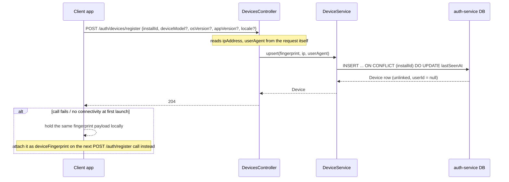

**(b) Organization/license validation before registration**

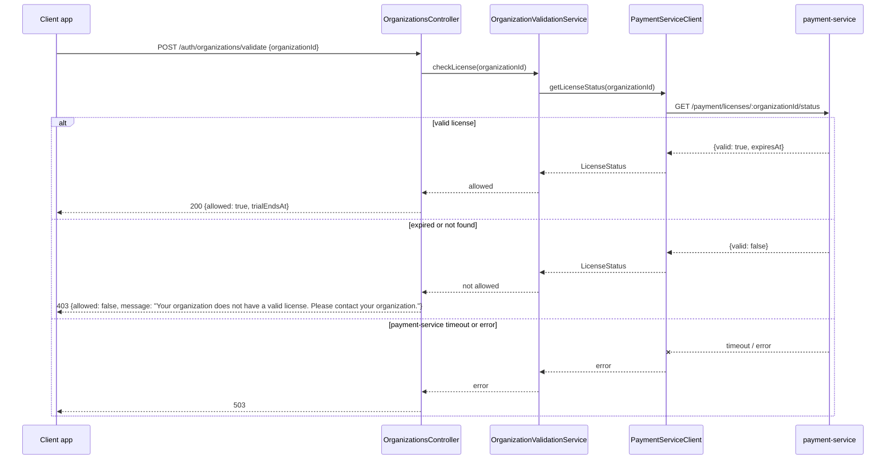

**(c) Registration**

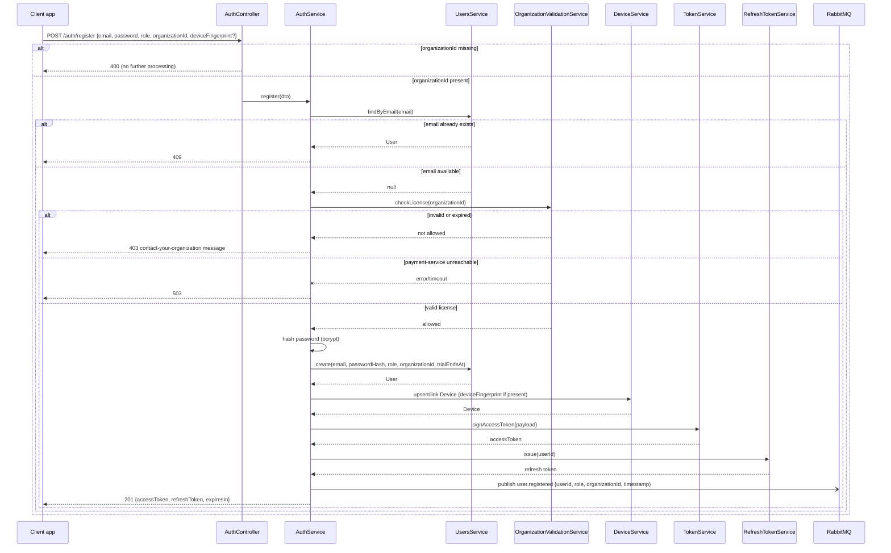

**(d) Login**

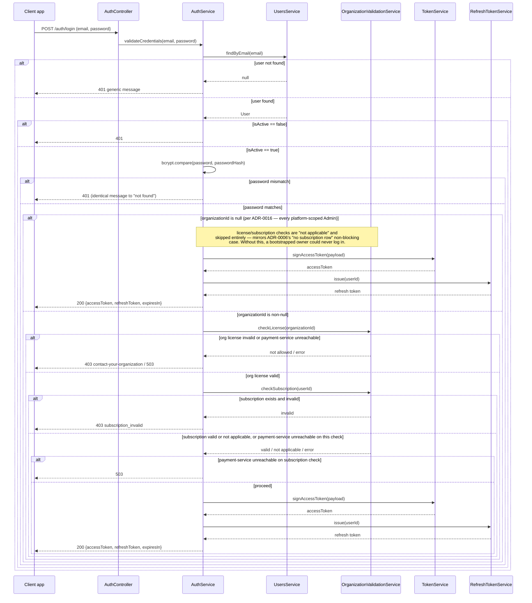

**(e) Refresh token rotation**

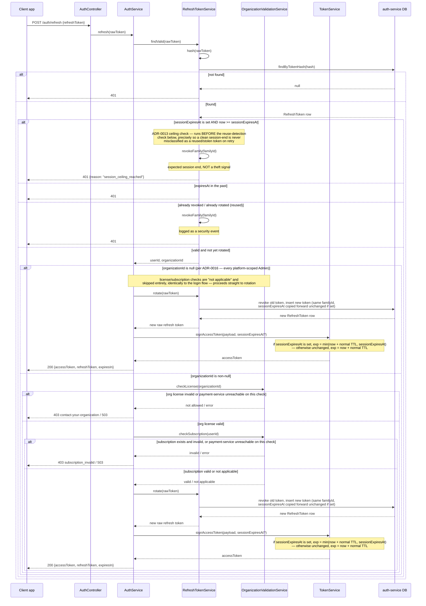

Note: this flow reshapes the previous revision's `AuthController`-owned `rotate(rawToken)`
call into `AuthService`-owned orchestration (`AuthService.refresh`), since rotation itself
must now be gated by the license/subscription check above rather than happening
unconditionally — matching the `AuthService.refresh` method already declared in the class
diagram. The `sessionExpiresAt` ceiling check and its ordering relative to reuse-detection
(per ADR-0013) apply only to operator-issued tokens; every other token has
`sessionExpiresAt = null` and passes through this check as a no-op, exactly as before.

**(f) Logout**

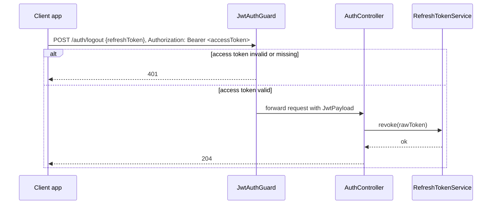

**(g) Downstream consumer authorizing a request from the JWT alone**

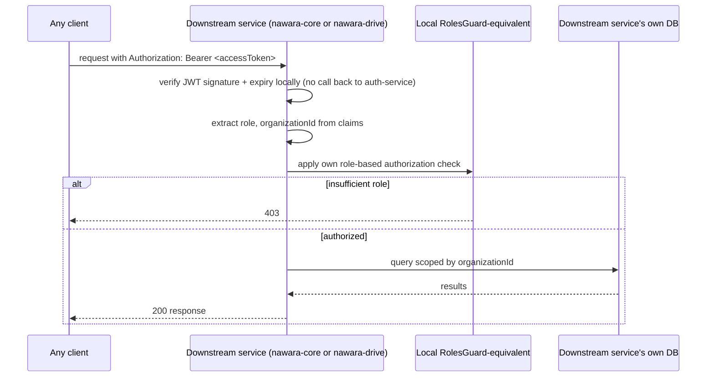

This last flow operationalizes `nawara-drive`'s deferred school-scoping need from
ADR-0001: `auth-service` never sees this request at all — the downstream service holds
its own verification key and applies its own meaning to `role`/`organizationId`.

**(h) Owner secret-key login with new-device check**

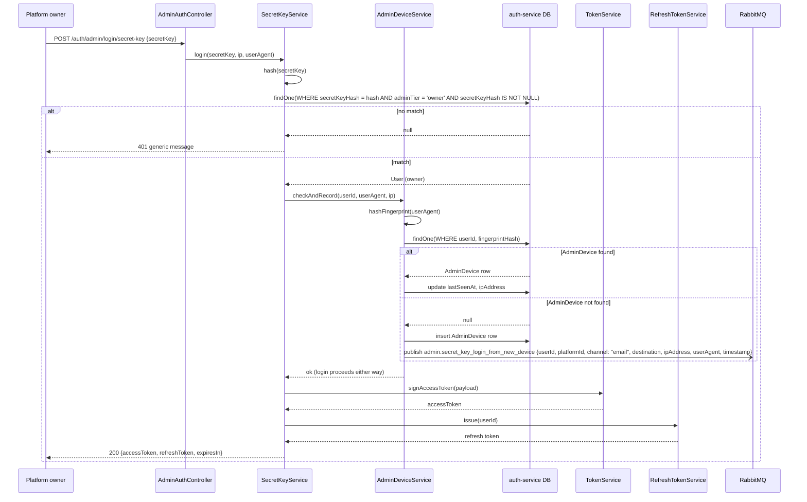

**(i) Owner secret-key rotation**

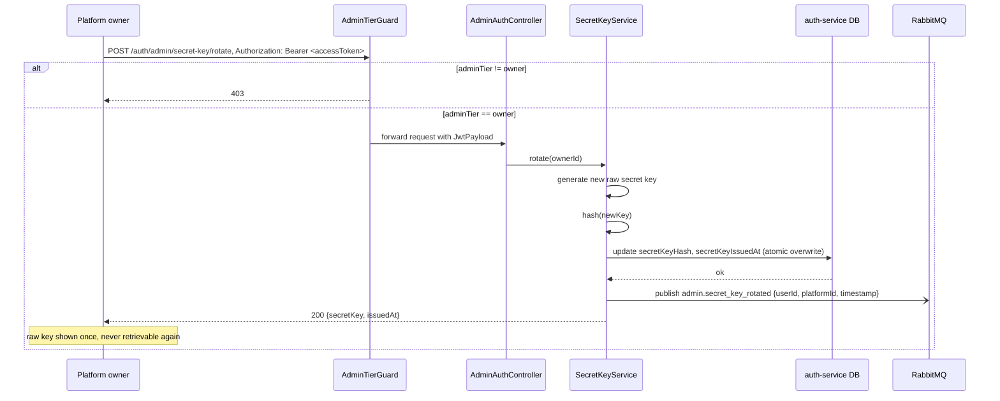

Note: rotation is reached through `POST /auth/login`'s **existing** email+password flow
issuing the Bearer token used here, not through the secret-key login itself — per ADR-0010,
this is deliberate, so password login remains the recovery path if the secret key leaks.

**(j) Operator registration (updated per ADR-0015: also issues a confirmation code)**

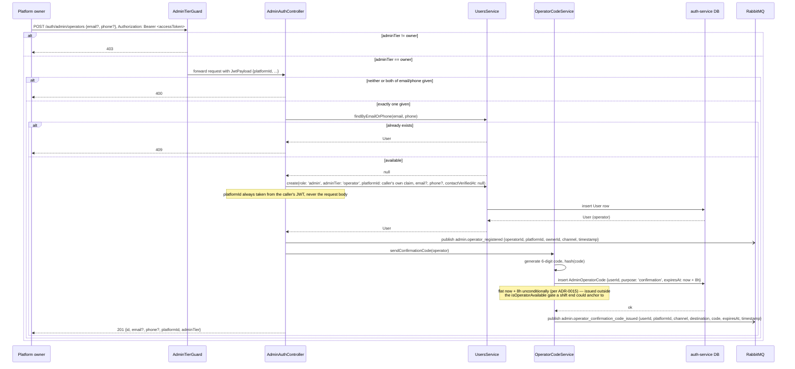

**(k) Operator request-code with availability gate (updated per ADR-0012/ADR-0014/ADR-0015)**

```mermaid
sequenceDiagram
    participant Operator as Platform operator
    participant AAC as AdminAuthController
    participant OCS as OperatorCodeService
    participant US as UsersService
    participant OAS as OperatorAvailabilityService
    participant PCS as PlatformCalendarService
    participant DB as auth-service DB
    participant Broker as RabbitMQ

    Operator->>AAC: POST /auth/admin/login/operator/request-code {email?, phone?}
    alt neither or both of email/phone given
        AAC-->>Operator: 400
    else exactly one given
        AAC->>OCS: requestCode(email?, phone?)
        OCS->>US: findByEmailOrPhone(email, phone, adminTier: 'operator', isActive: true, contactVerifiedAt: not null)
        alt not found (unknown identifier, blocked operator, OR not-yet-confirmed operator)
            US-->>OCS: null
            OCS-->>Operator: 401 generic message
            Note over OCS: unknown identifier, blocked operator, and unconfirmed operator are<br/>all indistinguishable here — deliberate, per ADR-0012/ADR-0015
        else found, active, confirmed
            US-->>OCS: User (operator)
            OCS->>OAS: isOperatorAvailable(operator.id, now)
            OAS->>PCS: isWorkingDay(operator.platformId, today)
            alt platform-wide non-working day
                PCS-->>OAS: false
                OAS-->>OCS: false
            else platform working day
                PCS-->>OAS: true
                OAS->>DB: check OperatorTimeOff for today
                alt operator has time off today
                    DB-->>OAS: match
                    OAS-->>OCS: false
                else no time off today
                    DB-->>OAS: no match
                    OAS->>DB: load OperatorSchedule rows for this operator
                    alt zero schedule rows configured
                        DB-->>OAS: []
                        OAS-->>OCS: true
                        Note over OAS: fail-open — same philosophy ADR-0011<br/>applies to PlatformNonWorkingDay
                    else schedule configured
                        DB-->>OAS: OperatorSchedule[]
                        OAS->>OAS: today's dayOfWeek has a row AND now in [startTime, endTime)?
                        OAS-->>OCS: true/false accordingly
                    end
                end
            end
            alt not available
                OCS-->>Operator: 403 {reason: "non_working_day", message: "You're outside your scheduled login window. Try again during your next scheduled shift."}
                Note over OCS: all three unavailable branches above collapse to<br/>this one reason code — the corrective action is identical
            else available
                OCS->>OCS: generate 6-digit code, hash(code)
                OCS->>OAS: getShiftEndOrFallback(operator.id, issuedAt)
                OAS->>DB: load OperatorSchedule rows for this operator (already loaded above; re-read here for clarity)
                alt zero schedule rows configured
                    OAS-->>OCS: issuedAt + 8h
                    Note over OAS: fail-open fallback (per ADR-0014) — same operator already<br/>known to have zero rows, from the isOperatorAvailable call above
                else schedule configured
                    OAS-->>OCS: today's row's endTime, combined with today's date
                    Note over OAS: invariant: isOperatorAvailable already returned true for this<br/>now, so today's row is guaranteed to exist (per ADR-0014)
                end
                OCS->>DB: delete previous unconsumed purpose:'login' AdminOperatorCode row for this operator (if any), insert new one {purpose: 'login', expiresAt}
                Note over OCS: scoped by (userId, purpose) per ADR-0015 — a live<br/>purpose:'confirmation' row, if any, is untouched
                DB-->>OCS: ok
                OCS-)Broker: publish admin.operator_code_issued {userId, platformId, channel, destination, code, expiresAt, timestamp}
                OCS-->>Operator: 204
            end
        end
    end
```

**(l) Operator verify-code (updated per ADR-0012: `isActive` join, no `attemptCount`
increment on a no-row-found result; per ADR-0013: `sessionExpiresAt` stamped on success; per
ADR-0014: `sessionExpiresAt` computed via `getShiftEndOrFallback`, fresh and independent of
request-code's own computation; per ADR-0015: `contactVerifiedAt` join)**

```mermaid
sequenceDiagram
    participant Operator as Platform operator
    participant AAC as AdminAuthController
    participant OCS as OperatorCodeService
    participant OAS as OperatorAvailabilityService
    participant DB as auth-service DB
    participant TS as TokenService
    participant RTS as RefreshTokenService

    Operator->>AAC: POST /auth/admin/login/operator/verify-code {email?, phone?, code}
    AAC->>OCS: verifyCode(email?, phone?, code)
    OCS->>DB: findOne(WHERE userId matches identifier AND User.isActive = true AND<br/>User.contactVerifiedAt IS NOT NULL, purpose = 'login',<br/>consumedAt IS NULL, expiresAt > now)
    Note over OCS,DB: codeHash is NOT part of this WHERE clause — the row is fetched by\nidentifier alone, then codeHash is compared in application code below,\nso a wrong guess still yields a row whose attemptCount can be incremented.\ncontactVerifiedAt is defense-in-depth: a live purpose:'login' row cannot\nexist for an unconfirmed operator by construction (per ADR-0015).
    DB-->>OCS: AdminOperatorCode row, or none
    alt no row found (unknown identifier, blocked/unconfirmed operator, or no live code)
        OCS-->>Operator: 401 generic message
        Note over OCS: attemptCount is NOT touched here — this isn't a wrong-code<br/>guess, it's "no matching live code," so it shouldn't burn an attempt
    else row found, attemptCount >= 5
        OCS-->>Operator: 401 generic message (code permanently invalidated — caller must request-code again)
    else row found, attemptCount < 5
        OCS->>OCS: matches = compare(codeHash, hash(code))
        alt not matches
            OCS->>DB: increment attemptCount on this row
            OCS-->>Operator: 401 generic message
        else matches
            OCS->>DB: mark consumedAt
            OCS->>OAS: getShiftEndOrFallback(operator.id, now)
            Note over OCS,OAS: per ADR-0014, computed fresh here — NOT reused from the<br/>AdminOperatorCode.expiresAt value computed at request-code time.<br/>Guaranteed same calendar day: verify-code can only reach this point<br/>while now < expiresAt (the code's own unchanged expiry check), and<br/>expiresAt is itself today's shift-end, so recomputing can never<br/>resolve to a different day's OperatorSchedule row than request-code<br/>saw. NOT guaranteed to match byte-for-byte, though: if the owner<br/>edits this operator's schedule (PUT .../schedule, no concurrency<br/>control) between request-code and verify-code, this recomputation<br/>can legitimately differ from request-code's value on the same day —<br/>an accepted, not-mitigated edge case (ADR-0014). Recomputing is the<br/>better design regardless: reusing would pipe the code's own<br/>redemption-deadline concept into the session-ceiling concept,<br/>exactly the conflation ADR-0013's Context warns against, and would<br/>apply a schedule value the owner may have already changed.
            alt zero schedule rows configured
                OAS-->>OCS: now + 8h
            else schedule configured
                OAS-->>OCS: today's row's endTime, combined with today's date
            end
            OCS->>RTS: issue(userId, sessionExpiresAt)
            Note over RTS: ADR-0013 — sessionExpiresAt set exactly once, here,<br/>at login success; copied forward unchanged on every later rotation
            RTS-->>OCS: refresh token
            OCS->>TS: signAccessToken(payload, sessionExpiresAt)
            Note over TS: exp = min(now + normal TTL, sessionExpiresAt) — resolves to<br/>the normal TTL here for all but a pathologically short remaining<br/>shift, but the ceiling is passed explicitly at every operator<br/>issuance, not assumed
            TS-->>OCS: accessToken
            OCS-->>Operator: 200 {accessToken, refreshToken, expiresIn}
        end
    end
```

**(m) Owner blocks an operator (updated per ADR-0015: deletes unconsumed codes of either
`purpose`)**

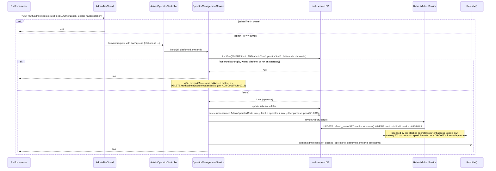

**(n) Owner unblocks an operator**

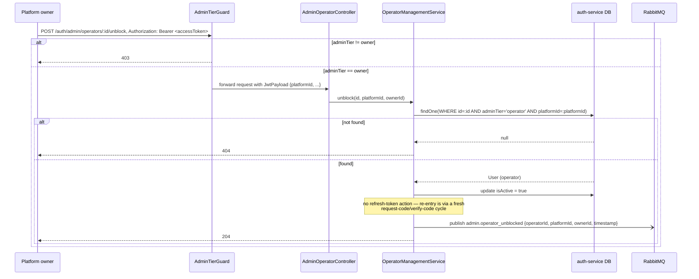

**(o) Operator contact confirmation (new, per ADR-0015)**

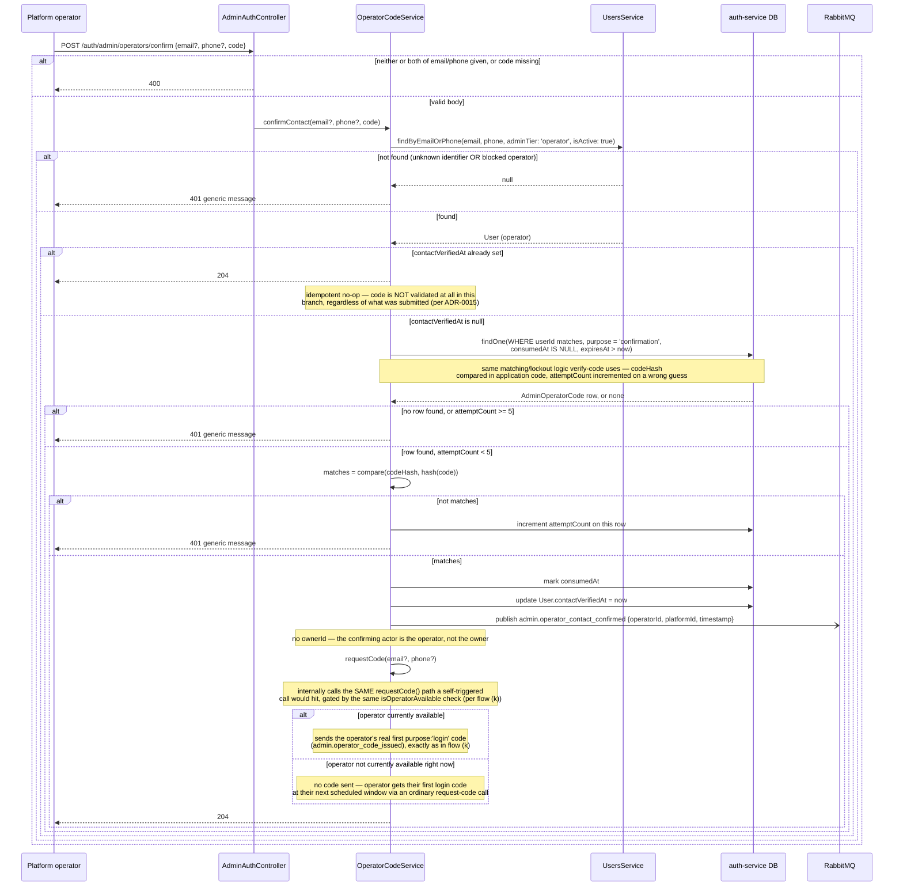

**(p) Owner creation (new, per ADR-0017)**

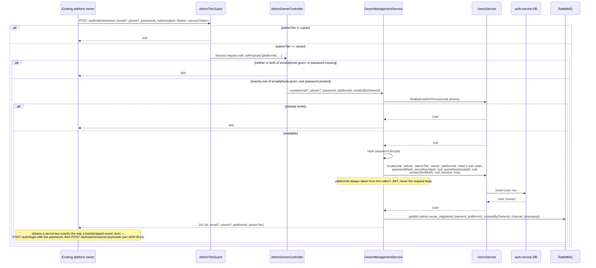

**(q) Owner deactivation with the "last owner" invariant (new, per ADR-0017)**

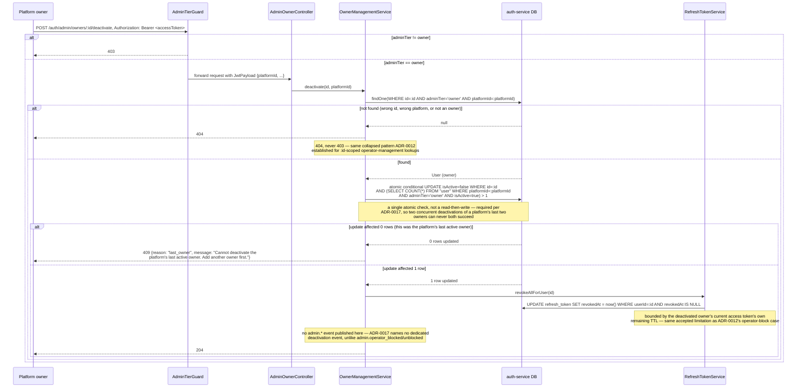

Note: unlike operator block/unblock (flows (m)/(n)), ADR-0017's Decision section does not name a
dedicated `admin.owner_deactivated`/`admin.owner_activated` event pair — only
`admin.owner_registered` is specified. The note in flow (q) above records this as a documented
absence, not an oversight in this pass.

## Error handling & edge cases

- Missing `organizationId` on register → `400` (distinct from the license-related `403`s
  below — this is a client/validation error, not a business-rule rejection).
- Duplicate email → `409`.
- Wrong password or unknown email on login → `401` with an identical message
  (enumeration mitigation).
- Malformed or not-found refresh token → `401`.
- Expired refresh token → `401`.
- Reused/already-rotated refresh token → `401` **and** the entire token family is
  revoked (theft signal; structured log, no alerting mechanism exists yet in v1).
- An operator-issued refresh token presented at or after its `sessionExpiresAt` ceiling →
  `401 {reason: "session_ceiling_reached"}` **and** the token family is revoked, checked
  **before** the reuse-detection check above (per ADR-0013). This is a clean, expected
  session end, not a theft signal — see flow (e)'s ordering note for why the check must run
  first.
- Inactive user (`isActive=false`) attempting login or refresh → `401`. As of ADR-0012, this
  is no longer just schema-only groundwork: `POST /auth/admin/operators/:id/block` is the
  first endpoint to actually set `isActive=false`, for an operator specifically.
- Invalid/expired/malformed JWT on any protected route → `401`.
- Valid JWT but insufficient role → `403`.
- Other DTO validation failures → `400`, via Nest's `ValidationPipe` + `class-validator`.
- `organizationId` present but not found, or its license has expired → `403` with the
  exact "Your organization does not have a valid license. Please contact your
  organization." message, identical wording regardless of the specific reason, to avoid
  confirming which organization ids exist.
- `payment-service` unreachable or timing out during either `/auth/organizations/validate`
  or `/auth/register` → `503`, per ADR-0004's fail-closed decision.
- Login or refresh attempted after the requesting user's organization's license has
  lapsed → `403` with the same "contact your organization" message, even if the request's
  credentials/refresh token are otherwise entirely valid (per ADR-0005). This is the
  mechanism that logs a user out, bounded by the 15-minute access-token TTL — see the ADD's
  Open questions for the full rationale.
- Login or refresh for a user whose individual `UserSubscription` (if one exists) is
  suspended or expired, but whose organization's license is still valid → distinct
  `403 {reason: "subscription_invalid"}` (per ADR-0006). A user with no `UserSubscription`
  row at all is never blocked by this check.
- `payment-service` unreachable or timing out during the login/refresh license or
  subscription check → `503`, per ADR-0005's fail-closed decision (same as ADR-0004's).
- An organization's license lapsing while a user is mid-session, holding a still-valid
  access token → not surfaced immediately; the user keeps working until that access token
  expires and a refresh is attempted, which then fails per the first bullet above. This is
  documented as expected, intentional behavior (per ADR-0005), not a bug.
- A license that expires in the window between a successful
  `/auth/organizations/validate` call and a later `/auth/register` call → register's own
  server-side re-check catches this and returns `403`; this is documented as expected,
  intentional behavior, not a bug.
- Device-fingerprint call failing at first launch → silently handled client-side, never
  surfaced as an error to the user, retried via the registration-time fallback field —
  device capture is best-effort and never blocks app usage.
- `installId` seen before on a repeat device-fingerprint call → idempotent upsert, just
  updates `lastSeenAt`.
- Login/registration brute-force is a known, currently undesigned gap (no rate-limiting
  yet).
- `POST /auth/admin/login/secret-key` with a key that doesn't match any owner → `401`
  generic message (per ADR-0010); no distinction between "no such key" and "key belongs to
  a non-owner admin."
- `POST /auth/admin/secret-key/rotate` called by a non-owner admin (or a non-admin) →
  `403`, via `AdminTierGuard`.
- `POST /auth/admin/operators` with neither or both of `email`/`phone` → `400`; with a
  duplicate `email`/`phone` → `409`; called by a non-owner admin → `403`.
- `POST /auth/admin/operators/confirm` (per ADR-0015) with neither or both of `email`/`phone`,
  or missing `code` → `400`; unknown identifier or blocked operator → generic `401`; an
  already-confirmed operator (`contactVerifiedAt` non-null) → idempotent `204`, **without**
  validating the submitted `code` at all; a not-yet-confirmed operator's wrong, expired,
  already-consumed, or attempt-exhausted `purpose: 'confirmation'` code → generic `401`, with
  the same `attemptCount` increment/5-attempt-lockout behavior `verify-code` uses. **Accepted
  account-enumeration side channel (per ADR-0015, same spirit as ADR-0011's):** because the
  idempotent-`204` branch doesn't depend on the submitted code being correct while the
  real-validation branch does, a caller submitting a deliberately wrong code can distinguish
  "already-confirmed operator" (`204`) from "unconfirmed or unknown" (`401`); not
  re-engineered around here.
- `POST /auth/admin/login/operator/request-code` with neither or both of `email`/`phone` →
  `400`; unknown identifier, **a blocked operator, or a not-yet-confirmed operator**
  (`contactVerifiedAt IS NULL`) → generic `401` (checked before the
  availability check, per ADR-0012/ADR-0015 — a blocked or unconfirmed operator is
  deliberately indistinguishable from an unknown identifier here, so this doesn't widen the
  small enumeration side-channel ADR-0011's own Consequences already accept, not close, for
  unknown-vs-non-working-day; see ADR-0015's Decision for the explicit contrast with
  ADR-0013's opposite choice for `session_ceiling_reached`);
  known, active, confirmed operator
  identifier outside their available window (platform calendar, own time off, or own
  schedule — all three collapse to the same reason) → `403 {reason: "non_working_day"}`.
  **Accepted account-enumeration side channel (per ADR-0011, still applicable):** because the
  not-found check runs first, only a valid, active, confirmed operator identifier can ever
  produce the `403 non_working_day` response — an invalid, blocked, or unconfirmed identifier
  always gets `401` regardless of availability. This is in the same spirit as the
  already-accepted enumeration risk on `POST /auth/organizations/validate`; it is not
  re-engineered around here.
- `POST /auth/admin/login/operator/verify-code` with a wrong, expired, already-consumed, or
  attempt-exhausted code → generic `401`, `attemptCount` incremented on a wrong-but-otherwise
  -matching code; once `attemptCount` reaches 5 the code is permanently invalidated even
  against a subsequently correct guess, forcing a fresh `request-code` call. **A blocked or
  not-yet-confirmed operator's leftover code (if one somehow survived — `block()` already
  deletes it, and a live `purpose: 'login'` code cannot exist for an unconfirmed operator by
  construction) or an
  unknown identifier** → generic `401` via the same no-row-found branch, and — deliberately,
  per ADR-0012 — `attemptCount` is **not** incremented in this case, since it isn't a
  wrong-code guess.
- `POST /auth/admin/platform/calendar` with `type = 'holiday'` and no `date` (or
  `type = 'weekly_weekend'` and no `dayOfWeek`) → `400`; called by a non-owner admin → `403`.
- `DELETE /auth/admin/platform/calendar/:id` for a row belonging to a different platform →
  `404` (never `403`, to avoid confirming the row exists at all).
- Phone-registered operator's `admin.operator_code_issued` event is currently undeliverable
  in practice — the SMS **provider** is now named (Twilio, per
  [ADR-0019](../adr/0019-twilio-as-sms-gateway-provider.md)), but `notification-service`'s
  actual integration (consuming the event, calling the gateway, retry/failure handling) remains
  entirely undesigned — `notification-service` has no ADD or SDD of any kind yet. As of
  ADR-0015, this same gap also covers `admin.operator_confirmation_code_issued` events for
  phone-registered operators. `auth-service` itself is unaffected either way — it never calls
  an SMS gateway directly.
- `isWorkingDay`'s notion of "today" is evaluated as **UTC server-date** — the v1 decision
  (per ADR-0011; see the ADD's Open questions), not merely a recommendation.
  `OperatorAvailabilityService`'s time-of-day comparison (per ADR-0012) uses the same UTC
  server clock for `startTime`/`endTime`. A per-platform/per-operator timezone field remains
  an explicit future enhancement, not designed here.
- Any `GET/PATCH/POST/DELETE /auth/admin/operators/:id...` call where `:id` doesn't resolve
  to an operator on the caller's own platform → `404` (never `403`), the same collapsed
  pattern as `DELETE /auth/admin/platform/calendar/:id` (per ADR-0011/ADR-0012).
- `PATCH /auth/admin/operators/:id/contact` with neither or both of `email`/`phone` → `400`;
  duplicate `email`/`phone` → `409` (per ADR-0012).
- `PUT /auth/admin/operators/:id/schedule` with a duplicate `dayOfWeek` in the array, or any
  entry where `startTime >= endTime` → `400` (per ADR-0012).
- `POST /auth/admin/operators/:id/time-off` with a duplicate `(userId, date)` → `409` (per
  ADR-0012).
- `GET /auth/admin/operators/:id/schedule` called by anyone other than the platform's owner
  (including the operator themselves) → `403`/`404` via `AdminTierGuard`/the collapsed-404
  scoping above — deliberately **not** given the platform calendar's more permissive
  any-admin-can-read treatment (per ADR-0012).
- The new owner-only `AdminOperatorController` surface is unauthenticated-adjacent in the
  sense that it inherits the same undesigned rate-limiting gap as the rest of
  `auth-service` — see the ADD's non-functional constraints.
- `POST /auth/admin/owners` with a duplicate `email`/`phone` → `409`; with neither or both of
  `email`/`phone`, or a missing `password` → `400`; called by a non-owner admin → `403` (per
  ADR-0017).
- `POST /auth/admin/owners/:id/deactivate` that would leave the platform with zero
  `isActive: true` owners → `409 {reason: "last_owner", message: "Cannot deactivate the
  platform's last active owner. Add another owner first."}` (per ADR-0017), enforced via an
  atomic check rather than a read-then-write, so two concurrent deactivation requests against a
  platform's last two owners can never both succeed in leaving zero.
- Any `POST /auth/admin/owners/:id/...` call where `:id` doesn't resolve to an owner on the
  caller's own platform (unknown id, a different platform's owner, or an id that isn't an owner
  at all) → `404`, never `403` — the same collapsed pattern already used for
  `:id`-scoped operator-management lookups (per ADR-0012, reused unchanged by ADR-0017).
- The CLI's `BOOTSTRAP_OWNER_FORCE_RESET` mode revokes all of the target owner's existing
  refresh tokens unconditionally, on every invocation — not only when there's specific evidence
  of compromise. This is a deliberately defensive posture (per ADR-0017): "the owner lost both
  credentials" and "an attacker compromised the account and changed credentials to lock the
  real owner out" are indistinguishable from the command's point of view, so both are treated
  identically and all existing sessions are ended, the same posture ADR-0010 already takes for
  a suspicious secret-key rotation.

## Open questions

- ~~Password complexity policy (not yet defined).~~ **Resolved:** minimum 8 characters, no
  forced composition rules (no required uppercase/digit/symbol mix) — NIST 800-63B-style
  guidance, where length matters more than composition-rule theater. No breach-corpus/
  pwned-password check in v1; that's separate future scope.
- ~~Login rate-limiting — `@nestjs/throttler` is a likely candidate, deferred to a future
  TDD.~~ **Resolved by [`docs/tdd/rate-limiting-baseline.md`](../tdd/rate-limiting-baseline.md),
  for the global baseline only:** `@nestjs/throttler`, applied globally (100 requests/60s per
  IP) via a global `APP_GUARD`, not per-endpoint. Stricter, per-endpoint limits for
  `/auth/login`, `/auth/register`, and the admin/operator endpoints named in the ADD's
  non-functional constraints remain each endpoint's own future TDD's job, once that endpoint
  is actually implemented.
- ~~Whether a "logout everywhere" (family-wide refresh-token revoke) endpoint is needed.~~
  **Resolved:** out of v1 scope — grouped with the other already-deferred v1 cuts below (MFA,
  multi-session/device management) rather than built now.
- The five explicit v1-deferred auth features (password reset, email verification, MFA,
  social login, multi-session/device management), now joined by "logout everywhere"
  (family-wide refresh-token revoke, resolved above) — the current additive-only schema
  design is intended not to block adding these later.
- ~~The stale-claim window when a user's role or organizationId changes mid-session —
  current mitigation is a short access-token TTL; whether that's sufficient is
  unresolved. The same access-token TTL now also bounds how long a user stays logged in
  after their organization's license lapses (per ADR-0005) — the exact TTL value is not
  decided by this document.~~ **Resolved:** 15 minutes (see the ADD's Open questions for the
  full rationale) — short enough to bound both the role/organizationId stale-claim window and
  the license/subscription-lapse window, refreshed transparently via the existing rotating
  refresh-token mechanism.
- Rate-limiting `/auth/organizations/validate` specifically, given organization ids/keys
  may be short, human-typed codes rather than high-entropy tokens (an enumeration risk).
- Per-organization/per-license custom trial length is deferred — v1 uses one global
  config default.
- How `installId` collisions or resets (e.g. app reinstall) should be handled —
  currently just looks like a new device, no special handling designed.
- `Device` data-retention period and whether it needs privacy-policy disclosure
  (unresolved — see the ADD's "Design rationale: device/network fingerprinting").
- What actually consumes `Device` records for blocking/rate-limiting is out of scope for
  this pass — capture only.
- ~~The internal mechanism for provisioning platform Admin accounts out-of-band is
  deliberately left unspecified in this pass (per ADR-0001's revision).~~ **Resolved by
  [ADR-0016](../adr/0016-first-owner-bootstrap-command.md)**, for a platform's *first* owner:
  `apps/auth-service/src/cli/bootstrap-owner.ts`, an idempotent CLI command (not a migration —
  ADR-0016 keeps `apps/auth-service/src/migrations/` schema-only) that seeds only an
  email+password credential through the real `UsersService`, deliberately minting no secret
  key — the owner's first secret key still comes from the existing
  `POST /auth/admin/secret-key/rotate` path (ADR-0010), reached via the same command's seeded
  password login. Operators remain provisioned in-band by an owner, via
  `POST /auth/admin/operators` (ADR-0011) — that path was never part of this open question.
  Ownership transfer, a second/standby owner, and sole-owner credential-loss recovery remain
  unresolved — see ADR-0016's own Consequences. **Addendum, per
  [ADR-0017](../adr/0017-owner-recovery-and-second-owner.md):** this same script gains an
  opt-in `BOOTSTRAP_OWNER_FORCE_RESET=true` mode, a CLI-only (never HTTP-reachable) path for
  the one scenario in-band owner creation cannot retroactively fix — a platform already down to
  one owner who has already lost both credentials. It identifies the target owner via
  `BOOTSTRAP_OWNER_RESET_EMAIL` combined with the existing `BOOTSTRAP_OWNER_PLATFORM_ID` (no
  match → exit non-zero, no writes), overwrites only `passwordHash` from
  `BOOTSTRAP_OWNER_PASSWORD`, leaves `secretKeyHash`/`secretKeyIssuedAt` deliberately untouched,
  and revokes all of that owner's existing refresh tokens unconditionally. See the
  ADR-0017-resolution bullet below for the rest of the picture this mode complements
  (multi-owner support and ownership transfer).
- **SHA-256, not bcrypt, for `secretKeyHash`/`codeHash`:** stated explicitly here, not just
  referenced. For `secretKeyHash`, the reasoning is entropy-based — the secret key is a
  high-entropy, server-generated value, not a low-entropy human-chosen password, so it doesn't
  need bcrypt's deliberate slowness to resist brute force; the same reasoning applies to
  ADR-0002's refresh tokens (also hashed rather than bcrypted), though ADR-0002 itself doesn't
  name a specific algorithm or spell out this rationale. For `codeHash` the reasoning is
  different: a 6-digit operator code is genuinely **low**-entropy (10⁶ possibilities), so a
  fast hash is *not* justified by entropy — it's justified because the compensating control is
  the 5-attempt lockout and the code's own validity window (whichever duration applies — see
  below), which cap an online guesser to 5 tries
  regardless of hash speed. This applies identically to both `purpose: 'login'` and
  `purpose: 'confirmation'` codes (per ADR-0015) — the reasoning doesn't depend on which
  purpose or duration a given row has. This does leave an accepted, not-re-litigated-here gap: an offline
  attacker who obtains a leaked `codeHash` row directly (e.g. a database breach) could brute
  force the full 10⁶ space quickly against SHA-256, where bcrypt would have slowed that down —
  a real tradeoff, not an oversight, since the primary threat model here is an online guesser
  against the live endpoint, not a DB-breach scenario.
- Whether the 5-attempt operator-code lockout threshold (per ADR-0011) should be
  configurable per platform, rather than a single hardcoded value for every platform.
- Operator-code length/entropy tuning — whether a 6-digit code with a shift-anchored (or,
  for confirmation codes, flat 8-hour) validity
  window and 5-attempt lockout is the right balance, or needs revisiting (per ADR-0011,
  ADR-0014, ADR-0015).
- ~~Per-platform timezone for `isWorkingDay`'s "today" — recommended as UTC server-date for
  now (per ADR-0011); not designed here.~~ **Resolved:** UTC server-date is the v1 decision,
  not merely a recommendation — see the ADD's "Timezone default for `isWorkingDay`/
  shift-boundary evaluation" open-question resolution. A per-platform timezone field remains
  an explicit future enhancement.
- ~~The single-owner-per-platform assumption — no ownership-transfer mechanism is designed if
  a platform's owner needs to be replaced (per ADR-0009/ADR-0010).~~ **Resolved by
  [ADR-0017](../adr/0017-owner-recovery-and-second-owner.md)**: `POST /auth/admin/owners`
  (owner-only, mirroring `POST /auth/admin/operators`) lets an existing owner add another owner
  to their own platform; `POST /auth/admin/owners/:id/deactivate`/`.../activate` give
  ownership transfer almost for free (add a new owner, then deactivate the old one), gated by a
  hard "last owner" invariant so a platform can never be fully de-owned. Sole-owner
  credential-loss recovery is handled separately, by a new opt-in
  `BOOTSTRAP_OWNER_FORCE_RESET` mode on ADR-0016's existing `bootstrap-owner.ts` CLI, not a
  self-service flow. A freshly bootstrapped platform's very first owner still carries the same
  lockout exposure until a second owner is actually added — ADR-0017 surfaces that as
  operational guidance, not something this design enforces.
- ~~The SMS-gateway/provider dependency for phone-registered operators (per ADR-0011) — no
  such infrastructure exists anywhere in this repo yet. As of ADR-0015, this same gap also
  covers confirmation-code delivery.~~ **Provider resolved by
  [ADR-0019](../adr/0019-twilio-as-sms-gateway-provider.md)**: Twilio, behind a generic
  `SmsGateway` interface mirroring `payment-service`'s own gateway-adapter pattern.
  **`notification-service`'s actual integration remains entirely undesigned** — that service
  has no ADD or SDD of any kind yet, and ADR-0019 deliberately does not attempt to design it;
  it only names the provider. `auth-service` never touches Twilio, or any SMS gateway,
  directly — this resolution doesn't change anything about `auth-service`'s own design.
- A real audit-log capability for owner actions against operators (per ADR-0012) — deferred
  as bigger scope than that ADR's pass warranted. Today's only trace is the incidental
  `ownerId` on `admin.operator_blocked`/`admin.operator_unblocked`, not a designed audit
  trail.
- ~~Per-operator timezone for evaluating `OperatorSchedule.startTime`/`endTime` (per
  ADR-0012) — this extends, rather than resolves, the existing `isWorkingDay`-timezone open
  question above; neither is designed here.~~ **Resolved** by the same UTC-server-date
  decision above: `startTime`/`endTime` comparisons also evaluate "now" against the server's
  UTC clock. A per-operator timezone field remains an explicit future enhancement, not
  designed here.
- `OperatorSchedule`'s no-overnight-shift restriction (per ADR-0012) — a real v1 limitation
  for a platform whose operators work shifts crossing midnight; not designed here.
- Whether the operator session-ceiling/login-code fallback duration (per ADR-0013/ADR-0014,
  currently 8 hours, used only when an operator has no configured `OperatorSchedule`) should
  become configurable per platform, rather than a single hardcoded constant shared by every
  platform.
- A confirmation-code resend endpoint (per ADR-0015) is not designed — only the initial send
  (bundled into `POST /auth/admin/operators`) and `POST /auth/admin/operators/confirm` exist.
  An operator whose confirmation code expires or is exhausted before they complete
  confirmation has no self-service way to get a new one in v1.
- The very short redemption/session window an operator could get if they request a login code
  moments before their shift ends (per ADR-0014) — an accepted, not-mitigated edge case.
- **No first-class `Organization` entity exists anywhere in this repo.** `organizationId` is
  purely an opaque string claim stamped onto `User` (this document), and onto `License`,
  `Charge`, and `UserSubscription` in `payment-service` — there is no `Organization` table or
  service anywhere. Concretely, `auth-service` has no way to answer "list the organizations
  under my platform," because `organizationId` and `platformId` are two independent, opaque
  claims (per ADR-0001/ADR-0009) with no recorded relationship between them in this schema —
  an owner or operator has no endpoint here to list, view, or manage the organizations
  belonging to their own platform. Not designed here; needs its own future ADR (likely a new
  `Organization` entity carrying its own `platformId`, plus admin-facing
  listing/management endpoints), not an incidental extension of this document.
