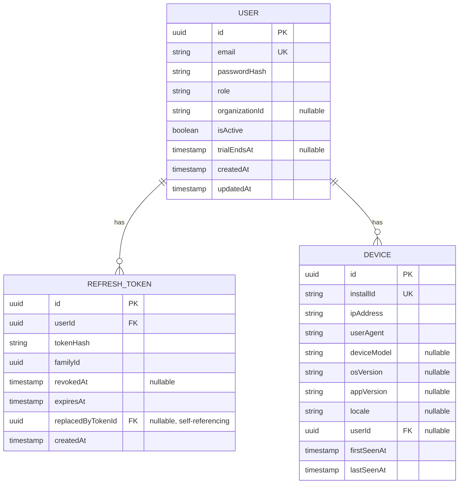
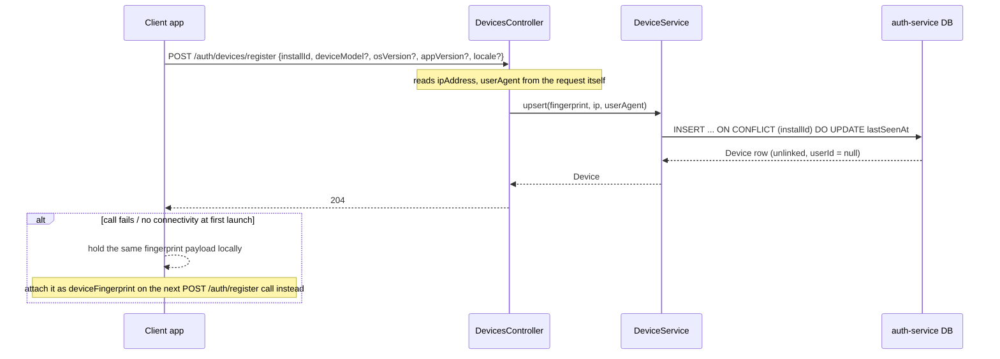
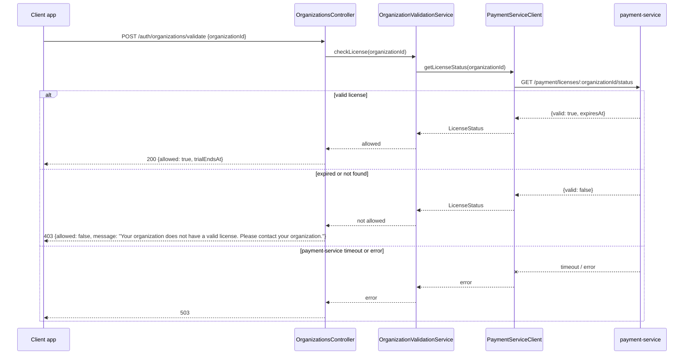
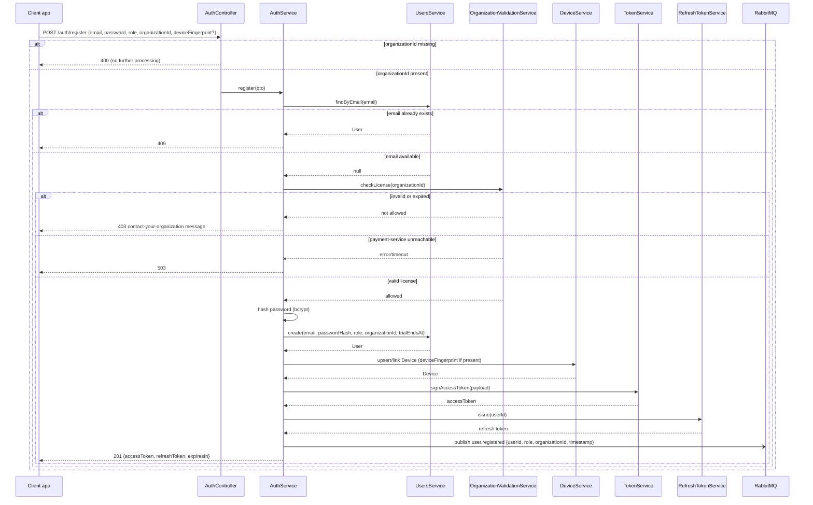
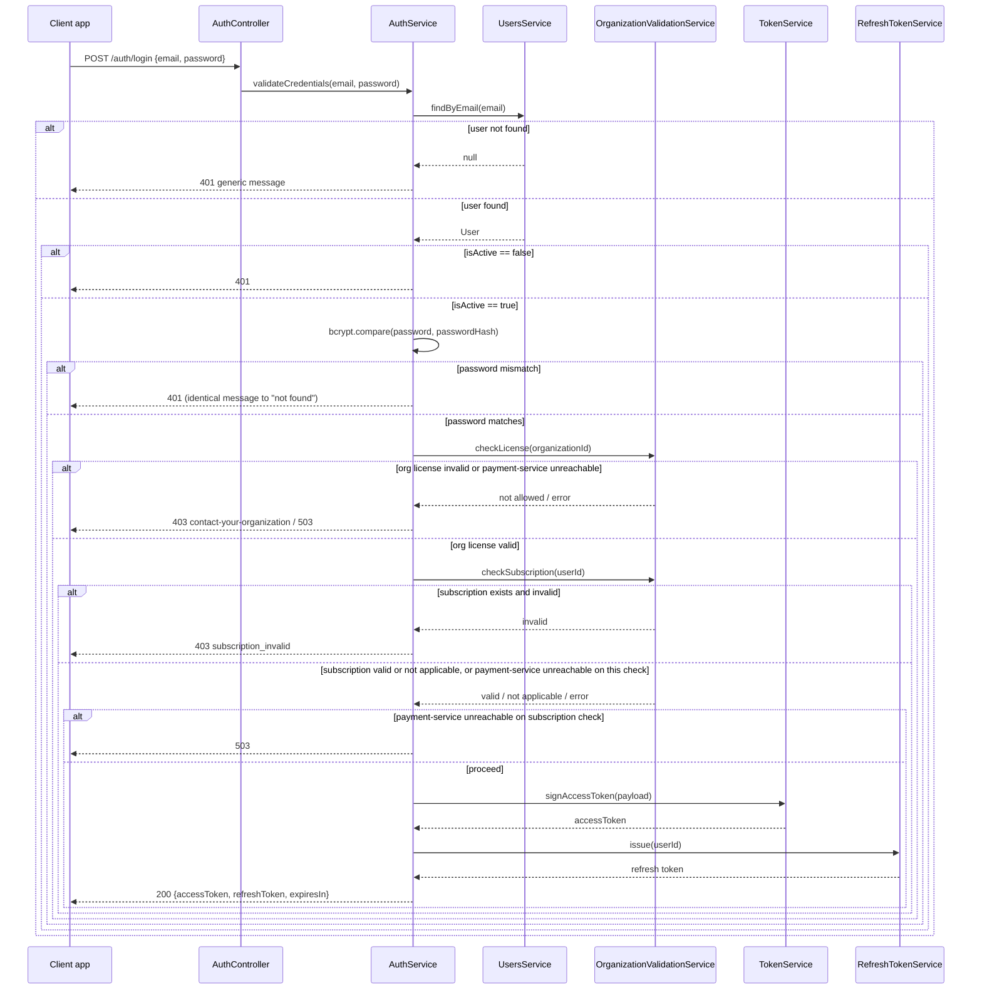
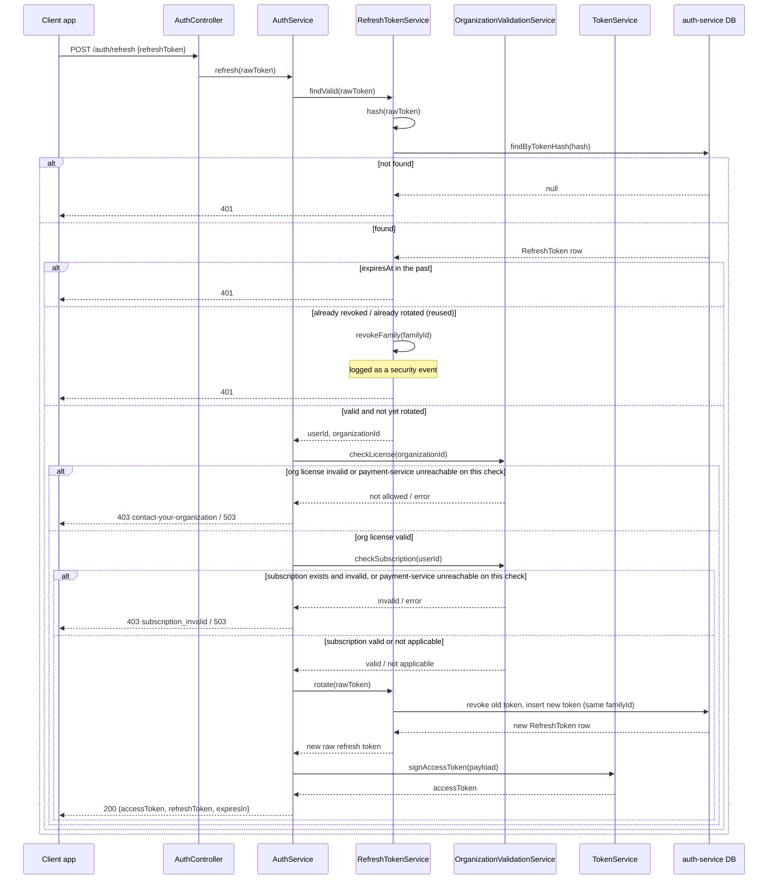
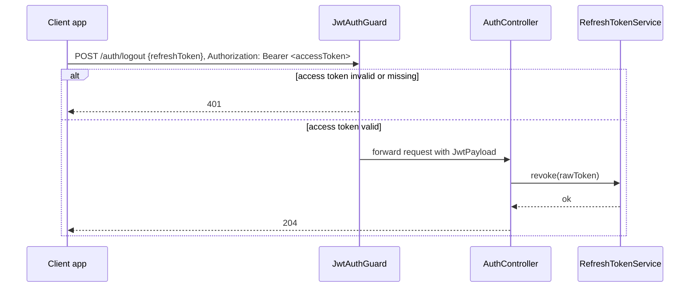
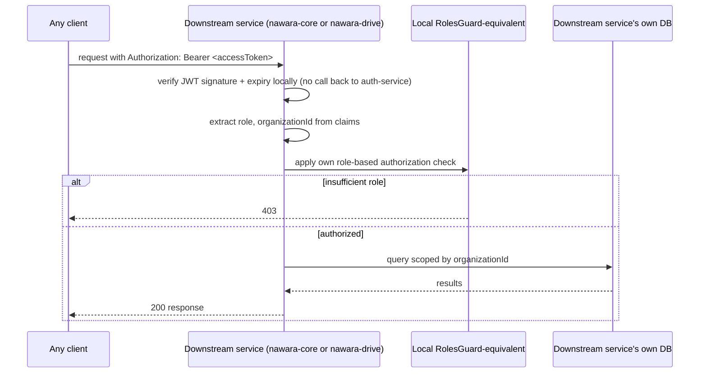

# auth-service

- **Status:** Draft <!-- Draft | Reviewed | Implemented -->
- **Owners:** Anwar (project owner)
- **Related ADD:** [docs/add/auth-service.md](../add/auth-service.md)
- **Related ADRs:** [0001](../adr/0001-generic-organization-id-scoping-claim.md) (generic
  `organizationId` scoping claim), [0002](../adr/0002-jwt-access-token-with-rotating-refresh-token.md)
  (JWT access token + DB-backed rotating refresh token), [0003](../adr/0003-postgresql-typeorm-persistence.md)
  (PostgreSQL + TypeORM persistence), [0004](../adr/0004-synchronous-fail-closed-license-validation.md)
  (synchronous, fail-closed license validation against payment-service),
  [0005](../adr/0005-bounded-time-license-subscription-revalidation.md) (bounded-time
  license/subscription re-validation on login and refresh),
  [0006](../adr/0006-per-user-subscription-reservation-on-license-lapse.md) (per-user
  subscription reservation on organization license lapse — `payment-service`'s decision).
  Device/network fingerprinting rationale lives in the ADD's "Design rationale: device/network
  fingerprinting" section, not a standalone ADR.

## Responsibility

`auth-service` owns `User` identity, credential verification, and the full JWT
access-token/refresh-token lifecycle. It also now owns capturing — but not acting on —
device/network fingerprint signals for future abuse-prevention work. It exposes generic
`role` and `organizationId` claims to every other service and consuming app. As of ADR-0005,
it also owns re-checking, on every login and token refresh, that the requesting user's
organization still holds a valid license and — when one exists — that the user's own
individual subscription is still valid, rejecting the call with a distinct `403` for each
case when it isn't.

It explicitly does **not** own:

- What a given `role` or `organizationId` value *means* semantically to any consumer —
  those are fully opaque strings to `auth-service` (per ADR-0001).
- License, billing, or individual-subscription data. That belongs to `payment-service`'s
  `Product`/`Charge` model (per `CLAUDE.md`); `auth-service` only asks `payment-service`
  yes/no questions about whether a given organization currently holds a valid license (per
  ADR-0004) and whether a given user's individual subscription, if any, is currently valid
  (per ADR-0006). It never decides who gets a subscription in the first place.
- Any actual blocking, rate-limiting, or abuse-scoring logic built on top of `Device`
  records. That is future work consuming what this service captures — this design covers
  capture only (see the ADD's "Design rationale: device/network fingerprinting").
- The freeze/resume ("reservation") mechanics for a lapsed organization's individual
  subscriptions, or the notifications sent when a license/subscription changes state. Both
  are `payment-service`'s responsibility, per ADR-0006.

## Data model

Notes:

- `User.organizationId` is nullable at the schema level per ADR-0001, but required as
  input on the public `POST /auth/register` endpoint. The only rows with a null
  `organizationId` are the platform's out-of-band-provisioned `Admin` accounts, which are
  never created through that endpoint.
- `User.trialEndsAt` is stamped at registration time for every self-registered user
  (every self-registration now goes through the org/license-gated path — there is no
  separate "direct" mode), using a global config default trial length for v1.
- `RefreshToken.tokenHash` is the only representation of the refresh token ever
  persisted — the raw token itself is never stored (per ADR-0002).
- `Device` is new (see the ADD's "Design rationale: device/network fingerprinting").
  `ipAddress` and `userAgent` are always server-observed from the incoming request, never
  client-supplied. A device starts unlinked (`userId = null`) and is linked once its
  owner registers or logs in from it.
- **No real MAC address or other hardware-level device identifier field exists on
  `Device`.** This is a deliberate omission, not an oversight: real MAC addresses are not
  obtainable from apps on modern mobile platforms or browsers (blocked since roughly
  2016), so no such field could ever be populated meaningfully — see the ADD's "Design
  rationale: device/network fingerprinting".
- Open naming question, flagged here rather than resolved: whether to add any generic
  profile field (e.g. `displayName`) to `User`. Recommendation for v1 is to keep
  `auth-service` strictly to identity + credentials and leave profile data to consuming
  apps, but this hasn't been formally decided.
- Password hashing: bcrypt, with the cost factor tuned for roughly 250ms per hash (an
  implementation parameter, not significant enough to warrant its own ADR — see the ADD's
  non-functional constraints).
- No individual-subscription entity exists in this schema, deliberately: per ADR-0006, that
  data is owned entirely by `payment-service`. `auth-service` only ever reads a subscription's
  current status at login/refresh time (see API contract below); it never stores one.

## Key interfaces / classes

```mermaid
classDiagram
    class AuthController {
      +register(dto: RegisterDto) AuthTokensResponse
      +login(dto: LoginDto) AuthTokensResponse
      +refresh(dto: RefreshTokenDto) AuthTokensResponse
      +logout(dto: RefreshTokenDto, user: JwtPayload) void
      +me(user: JwtPayload) UserResponseDto
    }
    class AuthService {
      -usersService: UsersService
      -tokenService: TokenService
      -refreshTokenService: RefreshTokenService
      -organizationValidationService: OrganizationValidationService
      -deviceService: DeviceService
      +register(dto: RegisterDto) AuthTokensResponse
      +validateCredentials(email, password) User
      +login(user: User) AuthTokensResponse
      +refresh(rawToken: string) AuthTokensResponse
      +logout(rawToken: string) void
    }
    class UsersService {
      -usersRepository: Repository~User~
      +create(email, passwordHash, role, organizationId, trialEndsAt) User
      +findByEmail(email) User
      +findById(id) User
    }
    class TokenService {
      +signAccessToken(payload: JwtPayload) string
      +verifyAccessToken(token: string) JwtPayload
    }
    class RefreshTokenService {
      -refreshTokenRepository: Repository~RefreshToken~
      +issue(userId, familyId?) RawAndStoredToken
      +rotate(rawToken: string) RawAndStoredToken
      +revoke(rawToken: string) void
      +revokeFamily(familyId: string) void
      -hash(rawToken: string) string
    }
    class JwtStrategy {
      +validate(payload: JwtPayload) JwtPayload
    }
    class RolesGuard {
      +canActivate(context) boolean
    }
    class OrganizationsController {
      +validate(dto: ValidateOrganizationDto) OrganizationValidationResponse
    }
    class OrganizationValidationService {
      -paymentServiceClient: PaymentServiceClient
      +checkLicense(organizationId) LicenseStatus
      +checkSubscription(userId) SubscriptionStatus
    }
    class PaymentServiceClient {
      +getLicenseStatus(organizationId) LicenseStatus
      +getSubscriptionStatus(userId) SubscriptionStatus
    }
    class LicenseStatus {
      +valid: boolean
      +expiresAt: Date?
    }
    class SubscriptionStatus {
      +exists: boolean
      +valid: boolean
      +expiresAt: Date?
    }
    class DevicesController {
      +register(dto: DeviceFingerprintDto, req: Request) void
    }
    class DeviceService {
      -deviceRepository: Repository~Device~
      +upsert(fingerprint: DeviceFingerprintDto, ip: string, userAgent: string, userId?: string) Device
      +linkToUser(installId: string, userId: string) void
    }
    class User {
      +id: string
      +email: string
      +passwordHash: string
      +role: string
      +organizationId: string?
      +isActive: boolean
      +trialEndsAt: Date?
      +createdAt: Date
      +updatedAt: Date
    }
    class RefreshToken {
      +id: string
      +userId: string
      +tokenHash: string
      +familyId: string
      +revokedAt: Date?
      +expiresAt: Date
      +replacedByTokenId: string?
      +createdAt: Date
    }
    class Device {
      +id: string
      +installId: string
      +ipAddress: string
      +userAgent: string
      +deviceModel: string?
      +osVersion: string?
      +appVersion: string?
      +locale: string?
      +userId: string?
      +firstSeenAt: Date
      +lastSeenAt: Date
    }
    class RegisterDto {
      +email: string
      +password: string
      +role: string
      +organizationId: string
      +deviceFingerprint: DeviceFingerprintDto?
    }
    class LoginDto { +email: string +password: string }
    class RefreshTokenDto { +refreshToken: string }
    class ValidateOrganizationDto { +organizationId: string }
    class DeviceFingerprintDto {
      +installId: string
      +deviceModel: string?
      +osVersion: string?
      +appVersion: string?
      +locale: string?
    }
    class JwtPayload {
      +sub: string
      +role: string
      +organizationId: string?
      +iat: number
      +exp: number
    }
    AuthController --> AuthService
    AuthService --> UsersService
    AuthService --> TokenService
    AuthService --> RefreshTokenService
    AuthService --> OrganizationValidationService
    AuthService --> DeviceService
    OrganizationsController --> OrganizationValidationService
    OrganizationValidationService --> PaymentServiceClient
    PaymentServiceClient ..> LicenseStatus
    PaymentServiceClient ..> SubscriptionStatus
    DevicesController --> DeviceService
    DeviceService --> Device
    UsersService --> User
    RefreshTokenService --> RefreshToken
    RefreshToken --> User : belongs to
    Device --> User : linked to
    AuthController ..> RegisterDto
    AuthController ..> LoginDto
    AuthController ..> RefreshTokenDto
    OrganizationsController ..> ValidateOrganizationDto
    DevicesController ..> DeviceFingerprintDto
    RegisterDto ..> DeviceFingerprintDto
    TokenService ..> JwtPayload
    JwtStrategy ..> JwtPayload
    RolesGuard ..> JwtPayload
```

Module boundaries: `AuthModule` (`AuthController`/`AuthService`) is the entry point for
credential-based flows (register/login/refresh/logout/me). `UsersModule`
(`UsersService`/`User` entity) owns user persistence and has no controller of its own.
Token handling is deliberately split in two: `TokenService` is a pure, stateless JWT
signer/verifier with no database access, while `RefreshTokenService` is the DB-backed
component owning issuance, rotation, and reuse-detection of refresh tokens (per
ADR-0002) — this split keeps access-token verification usable by any future
service/gateway without a database dependency, while confining all stateful
rotation/revocation bookkeeping to one place. `OrganizationsModule`
(`OrganizationsController`/`OrganizationValidationService`/`PaymentServiceClient`) is the
only module with an outbound network dependency on another service, implementing the
license-check contract from ADR-0004 and, per ADR-0005, the subscription-check contract from
ADR-0006 — both are now also called from `AuthService.login`/`AuthService.refresh`, not just
from registration. `DevicesModule` (`DevicesController`/
`DeviceService`/`Device` entity) is an independent entry point that fires
before any user exists — it has no dependency on `AuthModule`, and `AuthModule` depends
on it (not the other way around) only for the registration-time `deviceFingerprint`
fallback. `JwtStrategy` and `RolesGuard` are cross-cutting: they authorize incoming
requests to protected routes regardless of which module owns the route.

## API contract

- **`POST /auth/devices/register`** — body `{installId, deviceModel?, osVersion?,
  appVersion?, locale?}`. `ipAddress`/`userAgent` are read server-side from the request,
  never client-supplied. → `204` always (fire-and-forget from the client's perspective;
  upserts a `Device` row keyed by `installId`, unlinked to any user yet). Called
  proactively at first app launch, best-effort — never blocks app usage.

- **`POST /auth/organizations/validate`** — body `{organizationId}`.
  - Valid, non-expired license (verified via `payment-service`) → `200 {allowed: true,
    trialEndsAt}` (an informational preview of what registering now would grant).
  - Invalid, not-found, or expired → `403 {allowed: false, message: "Your organization
    does not have a valid license. Please contact your organization."}` — the exact same
    status and message for both "not found" and "expired," deliberately, to avoid
    confirming which organization ids exist.
  - `payment-service` unreachable or times out → `503` (fail closed, per ADR-0004).

- **`POST /auth/register`** — body `{email, password, role, organizationId,
  deviceFingerprint?}`.
  - `organizationId` is **required**; missing → `400`, a standard validation error,
    distinct from the license-related `403` below.
  - The endpoint independently re-validates license status server-side — it never trusts
    a prior `/auth/organizations/validate` call (closing the TOCTOU gap per ADR-0004) —
    and, on success, stamps `trialEndsAt = now + <configured trial days>` on the new user.
  - `deviceFingerprint`, if present, is the registration-time fallback path (see the
    ADD's "Design rationale: device/network fingerprinting"), used only if the
    client's earlier `/auth/devices/register` call didn't succeed. `AuthService` upserts/
    links the `Device` record the same way (via `DeviceService`) regardless of which path
    delivered it.
  - Responses: `201 {accessToken, refreshToken, expiresIn}` on success; `400` if
    `organizationId` is missing or other validation fails; `409` on duplicate email;
    `403` with the same "contact your organization" message if `organizationId` doesn't
    resolve to a valid-license organization; `503` if `payment-service` is unreachable
    during the check.

- **`POST /auth/login`** — body `{email, password}`.
  - `401` on any credential failure, identical generic message whether the email doesn't
    exist or the password is wrong (checked before the calls below, so a wrong password
    never reveals anything about license/subscription state).
  - On valid credentials, re-checks license and subscription status (per ADR-0005) before
    issuing tokens: `403` with the same "contact your organization" message as
    registration/validate if the user's `organizationId` doesn't resolve to a valid-license
    organization; a distinct `403 {reason: "subscription_invalid", message: "Your
    subscription has expired. Please renew to continue."}` if a `UserSubscription` exists
    for this user (per ADR-0006) and its status isn't `active`; `503` if `payment-service`
    is unreachable during either check.
  - `200 {accessToken, refreshToken, expiresIn}` on success.

- **`POST /auth/refresh`** — body `{refreshToken}`.
  - `401` if the refresh token itself is not found, expired, or already-rotated (reused) —
    checked before the calls below.
  - On a valid, not-yet-rotated refresh token, re-checks license and subscription status the
    same way `login` does (per ADR-0005): same `403` (org license) / `403` (subscription) /
    `503` (`payment-service` unreachable) outcomes as `login`, in place of rotating the
    token.
  - `200 {accessToken, refreshToken, expiresIn}` new token pair on success.

- **`POST /auth/logout`** — body `{refreshToken}`, requires a valid `Authorization:
  Bearer` access token → `204` on success; revokes only that specific refresh token
  (family-wide "logout everywhere" is out of v1 — see Open questions).

- **`GET /auth/me`** — requires `Authorization: Bearer` → `200 {id, email, role,
  organizationId, isActive, trialEndsAt, createdAt}`.

- **JWT claims:** `sub`, `role`, `organizationId`, `iat`, `exp` — deliberately no email
  in the token.

## Important flows

**(a) Device fingerprint capture at first launch**

**(b) Organization/license validation before registration**

**(c) Registration**

**(d) Login**

**(e) Refresh token rotation**

Note: this flow reshapes the previous revision's `AuthController`-owned `rotate(rawToken)`
call into `AuthService`-owned orchestration (`AuthService.refresh`), since rotation itself
must now be gated by the license/subscription check above rather than happening
unconditionally — matching the `AuthService.refresh` method already declared in the class
diagram.

**(f) Logout**

**(g) Downstream consumer authorizing a request from the JWT alone**

This last flow operationalizes `nawara-drive`'s deferred school-scoping need from
ADR-0001: `auth-service` never sees this request at all — the downstream service holds
its own verification key and applies its own meaning to `role`/`organizationId`.

## Error handling & edge cases

- Missing `organizationId` on register → `400` (distinct from the license-related `403`s
  below — this is a client/validation error, not a business-rule rejection).
- Duplicate email → `409`.
- Wrong password or unknown email on login → `401` with an identical message
  (enumeration mitigation).
- Malformed or not-found refresh token → `401`.
- Expired refresh token → `401`.
- Reused/already-rotated refresh token → `401` **and** the entire token family is
  revoked (theft signal; structured log, no alerting mechanism exists yet in v1).
- Inactive user (`isActive=false`) attempting login or refresh → `401` (schema-only
  groundwork for v1 — no endpoint sets this flag yet).
- Invalid/expired/malformed JWT on any protected route → `401`.
- Valid JWT but insufficient role → `403`.
- Other DTO validation failures → `400`, via Nest's `ValidationPipe` + `class-validator`.
- `organizationId` present but not found, or its license has expired → `403` with the
  exact "Your organization does not have a valid license. Please contact your
  organization." message, identical wording regardless of the specific reason, to avoid
  confirming which organization ids exist.
- `payment-service` unreachable or timing out during either `/auth/organizations/validate`
  or `/auth/register` → `503`, per ADR-0004's fail-closed decision.
- Login or refresh attempted after the requesting user's organization's license has
  lapsed → `403` with the same "contact your organization" message, even if the request's
  credentials/refresh token are otherwise entirely valid (per ADR-0005). This is the
  mechanism that logs a user out, bounded by the access-token TTL — see the ADD's Open
  questions for the TTL value itself.
- Login or refresh for a user whose individual `UserSubscription` (if one exists) is
  suspended or expired, but whose organization's license is still valid → distinct
  `403 {reason: "subscription_invalid"}` (per ADR-0006). A user with no `UserSubscription`
  row at all is never blocked by this check.
- `payment-service` unreachable or timing out during the login/refresh license or
  subscription check → `503`, per ADR-0005's fail-closed decision (same as ADR-0004's).
- An organization's license lapsing while a user is mid-session, holding a still-valid
  access token → not surfaced immediately; the user keeps working until that access token
  expires and a refresh is attempted, which then fails per the first bullet above. This is
  documented as expected, intentional behavior (per ADR-0005), not a bug.
- A license that expires in the window between a successful
  `/auth/organizations/validate` call and a later `/auth/register` call → register's own
  server-side re-check catches this and returns `403`; this is documented as expected,
  intentional behavior, not a bug.
- Device-fingerprint call failing at first launch → silently handled client-side, never
  surfaced as an error to the user, retried via the registration-time fallback field —
  device capture is best-effort and never blocks app usage.
- `installId` seen before on a repeat device-fingerprint call → idempotent upsert, just
  updates `lastSeenAt`.
- Login/registration brute-force is a known, currently undesigned gap (no rate-limiting
  yet).

## Open questions

- Password complexity policy (not yet defined).
- Login rate-limiting — `@nestjs/throttler` is a likely candidate, deferred to a future
  TDD.
- Whether a "logout everywhere" (family-wide refresh-token revoke) endpoint is needed.
- The five explicit v1-deferred auth features (password reset, email verification, MFA,
  social login, multi-session/device management) — the current additive-only schema
  design is intended not to block adding these later.
- The stale-claim window when a user's role or organizationId changes mid-session —
  current mitigation is a short access-token TTL; whether that's sufficient is
  unresolved. The same access-token TTL now also bounds how long a user stays logged in
  after their organization's license lapses (per ADR-0005) — the exact TTL value is not
  decided by this document.
- Rate-limiting `/auth/organizations/validate` specifically, given organization ids/keys
  may be short, human-typed codes rather than high-entropy tokens (an enumeration risk).
- Per-organization/per-license custom trial length is deferred — v1 uses one global
  config default.
- How `installId` collisions or resets (e.g. app reinstall) should be handled —
  currently just looks like a new device, no special handling designed.
- `Device` data-retention period and whether it needs privacy-policy disclosure
  (unresolved — see the ADD's "Design rationale: device/network fingerprinting").
- What actually consumes `Device` records for blocking/rate-limiting is out of scope for
  this pass — capture only.
- The internal mechanism for provisioning platform Admin accounts out-of-band is
  deliberately left unspecified in this pass (per ADR-0001's revision).
