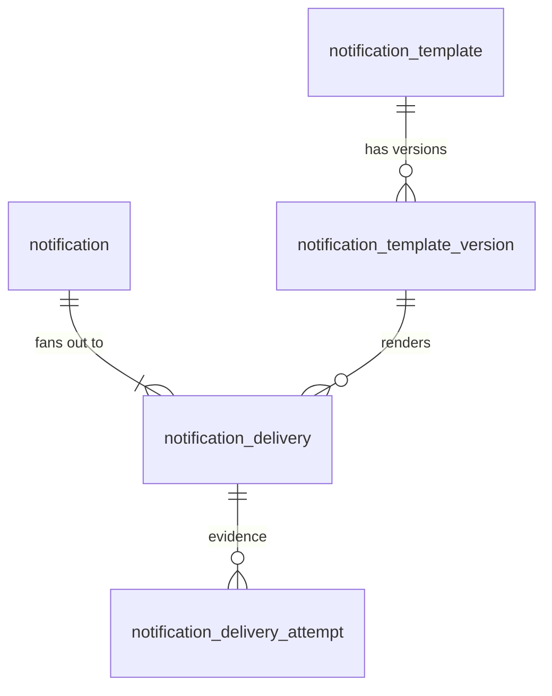

# notification-service

- **Status:** Draft (Stage 16.1 design). Implemented so far: the Stage 16.2 Auth envelope, the Stage 16.3 service foundation
  ([record](../architecture/stage-16/stage-16-3-service-foundation.md)) and the Stage 16.4 persistence and template catalog
  ([record](../architecture/stage-16/stage-16-4-persistence-and-templates.md)) and the Stage 16.5 event intake
  ([record](../architecture/stage-16/stage-16-5-notification-event-intake.md)) and the Stage 16.6 send API
  ([record](../architecture/stage-16/stage-16-6-notification-send-api.md)); nothing is sent yet
- **Owners:** Anwar (project owner)
- **Related ADD:** [core-architecture.md](../architecture/core-architecture.md) (service map, event catalog, §17.3 certification in
  [core-validation.md](../architecture/core-validation.md))
- **Related ADRs:** [0046](../adr/0046-notification-service-architecture.md) (this service's architecture), [0019](../adr/0019-twilio-as-sms-gateway-provider.md)
  (SMS provider), [0018](../adr/0018-rabbitmq-as-async-message-broker.md), [0027](../adr/0027-service-layer-security-model.md),
  [0033](../adr/0033-service-to-service-authentication-and-user-identity.md), [0034](../adr/0034-shared-service-kit-and-api-conventions.md),
  [0037](../adr/0037-reliable-events-outbox-inbox.md), [0042](../adr/0042-service-token-scopes-and-administrative-authorization.md)
- **Decisions and roadmap:** [Stage 16.1](../architecture/stage-16/stage-16-1-decisions-and-roadmap.md) (D1–D24, the 16.2–16.10
  plan)

## 1. Responsibility

Producers decide **why** and **when** something is communicated. Notification decides **how** and **where**, and remembers what
happened.

**Owns:**
- the notification intent;
- its channel deliveries and their attempts;
- templates, template versions and localization;
- rendering;
- scheduling and cancellation of a requested send;
- provider integration: retry, backoff, the ambiguity policy, and delivery status;
- idempotency of intake;
- delivery-time abuse limits;
- operational delivery history.

**Does not own:**

| Concept | Owner |
|---|---|
| Users, contact details (email, phone), push devices | Auth |
| Organizations, platforms, companies | Auth today, Organization later |
| Memberships | Auth |
| Invoices, subscriptions, entitlement | Billing |
| Payments | Payment |
| Any product concept (lessons, exams, students, …) | the product services |
| Deciding that a notification should exist, or when | the producer |
| Audit history | audit-service, Stage 18 |
| Files and attachments | file-service, Stage 17 |
| User preferences UI, delivery dashboards, template editors | future consumers of this API |

**Product-agnostic by construction:**
- `check:repo` already forbids product terms in `apps/notification-service/src/`;
- templates and event mappings are data (keys, variables), never branches on business meaning;
- there is no `if payment …` anywhere.

## 2. Architecture

```text
              Auth (events)                Core / product services (HTTP, service token)
                    │                                       │
      nawara.events (kit envelope,                POST /notification/notifications
      persistent, confirmed)                      (Idempotency-Key, caller policy)
                    ▼                                       ▼
          ┌────────────────────────── notification-service ──────────────────────────┐
          │ EventIntake (kit consumer)            SendApi                            │
          │     └──────── one DB transaction: notification + deliveries ─────────┘   │
          │                                                                          │
          │ DeliveryWorker (PollLoop): claim due deliveries (FOR UPDATE SKIP LOCKED) │
          │   → lease → commit → attempt STARTED (commit) → render → provider.send() │
          │   (outside any transaction) → record outcome                             │
          │ SecretPurge (PollLoop): purge ciphertext of finished / expired intents   │
          └───────────┬─────────────────────────────┬────────────────────────────────┘
                      ▼                             ▼
               EmailProvider (port)          SmsProvider (port) ── Twilio (ADR-0019)
               vendor: separate ADR (D2)     test provider in every non-production run
```

**Reused Core, unchanged:**
- `configureApp`, `JsonLogger`, request and correlation ids, `KitExceptionFilter`;
- `HealthModule` and `HttpDrain`, `ReadinessRegistry`;
- `DbModule` (bounded pool and deadlines, migrations with lock and checksum, the migrator / app roles);
- `RabbitMqEventBus.subscribe` (confirms, prefetch 5 = pool / 2, retry → `.retry` → `.dead`, `PermanentEventFailure`, the
  `nawara-dlq` and `nawara-check-dlq` tools);
- `PollLoop` (a bounded drain);
- `ServiceTokenGuard` and `ServiceAuthModule`;
- `RateLimitService`;
- the kit triggers (`forbid_column_change`);
- the Billing / Payment Dockerfile;
- the §17.3 certification harnesses.

Nothing Notification-specific is added to the kit in Stage 16.

**Dependencies:**
- PostgreSQL, its own `notification` database (ADR-0032);
- RabbitMQ (consume only);
- the email and SMS providers over HTTPS.
There is **no synchronous dependency on any Core service**: no call to Auth, Billing or Payment.

## 3. Data model



> **Implemented in Stage 16.4** (`db/migrations/0001_notification_schema.sql`), column for column. The additions are
> integrity guards only; the [Stage 16.4 record](../architecture/stage-16/stage-16-4-persistence-and-templates.md) §2 lists them:
> - the category foreign key;
> - the version pin on `(id, channel, locale)`;
> - create-`PENDING` only;
> - terminal rows final;
> - the attempt lifecycle.

Conventions follow Billing and Payment: camelCase quoted columns, `timestamptz` from the database clock, uuid ids generated by the
service, and CHECK constraints on every enumeration. The kit migrations `kit_0001`–`kit_0003` also apply. Their `outbox`, `inbox`
and `kit_rate_limit` tables are present; the outbox and inbox stay unused in V1 (see §11 and §16).

### 3.1 `notification`: the immutable communication intent

| Column | Notes |
|---|---|
| `id` uuid PK | |
| `sourceKind` text | `event` or `api` |
| `sourceService` text | `event`: the envelope's `source` header (for example `auth-service`); `api`: the calling service's name |
| `sourceEventId` uuid NULL | `event` only: the kit `eventId` |
| `idempotencyKey` text NULL, `requestHash` text NULL | `api` only: the `Idempotency-Key` header and the **HMAC-SHA-256** of the canonical request under `NOTIFICATION_REQUEST_HASH_KEY` (D25, Stage 16.6; it replaces the unkeyed SHA-256 of the Payment pattern, which would let a database reader brute-force a one-time code) |
| `templateId` uuid FK → `notification_template` | the logical template |
| `category` text | copied from the template (`SECURITY`, `TRANSACTIONAL` or `OPTIONAL`) for queries without a join |
| `organizationId` uuid NULL | NULL = platform-scoped |
| `recipientType` text NULL, `recipientId` text NULL | a generic reference, for example `user` + an Auth user id; never contact data |
| `requestedLocale` text NULL | as requested (BCP 47); resolution happens per delivery |
| `data` jsonb | the **non-secret** template variables, validated against the schema; ≤ 8 KB (CHECK) |
| `secretCiphertext` bytea NULL, `secretKeyId` text NULL | the secret variables, sealed together (§12.1); NULL when none or once purged |
| `scheduledAt` timestamptz NULL | when to send; NULL = now |
| `expiresAt` timestamptz NULL | never deliver after this (codes) |
| `correlationId` text NULL | |
| `cancelledAt` timestamptz NULL, `cancelledBy` text NULL | set once by a cancel (§9.3); deliveries carry the actual state |
| `createdAt` timestamptz | |

- **Constraints:**
  - `UNIQUE (sourceService, sourceEventId) WHERE sourceKind = 'event'`;
  - `UNIQUE (sourceService, idempotencyKey) WHERE sourceKind = 'api'`;
  - CHECK that exactly the right identity fields are set per `sourceKind`;
  - CHECK `expiresAt IS NULL OR scheduledAt IS NULL OR expiresAt > scheduledAt`;
  - `secretCiphertext` and `secretKeyId` are both set or both NULL.
- **Immutable** (`forbid_column_change`): every column except `secretCiphertext` and `secretKeyId` (NULL-only purge) and
  `cancelledAt` / `cancelledBy` (set once).
- **Indexes:**
  - the two unique keys;
  - `(sourceService, createdAt)` for per-caller reads;
  - `(organizationId, createdAt) WHERE organizationId IS NOT NULL`;
  - `(expiresAt) WHERE secretCiphertext IS NOT NULL` for the purge scan.
- **Personal data and secrets:**
  - `recipientId` and `data` may be personal data;
  - `secretCiphertext` is secret (encrypted).
- **Retention:** POLICY (see §17).

**No aggregate status is stored.** A notification's status is derived from its deliveries (§5.1), so two sources of truth cannot
disagree.

### 3.2 `notification_delivery`: one channel attempt-series for one intent

| Column | Notes |
|---|---|
| `id` uuid PK | also the provider-side reference / idempotency key (§8.4) |
| `notificationId` uuid FK | |
| `channel` text | `EMAIL`, `SMS` or `IN_APP` (CHECK). `IN_APP` is accepted by the schema, but no V1 path creates it |
| `destination` text NULL | the snapshot actually used: a normalized email or an E.164 phone; NULL for channels without an address (`IN_APP`) |
| `templateVersionId` uuid FK | **pinned at intake**: the exact version that renders this delivery |
| `locale` text | the resolved locale of that version |
| `status` text | §5.2 |
| `attempts` int | provider calls started |
| `ambiguousResends` int | 0 or 1 (§8.5) |
| `nextAttemptAt` timestamptz NULL | the due time while `PENDING` |
| `leaseUntil` timestamptz NULL | while `SENDING` |
| `provider` text NULL | the adapter id of the last attempt |
| `providerMessageId` text NULL | from an accepted attempt |
| `failureClass` text NULL, `failureCode` text NULL | a bounded code, never provider text |
| `sentAt`, `failedAt`, `completedAt` timestamptz NULL | `completedAt` = when the delivery became terminal |
| `createdAt`, `updatedAt` timestamptz | |

- **Constraints:**
  - `UNIQUE (notificationId, channel)`: one delivery per channel per intent. This is safe because a notification has exactly one
    recipient, and a second address on the same channel is a second notification. Relaxing it later is additive.
  - CHECK that the state fields agree with the status (for example `leaseUntil` NOT NULL ⇔ `SENDING`);
  - a state-transition trigger (the Payment attempt pattern);
  - `channel`, `destination`, `templateVersionId`, `locale` and `notificationId` are immutable.
- **Indexes:**
  - `(nextAttemptAt) WHERE status = 'PENDING'`: the due claim;
  - `(leaseUntil) WHERE status = 'SENDING'`: the expired-lease scan;
  - `(notificationId)` through the unique key.
- **Personal data:** `destination`.
- **Retention:** POLICY.

**Channel extension rule.** Channel-specific state never becomes a nullable column here. A future `IN_APP` delivery gets a 1:1
extension table (`notification_inbox_item`: presentation payload, `readAt`, `archivedAt`), and so does `PUSH`. See §15.

### 3.3 `notification_delivery_attempt`: append-oriented provider evidence

| Column | Notes |
|---|---|
| `id` uuid PK | |
| `deliveryId` uuid FK | |
| `attemptNumber` int | |
| `provider` text | |
| `startedAt` timestamptz | |
| `completedAt` timestamptz NULL | |
| `outcome` text | `STARTED`, `ACCEPTED`, `RETRYABLE_FAILURE`, `TERMINAL_FAILURE` or `AMBIGUOUS` |
| `providerMessageId` text NULL | |
| `failureCode` text NULL | bounded |
| `latencyMs` int NULL | |

- **Constraints:** `UNIQUE (deliveryId, attemptNumber)`. The row is inserted as `STARTED` and completed **exactly once**:
  `STARTED` → one final outcome, enforced by a trigger. It is immutable afterwards.
- **Retention:** SRE (operational evidence).
- There is no raw provider response, no request and no body.

### 3.4 `notification_template` and `notification_template_version`

**`notification_template`**

| Column | Notes |
|---|---|
| `id` uuid PK | |
| `key` text | a stable dotted key, for example `identity.contact_verification_code`, `^[a-z][a-z0-9_]*(\.[a-z0-9_]+)+$` |
| `category` text | `SECURITY`, `TRANSACTIONAL` or `OPTIONAL` |
| `ownerScope` text | `platform` in V1; `organization` reserved |
| `organizationId` uuid NULL | NULL in V1; a future organization override |
| `description` text | |
| `createdAt` timestamptz | |

- `UNIQUE (key) WHERE organizationId IS NULL`.

**`notification_template_version`**

| Column | Notes |
|---|---|
| `id` uuid PK | |
| `templateId` uuid FK | |
| `channel` text | |
| `locale` text | BCP 47, for example `fr`, `ar`, `en` |
| `version` int | ≥ 1 |
| `variables` jsonb | the schema, §6.2 |
| `subject` text NULL | email only |
| `bodyText` text | every channel |
| `bodyHtml` text NULL | email only, optional |
| `smsMaxSegments` int NULL | SMS only |
| `checksum` text | SHA-256 of the canonical content |
| `publishedAt` timestamptz | |

- `UNIQUE (templateId, channel, locale, version)`.
- The whole row is immutable (`forbid_column_change` on every column), and there is no delete (a trigger).
- **The active version** of `(template, channel, locale)` is the highest `version`.
- **Publishing** means a migration inserts a higher version. The migration runner's checksum makes past content tamper-evident.
- **The publish-time check** runs in the migration and in a unit test over the template files: every template has at least the
  platform default locale for every channel it declares; the variables used in the content equal the schema's variables; SMS
  static text fits `smsMaxSegments`.
- **Retention:** kept (small; needed to explain past deliveries).

### 3.5 Not persisted

- Rendered bodies (see D18).
- Raw provider requests and responses.
- Provider credentials: configuration and secrets only.
- Preferences: deferred.
- Push devices: Auth.
- Files: File Service.
- A separate idempotency table: the API path has a single operation, so its key lives on `notification` (see §7). The Payment
  table exists for several operations.

## 4. Identity and idempotency

| Level | Identity | Guarantee |
|---|---|---|
| Logical notification (event) | `(sourceService, sourceEventId)` | a duplicate delivery of the same event creates nothing; the handler acknowledges |
| Logical notification (API) | `(sourceService, idempotencyKey)` + `requestHash` | the same key and hash replays the original answer; the same key with a different hash is `422 idempotency_key_reused` |
| Delivery | `(notificationId, channel)` | created in the same transaction as the notification; never re-created |
| Attempt | `(deliveryId, attemptNumber)` | one row per provider call; `STARTED` is committed before the call |
| Provider reference | `delivery.id` | sent as the provider idempotency key / client reference **where the provider supports one**, so a resend of the same delivery can be deduplicated by the provider. Twilio's Messages API has no idempotency key |

**The contract:** exactly-once internal intent, at-least-once processing, best-effort external deduplication. Exactly-once
network delivery to a provider is **not** claimed.

## 5. State machines

### 5.1 Notification (derived, not stored)

| Derived status | Condition |
|---|---|
| `CANCELLED` | `cancelledAt` is set and every delivery is `CANCELLED`, or terminal from before the cancel |
| `IN_PROGRESS` | any delivery is `PENDING` or `SENDING` |
| `COMPLETED` | every delivery is terminal |

The API returns the derived value with the per-delivery states.

### 5.2 Delivery

```text
                 intake (due now or at scheduledAt)
                          │
                          ▼
   ┌──────────────► PENDING ───────────── cancel ──────────────► CANCELLED
   │                   │  └───── expiresAt passed ─────────────► EXPIRED
   │   retryable,      │ claim (due, SKIP LOCKED, lease)
   │   or one          ▼
   │   ambiguous ◄── SENDING ─── provider ACCEPTED ────────────► SENT
   │   resend of a     │    ├─── TERMINAL failure / max attempts
   │   code            │    │    / rate_limited / render error ─► FAILED
   │                   │    ├─── AMBIGUOUS, no resend allowed ─► UNCONFIRMED
   │                   │    └─── expiresAt passed at the pre-send check ─► EXPIRED
   └───────────────────┘
        lease expired with an unfinished attempt → the ambiguity policy (§8.5)
```

- **Statuses:** `PENDING`, `SENDING`, `SENT`, `FAILED`, `UNCONFIRMED`, `EXPIRED`, `CANCELLED`. The last five are terminal.
- **Normalization:**
  - "scheduled", "queued" and "retry" are all `PENDING` with a due `nextAttemptAt`, so there is one claimable state and one
    index;
  - "ambiguous" is an **attempt** outcome; the delivery either goes back to `PENDING` (one resend of a code) or ends `UNCONFIRMED`.
- **Allowed transitions** (a trigger refuses any other):

  | From | To |
  |---|---|
  | `PENDING` | `SENDING`, `CANCELLED`, `EXPIRED` |
  | `SENDING` | `SENT`, `PENDING`, `FAILED`, `UNCONFIRMED`, `EXPIRED` |

- A terminal status is final. `IN_APP` read / archive state lives in its extension table, not here.

### 5.3 Attempt

`STARTED` → exactly one of `ACCEPTED`, `RETRYABLE_FAILURE`, `TERMINAL_FAILURE` or `AMBIGUOUS`.

`AMBIGUOUS` is written in two ways:
- the provider adapter returned `ambiguous` (a timeout after the request was sent);
- a worker reclaiming an expired lease finds a `STARTED` attempt with no completion. It then marks it `AMBIGUOUS` with
  `failureCode = worker_lost` before applying §8.5.

So ambiguity is always an explicit, recorded outcome; nothing is left to inference later.

## 6. Templates, rendering and localization

### 6.1 Authoring (V1)

- Template content lives in the repository as data files: one directory per template key, one file per channel and locale.
  Implemented in 16.4 (`apps/notification-service/templates/`): `<key>/<CHANNEL>.<locale>.v<N>.json`, plus `catalog.json`, whose
  `requiredLocales` every channel must cover. The configured platform default locale (16.5) must be one of them.
- A migration generated from those files publishes a version; the migration runner's checksum and the immutable rows make it
  tamper-evident.
- Changing content means a new version in a new migration. An older version remains, and so do the deliveries pinned to it.
- There is no runtime authoring API and no editor in Stage 16. Organization overrides reuse the same tables with
  `ownerScope = 'organization'` later.

### 6.2 Variable schema

A deliberately small, closed type system, stored in `variables`:

```json
{ "code": { "type": "code", "required": true, "secret": true, "maxLength": 12 },
  "expiresAt": { "type": "datetime", "required": true } }
```

- **Types:** `string` (`maxLength` required), `integer`, `datetime` (ISO 8601 UTC in, rendered per locale and the platform time
  zone), `code` (digits and letters, `maxLength`) and `url` (https only).
- **`secret: true` (a flag on a `code` or `string`, not a type):** the variable is routed to the sealed secret store (§12.1), never to `data`, and never appears in a log or
  an API response.
- **Validation happens at intake:**
  - a missing required variable, a wrong type, an over-length value or an **unknown variable** is refused;
  - on the API path that is `422 invalid_template_data`;
  - on the event path it is a `PermanentEventFailure('invalid_template_data')`, which goes to the DLQ.
- Nothing invalid reaches the worker. The renderer re-validates defensively; a render error is terminal (`FAILED`,
  `render_failed`) and is never retried.

### 6.3 Rendering

- **Syntax:** `{{name}}` interpolation only. There are no expressions, conditionals, loops, partials, helpers, includes or
  template-controlled code; unknown placeholders fail the publish check. It is a small in-repo renderer, not a template library.
- **Escaping:**
  - variables are HTML-escaped in `bodyHtml`;
  - in `bodyText` and the email subject they are inserted as text, with CR/LF refused in the subject (no header injection);
  - `url` values must be https and are attribute-escaped in HTML.
- **Determinism:** the same pinned version, the same variables and the same locale give the same bytes. Datetimes are formatted
  with `Intl` for the resolved locale in the configured platform time zone. A per-recipient time zone is deferred (D22).

### 6.4 Localization

Resolution happens at intake, per delivery, and pins `templateVersionId` and `locale`. The first match wins:
1. the exact requested locale (`fr-TN`);
2. its base language (`fr`);
3. `NOTIFICATION_DEFAULT_LOCALE` (the platform default, configuration, required).

The publish-time check guarantees step 3 always matches, so resolution cannot fail at runtime.
- An organization default locale is a future step between 2 and 3.
- The locale list (`ar`, `fr`, `en`, `it`, …) is open. Adding a locale is adding template versions, never schema.
- Auth events carry no locale today, so they resolve to the platform default.

### 6.5 Email

- The subject is required.
- The **plain-text body is required**, and an HTML body is optional: multipart/alternative when present.
- HTML is static template markup plus escaped variables; no variable can inject markup.
- There are no remote images or scripts in V1 templates (a publish-check lint).
- The sender (`From`) is platform configuration (D14), never caller-supplied.

### 6.6 SMS

- Body only, with no subject.
- The adapter computes the encoding (GSM-7 or UCS-2; Arabic is UCS-2) and the segment count before sending.
- More segments than `smsMaxSegments` means terminal `FAILED content_too_long`, and the provider is never called with an
  oversize or costly message.
- The publish check runs the same computation on the static text with maximum-length variables.

## 7. Intake contracts

### 7.1 Events (Core producers only)

**The flow:**
1. The kit `RabbitMqEventBus` delivers on queue `notification.events`, bound only to the mapped routing keys.
2. The mapping for `(source, name)` is looked up. An unknown pair is `PermanentEventFailure('unmapped_event')`.
3. The payload is validated against the mapping and the template schema.
4. **One transaction:** insert the `notification` (unique source identity) and its deliveries, pinning the version and locale.
5. The handler returns, and the kit acknowledges.

A duplicate is the unique violation on `(sourceService, sourceEventId)`: the handler returns and the kit acknowledges, with no new
row. The handler never calls a provider.

**The mapping** is a declarative registry in code: data, not branches. Each entry has:
- `source`, `name`, `version`;
- `template` (a key) and `category`;
- `channelFrom`: a payload field, mapped `email` → `EMAIL` and `phone` → `SMS`;
- `destinationFrom`, `recipient` (`{ type: 'user', idFrom: 'userId' }`), `organizationFrom` (a field or `null`);
- `variables` (payload field → template variable);
- `expiresAtFrom` (a field or none).

Future Core producers either add a mapping entry (event intake, for producers that must not call Notification synchronously) or
use the API.

> **Implemented in Stage 16.5** as specified here, with these refinements (see the Stage 16.5 record):
> - **invalid destination:** it becomes `FAILED invalid_destination` inside the intake transaction, along the allowed path `PENDING →
>   SENDING → FAILED` (no attempt), and no secret is kept for it;
> - **payload:** unknown extra fields are ignored and never stored;
> - **start order:** the consumer starts only after the database, the migrations and the default-locale coverage are verified;
> - **readiness:** `rabbitmq` plus `event-intake`.

**The initial mapping** (Stage 16.5), taken exactly from Auth's current publishers. The source is `auth-service` and the version is
1 for every row; `userId` is always the recipient; "dest" means `channel` + `destination`.

| Event | Payload fields today | Organization | Channel | Template key (V1) | Expiry | Secret |
|---|---|---|---|---|---|---|
| `member.contact_verification_requested` | `userId`, dest, `code`, `expiresAt` | NULL (none in the payload) | from `channel` | `identity.contact_verification_code` | `expiresAt` | `code` |
| `admin.operator_code_issued` | `userId`, dest, `code`, `expiresAt`, `timestamp` | NULL (platform-level) | from `channel` | `identity.operator_login_code` | `expiresAt` (the shift end) | `code` |
| `admin.operator_confirmation_code_issued` | as above | NULL | from `channel` | `identity.operator_confirmation_code` | `expiresAt` | `code` |
| `admin.owner_recovery_requested` | `userId`, dest, `availableAt`, `ipAddress`, `timestamp` | NULL | from `channel` | `identity.owner_recovery_requested` | none | none (`ipAddress` is personal data) |
| `admin.owner_recovery_completed` | `userId`, dest, `ipAddress`, `timestamp` | NULL | from `channel` | `identity.owner_recovery_completed` | none | none |
| `admin.owner_login_from_new_device` | `userId`, contact (`channel`, `destination`), `ipAddress`, `timestamp` | NULL | from `channel` | `identity.owner_new_device_login` | none | none |
| `membership.approved` / `membership.rejected` / `membership.revoked` | `userId`, `organizationId`, dest, `timestamp` | `organizationId` | from `channel` | `membership.approved` / `.rejected` / `.revoked` | none | none |

Notes on this mapping:
- **Not consumed** (no destination in the payload; Notification does not resolve contacts): `user.registered`,
  `membership.requested`, `membership.admin_provisioned`. Adding them needs Auth to include the destination or a
  recipient-resolution decision (D8).
- **A destination may be NULL** when the user has neither contact. The event is then refused as
  `PermanentEventFailure('no_destination')`; Auth only publishes after resolving a contact, so this is defensive.
- **Phones:** Auth accepts `+?[0-9]{8,15}` (the `+` is optional), not E.164. A non-E.164 destination fails the delivery
  `invalid_destination`. That is terminal and visible, never guessed at: see D20.
- **Operator code lifetime:** the shift end, possibly hours away. That is fine, since expiry is enforced per delivery.
- **The Stage 16.2 prerequisite:** met. Auth now publishes the kit envelope and the kit consumer accepts every Auth event (§14).
  Before 16.2 these messages had no envelope and were rejected as `malformed_envelope`.

### 7.2 API

**`POST /notification/notifications`** (a service token; `Idempotency-Key` required, 8–128 characters of `[A-Za-z0-9._:-]`)

```json
{ "template": "identity.contact_verification_code",
  "organizationId": "8c2…" ,            // nullable; must be allowed by the caller's policy
  "recipient": { "type": "user", "id": "u-123" },      // optional generic reference
  "locale": "fr-TN",                     // optional
  "channels": [ { "channel": "EMAIL", "destination": "a@b.test" },
                { "channel": "SMS",   "destination": "+21620000000" } ],
  "data": { "code": "482913", "expiresAt": "2026-09-24T12:00:00Z" },
  "scheduledAt": "2026-09-25T08:00:00Z", // optional, ≤ NOTIFICATION_MAX_SCHEDULE_AHEAD
  "expiresAt": "2026-09-24T12:00:00Z" }  // optional
```

- `202 Accepted`, `{ "id", "status": "accepted", "deliveries": [ { "id", "channel", "status": "PENDING" } ] }`.
- The same key and the same hash replays the same `202` body; the same key with a different hash is
  `422 idempotency_key_reused`.
- **Errors:**
  - `400 validation_error` / `idempotency_key_required`;
  - `401` (no, bad, malformed or user-shaped token);
  - `403 template_not_allowed` / `channel_not_allowed` / `organization_not_allowed` (the caller policy);
  - `404 unknown_template`;
  - `422 invalid_template_data` / `invalid_destination` / `duplicate_channel` / `schedule_out_of_range`;
  - `429 rate_limited` (the per-caller intake limit).
- It **never** waits for a provider.
- **The request hash** covers the whole body except whitespace, including the destinations and data. It is stored as a hash
  only.
- Secret variables are sealed (§12.1) and the hash is computed before sealing, so the plaintext never persists.
- **Superseded in Stage 16.6 (D25):** the hash is **keyed**: `HMAC-SHA-256(NOTIFICATION_REQUEST_HASH_KEY, "nawara.notification.api.v1|"
  + canonicalJson(body))`.
  - An unkeyed SHA-256 of a body holding a low-entropy one-time code, with every other field stored in clear beside it, would let a
    database reader recover a live code in about a second.
  - Secret variables stay inside the hash: a changed code under the same key is `422 idempotency_key_reused`.
  - Payment keeps its unkeyed hash, since its bodies hold no such secret.
  - Key rotation and versioning is a Stage 16.9 item. See the
    [Stage 16.6 record](../architecture/stage-16/stage-16-6-notification-send-api.md) §5.

> **Implemented in Stage 16.6** as specified above, with these refinements (the Stage 16.6 record):
> - the schedule bound is `NOTIFICATION_MAX_SCHEDULE_AHEAD_SEC` (the unit named);
> - `expiresAt` must also be in the future and after `scheduledAt` (`schedule_out_of_range`);
> - the `409 delivery_in_progress` states the cancelled / in-flight counts in its message, because the kit error envelope carries no
>   list;
> - an invalid destination on the API is `422` with nothing written; the event intake keeps its durable `FAILED` delivery.

**`GET /notification/notifications/:id`** (a service token; only the **creating caller**)

```json
{ "id", "template": "identity.contact_verification_code", "category": "SECURITY", "organizationId", "status": "IN_PROGRESS",
  "createdAt", "scheduledAt", "expiresAt", "cancelledAt",
  "deliveries": [ { "id", "channel": "SMS", "status": "SENDING", "attempts": 1, "locale": "fr",
                    "templateVersion": 2, "destinationHint": "…00", "sentAt": null, "failureCode": null } ] }
```

- It never returns `data`, secrets, full destinations (only the last 2 characters as a hint), provider messages or credentials.
- A notification the caller did not create is `404` (collapsed, like every Core service).

**`POST /notification/notifications/:id/cancel`** (a service token; only the creating caller; no body)
- `200` with the representation above. Every `PENDING` delivery is now `CANCELLED`.
- It is idempotent: calling it again, or on an already cancelled notification, is `200` with the same state.
- `409 delivery_in_progress` when one or more deliveries are `SENDING`. The pending ones *are* cancelled, and the response
  lists what was cancelled.
- A notification whose deliveries are all terminal is `200` and nothing changes.

**No list, search or admin query API in Stage 16.** The `(sourceService, createdAt)` and `(organizationId, createdAt)` indexes
keep a later operational query cheap.

## 8. Delivery engine

### 8.1 Claim (the Billing dispatcher + Payment resolver patterns)

```sql
SELECT … FROM notification_delivery
 WHERE status = 'PENDING' AND "nextAttemptAt" <= now()
 ORDER BY "nextAttemptAt", id LIMIT $batch FOR UPDATE SKIP LOCKED
```

1. Claim: set `status = 'SENDING'`, `leaseUntil = now() + lease`, `attempts = attempts + 1`, and commit.
2. For each claimed delivery:
   - re-check `expiresAt` and the parent `cancelledAt`;
   - apply the rate limits (§11.3);
   - insert the attempt `STARTED` and **commit**;
   - render;
   - call the provider **outside any transaction**;
   - record the outcome in one transaction (attempt completion + delivery transition).
3. Renew the unsent claims every lease / 4 (the Stage 15.8 dispatcher renewal).

An expired lease (`status = 'SENDING' AND leaseUntil < now()`, a crashed or partitioned worker) is reclaimed by the next pass
through §8.5.

### 8.2 Startup relationships (refused when violated)

- lease ≥ 2 × the largest provider `timeoutMs` (Stage 15.8);
- delivery-worker drain ≥ the provider timeout, so an in-flight send can finish at shutdown;
- the provider timeout < the 60 s stop grace minus the HTTP drain.

The values are set in 16.7 and 16.8 from measurement, never guessed here.

### 8.3 Retry and backoff

| Provider / adapter result | Class | Delivery |
|---|---|---|
| accepted (2xx + a message id) | `ACCEPTED` | `SENT` |
| 429 | `RETRYABLE_FAILURE` | `PENDING`, `nextAttemptAt` = max(backoff, the `Retry-After` hint), bounded by the ceiling |
| 5xx, connection refused, DNS failure, TLS failure, a timeout **before** the request was written | `RETRYABLE_FAILURE` | `PENDING` with backoff |
| a timeout **after** the request was written; the connection reset mid-response | `AMBIGUOUS` | §8.5 |
| 4xx invalid address, blocked recipient, content rejected | `TERMINAL_FAILURE` | `FAILED` (a bounded code) |
| provider 401 / 403 (our credentials) | `RETRYABLE_FAILURE` + an `error` log (`provider_auth_fault`) | `PENDING` with backoff, up to the maximum. It is a configuration fault, alerted, never silently terminal |

- **Backoff:** `base × 2ⁿ`, with ±20 % jitter and a `ceiling`.
- **It stops at** `maxAttempts` (then `FAILED retries_exhausted`) or at `expiresAt` (then `EXPIRED`), whichever comes first.
- `base`, `ceiling` and `maxAttempts` are bounded configuration; the defaults are chosen in 16.7 (none is invented here).

### 8.4 Provider port

```ts
interface ChannelProvider {
  readonly id: string;                       // 'twilio', 'test', …
  readonly channel: 'EMAIL' | 'SMS';
  readonly capabilities: { timeoutMs: number; idempotencyKey: boolean; maxSmsSegments?: number };
  send(message: RenderedMessage, ctx: { reference: string /* delivery id */; attemptId: string }):
    Promise<
      | { kind: 'accepted'; providerMessageId: string }
      | { kind: 'rejected'; failureClass: 'retryable' | 'terminal'; code: string; retryAfterMs?: number }
      | { kind: 'ambiguous'; code: string }>;
}
```

- The domain depends only on this port. A `TestProvider` with scenarios (accept, retryable, terminal, timeout-after-accept, hang,
  429 with `Retry-After`) runs in every non-production run, like Payment's test provider.
- The real adapters (Twilio SMS; the email vendor per D2) live behind flags, and production refuses to start with the test
  provider enabled.
- Adapters return **bounded codes only**. Raw provider bodies are never stored or logged.

### 8.5 Ambiguity policy (frozen)

When an attempt ends `AMBIGUOUS`:
- **The notification has a `secret` variable (a one-time code), and all of these hold:**
  - `ambiguousResends = 0`;
  - `now() < expiresAt`;
  - the secret is still sealed.
  → `ambiguousResends = 1` and the delivery goes back to `PENDING` (due at once). The resend carries **the same code**, pinned to
  the same version, with the same provider reference.
- **Otherwise:** the delivery ends `UNCONFIRMED` (terminal) and is **not resent automatically**. Security and general alerts are
  never duplicated on a guess.
- The worst case for a code is two messages with the same code, which is harmless. An alert may be lost when the provider in
  fact failed; that is visible as `UNCONFIRMED`.

## 9. Scheduling and cancellation

### 9.1 Scheduling (V1: API only)

- `scheduledAt` sets the deliveries' first `nextAttemptAt`.
- There is no separate "scheduled" state, and no scheduler process beyond the delivery worker's due scan.
- `scheduledAt` must be in the future and ≤ `NOTIFICATION_MAX_SCHEDULE_AHEAD`, a bounded configuration value set in 16.6.
- **Events are immediate.** A producer that wants "one day before" computes the time and calls the API; Notification never
  derives times from business data.

### 9.2 Why V1

The cost is one column and one API field on the existing due-time claim. Deferring it would force a later API change for every
future producer. No current producer needs it, which is why it is limited to the API.

### 9.3 Cancellation race (frozen contract)

1. The cancel runs, in one transaction:
   - `UPDATE notification SET cancelledAt = now() WHERE id = $1 AND cancelledAt IS NULL`;
   - `UPDATE notification_delivery SET status = 'CANCELLED' WHERE notificationId = $1 AND status = 'PENDING'`.
2. The worker's claim takes `PENDING` rows `FOR UPDATE SKIP LOCKED`. A row is either still `PENDING` (the cancel wins) or already
   `SENDING` (the claim won).
3. **Guarantee:**
   - a `CANCELLED` delivery is never sent;
   - a `SENDING` delivery may still be sent, and the cancel reports `409 delivery_in_progress`;
   - the pre-send check reads `cancelledAt`, which closes the window between the claim commit and the provider call.

## 10. Priority and preferences

- **Priority:** not in V1. Deliveries are served in `nextAttemptAt` order. A priority field without bulk producers would have no
  observable meaning. When bulk producers arrive, priority is added as ordering only, with aging, and never bypasses security,
  rate limits, idempotency or provider safety (D17).
- **Preferences:** not in V1.
  - Every template has a `category`: `SECURITY` (never suppressible), `TRANSACTIONAL` (suppressible only by product decision) or
    `OPTIONAL` (subject to preferences).
  - A future preference check sits at intake: an `OPTIONAL` delivery for a recipient who opted out ends `CANCELLED` with a reason.
  - Where preferences are stored (in Notification or a future profile capability) is decided with the first `OPTIONAL` template
    (D9).
  - Every V1 template is `SECURITY` or `TRANSACTIONAL`.

## 11. Security, tenancy, abuse

### 11.1 Service authentication

- Every Stage 16 route uses `ServiceTokenGuard` with `SERVICE_TOKENS` (hashed tokens, ADR-0033).
- A missing, invalid, malformed or user-shaped token is `401`, with **0 writes**.
- There is no user-facing route in Stage 16.

### 11.2 Caller policy

`NOTIFICATION_SERVICE_POLICY` JSON, parsed and validated at startup (the Organization `SERVICE_POLICY` pattern). A registered
caller without an entry refuses to boot.

```json
{ "callers": { "some-core-service": { "templates": ["membership.approved"], "channels": ["EMAIL", "SMS"],
                                       "organizations": "request" } } }
```

- **`templates`:** an explicit list. There is no wildcard and no raw-content send.
- **`channels`:** an explicit list.
- **`organizations`:** `"none"` (platform-level only; `organizationId` must be NULL) or `"request"` (the caller asserts an
  organization, trusted as for other Core producers, and recorded).
- **Reads and cancels** are always limited to `sourceService = caller`, so caller A never sees or cancels caller B's
  notifications, whatever the organization.
- **Event intake** has its own static allowlist: the mapping table (§7.1), keyed by `(source, name)`. Anyone with broker
  credentials can publish; this is the existing platform trust boundary, not a new one.

### 11.3 Abuse and cost

The kit `RateLimitService` applies at claim time, before the provider call.
- **Buckets:**
  - `notif_dest`: channel + normalized destination, per window;
  - `notif_caller_template`: source + template, per window;
  - API intake: `notif_api_caller` per caller (`429` at intake).
- **When exceeded:** the delivery ends `FAILED rate_limited` (terminal, never retried, logged `notification_delivery_failed
  reason=rate_limited`).
- The limits are bounded configuration, set above the producers' own throttles, so only abuse or bugs reach them.
- Auth's code throttles stay the primary control.
- **Known residual:** `kit_rate_limit` keys are an unpeppered SHA-256 of `bucket:identifier`. A phone-number key is
  brute-forceable, so it is classified as personal data, and a peppered key is a kit follow-up (D21).

### 11.4 Secrets and personal data

See §12. The **logging rule** (enforced by a unit test over log lines and by the certification's sensitive scan): never log a
destination, a code or any secret variable, `data`, a rendered subject or body, an Authorization header, a service token, a
provider credential or a cookie.

## 12. Data protection

### 12.1 Secret variables

- **Sealing:** AES-256-GCM.
  - The key ring is `NOTIFICATION_SECRET_KEYS` (`id:base64(32 bytes),…`) plus `NOTIFICATION_SECRET_ACTIVE_KEY_ID` (Auth's TOTP
    ring pattern).
  - Fresh 96-bit nonce per seal; AAD `nawara.notification.v1|<notificationId>`.
  - All secret variables of one notification are sealed together into `secretCiphertext`, with the `secretKeyId` recorded.
  - The key is never in the database.
- **Plaintext** exists only in the intake request's memory and in the worker while rendering and sending.
- **Purge:** `secretCiphertext` is set to NULL by the `SecretPurge` worker (a `PollLoop`) when:
  - every delivery of the notification is terminal (`SENT`, `FAILED`, `UNCONFIRMED`, `EXPIRED`, `CANCELLED`); or
  - `expiresAt` has passed.
  The ambiguity resend of §8.5 can only happen while the ciphertext is present.
- **Rotation:** add a key and make it active; old keys stay until no row references them. Codes live at most until their
  `expiresAt`, and the ciphertext is purged by then.

### 12.2 Classification

| Data | Class | Stored | Logged |
|---|---|---|---|
| Destination (email / phone) | personal data | `notification_delivery.destination` | never (only `destinationHint`, the last 2 characters, in API responses; a keyed HMAC is not needed in V1) |
| `recipientId` | personal-data reference | `notification` | as an id, yes (the Core logging convention: opaque ids) |
| `data` (non-secret variables, for example an IP address in recovery notices) | potentially personal data | `notification.data` | never |
| One-time code / secret variable | secret | encrypted, then purged | never |
| Rendered subject / body | potentially sensitive | **never stored** | never |
| Provider message id, attempt metadata, failure code, latency | operational | yes | yes |
| Correlation id, notification / delivery / attempt ids, template key / version, channel, provider, `organizationId` | operational | yes | yes |

### 12.3 Rendered content: decision

Option **B**: store the pinned template version + non-secret data + the sealed secrets (purged); never a rendered body.
- **Why:** the exact message can be re-rendered for debugging while the secret still exists, and afterwards everything except the
  code is known.
- **Rejected:**
  - A (a full body): it duplicates personal data and stores codes in plaintext;
  - C (a separate rendering snapshot): the same personal data, with no benefit given immutable versions.
- A legal requirement to keep sent content would reopen this (D18).

## 13. Failure and recovery

| Failure | Resulting state | Retry | DLQ | Operator | Duplicate risk | Data kept |
|---|---|---|---|---|---|---|
| Database unavailable at intake (event) | nothing written; the handler fails | the kit retries 3 × 5 s, then DLQ | yes | replay after recovery (15.7 runbook) | none (unique source) | the message in the DLQ |
| Database unavailable at intake (API) | 500 (the O3 semantics, unchanged); the caller retries with the same key | caller | – | – | none | – |
| Database frozen | bounded by `DB_QUERY_TIMEOUT_MS`; as above | as above | as above | as above | none | – |
| Database down in the worker | the pass fails, logged `*_pass_failure`; claims roll back or leases expire | the next pass | – | none | leased and unfinished → §8.5 | – |
| RabbitMQ unavailable / consumer connection lost | kit supervision reconnects; `/ready` 503; the API and worker keep working | automatic | – | none | none | messages stay in the queue |
| Duplicate event | unique violation → acknowledged | – | – | none | none | – |
| Malformed envelope / payload / unmapped event / unknown template / invalid data / no destination | `PermanentEventFailure` | none | immediate | inspect; replay after a fix | none | the message in the DLQ (may contain a code, §13.1) |
| Template data invalid (API) | `422` | – | – | – | – | – |
| Provider 429 | `PENDING` with `Retry-After` / backoff | yes | – | none | none | – |
| Provider 5xx / connection refused / timeout before send | `PENDING` with backoff | yes | – | alert after the maximum | none | – |
| Provider timeout after a possible accept | attempt `AMBIGUOUS` → §8.5 | a code: once | – | none | possible (the same code) | – |
| Worker killed before the provider call | the lease expires; a `STARTED` attempt with no call made → still treated as `AMBIGUOUS` (we cannot prove the call was not made) | §8.5 | – | none | low | – |
| Worker killed during / after provider accept | as above | §8.5 | – | none | possible for codes | – |
| Lease expiry while still sending (a partitioned worker) | the reclaimer marks the attempt `AMBIGUOUS`; the late result of the old worker is refused by the status/attempt guard (a conditional update on `attempts` and `status`) | §8.5 | – | none | possible for codes | – |
| Service restart with pending work | the next pass claims due rows; expired leases are reclaimed | automatic | – | none | as above | – |
| SIGTERM during a delivery | §14.3 | – | – | none | only if the drain bound is exceeded | – |
| Code expiry | `EXPIRED` at claim or pre-send; the secret is purged | no | – | none | none | – |
| Scheduled-cancel race | §9.3 | – | – | – | none | – |
| Rate limit exceeded | `FAILED rate_limited` | no | – | investigate the caller or destination | none | – |
| Provider credentials wrong (401/403) | retryable + `provider_auth_fault` error | up to the maximum | – | fix the configuration | none | – |
| DLQ replay of an expired code | intake records the notification with its deliveries `EXPIRED` at the claim; never sent | – | removed from the DLQ by the replay | the runbook | none | – |

### 13.1 DLQ and code TTL (frozen)

- ADR-0027 asked for a "short message TTL" on the code queue. A RabbitMQ TTL on a queue whose dead-letter exchange is the kit's
  `.dead` queue would **move expired codes into the DLQ** (still retained); a TTL on `.dead` would **purge unseen messages**,
  which the 15.7 policy forbids. **Neither is adopted, and no kit change is needed.**
- **The actual guarantee is `expiresAt`, enforced by Notification:**
  - a code is never sent after its expiry, however late it is consumed or replayed;
  - a replay of an expired code-bearing message is recorded `EXPIRED` and never sent;
  - the operator's list (`nawara-dlq list`) never prints payloads (only the fields asked for by name).
- **Residual risk (accepted, SRE):**
  - codes sit on broker disk while queued or dead-lettered;
  - the `nawara-check-dlq` alarm plus the runbook keep that window short;
  - the broker is inside the trusted boundary.

## 14. Auth prerequisite (Stage 16.2)

> **Status: implemented and validated in Stage 16.2** as designed below, with a real-broker proof that the kit consumer accepts
> every Auth event. See [the Stage 16.2 record](../architecture/stage-16/stage-16-2-auth-event-envelope.md) for the event inventory,
> the envelope, the bounds (sequential publishing, a 1000-event backlog, a 5 s shutdown drain) and the evidence.
> "The gap today" below describes the state before 16.2.

**The gap today** (`apps/auth-service/src/events/events-publisher.service.ts`):
- `AmqpConnection.publish(EVENTS_EXCHANGE, routingKey, payload)` sends no `messageId`, no `type`, no headers, `persistent` unset,
  and no confirm;
- the kit consumer dead-letters such a message as `malformed_envelope`.

**The change in 16.2:** Auth's `EventsPublisherService` publishes through the kit's `RabbitMqEventBus.publish` (the one canonical
format). The envelope:
- `id = eventId` = a new uuid per publish;
- `name` = the routing key;
- `payload` unchanged;
- headers `eventId`, `occurredAt` (now), `source: 'auth-service'`, `version: 1`, `correlationId` (the request context);
- the kit sets `messageId`, `type`, `timestamp`, `persistent: true` and waits for the **publisher confirm**, bounded by
  `RABBITMQ_CONFIRM_TIMEOUT_MS`.

From the caller's side it stays **fire-and-forget**: the service method does not await it; a failure is logged
`event_publish_failure` and not retried (F14). `AUTH_EVENTS`, `RABBITMQ_URL` and the production value (`off` until Stage 20/22)
are unchanged. Removing `@golevelup/nestjs-rabbitmq` from Auth is part of 16.2 if nothing else uses it.
- **Class:** B (additive): payloads unchanged, no consumer exists today.
- **Re-certification:** Auth unit / E2E, Auth–Organization E2E, and a new real-broker test proving the kit consumer accepts Auth
  events.

**Auth outbox: deferred (D19).**
- Without it, an Auth transaction can commit while its event is lost (a broker outage, a crash between the commit and the confirm).
- For codes, the user asks again (Auth's throttles apply). For notices, one notice is lost.
- A transactional Auth outbox is a Class C change to Auth, which Phase C certified. It is recorded, not built, in Stage 16.

## 15. Future channels and extensions (no V1 code)

- **IN_APP:**
  - an `IN_APP` delivery with `destination` NULL, rendered from an `IN_APP` template version (`bodyText` as title / body);
  - a 1:1 `notification_inbox_item` (`deliveryId` PK/FK, presentation JSON: title, body, action / deep-link key, `readAt`,
    `archivedAt`);
  - a user-facing read API authorized by the Auth bearer (`recipientId` = the caller), tenant-filtered;
  - the delivery becomes `SENT` when the inbox item is written (no provider).
  Nothing in §3 changes.
- **PUSH:**
  - device registration and the token lifecycle belong to **Auth** (`docs/tdd/devices-module.md` is Auth's design);
  - Notification receives or looks up device tokens only through a decided contract;
  - FCM / APNs adapters implement the same port; one delivery per device is a relaxation of the delivery uniqueness to
    `(notificationId, channel, destination)`.
  It is deferred because the device identity and the token lifecycle do not exist yet.
- **Attachments:** a future `notification_delivery_attachment` (`deliveryId`, `fileId` from File Service, name, content type).
  Notification fetches through File Service at send time and never stores binaries (Stage 17).
- **Outbound events:** `notification.sent` / `failed` / `expired` for audit and analytics, published **only** through the kit
  outbox in the transition's transaction. They are not in V1: no consumer exists (Audit is Stage 18).
- **Organization templates, locales, senders:** `ownerScope = 'organization'` rows, a resolution step before the platform
  default, a per-organization sender configuration. Deferred (D14).

## 16. Health, readiness, shutdown, observability

- **`/health`:** liveness.
- **`/ready`:** the database + migrations (kit) and RabbitMQ + the consumer attached (the Billing `registerRabbitmqReadiness`
  pattern). The providers are **not** readiness dependencies. O2 (should readiness include the broker) stays with SRE.
- **Shutdown** (Stage 15.5):
  1. SIGTERM: `/ready` answers 503 and new HTTP requests are refused (503, `Connection: close`).
  2. The consumer drain, the delivery-worker drain and the purge drain start together. The in-flight provider call finishes within
     its timeout (§8.2).
  3. The broker and the pool close last.
  An attempt left unfinished by a kill or an exceeded bound becomes `AMBIGUOUS` for the next instance (§8.5). The 60 s stop grace
  and Node as PID 1 apply.
- **Log events:**
  - `notification_accepted`, `notification_duplicate`, `notification_cancelled`;
  - `notification_delivery_claimed`, `notification_delivery_sent`, `notification_delivery_retry_scheduled`,
    `notification_delivery_failed`, `notification_delivery_unconfirmed`, `notification_delivery_expired`,
    `notification_delivery_cancelled`, `notification_delivery_resend_after_ambiguity`;
  - `notification_provider_failure` (class, code, latency);
  - `notification_secret_purged` (a count);
  - `provider_auth_fault`;
  - the kit notices (`*_pass_failure`, `readiness_check_*`, `rabbitmq_*`, `event_dead_lettered`).
- **Log fields:** ids, channel, template key / version, provider, failure class / code, latency, `correlationId`, and
  `organizationId` (an opaque id).
- **Metrics:** there is no metrics platform in Core. The backlog is observed through logs and `nawara-check-dlq`, and a
  due-backlog query is documented for operators.

## 17. Retention (added to core-validation §17.1; no duration invented)

| Dataset | Class | Rule / owner |
|---|---|---|
| Secret ciphertext | technical | purge at terminal state or `expiresAt` (§12.1): **decided** |
| Notification intent (`data`, `recipientId`) | personal data | PRODUCT / LEGAL |
| Deliveries (`destination`) | personal data | PRODUCT / LEGAL |
| Attempts | operational | SRE |
| API idempotency identity (on `notification`) | technical | follows the notification row; a retry horizon (the Payment D1 analogue) is a later decision |
| Template versions | configuration | kept (explains past deliveries) |
| Code-bearing DLQ messages | secret in transit | SRE runbook; never purged unseen; an expired replay is never sent |
| `kit_rate_limit` rows | technical | the Phase C rule (expired windows are safe to delete); policy open |

## 18. Migrations, image, CI

- **Migrations:** new tables and indexes created normally, since the tables start empty. Templates are published by migrations.
  Any index added later to a grown table follows the Stage 20 `CONCURRENTLY` strategy. Migrate before deploying the code that
  needs it.
- **Provisioning:** add `notification` to `infra/postgres/init/01-service-databases.sh` (a migrator role and an app role) and to
  `docker-compose.yml` (with `stop_grace_period: 60s`).
- **Image:** a copy of the Billing Dockerfile (two stages, `--omit=dev`, `USER node`, Node as PID 1, migrations and template
  data in the image, no test tooling).
- **CI:** the `notification-service` job already exists in `core-ci.yml`; since Stage 16.3 the service is also in the image job
  (`scripts/smoke-core-image.sh`).

## 19. Testing and certification

| Layer | What |
|---|---|
| Unit | config bounds and relationships; the policy parser; the variable schema and renderer (escaping, CR/LF, determinism); locale fallback; SMS segmentation; failure mapping; the log-redaction test |
| Integration (real PostgreSQL) | unique keys, the transition triggers, claim `SKIP LOCKED`, lease expiry and reclaim, cancel vs claim, purge, the runtime role |
| E2E (in-memory bus) | intake mapping, the API (auth matrix, policy, idempotency replay / mismatch, tenant reads), scheduling, cancel |
| Real RabbitMQ | the Auth → Notification envelope, redelivery, poison → DLQ, replay (including an expired code) |
| Concurrency | ≥ 20-iteration races with 2–4 workers: no double claim, cancel vs claim, lease reclaim |
| Failure injection | database / broker proxies (`core-stack`, `BrokerProxy`), test-provider scenarios (429, 5xx, hang, timeout-after-accept) |
| Mutation proofs | unique source key, `SKIP LOCKED`, lease guard, expiry guard, ambiguity cap, purge, policy |
| Production container | smoke; SIGTERM with a hung provider inside the 60 s grace |

The certification (16.10) uses the §17.3 contract rows that apply, plus the Notification-specific ones. It is not a new 15.9.

## 20. Open questions

See the [Stage 16.1 decision register](../architecture/stage-16/stage-16-1-decisions-and-roadmap.md). Deferred with owners:
- D2: the email vendor ADR, before 16.8;
- D8: Billing / Payment recipient resolution;
- D9: preferences;
- D10: retention durations;
- D14: tenant senders;
- D17: priority;
- D18: stored content;
- D19: Auth outbox;
- D20: E.164 at the producer;
- D21: a peppered rate-limit key;
- D22: recipient time zone.
