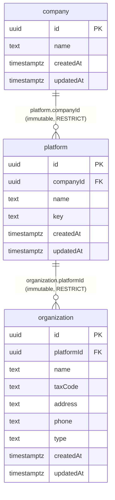

# organization-service

- **Status:** Implemented <!-- Draft | Reviewed | Implemented --> (Stage 9). **Not authoritative:** the ownership migration from auth-service (ADR-0039 Phases A-E) has not occurred.
- **Owners:** Anwar (project owner)
- **Related ADD:** [core-architecture](../architecture/core-architecture.md) (§2 service inventory, §11 O9)
- **Related ADRs:** [0031](../adr/0031-organization-service-intended-owner-of-the-hierarchy.md), [0039](../adr/0039-organization-ownership-and-cross-service-migration-authority.md),
  [0020](../adr/0020-organization-entity-and-platform-scoped-management.md), [0022](../adr/0022-company-and-platform-entities-with-operator-assignment.md),
  [0024](../adr/0024-database-enforced-tenancy-and-authorization-integrity.md), [0026](../adr/0026-authentication-is-not-entitlement.md),
  [0030](../adr/0030-multi-organization-membership-and-revoked-state.md), [0032](../adr/0032-database-per-service-on-a-shared-server.md),
  [0033](../adr/0033-service-to-service-authentication-and-user-identity.md), [0034](../adr/0034-shared-service-kit-and-api-conventions.md),
  [0038](../adr/0038-entitlement-in-billing-service.md)

## Responsibility

**Owns (once ADR-0039's cutover happens; today it is only *built*):** `Company`, `Platform`, `Organization` and the
`Company 1 → N Platform 1 → N Organization` relationships.

**Does not own:** `User`, credentials, sessions, MFA/recovery, `OrganizationMembership` (auth-service, ADR-0030); billing, payment,
accounting, products, prices, invoices, entitlements (ADR-0035/0038). It introduces no `Tenant`, `Workspace`, `BusinessUnit`,
`Department`, `Team` or `Group`. Nothing in Core reads or writes it yet; Billing and Payment keep holding opaque ids.

**Stage boundary.** Stage 9 builds the authority-to-be. It performs none of: importing Auth data, altering Auth tables/APIs/ownership,
the write freeze, the cutover, ownership rollback, an Auth-side projection, Organization → Auth events, or any Billing/Payment change.

## Data model

Mirrors auth-service's hierarchy tables **as they stand after all of its migrations** (`0001` created them; `0004` added `platform.key`;
`0005`-`0007` add only foreign keys from Auth-owned tables). The field set follows ADR-0020 (including `name` and `taxCode`) plus Auth's
`platform.key`: optional `text`, `CHECK (key IS NULL OR key ~ '^[a-z][a-z0-9-]{1,39}$')`, `UNIQUE (key)` (NULLs distinct), no trigger, no
foreign key; added here by migration `0003` under Auth's own constraint names. `key` is returned by the API but never accepted (Auth exposes
it in reads only and has no writer).
Carried over: the two `NOT NULL` foreign keys, `ON DELETE RESTRICT`, the non-blank name checks, the immutable parent columns.
Not carried over: the composite `UNIQUE (id, companyId)` / `(id, platformId)` keys (only targets of composite FKs from Auth-owned
tables; auth-service also has FKs *into* these tables from seven Auth-owned tables, which have no counterpart here). Constraint names differ
from Auth's generated ones (cosmetic). Added: `id`/`createdAt` frozen by trigger, keyset-pagination indexes, `idempotency_key`.
Deliberately **absent**: any unique name (none is established, and one could reject valid existing rows on import), any
status/archive column or delete path (lifecycle semantics are deferred), any `Organization → Company` column.

**Ids.** Random UUIDs generated by the service; the column only *defaults* to `gen_random_uuid()`, so an existing id and original
timestamps can be stored as-is by a later import. The public API never accepts a client-chosen id.

## Key interfaces / classes

`AppModule.register(config)` (one function used by `main.ts` and every test) wires kit modules only: `HealthModule`, `DbModule`,
`ServiceAuthModule`. Per entity: a controller (thin), a repository (the only writer of its table, one transaction per write), an
input module (`domain/*-input.ts`: allow-list, immutable-field refusal, trimming) and an OpenAPI-only DTO file. Shared:
`IdempotencyService`, cursor pagination (`common/`). **Absent on purpose:** Auth client, events module, outbound HTTP.

## API contract

See the service [README](../../apps/organization-service/README.md) and the generated OpenAPI. Prefix `/organization`; routes
`companies`, `platforms`, `organizations`, each with `POST` (requires `Idempotency-Key`), `GET` list, `GET :id`, `PATCH :id`.
No `DELETE`, no membership routes. Platform list filters by `companyId`, organization list by `platformId`.

## Important flows

1. **Create platform:** validate body → one transaction: reserve `(caller, operation, key)` → `INSERT` (FK to `company` checked by
   the database) → commit. An FK violation is `404 company_not_found`, rolls the reservation back, and leaves the key reusable.
2. **Replay:** the reservation collides on the unique key → same request hash returns the original resource (`200`); a different
   hash is `422 idempotency_key_reused`. Concurrent duplicates block on the unique index, so exactly one create happens.
3. **Update:** lock the row (`FOR UPDATE`), write only changed fields; a no-op changes nothing, including `updatedAt`.

## Authorization

Service tokens only (ADR-0033): every route is behind `ServiceTokenGuard`; a user bearer is refused and never forwarded (there is
no Auth client). All registered callers have equal access because the scope model is unresolved (B-029/O-13/O-14, named open by
ADR-0039). Human owner/operator access is not implemented: who may create a Company/Platform/Organization is undecided (auth
review F23) and today's live platform-access check is against Auth's copy of the hierarchy. Extension point when decided: replace
the controller guard with a service-or-user guard as billing-service does; nothing else changes.

## Error handling & edge cases

| Case | Behaviour |
|---|---|
| unknown or repeated field, client id/timestamps, parent id in a `PATCH` | `400 invalid_*_request` |
| unknown parent on create | `404 company_not_found` / `platform_not_found` |
| unknown id, or an id of another entity | `404 not_found` |
| missing/invalid `Idempotency-Key` | `400 idempotency_key_required`; reuse with a different body `422` |
| bad list parameters | `400 invalid_query` |
| database down | `/health` 200, `/ready` 503 naming only `database`; requests get an opaque 5xx (no host/SQL/credential) |
| shutdown | signal hooks; in-flight requests finish, then the pool closes |

## Migration compatibility (Stage 10, not built here)

Stage 10 needs: every persisted Auth attribute of the three tables representable (`platform.key` included, since Stage 9.1), stable ids (accepted by the schema), preserved parent-child links (FKs enforce parent-first order), original
timestamps (accepted), and a normal CRUD path that stays separate from import (the API rejects client ids). Tests show an imported
chain is representable and then served and edited through the normal API. Importer, verifier, freeze and cutover marker are Stage 10.

## Open questions

Owned by other decisions, **not** settled here: post-cutover ownership-rollback reconciliation; the cutover-detection mechanism; what
Auth's own hierarchy-mutating endpoints become after cutover; service-token scopes (B-029/O-13/O-14); organization-payer authority
(B-026/O-18); platform currency administration (B-036); lifecycle semantics (archive/deactivate/suspend); human-facing authorization;
where `GET /auth/me` reads organization/platform context after cutover (ADR-0039 keeps Auth's own tables for it).
**Observation for the record** (recorded as a factual correction in ADR-0039): ADR-0039 named Auth's `POST/PATCH /auth/admin/platforms|organizations`
and company creation as the mutating paths to freeze, but only the bootstrap CLI creates a company today and no such Auth routes exist in code
(ADR-0031, F23); the one related route is the read-only `GET /auth/admin/organizations/:id`.
Stage 10 should re-verify the real set of Auth write paths before designing the freeze.
