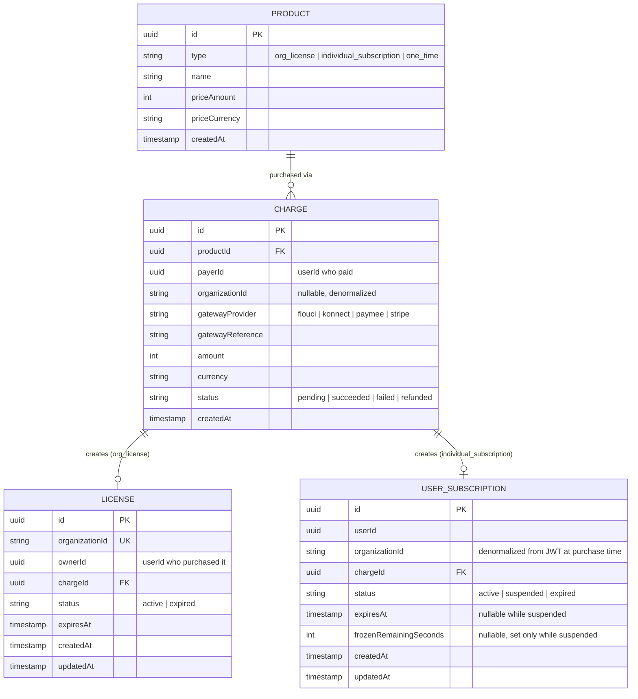
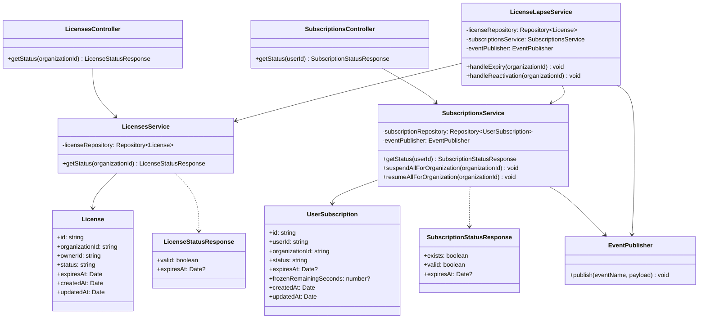
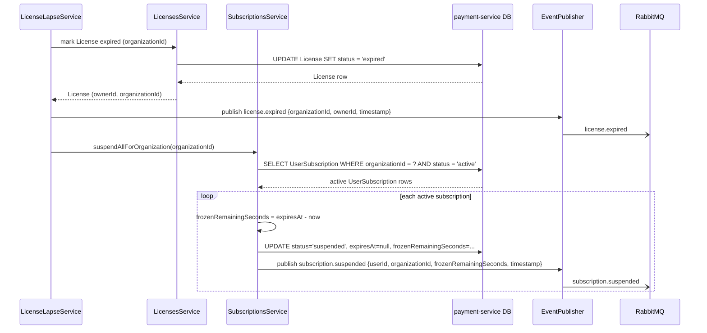
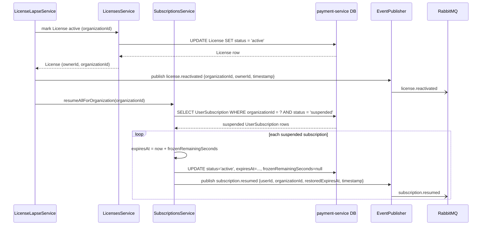
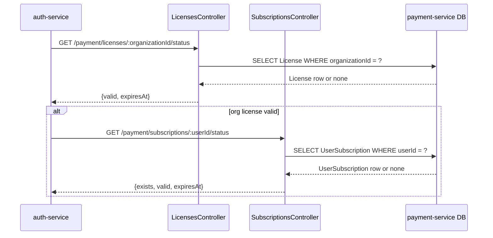

# payment-service

- **Status:** Draft <!-- Draft | Reviewed | Implemented -->
- **Owners:** Anwar (project owner)
- **Related ADD:** [docs/add/payment-service.md](../add/payment-service.md)
- **Related ADRs:** [0004](../adr/0004-synchronous-fail-closed-license-validation.md)
  (`auth-service`'s assumed license-status contract, finalized here),
  [0005](../adr/0005-bounded-time-license-subscription-revalidation.md) (`auth-service`'s
  login/refresh calls into the endpoints below),
  [0006](../adr/0006-per-user-subscription-reservation-on-license-lapse.md) (the primary
  decision this document implements).

## Responsibility

`payment-service` owns `Product`, `Charge`, `License`, and `UserSubscription` data, and answers
two yes/no questions other services depend on: does an organization currently hold a valid
license, and does a given user currently hold a valid individual subscription. It detects when
an organization's license lapses or is renewed, and on each transition suspends or resumes
every affected `UserSubscription` under that organization — freezing unused subscription time
rather than losing it — and publishes events so `notification-service` can inform the affected
users.

It explicitly does **not** own:

- What a `role` means, or which roles/users ever get a `UserSubscription` in the first place.
  That's entirely a consuming-app decision (per `ADR-0006`); `payment-service` only ever
  observes whether a `UserSubscription` row exists, never why.
- Any `auth-service` data (`User`, `RefreshToken`, credentials). `organizationId` and `userId`
  values stored here are opaque foreign references, stamped from the JWT at purchase time —
  never resolved via a cross-service database query.
- Notification delivery. `payment-service` publishes domain events; translating those into an
  actual push/SMS/email is entirely `notification-service`'s job.
- The purchase/checkout flow itself (out of scope per the ADD — see that document's Open
  questions).

## Data model

Notes:

- `Product`/`Charge` are the generic catalog/transaction concepts from `CLAUDE.md`; their full
  design (pricing rules, gateway-specific fields, refund handling) is out of scope here — only
  the fields this feature depends on are shown. A successful `Charge` against an
  `org_license`-type `Product` creates a `License` row; against an `individual_subscription`-type
  `Product`, a `UserSubscription` row. The purchase flow that performs this creation is out of
  scope (see the ADD).
- `License.organizationId` is unique — one active license per organization at a time. `ownerId`
  is the `userId` of the purchasing admin, used to address the `license.expired`/
  `license.reactivated` notification (per `ADR-0006`).
- `UserSubscription.organizationId` is denormalized from the JWT at purchase time specifically
  so `LicenseLapseService` can find every subscription under a lapsing organization using only
  `payment-service`'s own data — never a cross-service query (per `ADR-0006`).
- `UserSubscription.expiresAt` and `frozenRemainingSeconds` are mutually exclusive in practice:
  `active` rows have `expiresAt` set and `frozenRemainingSeconds` null; `suspended` rows have
  the reverse. A `suspended` row's clock has stopped — only a resume operation restarts it.
- No `auth-service` data (`User`, `RefreshToken`) is referenced by foreign key anywhere in this
  schema — `userId`/`organizationId` columns are opaque strings, per the ADD's data-ownership
  section.

## Key interfaces / classes

Module boundaries: `LicensesModule` (`LicensesController`/`LicensesService`/`License` entity)
owns the read-only status check `auth-service` calls, and is otherwise not responsible for
detecting lapses. `SubscriptionsModule`
(`SubscriptionsController`/`SubscriptionsService`/`UserSubscription` entity) owns both the
status check and the actual suspend/resume mutation, but never decides *when* to call them —
that's `LicenseLapseService`'s job. Both `LicenseLapseService` (for the org-level
`license.expired`/`license.reactivated` events) and `SubscriptionsService` (for the per-user
`subscription.suspended`/`subscription.resumed` events, published as part of the same
suspend/resume mutation — see flows (a)/(b) below) publish directly through `EventPublisher`.
`LicenseLapseService` is the only component that ties a license-state transition to a batch of
subscription mutations in the first place; it depends on both other services but neither of
them depends on it, keeping the read path (`auth-service`'s hot-path calls) free of any
lapse-detection logic. `EventPublisher` is a thin
wrapper around whatever RabbitMQ client eventually lands (per the ADD's infrastructure gap) —
its interface is stable even though its implementation can't be built yet.

## API contract

- **`GET /payment/licenses/:organizationId/status`** → `200 { valid: boolean, expiresAt: Date |
  null }`. No license found for this `organizationId`, or its license has expired → the same
  `{valid: false, expiresAt: null}` shape for both, deliberately not distinguished (mirrors the
  enumeration-avoidance reasoning `auth-service` already applies at its own boundary). This is
  the contract `auth-service` has assumed since `ADR-0004`, now finalized.

- **`GET /payment/subscriptions/:userId/status`** → `200 { exists: boolean, valid: boolean,
  expiresAt: Date | null }`.
  - No `UserSubscription` row ever created for this user → `{exists: false, valid: false,
    expiresAt: null}`.
  - `active` and not past `expiresAt` → `{exists: true, valid: true, expiresAt}`.
  - `suspended`, or `active` but past `expiresAt` (naturally expired) → `{exists: true, valid:
    false, expiresAt}` (`expiresAt` is `null` for a `suspended` row, since it's cleared while
    frozen — see Data model).

Both endpoints are internal, service-to-service calls in v1 (no API gateway exists in this
repo, per `auth-service`'s ADD) — they carry no separate authentication of their own beyond
whatever network-level trust exists between `nawara-core` services today, which this document
does not change or strengthen.

## Important flows

**(a) License lapse detected → suspend affected subscriptions and notify**

**(b) License reactivated → resume affected subscriptions and notify**

**(c) auth-service checking license/subscription status (login or refresh)**

## Error handling & edge cases

- Organization has no `License` row at all vs. an expired one → identical `{valid: false,
  expiresAt: null}` response, deliberately not distinguished (see API contract).
- User has no `UserSubscription` row at all → `{exists: false, valid: false, expiresAt: null}`;
  `auth-service` treats `exists: false` as "not applicable," never as a block (per `ADR-0006`).
- `LicenseLapseService.handleExpiry`/`handleReactivation` triggered more than once for the same
  transition (whatever the eventual detection mechanism turns out to be) → idempotent:
  `suspendAllForOrganization`/`resumeAllForOrganization` only operate on rows currently in the
  opposite state (`active`→suspend, `suspended`→resume), so a repeat call finds nothing left to
  do and is a no-op.
- A `UserSubscription` that naturally reaches its own `expiresAt` (unrelated to any
  organization license lapse) → moves directly to `expired`, not `suspended` — there is nothing
  to freeze or later resume, since the user's own paid time genuinely ran out. The lapse-sweep
  in flow (a) only selects rows still `active`, so an already-`expired` row is never touched.
- A `UserSubscription` suspended due to an organization's license lapse, whose
  `frozenRemainingSeconds` would have naturally expired *during* the suspension window (i.e.
  its original `expiresAt` was already in the past at suspension time) → `frozenRemainingSeconds`
  is computed as `expiresAt - now` at the moment of suspension per flow (a); if that value is
  zero or negative, the subscription is moved directly to `expired` instead of `suspended` —
  there's no remaining time to bank.
- Publishing any of the four lifecycle events fails (once RabbitMQ infrastructure exists) →
  not designed by this document; flagged as an open question (retry/outbox strategy) in the
  ADD.
- Concurrent purchase and lapse-detection for the same user/organization (e.g. a user buys a
  subscription in the same moment their organization's license lapses) → not designed by this
  document; deferred to a future TDD once the purchase flow itself is designed.

## Open questions

- The exact license-lapse detection mechanism (scheduled sweep vs. reacting to a
  renew/revoke trigger) that calls `LicenseLapseService.handleExpiry`/`handleReactivation` in
  the first place — not decided here (see the ADD's Open questions).
- Whether the two status endpoints need any authentication/authorization of their own beyond
  implicit network trust, once more than one internal caller exists.
- A retry/outbox strategy for the four lifecycle events once RabbitMQ infrastructure lands.
- Locking/concurrency behavior for `suspendAllForOrganization`/`resumeAllForOrganization` at
  scale (many subscriptions under one organization, or overlapping sweep runs) — deferred to a
  future TDD.
- Whether `License`/`UserSubscription` should support a grace period before a lapse actually
  triggers suspension (see the ADD's Open questions).
- The purchase/checkout flow that creates `Product`/`Charge`/`License`/`UserSubscription` rows
  in the first place — out of scope for this pass.
