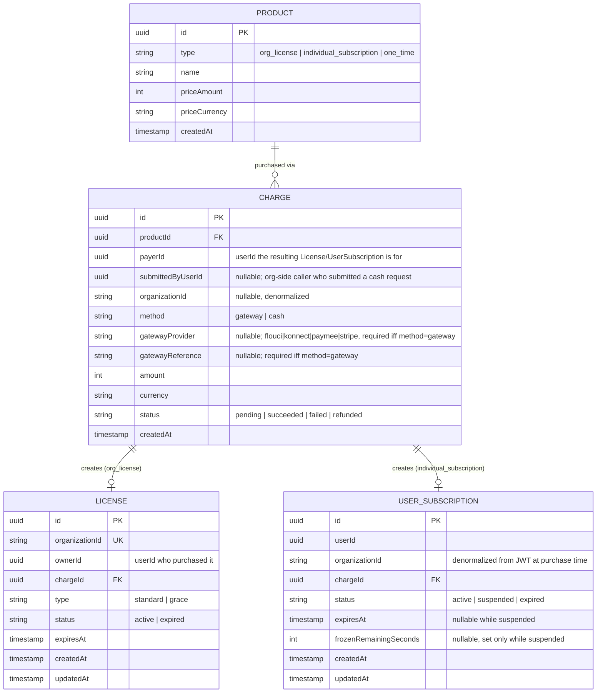
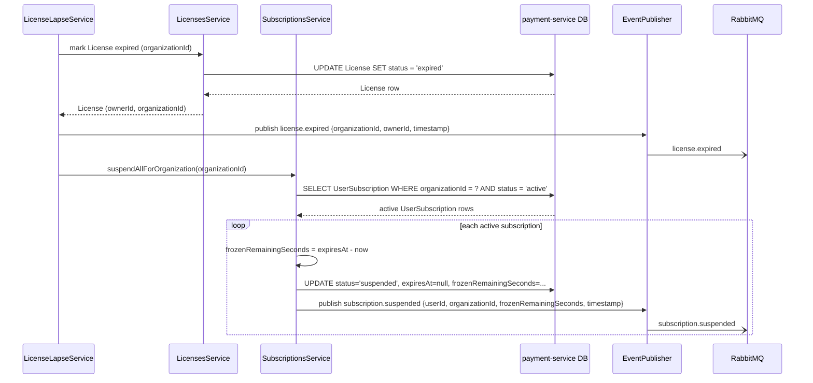
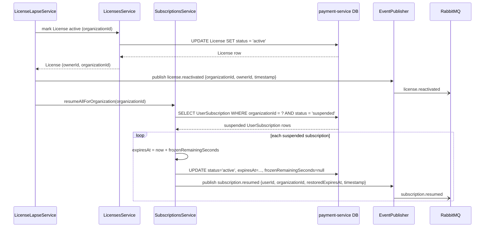
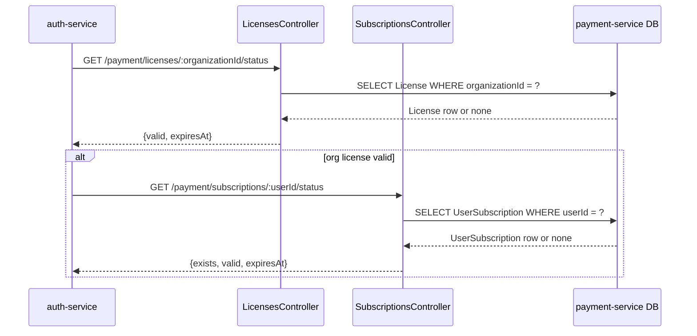
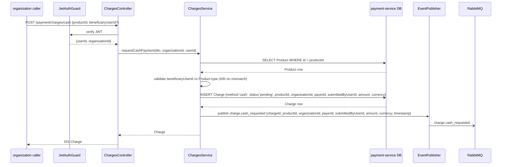
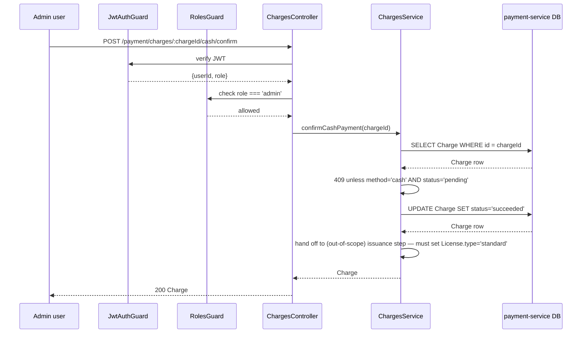
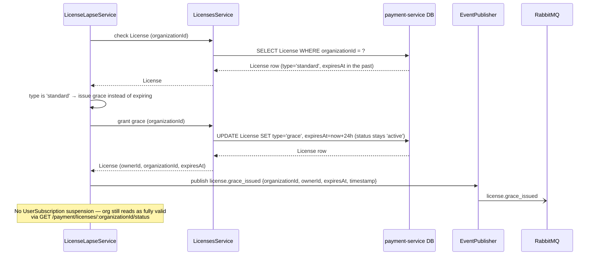

# payment-service

- **Status:** Draft <!-- Draft | Reviewed | Implemented -->
- **Owners:** Anwar (project owner)
- **Related ADD:** [docs/add/payment-service.md](../add/payment-service.md)
- **Related ADRs:** [0004](../adr/0004-synchronous-fail-closed-license-validation.md)
  (`auth-service`'s assumed license-status contract, finalized here),
  [0005](../adr/0005-bounded-time-license-subscription-revalidation.md) (`auth-service`'s
  login/refresh calls into the endpoints below),
  [0006](../adr/0006-per-user-subscription-reservation-on-license-lapse.md) (the primary
  decision this document implements),
  [0007](../adr/0007-out-of-band-cash-payment-confirmation.md) (out-of-band cash payment
  confirmation via Admin role),
  [0008](../adr/0008-automatic-grace-license-on-license-lapse.md) (automatic 24-hour grace
  license on organization license lapse).

## Responsibility

`payment-service` owns `Product`, `Charge`, `License`, and `UserSubscription` data, and answers
two yes/no questions other services depend on: does an organization currently hold a valid
license, and does a given user currently hold a valid individual subscription. It detects when
an organization's license lapses or is renewed, and on each transition suspends or resumes
every affected `UserSubscription` under that organization — freezing unused subscription time
rather than losing it — and publishes events so `notification-service` can inform the affected
users. Per `ADR-0008`, on a license's first lapse per renewal cycle it instead auto-issues a
24-hour grace license, deferring suspension until that window also elapses. Per `ADR-0007`, it
also owns the out-of-band cash-payment request/confirm/reject/list surface, gated by its own
new `JwtAuthGuard`/`RolesGuard`.

It explicitly does **not** own:

- What a `role` means, beyond the generic `admin`/non-`admin` distinction its own `RolesGuard`
  checks, or which roles/users ever get a `UserSubscription` in the first place. That's entirely
  a consuming-app decision (per `ADR-0006`); `payment-service` only ever observes whether a
  `UserSubscription` row exists, never why.
- Any `auth-service` data (`User`, `RefreshToken`, credentials). `organizationId` and `userId`
  values stored here are opaque foreign references, stamped from the JWT at purchase time —
  never resolved via a cross-service database query.
- Notification delivery. `payment-service` publishes domain events; translating those into an
  actual push/SMS/email is entirely `notification-service`'s job.
- The gateway purchase/checkout flow itself, and — now shared with `ADR-0007`'s cash-confirmation
  flow — the `Charge → License`/`UserSubscription` issuance step a successful `Charge` hands off
  to (out of scope per the ADD — see that document's Open questions).

## Data model

Notes:

- `Product`/`Charge` are the generic catalog/transaction concepts from `CLAUDE.md`; their full
  design (pricing rules, gateway-specific fields, refund handling) is out of scope here — only
  the fields this feature depends on are shown. A successful `Charge` against an
  `org_license`-type `Product` creates a `License` row; against an `individual_subscription`-type
  `Product`, a `UserSubscription` row. The purchase flow that performs this creation is out of
  scope (see the ADD).
- `License.organizationId` is unique — one active license per organization at a time. `ownerId`
  is the `userId` of the purchasing admin, used to address the `license.expired`/
  `license.reactivated` notification (per `ADR-0006`).
- `License.type` (per `ADR-0008`) defaults to `'standard'`. Because `organizationId` is already
  unique, `LicenseLapseService` enforces "at most one auto-granted grace period per renewal
  cycle" purely by inspecting this column on the existing row — no extra table or counter is
  needed. A grace license reuses the same row and the same `chargeId` as the license it
  succeeded; nothing about issuing grace creates a new `Charge` or a new `License` row. The
  **only** place `type` ever reverts to `'standard'` is the future issuance mechanism writing a
  real payment's result (`status = 'active'`, fresh `expiresAt`, fresh `chargeId`) — a real
  payment arriving mid-grace simply upgrades the same row early.
- `Charge.payerId` and `Charge.submittedByUserId` (per `ADR-0007`) answer different questions and
  can diverge: `payerId` is who the resulting `License`/`UserSubscription` is *for*;
  `submittedByUserId` is who actually called `POST /payment/charges/cash` on the organization's
  behalf. For an `individual_subscription` cash request these are typically two different
  people (the org submits on behalf of a beneficiary user); for an `org_license` cash request
  they're typically the same person, but the field is populated explicitly either way, never
  inferred. `submittedByUserId` is null for every `method = 'gateway'` charge.
- `UserSubscription.organizationId` is denormalized from the JWT at purchase time specifically
  so `LicenseLapseService` can find every subscription under a lapsing organization using only
  `payment-service`'s own data — never a cross-service query (per `ADR-0006`).
- `UserSubscription.expiresAt` and `frozenRemainingSeconds` are mutually exclusive in practice:
  `active` rows have `expiresAt` set and `frozenRemainingSeconds` null; `suspended` rows have
  the reverse. A `suspended` row's clock has stopped — only a resume operation restarts it.
- No `auth-service` data (`User`, `RefreshToken`) is referenced by foreign key anywhere in this
  schema — `userId`/`organizationId` columns are opaque strings, per the ADD's data-ownership
  section.

## Key interfaces / classes

```mermaid
classDiagram
    class LicensesController {
      +getStatus(organizationId) LicenseStatusResponse
    }
    class LicensesService {
      -licenseRepository: Repository~License~
      +getStatus(organizationId) LicenseStatusResponse
    }
    class SubscriptionsController {
      +getStatus(userId) SubscriptionStatusResponse
    }
    class SubscriptionsService {
      -subscriptionRepository: Repository~UserSubscription~
      -eventPublisher: EventPublisher
      +getStatus(userId) SubscriptionStatusResponse
      +suspendAllForOrganization(organizationId) void
      +resumeAllForOrganization(organizationId) void
    }
    class LicenseLapseService {
      -licenseRepository: Repository~License~
      -subscriptionsService: SubscriptionsService
      -eventPublisher: EventPublisher
      +handleExpiry(organizationId) void
      +handleReactivation(organizationId) void
    }
    class ChargesController {
      +requestCashPayment(dto, callerOrgId, callerUserId) Charge
      +confirmCashPayment(chargeId) Charge
      +rejectCashPayment(chargeId) Charge
      +listPendingCash() Charge[]
    }
    class ChargesService {
      -chargeRepository: Repository~Charge~
      -productsService: ProductsService
      -eventPublisher: EventPublisher
      +requestCashPayment(dto, callerOrgId, callerUserId) Charge
      +confirmCashPayment(chargeId) Charge
      +rejectCashPayment(chargeId) Charge
      +listPendingCash() Charge[]
    }
    class CreateCashChargeRequestDto {
      +productId: string
      +beneficiaryUserId: string?
    }
    class JwtAuthGuard {
      +canActivate(context) boolean
    }
    class RolesGuard {
      +canActivate(context) boolean
    }
    class EventPublisher {
      +publish(eventName, payload) void
    }
    class LicenseStatusResponse {
      +valid: boolean
      +expiresAt: Date?
    }
    class SubscriptionStatusResponse {
      +exists: boolean
      +valid: boolean
      +expiresAt: Date?
    }
    class License {
      +id: string
      +organizationId: string
      +ownerId: string
      +chargeId: string
      +type: string
      +status: string
      +expiresAt: Date
      +createdAt: Date
      +updatedAt: Date
    }
    class UserSubscription {
      +id: string
      +userId: string
      +organizationId: string
      +status: string
      +expiresAt: Date?
      +frozenRemainingSeconds: number?
      +createdAt: Date
      +updatedAt: Date
    }
    class Charge {
      +id: string
      +productId: string
      +payerId: string
      +submittedByUserId: string?
      +organizationId: string?
      +method: string
      +gatewayProvider: string?
      +gatewayReference: string?
      +amount: number
      +currency: string
      +status: string
      +createdAt: Date
    }
    LicensesController --> LicensesService
    LicensesService --> License
    LicensesService ..> LicenseStatusResponse
    SubscriptionsController --> SubscriptionsService
    SubscriptionsService --> UserSubscription
    SubscriptionsService ..> SubscriptionStatusResponse
    SubscriptionsService --> EventPublisher
    LicenseLapseService --> LicensesService
    LicenseLapseService --> SubscriptionsService
    LicenseLapseService --> EventPublisher
    ChargesController --> JwtAuthGuard
    ChargesController --> RolesGuard
    ChargesController --> ChargesService
    ChargesController ..> CreateCashChargeRequestDto
    ChargesService --> Charge
    ChargesService --> EventPublisher
```

Module boundaries: `LicensesModule` (`LicensesController`/`LicensesService`/`License` entity)
owns the read-only status check `auth-service` calls, and is otherwise not responsible for
detecting lapses. `SubscriptionsModule`
(`SubscriptionsController`/`SubscriptionsService`/`UserSubscription` entity) owns both the
status check and the actual suspend/resume mutation, but never decides *when* to call them —
that's `LicenseLapseService`'s job. Both `LicenseLapseService` (for the org-level
`license.expired`/`license.reactivated` events) and `SubscriptionsService` (for the per-user
`subscription.suspended`/`subscription.resumed` events, published as part of the same
suspend/resume mutation — see flows (a)/(b) below) publish directly through `EventPublisher`.
`LicenseLapseService` is the only component that ties a license-state transition to a batch of
subscription mutations in the first place; it depends on both other services but neither of
them depends on it, keeping the read path (`auth-service`'s hot-path calls) free of any
lapse-detection logic. `EventPublisher` is a thin
wrapper around whatever RabbitMQ client eventually lands (per the ADD's infrastructure gap) —
its interface is stable even though its implementation can't be built yet.

`ChargesModule` (`ChargesController`/`ChargesService`/`Charge` entity, per `ADR-0007`) owns the
cash-payment request/confirm/reject/list surface. `ChargesController` is `payment-service`'s
first controller gated by any guard: `requestCashPayment` only needs `JwtAuthGuard` (to read the
caller's `organizationId`/`userId` claims, no role check), while `confirmCashPayment`,
`rejectCashPayment`, and `listPendingCash` additionally require `RolesGuard` configured for
`role: admin`. `ChargesService` validates the `productId`/`beneficiaryUserId` combination,
persists the `Charge`, and publishes `charge.cash_requested` through the same `EventPublisher`
every other component uses — it does not itself decide what happens after a charge is confirmed
(the issuance hand-off is out of scope, see the ADD).

Per `ADR-0008`, `LicenseLapseService.handleExpiry` now branches on the lapsing `License.type`
before deciding what to do — see flows (f)/(g) below — rather than unconditionally expiring and
suspending as in the previous revision of this document. `handleReactivation` (flow (b)) is
unchanged: it still assumes a real payment has landed and unconditionally resumes suspended
subscriptions, since (per `ADR-0008`'s reset rule) the future issuance mechanism is what writes
`type = 'standard'` back onto the `License` row before `handleReactivation` would ever run.

## API contract

- **`GET /payment/licenses/:organizationId/status`** → `200 { valid: boolean, expiresAt: Date |
  null }`. No license found for this `organizationId`, or its license has expired → the same
  `{valid: false, expiresAt: null}` shape for both, deliberately not distinguished (mirrors the
  enumeration-avoidance reasoning `auth-service` already applies at its own boundary). This is
  the contract `auth-service` has assumed since `ADR-0004`, now finalized.

- **`GET /payment/subscriptions/:userId/status`** → `200 { exists: boolean, valid: boolean,
  expiresAt: Date | null }`.
  - No `UserSubscription` row ever created for this user → `{exists: false, valid: false,
    expiresAt: null}`.
  - `active` and not past `expiresAt` → `{exists: true, valid: true, expiresAt}`.
  - `suspended`, or `active` but past `expiresAt` (naturally expired) → `{exists: true, valid:
    false, expiresAt}` (`expiresAt` is `null` for a `suspended` row, since it's cleared while
    frozen — see Data model).

Both endpoints are internal, service-to-service calls in v1 (no API gateway exists in this
repo, per `auth-service`'s ADD) — they carry no separate authentication of their own beyond
whatever network-level trust exists between `nawara-core` services today, which this document
does not change or strengthen.

The four endpoints below are new, per `ADR-0007`, and are `payment-service`'s first
authenticated endpoints — all require a valid JWT (`JwtAuthGuard`); the three Admin-only ones
additionally require `role: admin` (`RolesGuard`).

- **`POST /payment/charges/cash`** — auth: any valid JWT whose `organizationId` claim matches
  the `organizationId` being billed (no role restriction, per `ADR-0006`'s "role eligibility is
  a consuming-app decision" precedent). Body: `{ productId: string, beneficiaryUserId?: string }`
  (`CreateCashChargeRequestDto`). `400` if `beneficiaryUserId` is missing and
  `Product.type === 'individual_subscription'`, if `beneficiaryUserId` is supplied and
  `Product.type === 'org_license'`, or if `Product.type === 'one_time'`. `404` if `productId`
  doesn't resolve to a `Product`. On success, `201` with the created `Charge`
  (`method: 'cash'`, `status: 'pending'`, `submittedByUserId` = caller's `userId`, `payerId` =
  caller's `userId` for `org_license` or `beneficiaryUserId` for `individual_subscription`,
  `amount`/`currency` copied from `Product`). Publishes `charge.cash_requested`.
- **`POST /payment/charges/:chargeId/cash/confirm`** — auth: `role: admin`. `404` if `chargeId`
  doesn't exist. `409` unless the charge is `method: 'cash'` and `status: 'pending'`. On success,
  `200` with the updated `Charge` (`status: 'succeeded'`) and hands off to the (out-of-scope)
  issuance step.
- **`POST /payment/charges/:chargeId/cash/reject`** — auth: `role: admin`. Same `404`/`409`
  preconditions as confirm. On success, `200` with the updated `Charge` (`status: 'failed'`).
- **`GET /payment/charges?method=cash&status=pending`** — auth: `role: admin`. `200` with an
  array of matching `Charge` rows, newest first. No pagination in v1 (flagged as an open
  question if pending-cash volume ever grows large enough to matter).

## Important flows

**(a) License lapse detected → suspend affected subscriptions and notify**

Per `ADR-0008`, this flow now only runs when the lapsing `License.type` is already `'grace'` —
i.e. the organization's one-shot grace window has itself now also elapsed. A `type = 'standard'`
license lapsing for the first time since its last real payment takes flow (f) instead. See flow
(g) below for this exact diagram applied to that precondition.

**(b) License reactivated → resume affected subscriptions and notify**

**(c) auth-service checking license/subscription status (login or refresh)**

**(d) Organization submits a cash payment request**

**(e) Admin confirms (or rejects) a pending cash charge**

`POST /payment/charges/:chargeId/cash/reject` follows the identical shape, differing only in
setting `status='failed'` and skipping the issuance hand-off entirely.

**(f) Lapse detected on a standard license → auto-grace issued, no suspension**

**(g) Grace license itself lapses → real lockout**

Identical to flow (a) above, with the precondition that the lapsing `License.type` is already
`'grace'` (i.e. the 24-hour window granted by flow (f) has now also elapsed). `type` is left as
`'grace'` after this runs — per `ADR-0008`, this is what makes the existing idempotent
`WHERE status = 'active'` sweep-selection naturally skip the row on any repeat run, with no
additional guard needed.

## Error handling & edge cases

- Organization has no `License` row at all vs. an expired one → identical `{valid: false,
  expiresAt: null}` response, deliberately not distinguished (see API contract).
- User has no `UserSubscription` row at all → `{exists: false, valid: false, expiresAt: null}`;
  `auth-service` treats `exists: false` as "not applicable," never as a block (per `ADR-0006`).
- `LicenseLapseService.handleExpiry`/`handleReactivation` triggered more than once for the same
  transition (whatever the eventual detection mechanism turns out to be) → idempotent:
  `suspendAllForOrganization`/`resumeAllForOrganization` only operate on rows currently in the
  opposite state (`active`→suspend, `suspended`→resume), so a repeat call finds nothing left to
  do and is a no-op.
- A `UserSubscription` that naturally reaches its own `expiresAt` (unrelated to any
  organization license lapse) → moves directly to `expired`, not `suspended` — there is nothing
  to freeze or later resume, since the user's own paid time genuinely ran out. The lapse-sweep
  in flow (a) only selects rows still `active`, so an already-`expired` row is never touched.
- A `UserSubscription` suspended due to an organization's license lapse, whose
  `frozenRemainingSeconds` would have naturally expired *during* the suspension window (i.e.
  its original `expiresAt` was already in the past at suspension time) → `frozenRemainingSeconds`
  is computed as `expiresAt - now` at the moment of suspension per flow (a); if that value is
  zero or negative, the subscription is moved directly to `expired` instead of `suspended` —
  there's no remaining time to bank.
- Publishing any of the six lifecycle events fails (once RabbitMQ infrastructure exists) →
  not designed by this document; flagged as an open question (retry/outbox strategy) in the
  ADD.
- Concurrent purchase and lapse-detection for the same user/organization (e.g. a user buys a
  subscription in the same moment their organization's license lapses) → not designed by this
  document; deferred to a future TDD once the purchase flow itself is designed.
- `POST /payment/charges/cash` called with `beneficiaryUserId` set for an `org_license` product,
  or omitted for an `individual_subscription` product, or referencing a `one_time` product →
  `400` in all three cases (per `ADR-0007`); `ChargesService` validates this server-side on every
  request, since it's the only guard against a malformed cash request.
- `POST /payment/charges/:chargeId/cash/confirm` or `.../reject` called on a `Charge` that is
  not `method = 'cash'` (e.g. a gateway charge), or not currently `status = 'pending'` (already
  confirmed, rejected, or a gateway-originated state) → `409` in both cases; neither endpoint
  mutates a charge outside that exact precondition.
- A real payment (gateway or Admin-confirmed cash) lands for an organization while its `License`
  is currently `type = 'grace'` → per `ADR-0008`'s reset rule, the future issuance mechanism
  unconditionally writes `type = 'standard'` alongside the new `status`/`expiresAt`/`chargeId`,
  upgrading the same row early rather than waiting for the grace window to run out first. Not
  itself a new code path in `LicenseLapseService` — the issuance mechanism (out of scope) is
  solely responsible for this write.
- The 24-hour grace window (flow (f)) is anchored to *detection time*, not the license's original
  `expiresAt` — if the eventual lapse-detection sweep cadence is coarser than roughly an hour,
  "exactly 24 hours" cannot be honored precisely, since the window starts whenever the sweep
  happens to notice the lapse, not the instant it occurred (see `ADR-0008`'s Consequences).

## Open questions

- The exact license-lapse detection mechanism (scheduled sweep vs. reacting to a
  renew/revoke trigger) that calls `LicenseLapseService.handleExpiry`/`handleReactivation` in
  the first place — not decided here (see the ADD's Open questions). Now additionally
  constrains how precisely `ADR-0008`'s 24-hour grace window can be honored; a sub-hourly sweep
  cadence is recommended if that precision matters.
- Whether the two status endpoints need any authentication/authorization of their own beyond
  implicit network trust, once more than one internal caller exists.
- A retry/outbox strategy for the six lifecycle events once RabbitMQ infrastructure lands.
- Locking/concurrency behavior for `suspendAllForOrganization`/`resumeAllForOrganization` at
  scale (many subscriptions under one organization, or overlapping sweep runs) — deferred to a
  future TDD.
- ~~Whether `License`/`UserSubscription` should support a grace period before a lapse actually
  triggers suspension~~ — resolved for `License` by
  [`ADR-0008`](../adr/0008-automatic-grace-license-on-license-lapse.md); `UserSubscription` is
  explicitly out of scope for that decision and remains unaddressed.
- The purchase/checkout flow that creates `Product`/`Charge`/`License`/`UserSubscription` rows
  in the first place, **and the `Charge → License`/`UserSubscription` issuance step** that both
  that flow and `ADR-0007`'s cash-confirmation flow now depend on — out of scope for this pass.
- Building `payment-service`'s own `JwtAuthGuard`/`RolesGuard` (per `ADR-0007`) and how it
  obtains the JWT signing secret/key, given `auth-service`'s ADD's still-open
  secret-distribution gap — see the ADD's Open questions.
- Whether `POST /payment/charges/:chargeId/cash/reject` needs a reason/note field for the Admin
  to record why a cash request was rejected (e.g. for the submitting organization's benefit) —
  not required by `ADR-0007`, flagged as a possible follow-up.
- Whether `GET /payment/charges?method=cash&status=pending` needs pagination once pending-cash
  volume grows — not designed here, v1 returns an unpaginated list.
